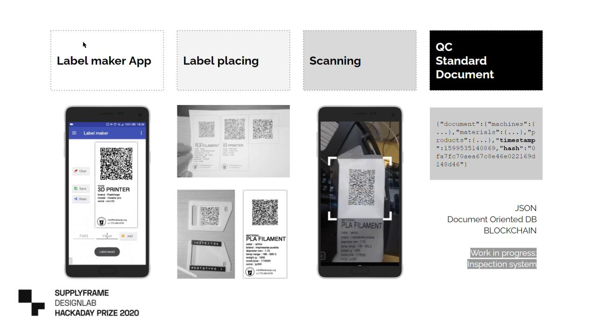

# About me

Hi! I'm Antonio from Mexico, currently studying the FabAcademy program in France. My plan is to become a product developer specialized in agriculture.

I've choose to study the program in France because of AgriLab which is a agriculture specialized FabLab, so I got in contact with [Luc Hanneuse](https://fabacademy.org/2019/labs/sorbonne/students/hanneuse-luc/about/) the FabManager of AgriLab and He assisted me through all the Fab Academy admission process, then I've also been granted a scholarship from the Fab Foundation and ran a fund-raising campaign to help me with some expenses.

I've been participating in agriculture and education related projects in Mexico, and I've been living in some difficult or isolated areas so I've a deep understanding of some of the many needs people have in these areas.

AgriLab offers three things together that help to reduce the expenses of some of the development process that I'm interested. The experimental farm is aside the FabLab and an Agriculture specialized institute. While in Mexico, I'll normally have to travel to a different location, that usually takes a few days. The other issue is related to advising, it's really difficult to find an adviser interested in agri-tech and product related projects that works in the field.

[You can find my portfolio here.](https://kny5.github.io/personal_portfolio/ "personal website")

## My background

I started my professional career as a CAD/CAM technician in the plastics manufacturing industry in 2007 while studying aeronautical engineering.

In 2014, I changed to developing control systems for greenhouses in southern Mexico as freelancer, and I got accepted to my first MIT program, the Global Startup Labs Bootcamp in 2015. I learned human-center design, and I've explored since then technology transference for agriculture.

I've acquired skills in rapid prototyping while studying in Product design innovation programs and collaborating with international initiatives of the MIT in Mexico. I've been also a teacher for Jacaranda Education and the Access Education program of the U.S. Embassy in Mexico.

I've volunteered to mentor technology-based social initiatives, government institutions, universities, and foreign organizations working in Mexico promoting education and gender equality for indigenous populations.

I've been a Linux user and evangelist since 2006, for the Ubuntu, Debian and Fedora distributions.

In 2020, I was part of the [Hackaday Prize 2020 Dream teams](https://hackaday.com/2020/07/10/dream-team-members-announced-for-the-2020-hackaday-prize/). Where I worked to help [Field Ready]() an international NFP Organization to develop a remote quality control system for humanitarian aid products, that are made mostly in FabLabs in countries were disaster relief is very important.

So, when someone asks me what do I do for a living, I say, I'm a product developer at the convergence between hacking, design, and the pyramid base economy.

## Work on the Open Quality control standard document

The main purpose of this project is to provide a quick and reliable traceability system for products made in Fab Labs, taking in consideration risk, supply chain, and tracking the: human-machine-material data of any product.

