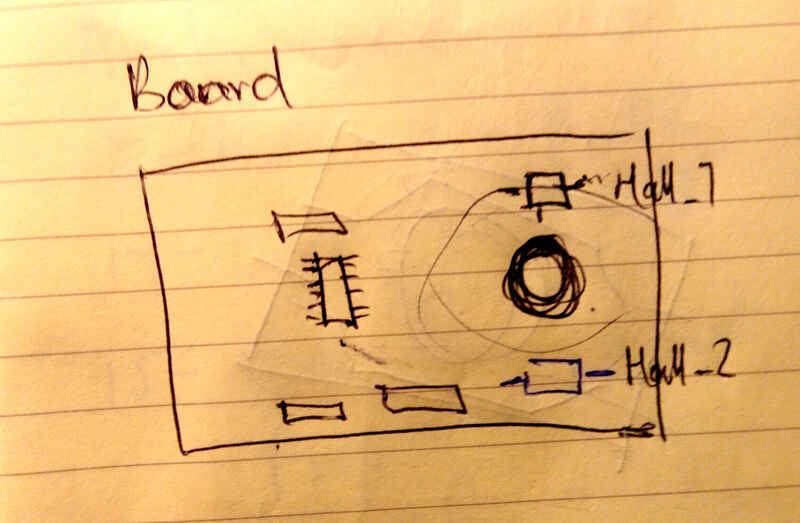
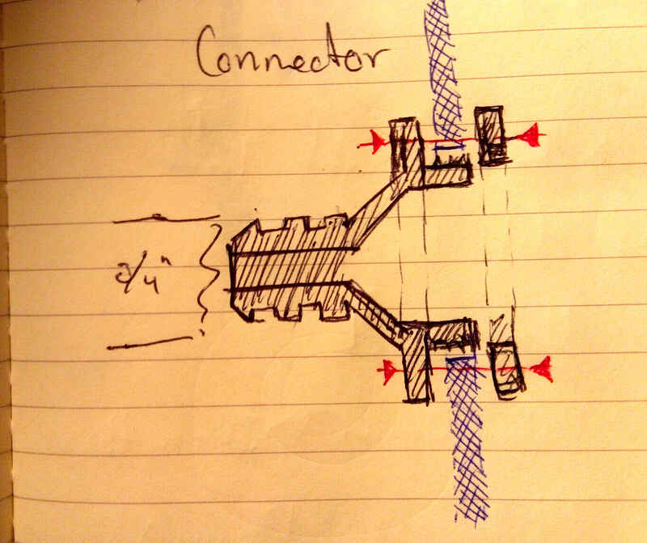
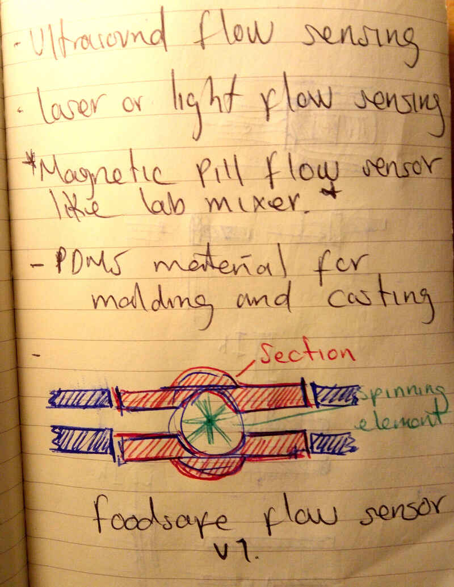
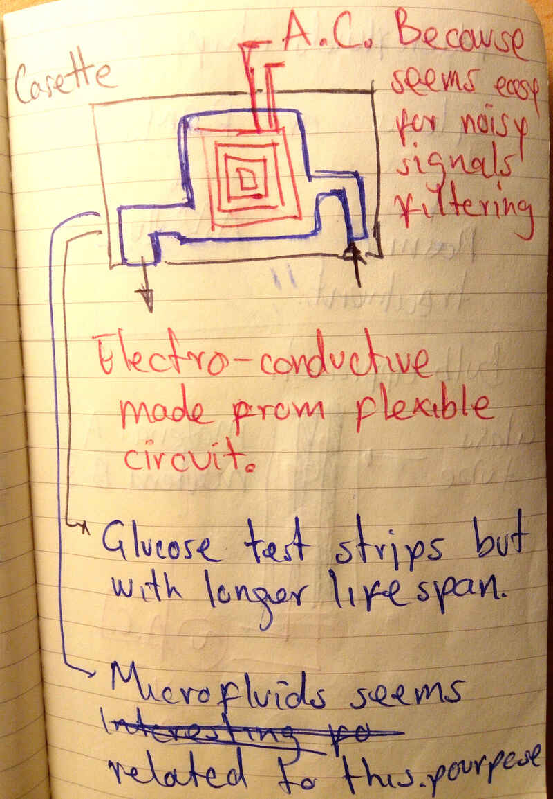
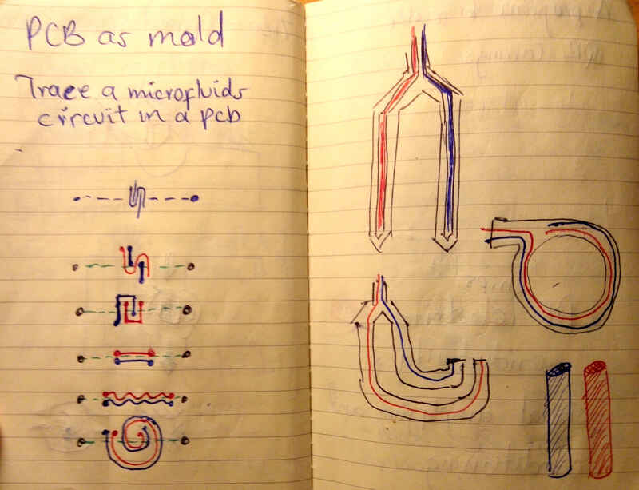

# 1. Principles and practices.

[You can find information about my project here.](../../projects/final-project/)

I've read the [fab charter](http://fab.cba.mit.edu/about/charter/)

## Project management program

| week01 | week02 | week03 | week04 | week05 |
| -- | -- | -- | -- | -- |
| General and user research |
| | Proposals, Hardware, Software, Interaction |
| | | Video demo |
| | | | First prototype, workbench test, feedback and rework |
| | | | | Second prototype, Workbench test, field test, feedback and rework |

## Project description:

Challenge:

To develop an affordable device for cow milk production measurement and quality checking.

Characteristics:

- Supply-chain reduced components.
- Food-safe components for the parts in contact with the milk.
- Adaptable to different countries and their local regulations or tech level.

Functions:

- Read RFID current existing earrings
- Meassure automatically ammount of milk produced for each animal on a production.
- Meassure a sample for milk quality control.

Parts:

- 4 Milk flow meter on for each cow's udder.
- RFID earring reader.
- Spectral sensor for substance identification
- Dielectric spectroscopy sensor.

User:

- Field veterinary technicians.
- Dairy production managers.
- Researchers.
- Quality control technicians.

## Sketches

- Hall effect circuit board sketch:

- Pipe milk conduct to fluid sensor connector:

- Flow sensor sketch 01:

- Flow sensor sketch 02:

- Microfluids sketch:

- Electrode design sketch:

## Tests

- Testing SLA 3D printing, I would like to cast this pieces in food-safe silicone.

- This is my first attempt to make a circuit board with a hall effect sensor that I'll use later for the flow sensor.

- This is a test of the ISO11784 RFID module that will be used to read Cow earrings.

<figure class="video_container">
  <video controls="true" allowfullscreen="true" poster="path/to/poster_image.png" width=100% loop>
    <source src="../../images/week11/demo_01.mp4" type="video/mp4">
  </video>
</figure>
