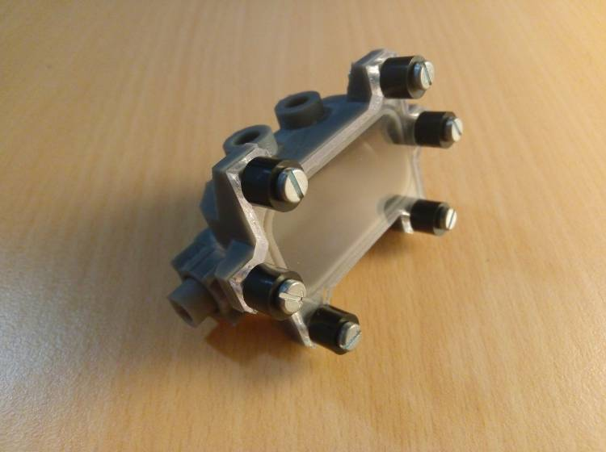

# 1. Principles and practices.

[You can find information about my project here.](../../projects/final-project/)

## First sprint
Expected time: 5 weeks.

### Research:
1. General
2. User

### Proposals:
1. Software
2. Hardware
3. Interaction

### Demo:
1. Video demo

### First prototype:
1. Workbench test
2. Feedback and rework

### Second prototype:
1. Workbench test
2. Field test
3. Feedback and rework
...

### Project description:

Challenge:

To develop an affordable device for cow milk production measurement and quality checking.

Characteristics:

- Supply-chain reduced components.
- Food-safe components for the parts in contact with the milk.
- Adaptable to different countries and their local regulations or tech level.

Functions:

- Read RFID current existing earrings
- Meassure automatically ammount of milk produced for each animal on a production.
- Meassure a sample for milk quality control.

Parts:

- 4 Milk flow meter on for each cow's udder.
- RFID earring reader.
- Spectral sensor for substance identification
- Dielectric spectroscopy sensor.

User:

- Field veterinary technicians.
- Dairy production managers.
- Researchers.
- Quality control technicians.

### Sketches

- Hall effect circuit board sketch:

- Pipe milk conduct to fluid sensor connector:

- Flow sensor sketch 01:

- Flow sensor sketch 02:

- Microfluids sketch:

- Electrode design sketch:

### Tests

<figure class="video_container">
  <video controls="true" allowfullscreen="true" poster="path/to/poster_image.png" width=100% loop>
    <source src="../../images/week11/demo_01.mp4" type="video/mp4">
  </video>
</figure>
