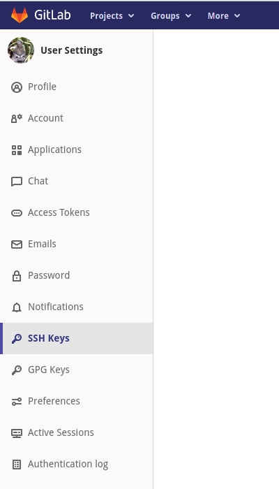
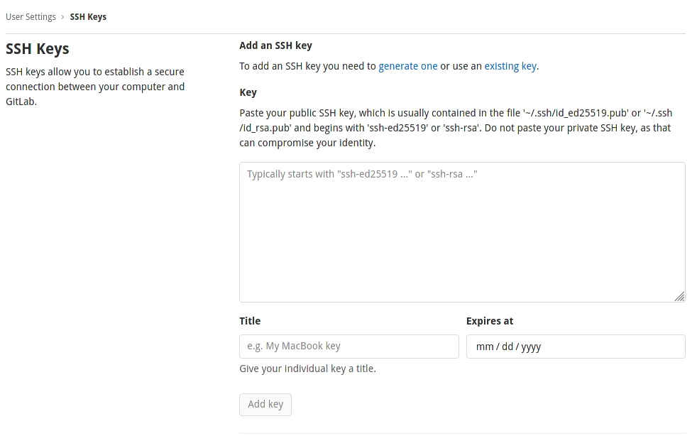
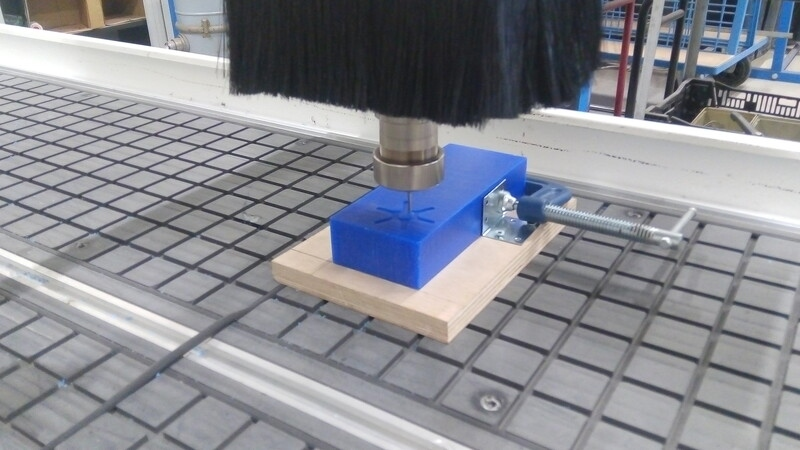
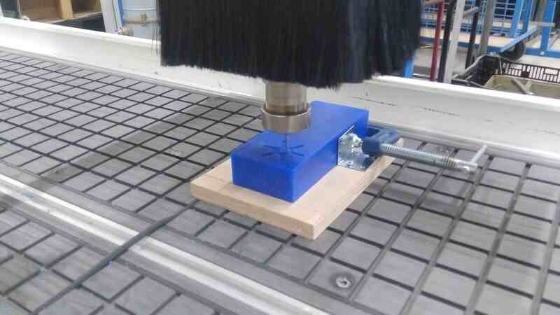
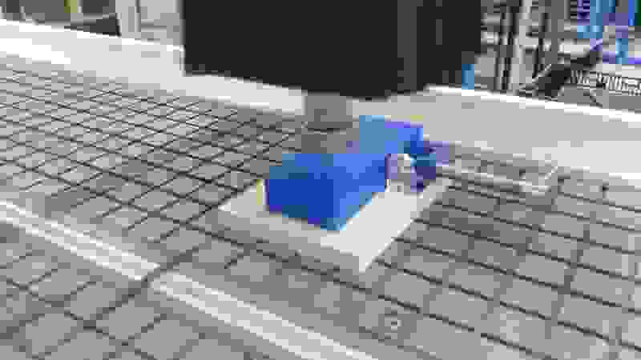

# 	2. Project management

For this week our assignments are to make a GIT tutorial following the quick review we had on Wednesday and define a final project. The final project is where, we individually or cooperatively apply our learned skills during the Fab-Academy.


## About my final project


[You can find information about my project here.](../../projects/final-project/)


## Git tutorial

I'm right now using [Linux Fedora](https://getfedora.org) 33 as main OS. Based on my research over the work of students on previous years I've found that showing terminal sessions has been something that a lot had struggle with. For this reason I'd like to share [ASCIINEMA](https://asciinema.org) and I hope that anyone looking at this founds this tutorial useful. Then I'd like to show how I'm using [GIT](https://git-scm.com/) and [GitLab](https://about.gitlab.com/) to manage my repository and for that my entire project. Finally, I've found also that having a defined nomenclature or norm while writing commits is really useful for project management and maintenance.


### Setting up:

I'm a big fan of the [Python Conda distribution](https://docs.conda.io/), having a separated environment for each project keeps everything clean and easy on the system, so first:

[Install Python Conda distribution, intructions following this link.](https://docs.conda.io/projects/conda/en/latest/user-guide/install/ "Follow this tutorial")

Conda is an environment manager for a variety of scientific languages and toolkits including Python.

To create a Python evironment for your fab academy repository:
```
conda create -n fabacademy
```
To access this environment:
```
conda activate fabacademy
```
To deactivate and use the "base" environment:
```
conda deactivate
```
The next steps are related to asciinema to share a terminal session but beautifully:
(the conda environment should be activated already to keep everything in order)

Asciinema is a platform for beautifully sharing of terminal sessions.

Under Linux to install Asciinema I'm using Conda, and Python's PIP a package manager for the Python ecosystem.
```
pip install asciinema
```
Once asciinema is installed, you can start recording terminal sessions, to exit and finish the recording just write down "exit"
```
asciinema rec -t "fabacademy first assignment"
```


### Asciinema example

<script id="asciicast-vzb1DXZk5KdnGWwGl1PL9mJt6" src="https://asciinema.org/a/vzb1DXZk5KdnGWwGl1PL9mJt6.js" async data-autoplay="true" data-size="medium" data-loop=1 data-t=23 data-speed=2  data-rows=10></script>


## About Git:

Git is a Version Control Software, this means you can save different states of a repository, get back to one of those states with the purpose of recovering from a bug, a crash a change of style while writing the code, change of paradigm or approach, these are things that happen while developing software.

We as students from the Fab Academy started with a boilerplate bootstrapped repository with a basic information architecture and Continuous Integration that renders the changes on our Markdown code to an Online Static Generated site.

But if you need a new repository managed with Git you just need to execute this on your terminal:
```
git init
```
I've made a recording showing the process of creating a directory, initiating a git repository, creating an empty file, add files to the git registry, committing changes and trying to push. Since I don't have a remote repository it gave me a error. Which means I'd need to add a remote location on the following steps.

<script id="asciicast-QRUGeTxDm9O8XSR2KMVx7SHHE" src="https://asciinema.org/a/QRUGeTxDm9O8XSR2KMVx7SHHE.js"  data-autoplay="true" data-size="medium" data-loop=1 data-t=23 data-speed=2  data-rows=10></script>


## Cloning our Fab Academy repository:

The process of cloning a repository is just to create a new instance or copy of our MASTER repository in GitLab, this has the purpose to avoid making changes every time online and instead work on our local instance or copy and then synchronize the changes to the online repository, and this is the whole purpose of Git, to manage changes simultaneously that happen when working collectively on big software projects.

You can add a SSH key to GitLab's repository configuration or you can just make use of the http request logging system.


### Setup SSH key

During our Bootcamp we had the time to learn how to setup a SSH key on our systems and then copy the resulting string to the GitLab configuration to allow SSH cloning for ourselves.
```
ssh-keygen -t rsa -b 4096 -C "replace_with_@your_email.com"
```
After generating the key and saving it on a file, we proceed to copy the content of it it to our GitLab add SSH key input, we just need to be careful to not add any space or any other content to it.

[Follow this tutorial from GitLab for detailed instructions.](https://docs.gitlab.com/ee/ssh/ "Follow this tutorial from GitLab.")

After this is setup You'll be able to execute successfully the next command:
```
git clone git@gitlab.fabcloud.org:your/project/path.git
```
Or using the http clonning approach:
```
git clone your_repository_url_on_fabcloud.git
```

### Gitlab configuration

- Open your fabcloud gitlab profile in my case and at this current time the URL is [https://gitlab.fabcloud.org/-/profile](https://gitlab.fabcloud.org/-/profile)

- Then Open the preferences tab in the top right menu:


- Under the User settings menu click on "SSH Keys"


- Copy and paste the generated SSH-key into the Key field, add a title and an expritarion date.



- Click on "**Add key**"

### Serve mkdocs locally:

Mkdocs is the current Markdown to site generator, and the default choice for the Fab Academy boostrap site, for developing purposes it's better to serve the repository locally before pushing to production or MASTER branch in the actual online Gitlab repository.

To install mkdocs we need also need two package dependencies:
```
pip install mkdocs mkdocs-material git-revision-date-localized
```
After those dependencies are installed we can render the Markdown files to html using, on terminal you need to access the directory where the mkdocs.yml, it means we need to access to our repository, in every system we can do it by using the "cd" command like this:
```
cd repository_name
```

To list all files inside the current location (Linux):
```
ls -ls
```

Then:
```
mkdocs build
```

I'd like to use Python's http server module instead of the default mkdoc serve, so on a second terminal or using TMUX and accessing the repository as we did before:
```
python -m http.server
```

And by default the page will be served at http://localhost:8000, and every time we make a change at the site we need to execute mkdocs build as we did before.


### Adding a .gitignore file to avoid large MB commits to GitLab remote repository:

This is very important I've just realized my mistake and had to revert my commits to avoid pushing to many MB's to the server:

To preserve the changes to my Week01 Markdown file I've just copy the content to a temporary file and then:

To delete the last two commits from my git repository:
```
git reset --hard HEAD~2
```
After this I've create a .gitignore file:
```
touch .gitignore
```
[An then copied the content of this file I've found online into my .gitignore file.](https://github.com/mkdocs/mkdocs/blob/master/.gitignore "Follow this link")


## Text editor:

I'm using [Typora](https://typora.io/) editor as I find it simple and aesthetic for Markdown editing.

The work-flow is just to edit the files as [Markdown](https://www.wikiwand.com/es/Markdown), execute [mkdocs](https://www.mkdocs.org/) and commit the changes on git.

Over the weeks I've been working using [Atom](https://atom.io/) and [Vim](https://www.vim.org/)

- Install atom and vim
```
sudo dnf install atom vim
```


## Adding content to Gitlab repository:

- Discard local changes
```
git stash
```

- Download the latest content from a remote instance of the repository by default "Gitlab fabacademy"
```
git pull
```

- Add all changes in repository to buffer
```
git add .
```

- Add all changes in buffer and commit with a descriptive message
```
git commit -m "week01, added images, archives, etc."
```

- Push current commits to remote repository "Gitlab Fabacademy by default"
```
git push
```

- Delete file from git history
```
git filter-branch -f --prune-empty --index-filter "git rm -r --cached --ignore-unmatch ./file1" HEAD
```


## Video and image processing

- Install requirements for Fedora Linux
```
sudo dnf install ffmpeg mogrify jpegoptim GraphicsMagick simplescreenrecorder
```

### Video

Video compression it's something crucial for the success of a less than 10MB commit and preserve a good repository size on the fabcloud gitlab service.

I've used this commands multiple times across my assignments.

The examples depend on your screen color configuration and its very subjective. But you can use this examples to have an idea on how to use this commands to have clear and concise videos on your documentation.

- FULL HD video compression with 32k audio
```
ffmpeg -i demo_01.mp4 -codec:a libmp3lame -b:a 32k -b:v 1400k demo_01_1400_c.mp4
```

- Video compression 100k bitrate without audio
```
ffmpeg -i demo_01.mp4 -an -bv 100k demo_01_c.mp4
```

- Video cut from second 3 to second 30
```
ffmpeg -i demo_01.mp4 -ss 00:00:03.0 -t 00:00:30.0 demo_01_cut.mp4
```

- Cut a square 480p video from 720x480p
```
ffmpeg -i demo_01.mp4 -vf "crop=iw-160" -b:v 300k demo_01_square.mp4
```

- Enhance video color brightness 0.06, saturation 2.
```
ffmpeg -i demo_01.mp4 -vf eq=brightness=0.06:saturation=2 -c:a copy demo_01_b0_06_s2.mp4
```

### Video Examples

- Video 720p 1000k bitrate
```
ffmpeg -i input.mp4 -vf scale=-1:720 -b:v 1000k output.mp4
```

<figure class="video_container">
<video controls="true" allowfullscreen="true" width=100%>
<source src="../../images/week02/720_demo_01_1000.mp4" type="video/mp4">
</video>
</figure>

- Video 720p 500k bitrate
```
ffmpeg -i input.mp4 -vf scale=-1:720 -b:v 500k output.mp4
```

<figure class="video_container">
<video controls="true" allowfullscreen="true" width=100%>
<source src="../../images/week02/720_demo_01_500.mp4" type="video/mp4">
</video>
</figure>

- Video 720p 500k bitrate squared
```
ffmpeg -i input.mp4 -vf "crop=iw-480" output.mp4
```

<figure class="video_container">
<video controls="true" allowfullscreen="true" width=100%>
<source src="../../images/week02/q_demo_01_500.mp4" type="video/mp4">
</video>
</figure>

- Video 720p 1000k bitrate squared
```
ffmpeg -i input.mp4 -vf "crop=iw-480" output.mp4
```

<figure class="video_container">
<video controls="true" allowfullscreen="true" width=100%>
<source src="../../images/week02/q_demo_01_1000.mp4" type="video/mp4">
</video>
</figure>

- Video 720 1000k bitrate squared brightness 0.06 and saturation 2

<figure class="video_container">
<video controls="true" allowfullscreen="true" width=100%>
<source src="../../images/week02/b0_06_s2_demo_01_1000.mp4" type="video/mp4">
</video>
</figure>


### Image processing

I've used this commands to standardize my images on the documentation, the values are examples, and the values are subjective. The objective is to have a clear and meaningful image that describes a process and contains valuable information on it.

As the weeks have passed I've been improving this process of image compression and this commands are part of my process.

I've preserved the size range between 750 and 800 pixels in photos, but in screen captures it depends on the size of the area captured.

- cut image to 750x750 pixels centered


```
convert -define jpeg:size=750x750 input.jpg -gravity center -extent 750x750  output.jpg
```

- Compress image quality
```
jpegoptim --size=80k arduino_07.jpg
```

- Scale image to 800 pixels
```
mogrify -resize 800x arduino_07.jpg
```

- Convert from PNG to jpg
```
mogrify -format jpg arduino_07.PNG
```

### Image examples

- Input image


- Scaled to 800px Width and keeping same aspect ratio.
```
mogrify -resize 800x input.jpg
```


- Scaled to 400px Width and keeping same aspect ratio.
```
mogrify -resize 400x input.jpg
```


- Scaled to 200px Width and keeping same aspect ratio.
```
mogrify -resize 200x input.jpg
```


- Scaled to 100px Width and keeping same aspect ratio.
```
mogrify -resize 100x input.jpg
```


I've chose 800px as size base. But the image size is 251.8 Kb, to optimize its size I'll use a compression command.

- 800px image optimized to 150k
```
jpegoptim --size=150k 800.jpg
```


- 800px image optimized to 100k
```
jpegoptim --size=100k 800.jpg
```


- 800px image optimized to 50k
```
jpegoptim --size=50k 800.jpg
```


- 800px image optimized to 40k
```
jpegoptim --size=40k 800.jpg
```


- 800px image optimized to 30k
```
jpegoptim --size=30k 800.jpg
```


I'd like to make my image squared and try different compression sizes to select the best one based in quality of the image.

- 800px input image squared
```
convert -define jpeg:size=750x750 800.jpg -gravity center -extent 750x750 sq_800.jpg
```


- 800px 150k image squared
```
convert -define jpeg:size=750x750 800_150k.jpg -gravity center -extent 750x750 sq_800_150k.jpg
```


- 800px 50k image squared
```
convert -define jpeg:size=750x750 800_50k.jpg -gravity center -extent 750x750 sq_800_50k.jpg
```


## Video recording of desktop using simple screen recorder

- Capture screen with ffmpeg

```
ffmpeg -f x11grab -y -r 30 -s 1920x1080 -i :0.0 -vcodec huffyuv out.avi
```

<iframe width="560" height="315" src="https://www.youtube.com/embed/EGWqjWqaV7M" frameborder="0" allow="accelerometer; autoplay; clipboard-write; encrypted-media; gyroscope; picture-in-picture" allowfullscreen></iframe>
