# 4. Computer controlled cutting

## Introduction:

This week  we learn how to use different machines in the Fab Lab. We had a great experience while practicing vinyl and laser cutting.
My approach was very simple but I've learnt interesting techniques and important information for the upcoming weeks.


## Vinyl Cutter:

### 2D Design:

This is a simple design, it's based on my earring 2D draft from the last assignment. And it's a Qr code badge that redirects to my fab academy main page.

QR Codes get complex with more text on it, so the idea is to share my website from the fab academy program to anyone by scanning the "badge".
I used [bit.ly](https://bitly.com/) to shorten my website URL and then I encoded it in QR.

I've created the QR code [here](https://barcode.tec-it.com/en/QRCode?data=https%3A%2F%2Fbit.ly%2F3qeLcyr), I know it's possible to get rid of online tools and just make a QR code with Python, but I actually liked this service, the generator has almost every standard of visual encoders.

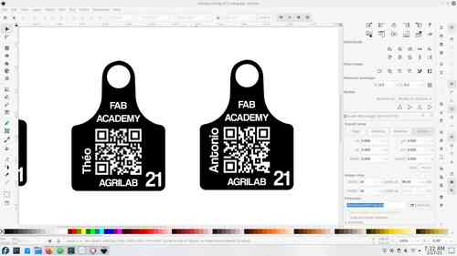

After that I used gimp to invert the colors of the QR, because I wanted a filled design. And right after I imported the QR in Inkscape and integrated it as shown. I've made one for each of my team mates as a gift. And this design is intended to serve for future AgriLab Fab Academy students. We're going to place our stickers in our classroom.


### Software:

I've used [silhouette studio](http://silhouettefr.fr/silhouette_studio.html) to raster all images, and this is a special proprietary software for the vinyl cutter.
It's a very friendly and intuitive software.

There are some important parameters to ensure a well cut design. Like the tolerance and speed.

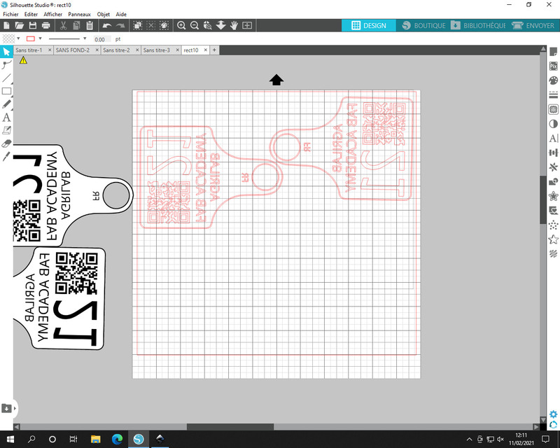

The process of cutting the vinyl is very quick and it only needs some basic adjustments in the machine:

1. Select and adjust the plate according to the roll width.
2. Ensure that the vinyl is cut in a square angle.
3. Ensure that the vinyl roll is aligned following the guides of the machine.
4. Ensure that nothing and obstacle for the output.


### Heat transfer vinyl on fabric:

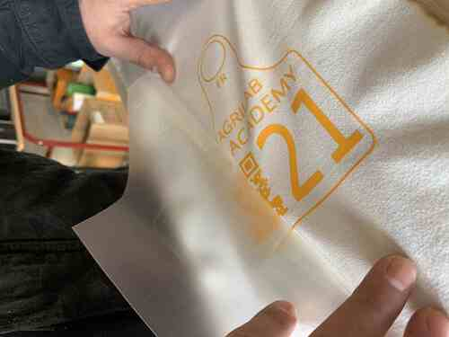

For this process we used vinyl with a thermal transfer film, after cutting the design, I peeled the vinyl to get rid of the unwanted parts in the design.
It was a slow process because of the QR in my design. But after a while I got confident enough to make the process a bit faster.

While peeling the design the iron press machine was pre-heating in order to be ready to transfer our designs in a piece of fabric.
This design is different from the one of stickers, it's a bit bigger.


### Adhesive transfer vinyl:

This was a very fun process. I used the design I described in the 2D design part.

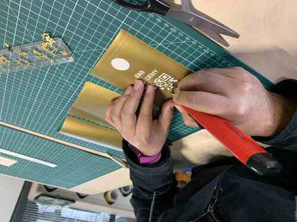

The peeling process was very difficult and it took me almost one hour to peel off the three stickers. The complexity was high because of the QR code.

One difference from the thermal transfer process is that we need to place the vinyl into another adhesive transfer film, that will help us to keep our design to place it in a polished surface preferably.


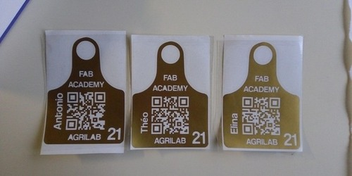


## Laser Cutter:

### Security:

Security it's a very important part of this practice, we had a couple of hours of theory to ensure we understand the dangers of a class 1 laser machine.

We understand that the process of cutting the material produces combustion so there are multiple things to help to keeo this under control.

1. Keep a power/speed ratio according to the material.
2. Use safe materials.
3. Work under supervision of the instructors.
4. Never open the lid while the machine is working.
5. Never put you or something between the path of the mirrors of the machine.
6. Identify the location of the extinguisher.
7. Localize the emergency stop button.
8. If possible use a wet fabric to extinguish small fires before use the extinguisher.
9. Never look directly to the laser.
10. Check the air extractor and liquid cooling systems, both should be working properly.
11. Stay watching the process carefully, don't turn back, because sometimes fires spread quickly.
12. Keep a safe distance area.
13. Be aware of the fumes.

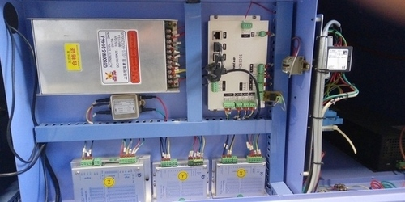

Controller board, motor drivers and power supply.

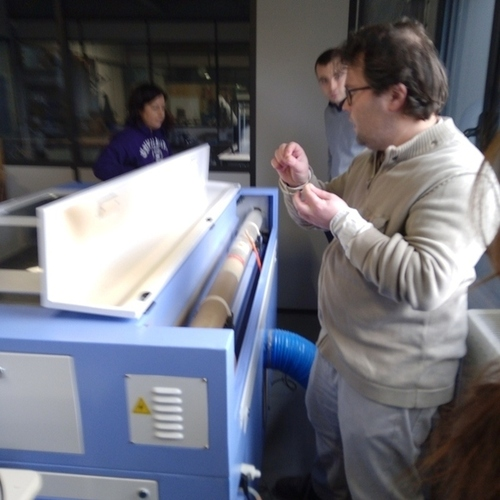

That big bulb is the CO2 laser tube, that projects a ray of IR photons and makes the laser.

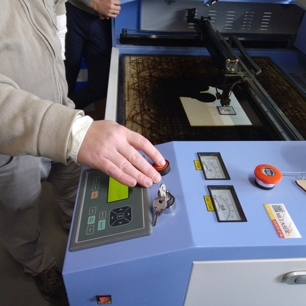

The emergency stop button is very important to avoid accidents and damage to the machine.


### Software:

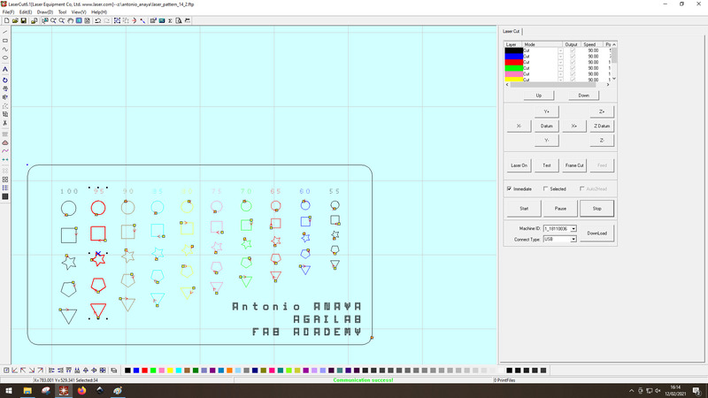

The software was the most frustrating experience for me this week. Sometimes I had to start all over my work because it just halts for any reason.

But I learnt to use it properly, the basic steps are:

1. Load a design in dxf format.
2. Separate the parts in layers.
3. Configure each of the layers for engraving.
4. Configure the last layer as the one that's going to cut out your design.


### Power and speed:

The ratio of output power of the laser and the speed of the movements of it are crucial to get the intended design.

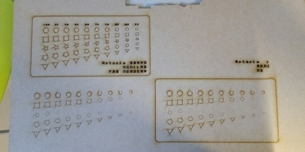

I tried several times to understand and identify differences of the combination of speed and power.
Sometimes the power was very low that it didn't engrave anything and other it was too high.

I discovered also the importance of the "minimum speed" parameter, if the difference is too high with the highest the machine will not engrave or cut properly.

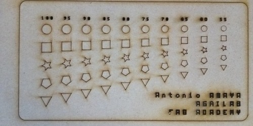


## Kit:

I've made a parametric random shape generator with Python, the idea was simple, just to generate DXF files ready for the laser cutting software.

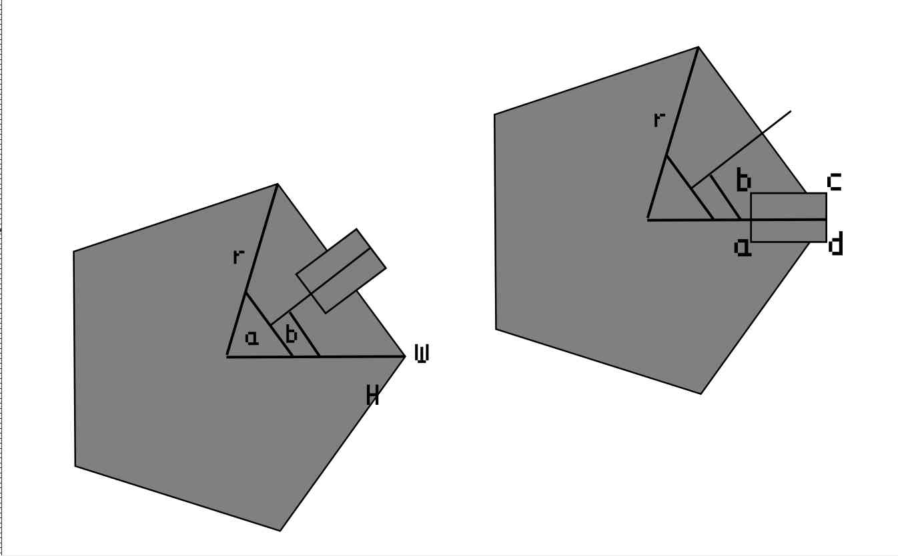

I've coded this following the principle of shaping a polygon by rotating a point in the respective angle that depends of the number of sides of it.

Then to cut the slot I used the same principle mapping manually the points and then rotating it in the origin of the shape.

### Python code:

```

'''
Autor: Antonio de Jesús Anaya Hernández
Github: @kny5
Program: Parametric polygon shape generator for laser cutting with kerf and dxf output.

'''
import math
import ezdxf
import random

# Parameters
sides = random.randrange(3, 10, 1)
radius = 40
origin = (100,100)
slot_depth = radius/2
kerf = 0.2
material_thickness = 5

class dxf_file():
    def __init__(self, __filename):
        self.filename = __filename
        self.file = None
        self.create_dxf()

    def create_dxf(self):
        self.file = ezdxf.new('R2018')
        self.file.saveas(self.filename)

    def save_dxf(self):
        self.file.saveas(self.filename)

    def add_vectors_dxf(self, vectors):
        self.model = self.file.modelspace()
        for vector in vectors:
            self.model.add_line(vector[0], vector[1])
            self.save_dxf()


def rotate_point(point, pivot, angle):
    x = ((point[0] - pivot[0]) * math.cos(angle)) - ((point[1] - pivot[1]) * math.sin(angle)) + pivot[0]
    y = ((point[0] - pivot[0]) * math.sin(angle)) + ((point[1] - pivot[1]) * math.cos(angle)) + pivot[1]
    return (x, y)


def line_intersection(line1, line2):
    xdiff = (line1[0][0] - line1[1][0], line2[0][0] - line2[1][0])
    ydiff = (line1[0][1] - line1[1][1], line2[0][1] - line2[1][1])

    def det(a, b):
        return a[0] * b[1] - a[1] * b[0]

    div = det(xdiff, ydiff)
    if div == 0:
       raise Exception('lines do not intersect')

    d = (det(*line1), det(*line2))
    x = det(d, xdiff) / div
    y = det(d, ydiff) / div
    return (x, y)


class workspace():
    def __init__(self, __origin=(0,0), __width=1000, __height=1000):
        self.origin = __origin
        self.width = __width
        self.height = __height
        self.objects = []

    def add_object(self, __object):
        self.objects.append(__object)
        # Should I sort this?


class polygon():
    def __init__(self, __origin, __sides, __radius, __kerf=kerf):
        self.kerf = __kerf
        self.sides = __sides
        # kerf parameter
        self.radius = __radius + self.kerf
        self.origin = __origin
        self.points = []
        self.vectors = []
        self.angle = 360/self.sides
        self.make()
        self.get_vectors()

    def make(self):
        for side in range(0, self.sides):
            __x = self.origin[0] + self.radius * math.cos(2 * math.pi * side / self.sides)
            __y = self.origin[1] + self.radius * math.sin(2 * math.pi * side / self.sides)
            self.points.append((__x, __y))

    def get_vectors(self):
        self.vectors = list(zip(self.points, self.points[1:] + self.points[:1]))

    def slot(self, __width, __depth):

        # kerf parameter
        width = __width - self.kerf
        depth = __depth - self.kerf
        # Define points of slot shape:
        __a = (self.origin[0] + self.radius - depth, self.origin[1] - (width / 2))
        __b = (self.origin[0] + self.radius - depth, self.origin[1] + (width / 2))
        __c = (self.origin[0] + self.radius, self.origin[1] + (width / 2))
        __d = (self.origin[0] + self.radius, self.origin[1] - (width / 2))

        # Set initial position rotate to initial position
        __a = rotate_point(__a, self.origin, math.radians(self.angle / 2))
        __b = rotate_point(__b, self.origin, math.radians(self.angle / 2))
        __c = rotate_point(__c, self.origin, math.radians(self.angle / 2))
        __d = rotate_point(__d, self.origin, math.radians(self.angle / 2))

        # packing slot sides
        slot_left_side_1 = (__b, __c)
        slot_right_side_1 = (__a, __d)

        # finding intersection point between slot sides and polygon face 1
        right_inter = line_intersection(self.vectors[0], slot_right_side_1)
        left_inter = line_intersection(self.vectors[0], slot_left_side_1)

        # Manually ordering the points of the slot shape
        output = [self.points[0]]
        output.append(right_inter)
        output.append(__a)
        output.append(__a)
        output.append(__b)
        output.append(__b)
        output.append(left_inter)
        # index 7

        # repeating the process radially for the number of faces.
        for side in range(1, self.sides):
            output.append(rotate_point(self.points[0], self.origin, math.radians(side * self.angle)))
            output.append(rotate_point(right_inter, self.origin, math.radians(side * self.angle)))
            output.append(rotate_point(__a, self.origin, math.radians(side *self.angle)))
            output.append(rotate_point(__a, self.origin, math.radians(side *self.angle)))
            output.append(rotate_point(__b, self.origin, math.radians(side *self.angle)))
            output.append(rotate_point(__b, self.origin, math.radians(side *self.angle)))
            output.append(rotate_point(left_inter, self.origin, math.radians(side * self.angle)))

        # creating a vector list from the points list
        self.output = list(zip(output, output[1:] + output[:1]))


# program test

# creating a random generated polygon
a = polygon(origin, sides, radius)
a.slot(material_thickness, slot_depth)

# creating a DXF document and adding slot output vectors
dxf_file_ = dxf_file("test.dxf")
a.get_vectors()
dxf_file_.add_vectors_dxf(a.output)
```


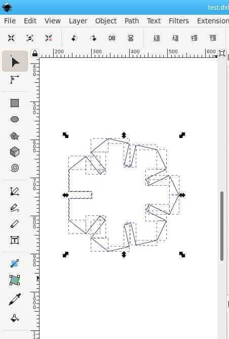


<figure class="video_container">
  <video controls="true" allowfullscreen="true" width="90%">
    <source src="../../images/week04/python_polygon.mp4" type="video/mp4">
  </video>
</figure>


### Laser cutting:
