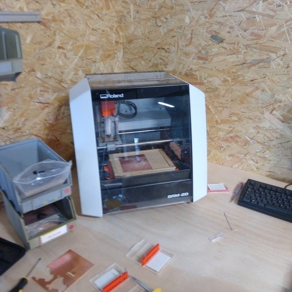

# 5. Electronics production

## Introduction:

This week we started learning about electronics production.

### Electronic board types:

We have seen two different types of boards in the lab, the FR1 and the FR4.

[You can code check the different FR standards here.](https://www.bestpcbs.com/blog/2016/08/whats-the-difference-for-fr1-fr2-fr3-and-fr4-materials/)

We're going to use the FR1 type this week, this is basically due to the soldering process, we know that FR4 boards are capable to be soldered using the IR oven, but FR1 will get fire in the oven, so we're already adverted that we shouldn't by any means try to solder a FR1 in the oven.

### Material:

1. Circuit board

### Manufacturing methods:

Chemical etching:

On this process we use a chemical reduction process to peel of the copper traces, it's a very precise method but the waste is very toxic and needs to be disposed carefully, we are discouraged to use this method because of this.   

## Milling:

This is the process we're going to use this week. It's very simple yet complex in the setting up. It requires a milling machine, those can be as expensive as many tens of thousands of dollars, lately there are some more affordable brands that produce small and precise versions for a few hundred dollars, a good option for home-brew electronics production.

The consumables for this machine, are the board, the sacrificial plate, and the bits that are use to cut the copper out of the material.

### V-Bits:

This type of bit is "V" shaped, it's imprecise but very cheap. As the bit goes low in the "Z" axis the diameter of the cut increases and this means it's impossible to produce small traces in the board, it means also the leveling needs to be very consistent in precision.

### Flat head bits:

This is the bit preferable for precise milling, the diameter is very consistent and this is important to keep consistency in the traces. It also means it's more expensive than "V shaped" bits. This bit also has a feature called "Flute" its a flap that cuts the material, this bit can actually have multiple "flutes"

### Precision:

## Roland SRM-20:

### Software:

### Security assessment:

### Calibration process:

### Maintenance:

## Preparing files to mill:

### PCB Designs for micro-controllers:

### Using Mods:

## Assignment outcome:

### Selecting Micro-Controllers:

### Milling the board:

### Stuffing:

### Soldering:

### Debugging:

### Programming:

### Burning the Boot-loader:

## Hero shot:
