# 5. Electronics production

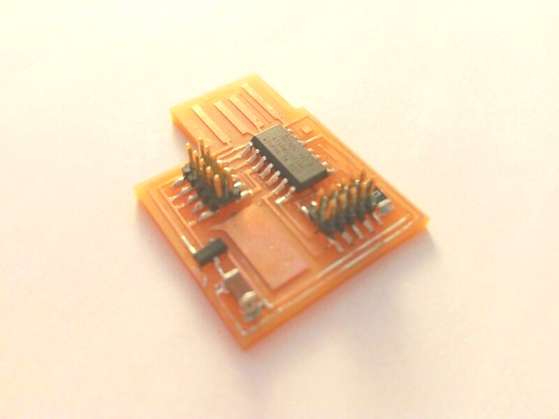

## Introduction:

This week we started learning about electronics production.


### Electronic board types:

We have seen two different types of boards in the lab, the FR1 and the FR4.

[You can code check the different FR standards here.](https://www.bestpcbs.com/blog/2016/08/whats-the-difference-for-fr1-fr2-fr3-and-fr4-materials/)

We're going to use the FR1 type this week, this is basically due to the soldering process, we know that FR4 boards are capable to be soldered using the IR oven, but FR1 will get fire in the oven, so we're already adverted that we shouldn't by any means try to solder a FR1 in the oven.


<!-- ### Materials:

1. Circuit board
-->

### Equipment:

Check list:

1. Roland SRM-20
2. Soldering iron
4. Multimeter
5. Microchip debugger (Flashing interface)


### Manufacturing methods:

Chemical etching:

On this process we use a chemical reduction process to peel of the copper traces, it's a very precise method but the waste is very toxic and needs to be disposed carefully, we are discouraged to use this method because of this.   


## Milling:

This is the process we're going to use this week. It's very simple yet complex in the setting up. It requires a milling machine, those can be as expensive as many tens of thousands of dollars, lately there are some more affordable brands that produce small and precise versions for a few hundred dollars, a good option for home-brew electronics production.

The consumables for this machine, are the board, the sacrificial plate, and the bits that are use to cut the copper out of the material. The bits are extremely fragile specially for flat heat small diameters, so we need to be very careful at the calibration process.


### V-Bits:

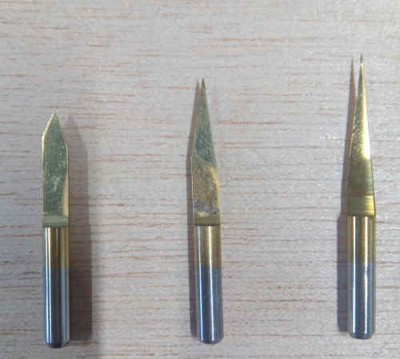

This type of bit is "V" shaped, it's imprecise but very cheap. As the bit goes low in the "Z" axis the diameter of the cut increases and this means it's impossible to produce small traces in the board, it means also the leveling needs to be very consistent in precision.

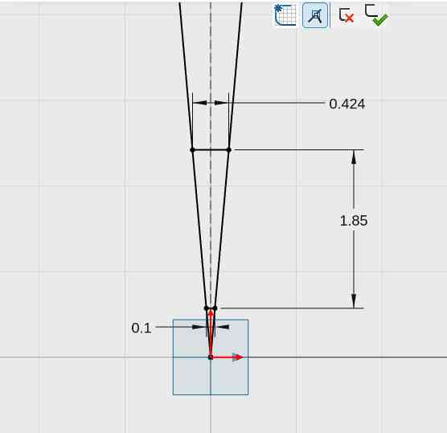

I've made this drawing in XDesing to estimate the diameter along the bit that depends in the depth of the cut in the Z axis.


### Flat head bits:

This is the bit preferable for precise milling, the diameter is very consistent and this is important to keep consistency in the traces. It also means it's more expensive than "V shaped" bits.


This bit also has a feature called "Flute" its a flap that cuts the material.

In the lab we have this diameters available:

**0.4 mm:**

Used to mill the circuit paths, and it's pretty fragile.

**1.0 mm:**

This is used to drill the outline of the PCB at the end.


###  Precision:

I've tested the V bit and this is the result and comparative with the 0.4mm flat head bit:

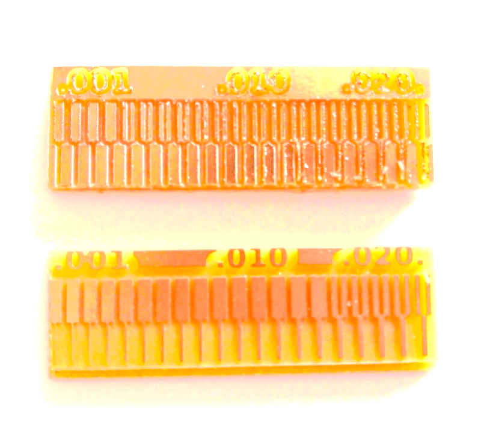

At the top its the board milled with the vbit. At the bottom the one machined with the flat head 0.4 mm.


## Roland SRM-20:


It's a desktop 3D milling machine, capable of cutting several soft materials including some metals like soft aluminum and FR1 PCBs.

You can find more technical details [here](https://www.rolanddg.co.uk/products/3d/srm-20-small-milling-machine).


### Security assessment:

They are a few rules for the usage of the Roland milling machine.

Check list:

1. Check for any obstacle that can collide with the cart.
2. Clean thoughtfully using a mask and the vacuum cleaner any dust that can cause pollution.
3. Use properly the machine, the spindle reaches nearly 8000 RPM so any fragment of the bit can cause damage if it's projected.
4. Use eye protection like googles.
5. Don't over-tight the holder's bolt.
6. Don't try to cut any hard material like steel or hard aluminum.
4. Check electrical connections and electricity reliability.
5. Be careful to not hit any part of the machine while moving the XYZ cart.


### Maintenance:

Check list:

1. Cleaning dust every end of work.
2. Change the sacrificial bed periodically.
3. Don't over-tight the holder's bolt.
4. Check periodically electrical reliability.


### Vpanel configuration:

Vpanel is the software made by Roland Inc. to control the milling machine.

Main functions:

1. Axis displacement and relative location.
2. Axis Origin setup.
3. Axis go to home.
4. Spindle RPM indicator.
5. Spindle speed control.
6. Global job speed control.
7. File list job.
8. Cancel job.

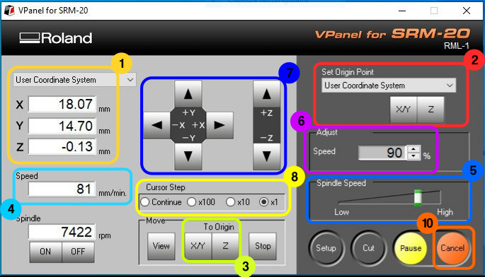


### Calibration process:

Steps:

1. Calibrate X and Y axis by moving the cart using the arrows in the VPanel software. to increase the precision chnge between continue, x100, x10 and x1.
2. Once you're in the exact desired position you should press the  X/Y button under "set origin point" in Vpanel.
3. To calibrate the Z axis it's a more complex process, first because we need to be able to precisely set the bit in touch of the PCB board. For this we need to use the continuity test in the multimeter, clamp the bit and move the Z axis carefully using the down arrow and changing the precision in this order: x100, x10 and x1, to prevent hitting the sacrificial bed with the bit, so you avoid breaking it.
4. Check continuity until the indicator beeps or indicates that there's current continuity between the clamp in the bit and the PCB board.
5. Remove the clamp, and everything else that's not required to stay inside the machine and close the lid.


### Start cutting process:

1. Close the machine's lid.
1. Click on the cut button on Vpanel.
2. Select a .rml file.
3. Press output button.
4. Start the milling process.


## Preparing files to mill:

I've choose to make the JTAG 10 pin board. To get the files of the board I went to the [Fabcademy week5 material](http://academy.cba.mit.edu/classes/embedded_programming/index.html#programmers). In the JTAG I used the next files to accomplish the board making:

1. [Traces file.](http://academy.cba.mit.edu/classes/embedded_programming/SWD/hello.CMSIS-DAP.10.D11C.traces.png)
2. [Outline file.](http://academy.cba.mit.edu/classes/embedded_programming/SWD/hello.CMSIS-DAP.10.D11C.interior.png)
3. [Binary file.(This one will be useful later for the flashing process)](http://academy.cba.mit.edu/classes/embedded_programming/SWD/free_dap_d11c_mini.bin)


### Using Mods:

This is a software made by Prf. Neil Gershenfeld that's is broadly use in the FabLab community to program easier and visually different procesees and workflows like convert PNG image files to Roland SRM-20 cut files.


#### Settings:

**Configuration for the circuit paths:**


1. Flat head 0.4 mm bit.
2. Speed 1.5 mm/s
3. Depth 0.1 mm

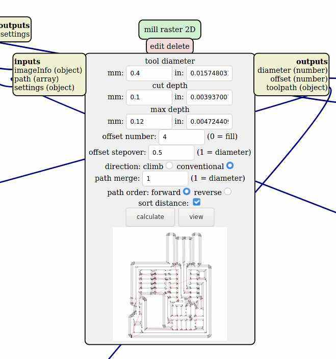


**Configuration for the outline:**

1. Flat head 1.0 mm bit.
2. Speed 2 mm/s
3. Depth 1.89 mm
4. Cut depth 0.4 mm


### Milling the board:


3. Follow risk assessment check lit
2. Follow calibration process check list.


### Stuffing:

In AgriLab's electrolab the components are located in labeled plastic trays.

List of components:

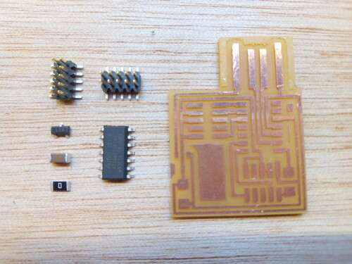

1. SAMD11 SMD-CHIP microprocesor. x1
2. 0 0 hms SMD-Resistor. x1
3. 1 microFarads Ceramic SMD-capacitor x1
4. 3.3 V 100 mA SMD-Regulator
5. 10 Pin SMD male conector. x2

**SAMD11 Pinout:**

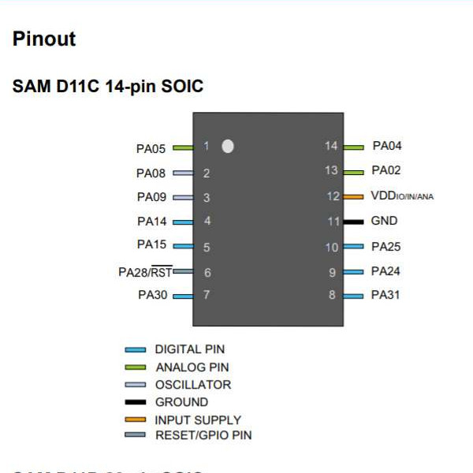


### Soldering:

Materials:

1. Lead-free Solder.

2. Components.

3. Traced PCB.

Process:

1. Power on the soldering iron and select 350 Degrees of Temp.

1. First cover with solder one of the pins in the PCB as a first step mechanical connection. This is helpful for SMD soldering since the components are very small and need a precise alignment.

2. Place the SMD components starting with the ones in the center of the board and progressing from the inside to the outside and leaving at the end the Pin conectors.

3. The soldering process it's very complex and requires expertise to handle the soldering iron.


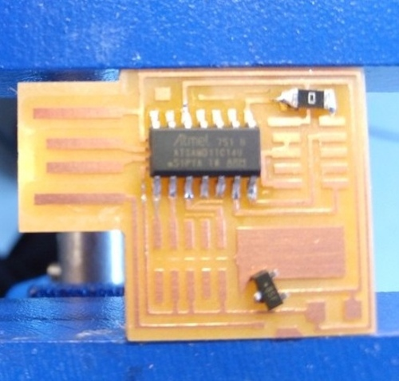


Results:


### Flashing:

Conections:

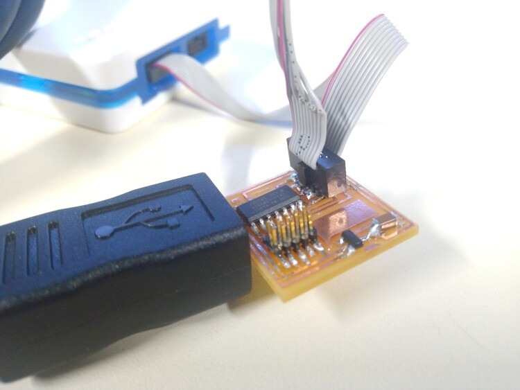
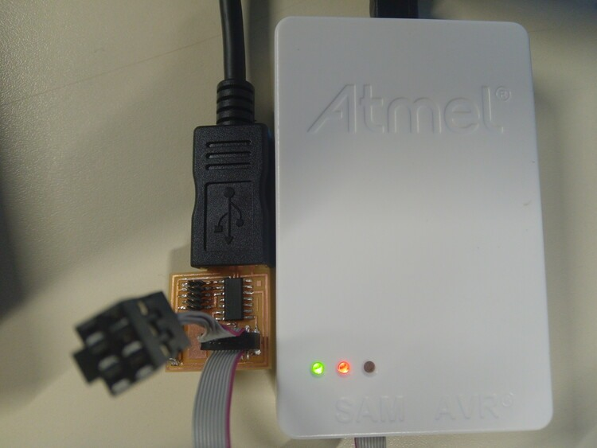

I've used EDBG compiled it from source.

Clonning EDBG Github repository:

```
git clone https://github.com/ataradov/edbg.git
```

Installing EDBG requirements for Fedora Linux:

```
sudo dnf install libudev-devel
```

Inside the EDBG directory executed:

```
make all
```

To execute EDBG and see the help:

```
./edbg -h
```

To access peripherals like the ATMEL USB interface debugger, Administrator rights are needed:

<script id="asciicast-hCsGpWuC8x9buPchYnUcHU1tT" src="https://asciinema.org/a/hCsGpWuC8x9buPchYnUcHU1tT.js" async data-autoplay="true" data-size="small" data-loop=1 data-t=23 data-speed=1  data-rows=10></script>

Parameters:

```
-t samd11
```
- **t** is for Target and SAMD11 it's the family chip of the micro-processor used in the board.

```
-bpv
```
- **b** is for Verbose it's meant to show all the output information in the process.
- **p** is for Programming, we're going to "flash" the binary file we downloaded previously.
- **v** is for Verify that the program was flashed correctly.

```
-f free_dap_d11c_mini.bin
```
- **f** is for File and "free_dap_d11c_mini.bin" it's the name of the binary file that contains the instructions or program for our programmer.


### Debugging:

#### Electrical continuity test:

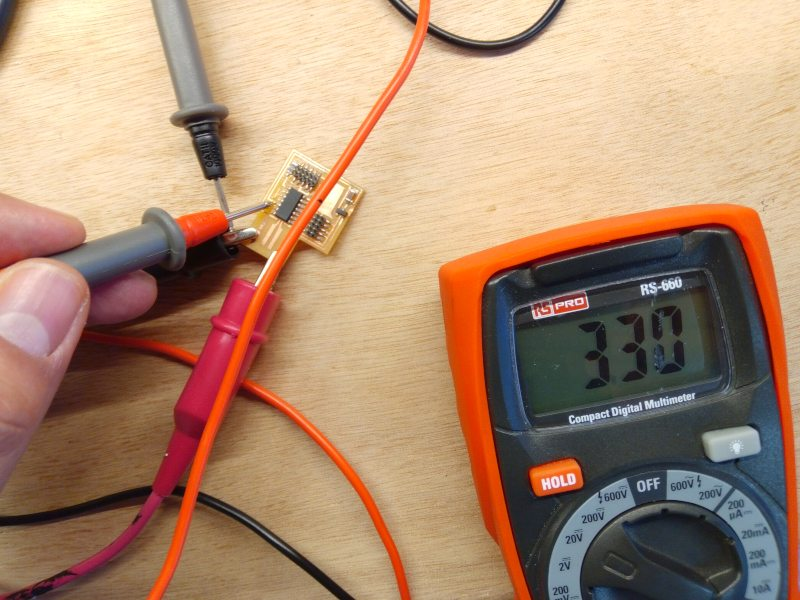
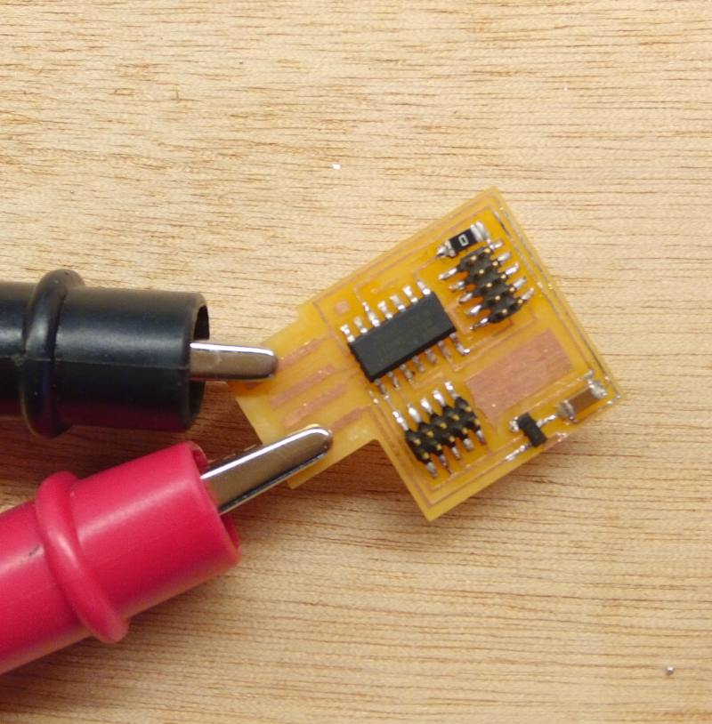
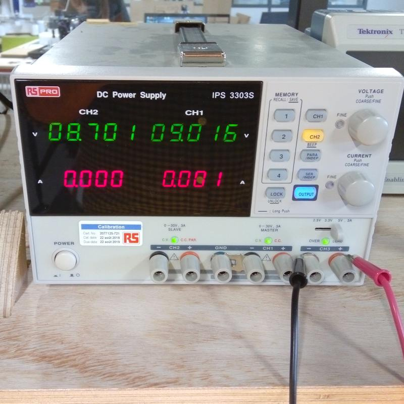


Equipment:

1. Power source.
2. Clamps.
2. Multimeter.

Procedure:

1. Attatch the clamps from the positive output of the power source to the positive side of the USB, check the PINOUT using [this image](http://academy.cba.mit.edu/classes/embedded_programming/SWD/hello.CMSIS-DAP.10.D11C.png).

## Hero shot:


