# 6. 3D Scanning and printing

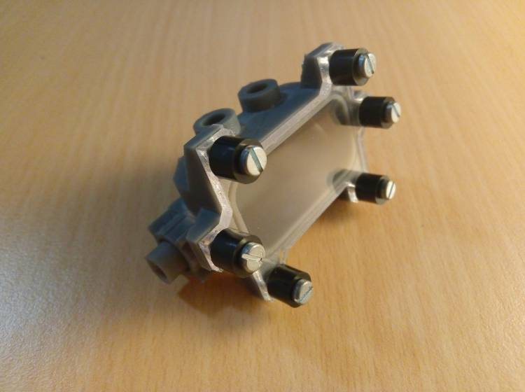

## Introduction:

This week we started on Friday to Print a becnhmarking model.

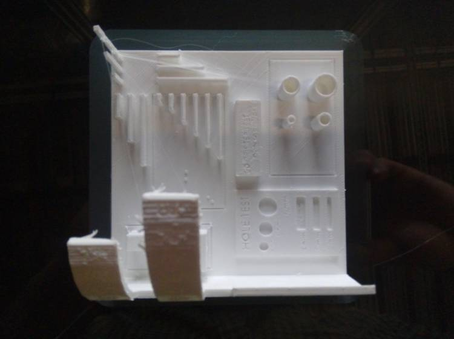

[More details in the group assingment page.](http://fabacademy.org/2021/labs/agrilab/group/week_6_3D_printing/)

Then we had the chance to look at the 3D scanners available at the FabLab.

## Scanning:

**Introduction:**

This is the process of digitalizing the shape of a physical object, the size can be relative but some scanners are specialized to keep dimesiona accuracy for reverse engineering.
There are different technologies for scanning, in the fablab we have optical light projection stereo scanners.

**Optical line scanning devices in the lab:**

Requirements:

1. Einscan Pro Plus.
2. Rotation plate.
1. Shinning 3D ExScanPro.
2. Meshlab

### ExScanPRo:

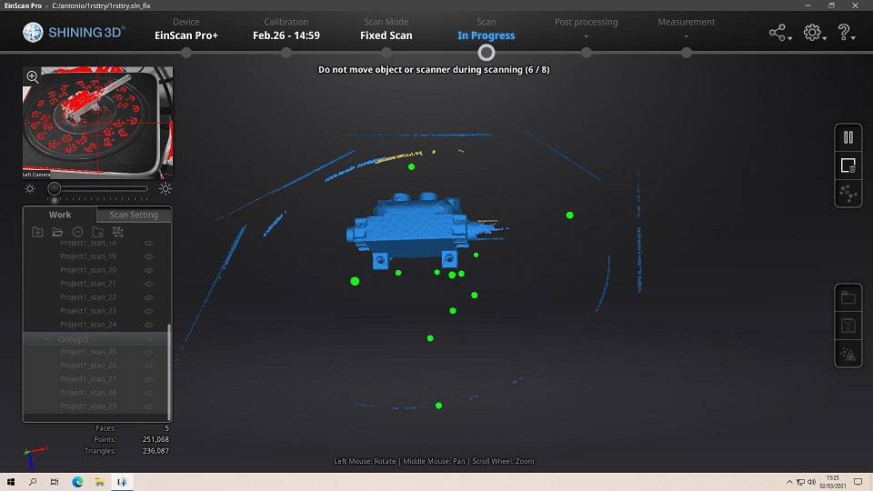

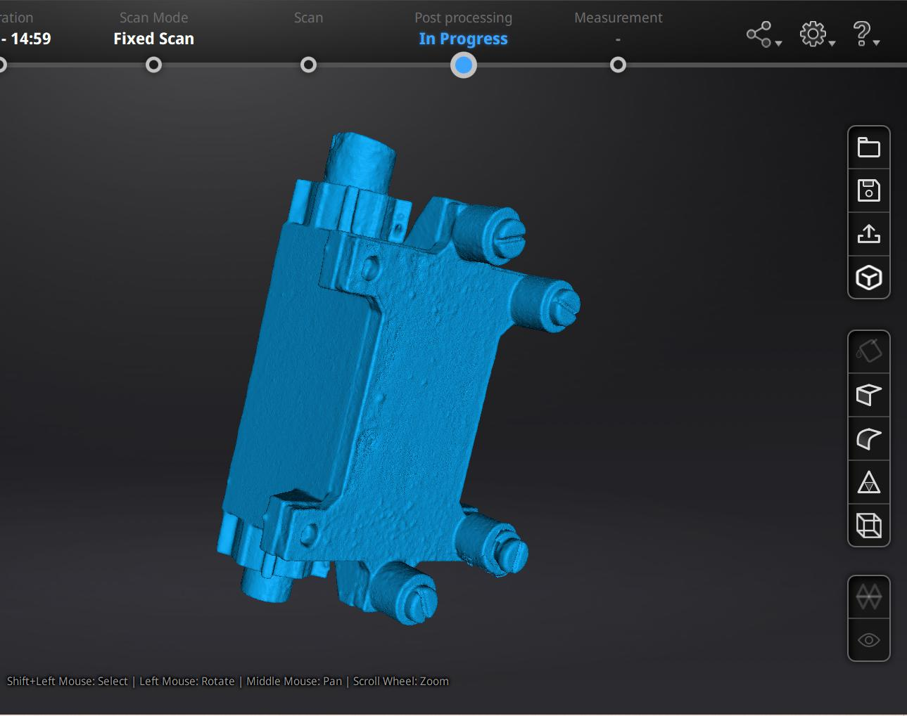

1. If you have a small object, les than 20 * 20 * 20 cm, choose to scan with the rotation plate, if not choose the handheld scanning.
4. If your object is as big as a room, and use the tracking stickers.
2. If you're using the rotation plate place the object to scan in a position with any curved face on top.
3. If your object has transparent or reflective surfaces, coat the all those surfaces with a thin layer of baby powder. This is used to improve the reflection of the light of the scan.
5. Open ExScanPro.
6. Connect the EinScan Pro to a computer using the USB cable. [Detailed computer specs here.]()
6. Choose the "Fixed scan" option.
7. Create a new project group.
8. Start the scan by pressing the play button.
8. Press play to start the scanning process.
9. Configure the step angle, for a full detailed scan choose the higher number (180, a scan every 2 degrees.)
10. Don't move the object during the scanning process, avoid any interference between the scanner and the object.
11. Once the first scan pass has finished, change the position of the object preserving one or more faces from the first pass visible to the scanner, so the software can unify the next scan passes.
13. During the scans it may be some noise or unwanted points in the model, use the selection tools to remove all the unwanted points, press shit and click to select and backspace to delete.
12. Keep scanning and turning the object in the plate changing the position until all the model gets covered.
13. Once the model gets completely scanned look for any green sphere and remove it, those are mark traking points that can damage your model.
14. Click on the mesh model button to create a mesh.
15. Process the mesh in the post-processing step, you can reduce, smooth, simplify and cover holes in the model.
16. Save the model as a STL file.

**Meshlab:**

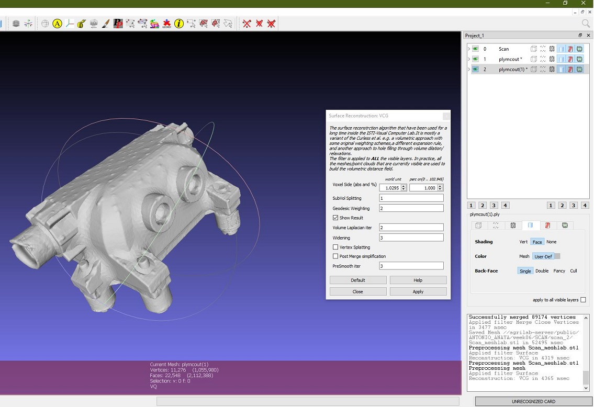

1. Import the STL model output from the ExScanPro software.
2. Filter the model, under the menu Filters>Cleaning and Repairing: Choose as many repair options as the model needs.
3. save the new filtered STL file.

**Outcome:**

My file was about 110 MB, after Meshlab it was reduced to 100 MB, still to big to be uploaded to the GitLab Repo, even compressed it was about 57 MB.
[Download file on drive.]()

### Xbox Kinect:

Requirements:

1. [Power supply 12 Volts.]()
2. [XBOX to USB and 12 Volts adapter.]()
3. [XBOX 360 kinect.]()
4. Computer prefereably with at least 16 GB of RAM a dedicated GPU card.
2. Skanect.
3. Meshmixer.

**Workflow:**

1. Open Skanect and plug the USB converter to current and the a USB port in the computer.
2. While on skanect follow the stes to stand at a optimal distance from the scanned objective. If you're to close the color of the preview will change to blue, if you're too far it will change to red.
3. Keep the distance until the color of the preview model stays at green color.
4. Move around the object to scan until you cover all the sides and details.
5. If Saknect loses track it will ask you to return to a specific position, so try to match the photo capture of the position and keep moving around the obeject to scan.
6. Once you have finished the scan, process the points, create a mesh and export the model as STL.

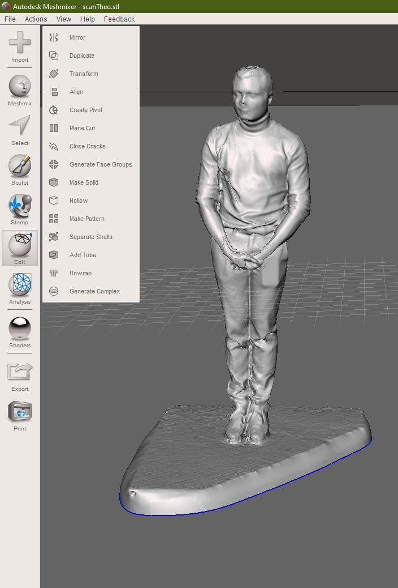

## FDM:

**Description:**

[3D printer at the lab.](../../images/week06/creality_cr10s5_agrilab.jpg)

It's a modern manufacturing process that uses CNC machines to build 3D models, has recently gained a lot of attention due to the availability of desktop 3D print machines to make plastic models.

**Parts:**

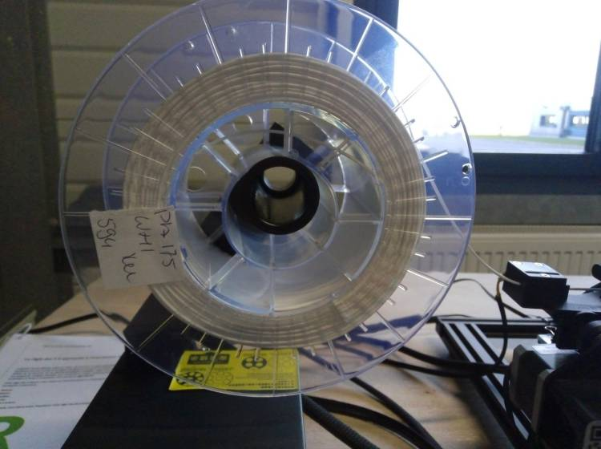

1. General structure.
2. Power supply and control unit.
3. Stepper motors.
4. Control board.
5. Motor drivers.
6. Build plate or bed.
7. Cart.
8. X, Y, Z. Rails.
9. Spool holder.
10. Filament spool.
11. Nozzle.
12. Heating unit for nozzle.
13. Thermal sensors.
14. Leveling sensors.
15. Extruder unit.

### Security assessment:

**Plastic particles in air:**

As in the printing process we are heating plastics and then use a fan to cooldown the layers it's very important to know that we're actually emitting dangerous plastic particles to the air.

So to prevent any hazardous environment follow this basic checklist:

1. Avoid the use of dangerous materials like ABS, instead try to use PLA if the mechanical properties are not important for your piece.
2. Use a HEPA air filter system in the room and keep it turn on while printing in the room. Keep a good maintenance of the filter, replacing or washing periodically the filter cartridges.
3. Once your printing is running and everything seems working fine, stay away from the room.
4. After every work ventilate the room by opening the windows.
5. If possible work with a closed cased 3D printer.
6. If you need to stay close in the same room of the printer for large amounts of time, use a face mask or particle gas mask.

[Detailed information here.](https://www.3dprintingmedia.network/study-desktop-3d-printers-negatively-impact-indoor-air-quality/)

**Fire risk:**

As the FDM printing process requires high temperatures to melt the plastic, there's some risk associated to the usage of the machine.

Checklist to prevent fires while 3D printing:

1. Check that the heat sensors work correctly.
2. Look for any sign of wearing of the insulation that covers the nozzle.
3. Look for any melted parts of the 3D printer that can indicate a over-high temperature.
4. Take a look at the board components and try to identify any over heating on the motor drivers.
5. Use safe temperature materials, there are some exotic mixes that require higher temperatures.
6. Check that all the cooling fans are working correctly.
7. Check if you have the right setttings for the material.
8. Try to split large models into ~8 to 10 hours parts.
9. Avoid prints that are very long.
10. Install [Octoprint](https://octoprint.org/) or [astroprint](https://www.astroprint.com/) to monitor online your prints.
11. Place the 3D printer in a safe environment far away from any fast combustion materials or any other temperature sensitive chemicals.
12. Have a fire extinguisher at hand.

[Detailed information here.](https://www.thissmarthouse.net/dont-burn-your-house-down-3d-printing-a-cautionary-tale/)

**Cross contamination:**

There are some people interested on food-safe or biomedical 3D printing parts. But there's some risk associated to the FDM process that makes very difficult to make safe printed parts.

Food-safe manufacturing checklist:

1. Change the brass extruder nozzle for one made of lead-free staninless steel.
2. Use a closed cased 3D printer.
3. Use a lead-free glass for the printer bed.
4. Use a lead-free material.
5. Print with the higher resolution to reduce the ammount of porosity on the part surface.
6. For posprocessing you can cover the part with Teflon, Transparent resin or try electroplating.

Food-safe use of 3D printed parts:

1. Clean inmediately after every usage, to avoid the food impregnate on the part surface.
2. Don't put any reactive substance in the 3D printed part.
3. If you're using a dishwashing machine, check the temperatures to avoid any deformation on the part.
4. Be conscious that there's no possibility to have a long-lasting 3D print part, so you need to dispose the part after it shows signs of wearing in the food-safe coating.

[Detailed information here.](https://formlabs.com/blog/guide-to-food-safe-3d-printing/)

**Disposing and recycling:**

[Detailed information here.]()

### Z axis Calibration:

Checklist:

1. Turn on the printer.
2. Make the cart go to the home position.
3. Disable steppers.
3. Move the cart to the closest corner of the build plate.
4. Using a small piece of normal bond paper, check the Z axis distance to the plate by passing through the nozzle and the build platform.
5. If you feel the paper passing too tight, lose the Z axis bolt, until the paper passes throughfully.
6. Move to the next corner and repeat the steps 3 to 5.
7. Once all the corners are aadjusted move to the center.
8. Enable steppers again and make a test print.
9. If the print sticks to the printing bed the calibration was successful.
10. If not, repeat the process, until it's succesfull.

### Troubleshooting:

Print not sticking to build plate:

When the machine Z axis is far from the build plate it's very likely that the printing is not going to stick to the bed. If that happens you need to check the Z axis calibration, follow the checklist.
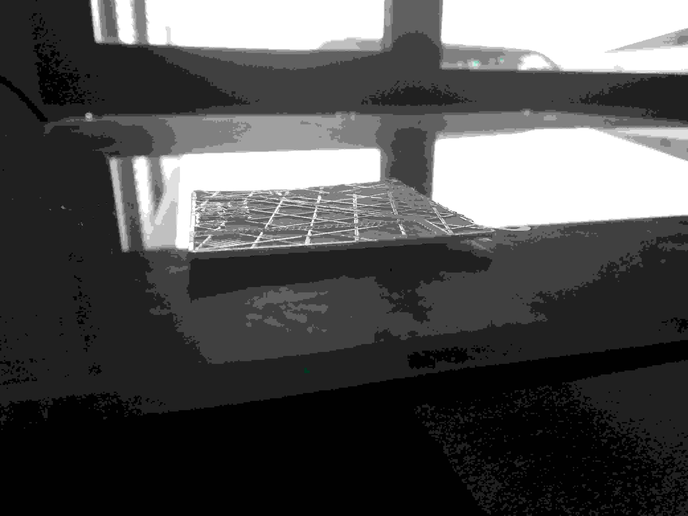

Warp:

When the build plate is too cold, the plastic shrinks quikly and the difference of contraction between the first layers and the current ones it makes the piece to warp and detatch to the build plate.
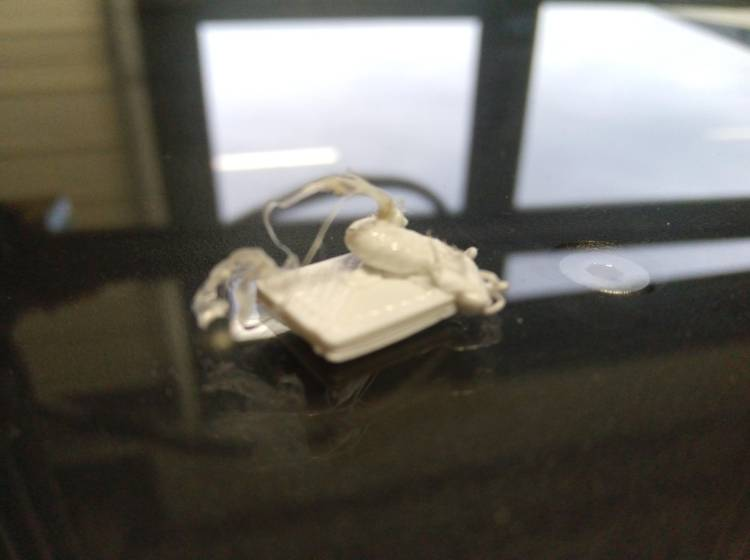

Elephant feet:

When the Z axis is too close to the bed, the fused filament can make a bigger base that looks that a elephant feet.
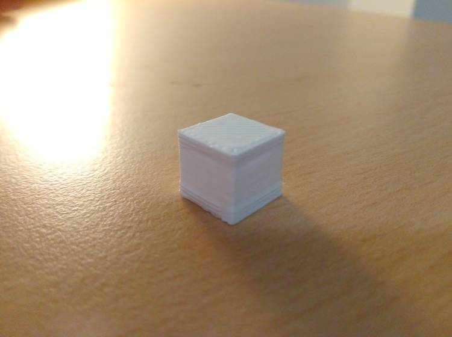

Melted points:

When the temperature it's too high and the speed it's too slow, the filament will look very low detailed and melted looking.

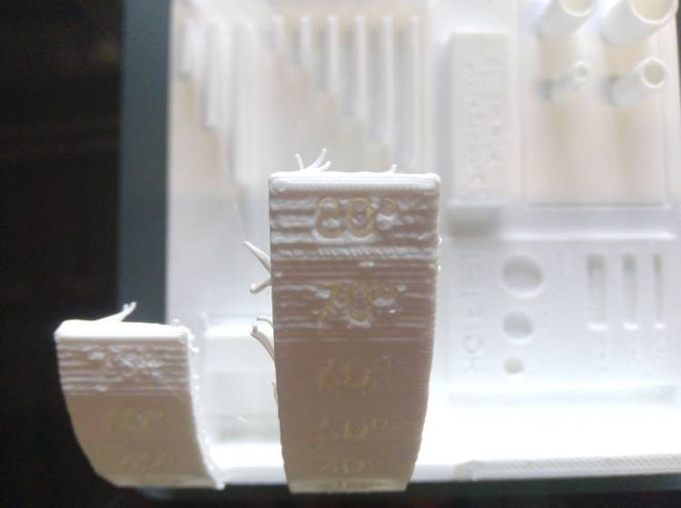

### FMD workflow:

**Requirements:**

1. STL 3D model.
2. Slicing software.
3. Filament material spool.

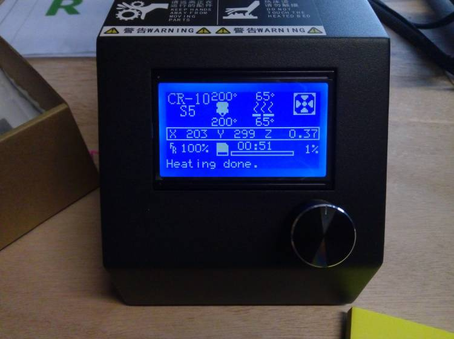

**Slicing using Cura:**

Cura is a software that converts STL files into GCODE that's used by the 3D printing.

1. Import the STL file to print.
2. Place it in to the build plated in one plain side.
3. Choose the orientation avoiding the largest side in the Z or Y axis.
4. Set the layer thickness optimizing time and material.
5. Set the temperature of the nozzle following the material recomendations.
5. Set the build plate temperature depeding on the temperature of the room and following the material labeled recommendations.
5. Set the speed of the printing process.
5. Set the infill to a conservative percentage to avoid material wasting, but optimizing mechanical properties of the part.
6. Slice
7. Save the GCODE file in a SD card or USB drive to upload it to the machine.

**Process:**

1. Ensure the machine is calibrated.
2. Ensure that there's enough material for the printing job.
3. Clean the build plate.
3. Load the GCODE file.
4. Start the printing process.
5. Take care of any extruded filament during the pre-heating process. Those can mess up the first layer of the printing.
6. Once the process started, take care of the temperature of the room and follow the risk assessment checlists.
7. Once the process has finished, separate the printed part from the build platform using a clean spatula.
8. Check dimension accuracy if needed.
9. Take notes of the configurations you used on a document to keep a quality control data base.

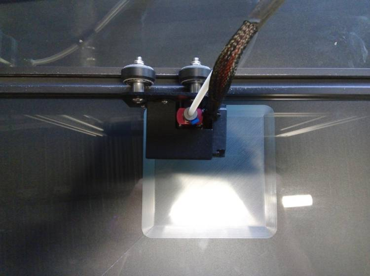
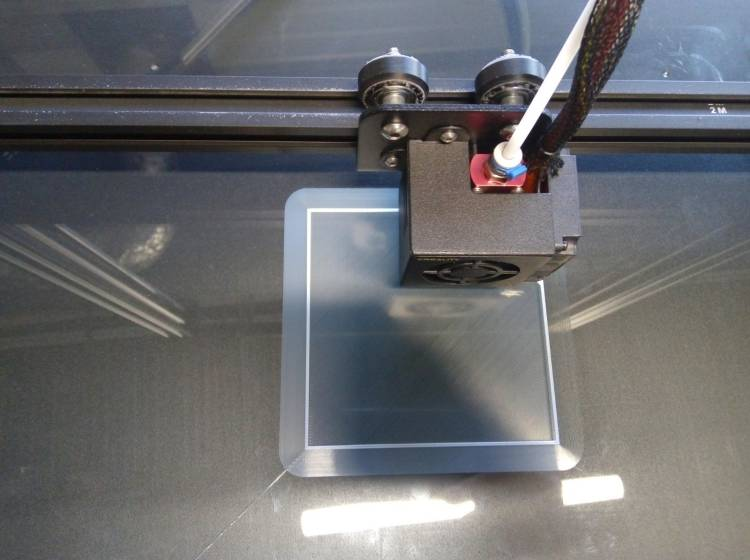
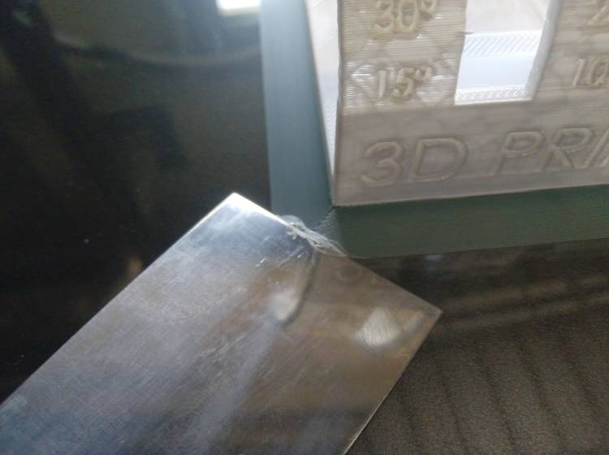

### SLA:

**Introduction:**

Stereolithography it's a manufacturing process that makes use of photoreactive resins and light in a specific wavelenght, to build tri-dimensional models.

### SLA Workflow with **Formlabs form 2**:

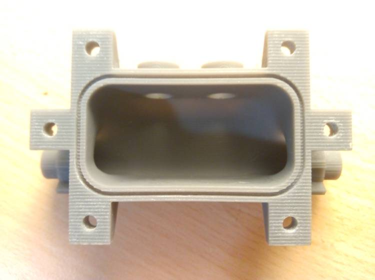

**Requirements:**

1. SLA printer (Formlabs form 2).
2. Resin cartridge.
3. Isopropyl alcohol.
4. Plastic Container.
5. Paper towels.
6. Disposable globes.
7. Clean Spatula.
8. Fabric Tissue.
9. UV curing chamber.
10. Washer for Automatically washing.
11. Slicer software for SLA.
12. USB cable or SD memory to load files.

**Preparing files:**

1. Desing a model and export it as a STL file.
2. Open Preform.
3. Click on the "magick wand button"
4. Save the file and send it to the machine.

**Process:**

1. Turn on the printer. Pulsing the power button.
2. Keep the lid closed as much as posible, light contaminates the resin byt curing it. Be quick at open and manipulating anything inside the print chamber.
2. Remove the tank cover.
3. Open the vent in the cartridge by pushing the mechanical vent button.
4. Place the building plate in the holder.
5. Upload the file to print using a USB memory stick, USB cable or network using Preform software.
6. Check before confirming that the chamber is free of any obstacles and the resin is flowing as expected.
7. Start the printing process.
8. If after the first layers you detect any anomaly in the printing like lose supports or detatched parts, stop the printing.
9. If the printing its succesfull, proceed to remove the building plate.
10. Use paper towels to clean the excess of liquid in the building plate, not in the model.
11. Don't pour any of the residual resin in the tank.
12. Remove the printed part carefully using a clean spatula.
13. Place the part in the washing machine.
14. Set the time depending on the size and resin type.
15. Once the washing process has finished, remove carefully the part from the machine using globes and avoiding breathing or touching the Isopropyl alcohol.
16. Place the part inside the curing chamber.
17. Set the temperature and time using the information available [here](https://support.formlabs.com/s/article/Form-Cure-Time-and-Temperature-Settings?language=en_US).
18. Once the curing process has finished, carefully remove the suppports using a pinzer or exacto cutter.
19. The print has finished.

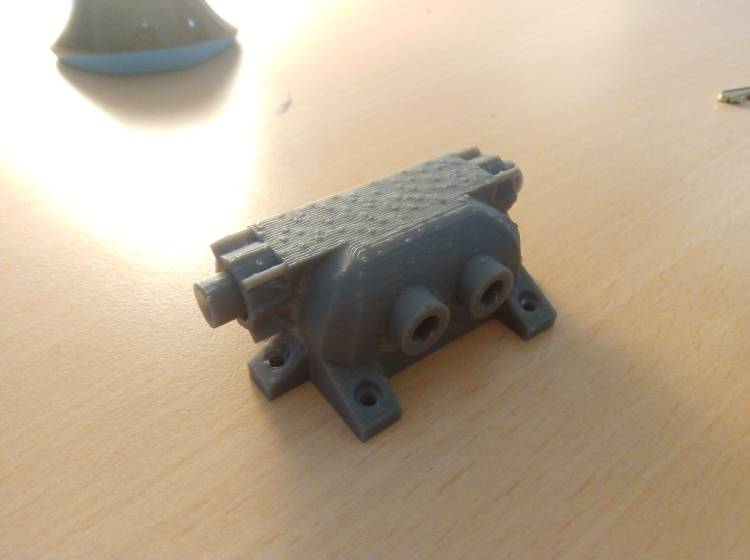

**Cleaning and chemical disposing:**

1. Do not wash the resing with water or Isopropyl alcohol in the sink.
2. Use paper towels, and don't dispose any of it in the paper recycling.
3. Expose the used towers to sunlight to cure the plastic.
4. Find a chemical disposal container to dispose the paper towels.

## Assignment Outcome:

### 3D model:

This is the first prototype of the electroconductive sensor for my final project. As I need the parto to be watertight I choose SLA priting, then as We don't have transparent resin available I made a window on my part to place a transparent laser cutted plate. I followed design principles using nervs and reincorcing the unions using chamflers or roundings. It will be very difficult for a 5 axis milling machine to reproduce the shape, but it's possible to make 2 parts mold of course.

[More info about my project here.](../../projects/final-project/)

Part for printing:

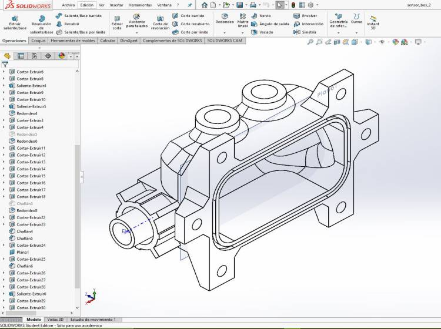

Assembly on 3D:

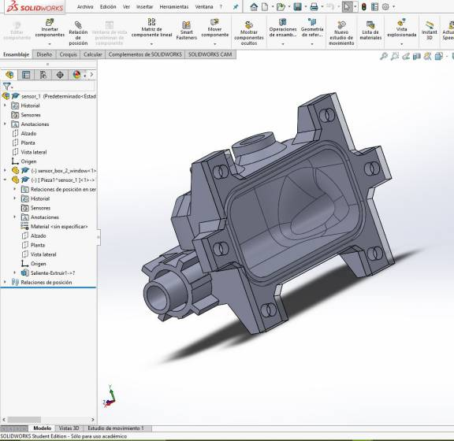

Preform:

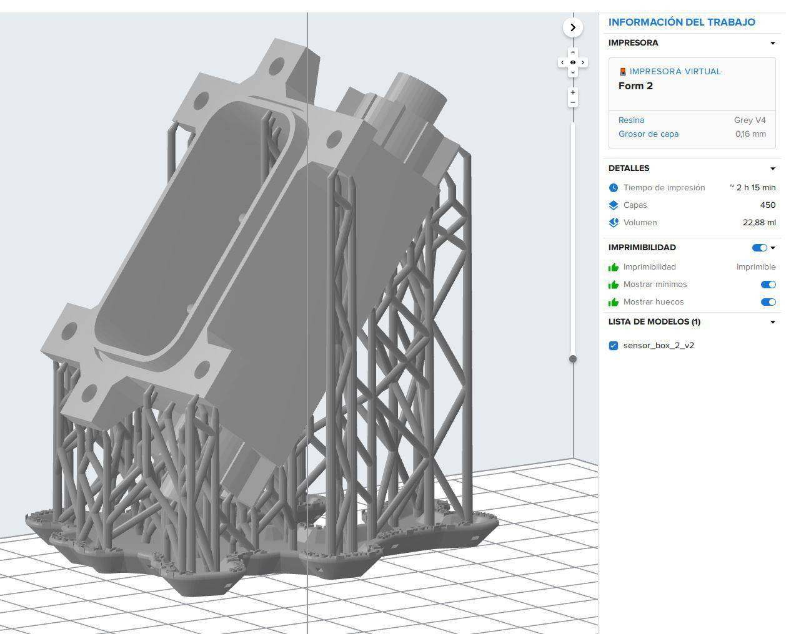

Printing:

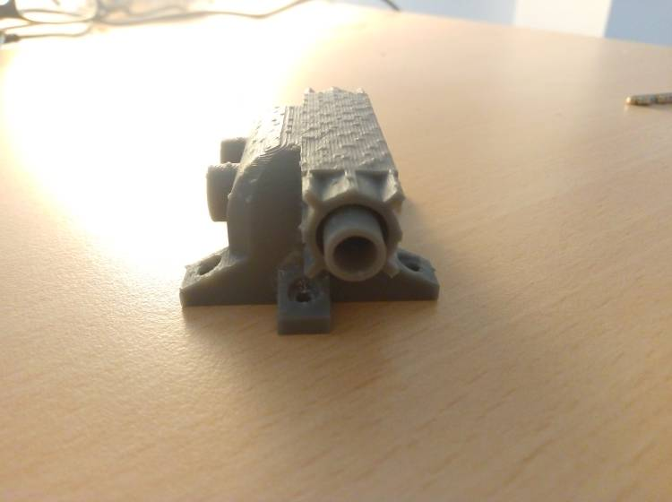

Parameters:

| Material  | Grey V4 |
| Printing time  | 89 min |
| Washing time | 30 min |
| Curing time | 36 min |
| Curing temperature  | 60 C |

### Assembly:

Parts:

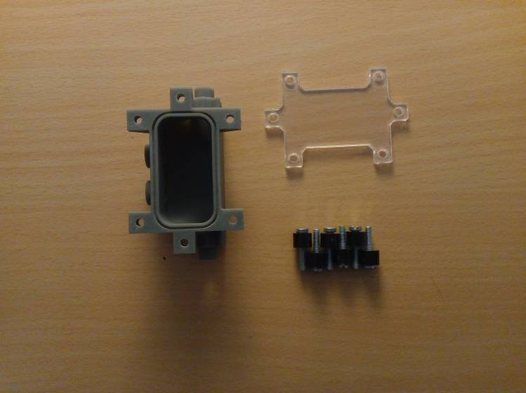

1. Printed part.
2. Laser cutted window.
3. 6 M3 15 mm Bolts.
4. 6 M3 rubber spacers.
5. 6 M3 hexagonal nuts.

View 1:

View 2:
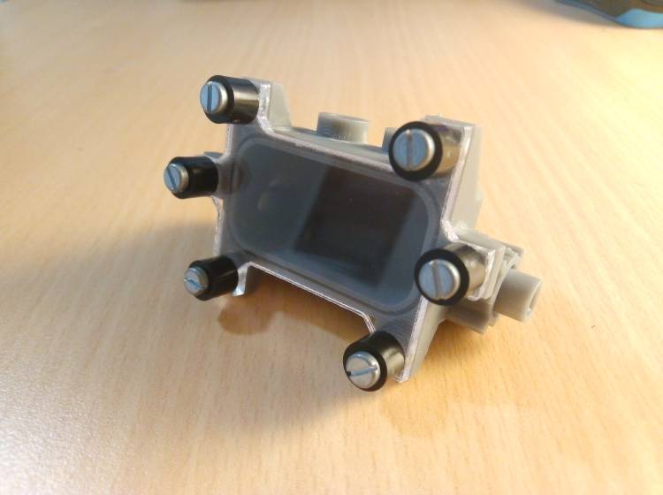

With Electrodes:
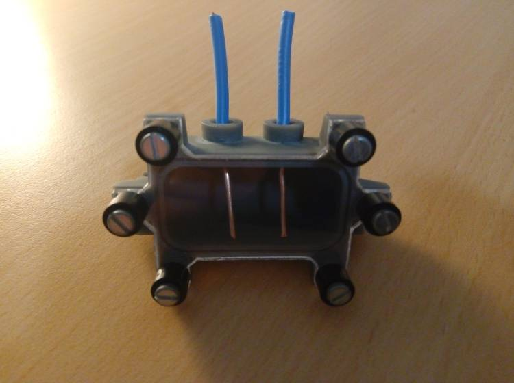

Design fails:

The rubber seal holder it's too small, the electrode holders are too big and the nuts can't touch the piece so I'll need to make it wider. For the next iteration.
