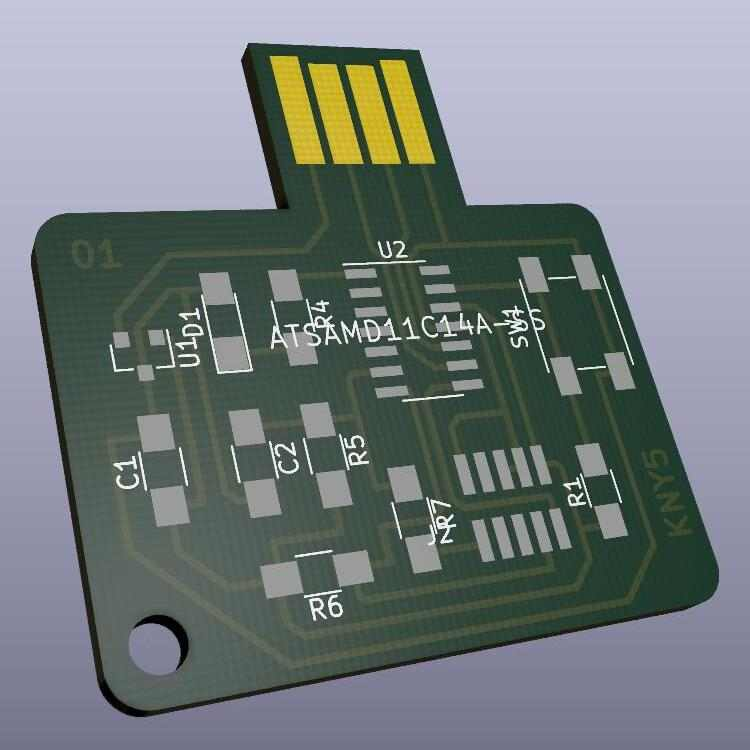
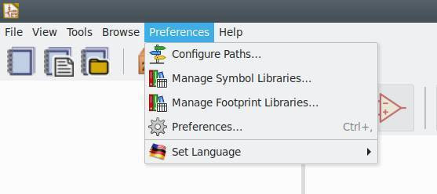
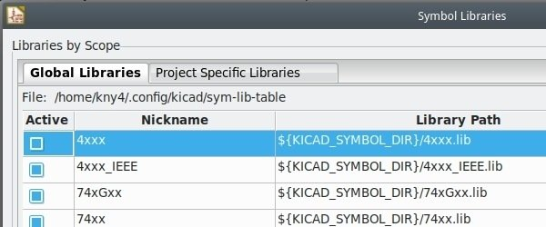
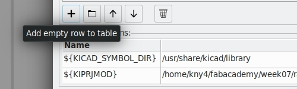
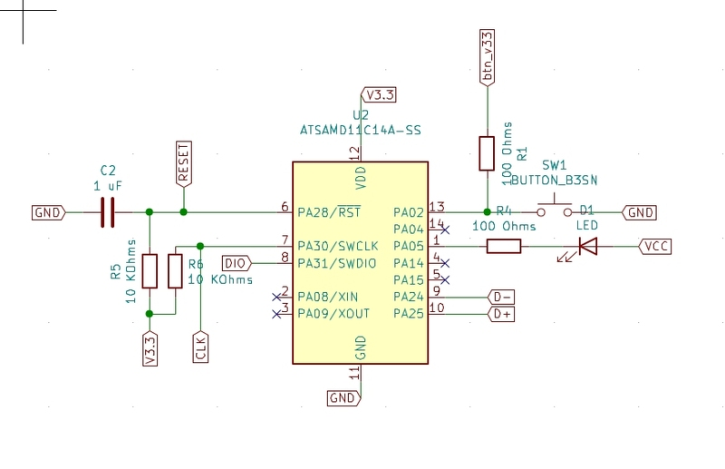
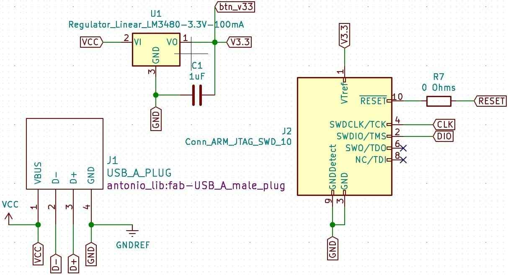
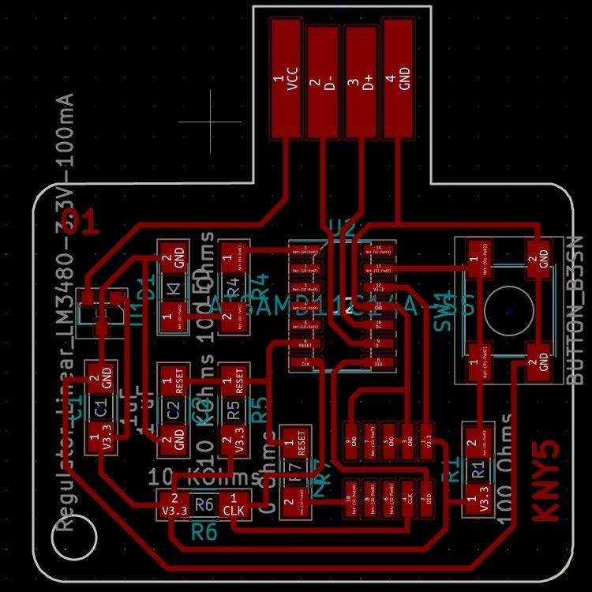

# 7. Electronics design

It might be a video for this week... depending on Monday's work.



**A few notes for this week about documentation:**

I've made a list of recommendations to get easily into the documentation process to help me out to have a structure, and with the hope to help others struggling under similar conditions.

[Check my notes on my new Tips section.](../../Tips/documentation_tips/)


## Electronic components:

**Resistor:**

*It's a passive electrical component that holds resistance to an electrical current.* [Detailed information](https://youtu.be/rcSOcbu6pDM?t=189)

| Component | Resistor |
| :----------- | :------------------- |
| Type | SMD 1206 |
| Value | 0 Ohms, 100 Ohms, 50 Ohms, 1 KOhms |
| Code | **Check** |
| Digikey #| 311-100FRCT-ND |
| Link | <a href="https://www.digikey.com/short/pd5fm4vp" target="_blank"> DigiKey </a> |

Formula:

Ohms Law: **Resistance = Voltage / Current**

Example for a 2V, 0.02A LED in a 5 Volts Power Supply: 5V - 2V = 3V; 3V / 0.02A = 150 Ohm


**Capacitor:**

*It's a passive electrical device used to store temporally a charge, consisting of one or more pairs of conductors separated by an insulator.*

| Component | Capacitor |
| :----------- | :------------------- |
| Type | SMD 1206 |
| Value | 1uF |
| Code | None |
| Digikey #| C3216X7R1H105K160AB |
| Link | <a href="https://www.digikey.com/short/fnhmzvj5" target="_blank"> DigiKey </a> |


**Regulator:**

*Any electrical or electronic device that maintains the voltage of a power source within acceptable limits.*

| Component | Regulator |
| :----------- | :------------------- |
| Type | SMD  SOT23 |
| Value | 3.3V 100mA |
| Code | None |
| Digikey #| LM3480IM3-3.3/NOPB |
| Link | <a href="https://www.digikey.com/short/5mntwv4z" target="_blank"> DigiKey </a> |


**Diode:**

*It's a semiconductor device with two terminals, typically allowing the flow of current in one direction only.*

| Component | light emitting diode (LED) |
| :----------- | :------------------- |
| Type | SMD 1206 |
| Value | 2V 0.02A |
| Code | None |
| Digikey #| 160-1167-1-ND |
| Link | <a href="https://www.digikey.com/short/8b9t5fjq" target="_blank"> DigiKey </a> |


**Micro-controller**

*It's a compressed micro computer manufactured to control the functions of embedded systems*

| Component | ATMEL SAMD11C14A Microcontroller |
| :----------- | :------------------- |
| Type | SMD 14 Pin |
| Value | 32Bits 48MHz 1.62~3.63V |
| Code | ATSAMD11C14A |
| Digikey #| ATSAMD11C14A-SSUTCT-ND  |
| Link | <a href="https://www.digikey.com/short/vv1nf30r" target="_blank"> DigiKey </a> |


## Electronic Schematics

**Symbols**

**Examples**

## Kicad

**Requirements**

1. Install [Kicad](https://kicad.org/about/kicad/){:target="_blank"}
2. Download or clone Fab Academy Kicad Library.
3. Add Symbol and Footprints libraries.
4. Add [Luc](https://fabacademy.org/2019/labs/sorbonne/students/hanneuse-luc/about/){:target="_blank"} and [Florent](http://fabacademy.org/2020/labs/agrilab/students/florent-lemaire/about/){:target="_blank"} USB and JTAG KiCad footprint files.
5. [SAMD11 datasheet.](https://ww1.microchip.com/downloads/en/DeviceDoc/Atmel-42363-SAM-D11_Summary.pdf){:target="_blank"}
6. [SAMD11 pinout information.](https://github.com/mattairtech/ArduinoCore-samd/blob/master/variants/Generic_D11C14A/README.md){:target="_blank"}
7. Look for availability of components in your local inventory.


**Installation**

On Fedora Linux:
```
sudo dnf install kicad
```

Download for any other platform [here.](https://kicad.org/download/){:target="_blank"}

Cloning Fab Academy Kicad Library repository:
```
git clone https://gitlab.fabcloud.org/pub/libraries/electronics/kicad.git
```

### **Setup**








**Add Symbol library**

1. Open Kicad, at the menu bar, click on: "Preferences">"Manage symbol libraries">"Global libraries".
2. Click on: "Add a new empty row to table".
3. Click on: "Library Path" and search-select the file **"fab.lib"** in Fab-Academy "kicad" repository.
4. Click on: "OK" and close the manager window.

**Add footprint library**

1. Click on: "Preferences">"Manage footprint libraries">"Global libraries".
2. Click on: "Add a new empty row to table".
3. Click on: "Library Path" and search-select the file **"fab.pretty"** in Fab-Academy "kicad" repository.
4. Click on: "OK" and close the manager window.

**Add custom USB and JTAG footprints**

1. Download this [file](../../files/week07/footprints.zip)
2. Extract the content to your Kicad project directory
3. Click on:

**Edit footprints:**


**Make your own library:**

### Workflow

#### Schematic design

For this process I took a look into this years scheduled content. And selected the    **hello.D11C.blink.reset.clock** board as the base of my design.


#### PCB design

**Place components:**

**Connecting components:**

## Outcome

### Schematic




### Footprints



### 3D model


### Processing files

### Milling

### Solder

### Debug

### Programming
