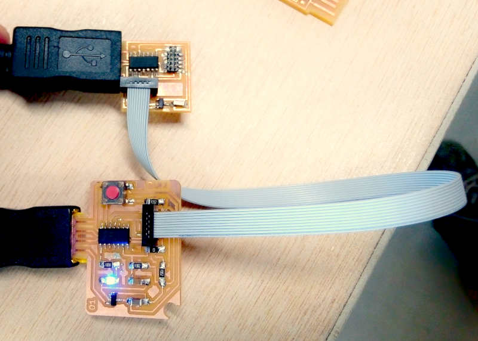

# 7. Electronics design


<details closed>
<summary>A few notes for this week about documentation:</summary>
<p>

I've made a list of recommendations to get easily into the documentation process to help me out to have a structure, and with the hope to help others struggling under similar conditions.

<a href="../../Tips/documentation_tips" > [Check my notes on my new Tips section.]</a>

</p>


</details>

## Introduction

This week I've learn to use Kicad and design my own version of the [**ATSAMD11C hello.D11C.blink.reset.clock**](http://academy.cba.mit.edu/classes/embedded_programming/index.html#echo) I've added a switch button and a blue LED.

I've made two boards. The first one broke in one corner when I tried to make a hole to use it as a badge, and I used the wrong SMD button. For the second one I've removed the hole in the design and used the correct button.

For my board programming I've used the programmer I've made in the [Electronics production week](../../assignments/week05/). And I've also used the oscilloscope to check the signals in my board as part of the group assignment, [check it here](http://fabacademy.org/2021/labs/agrilab/group/week_7).


### Electronic components

**Resistor:**

*It's a passive electrical component that holds resistance to an electrical current.* [Detailed information](https://youtu.be/rcSOcbu6pDM?t=189)

| Component | Resistor |
| :----------- | :------------------- |
| Type | SMD 1206 |
| Value | 0 Ohms, 100 Ohms, 50 Ohms, 1 KOhms |
| Code | **Check** |
| Digikey #| 311-100FRCT-ND |
| Link | <a href="https://www.digikey.com/short/pd5fm4vp" target="_blank"> DigiKey </a> |

>Formula:

>Ohms Law: **Resistance = Voltage / Current**
Example for a 2V, 0.02A LED in a 5 Volts Power Supply: 5V - 2V = 3V; 3V / 0.02A = 150 Ohm


**Capacitor:**

*It's a passive electrical device used to store temporally a charge, consisting of one or more pairs of conductors separated by an insulator.*

| Component | Capacitor |
| :----------- | :------------------- |
| Type | SMD 1206 |
| Value | 1uF |
| Code | None |
| Digikey #| C3216X7R1H105K160AB |
| Link | <a href="https://www.digikey.com/short/fnhmzvj5" target="_blank"> DigiKey </a> |


**Regulator:**

*Any electrical or electronic device that maintains the voltage of a power source within acceptable limits.*

| Component | Regulator |
| :----------- | :------------------- |
| Type | SMD  SOT23 |
| Value | 3.3V 100mA |
| Code | None |
| Digikey #| LM3480IM3-3.3/NOPB |
| Link | <a href="https://www.digikey.com/short/5mntwv4z" target="_blank"> DigiKey </a> |


**Diode:**

*It's a semiconductor device with two terminals, typically allowing the flow of current in one direction only.*

| Component | light emitting diode (LED) |
| :----------- | :------------------- |
| Type | SMD 1206 |
| Value | 1.8V 0.02A |
| Code | None |
| Digikey #| 160-1167-1-ND |
| Link | <a href="https://www.digikey.com/short/8b9t5fjq" target="_blank"> DigiKey </a> |


**Micro-controller**

*It's a compressed micro computer manufactured to control the functions of embedded systems*

| Component | ATMEL SAMD11C14A Microcontroller |
| :----------- | :------------------- |
| Type | SMD 14 Pin |
| Value | 32Bits 48MHz 1.62~3.63V |
| Code | ATSAMD11C14A |
| Digikey #| ATSAMD11C14A-SSUTCT-ND  |
| Link | <a href="https://www.digikey.com/short/vv1nf30r" target="_blank"> DigiKey </a> |


### Electronic Schematics

**Symbols**


## Kicad

**Requirements**

1. Install [Kicad](https://kicad.org/about/kicad/){:target="_blank"}
2. Download or clone Fab Academy Kicad Library.
3. Add Symbol and Footprints libraries.
4. Add [Luc](https://fabacademy.org/2019/labs/sorbonne/students/hanneuse-luc/about/){:target="_blank"} and [Florent](http://fabacademy.org/2020/labs/agrilab/students/florent-lemaire/about/){:target="_blank"} USB and JTAG KiCad footprint files.
5. [SAMD11 datasheet.](https://ww1.microchip.com/downloads/en/DeviceDoc/Atmel-42363-SAM-D11_Summary.pdf){:target="_blank"}
6. [SAMD11 pinout information.](https://github.com/mattairtech/ArduinoCore-samd/blob/master/variants/Generic_D11C14A/README.md){:target="_blank"}
7. Look for availability of components in your local inventory.


**Software**

On Fedora Linux:
```
sudo dnf install kicad
```

Download for any other platform [here.](https://kicad.org/download/){:target="_blank"}

Cloning Fab Academy Kicad Library repository:
```
git clone https://gitlab.fabcloud.org/pub/libraries/electronics/kicad.git
```


### **Kicad Setup**


**Add Symbol library**


>- Open Kicad, at the menu bar, click on: "Preferences">"Manage symbol libraries">"Global libraries".


>- Click on: "Add a new empty row to table".


>- Click on: "Library Path" and search-select the file **"fab.lib"** in Fab-Academy "kicad" repository.
>- Click on: "OK" and close the manager window.

**Add footprint library**

1. Click on: "Preferences">"Manage footprint libraries">"Global libraries".
2. Click on: "Add a new empty row to table".
3. Click on: "Library Path" and search-select the file **"fab.pretty"** in Fab-Academy "kicad" repository.
4. Click on: "OK" and close the manager window.

**Add custom USB and JTAG footprints**

1. Download this [file](../../files/week07/footprints.zip)
2. Extract the content to your Kicad project directory
3. Repeat the **Add Symbol library** and **Add footprint library** process using the files extracted.

**Edit footprints:**

**Make your own library:**

### Usage

#### Schematic layout design

**Symbol:**


>- Click on: **"Place symbol"** icon, pulse left click on canvas.


>- Select a component preferably from the **Fab Academy library**

**Global label:**


>- Click on: **"Place global label"** icon, pulse left click on canvas.


>- Write the a new name for a label or select an existing one from the drop-down menu.

**Wire:**


>- Click on: **"Place wire"** icon, then left-click in the start and end points of the wire, you can connect symbols by clicking in their pin connection area, represented by a circle in the terminals.

**No connection:**


>- Click on: **"Place no connection flag"**, left-click on every unused connection. This is important to avoid errors in the electrical check tool.


#### Associate footprints


>- Click on: **"Edit symbol fields"** icon in the toolbar.


>- Associate every symbol to the right footprint in the Fab-Academy footprint library by clicking in every footprint cell and search-find the footprints in the fabacademy footprint library.

>- For the LED, Resistors, diode and Capacitor, select the *type 1206* footprint.
>- For the USB and JTAG connectors look into the custom library.


#### Generate Netlist


1. Click on: Icon "Generate Netlist" in the top toolbar
2. Click on: Button "Generate Netlist"
3. Save the **"".net"** file


#### PCB Layout design

1. Open the PCB layout editor.
2. Click on "Load netlist".
3. Using the wire tool you can trace the tracks of the board.
4. Follow the [design rules of the week05 assingment.](../../assignments/week05)


#### Troubleshooting

During the documentation process I've found multiple mistakes in my schematic tht could lead to malfunction or a small explosion.
I've found also a fliped led in my schematic image. That I've corrected except in the screen capture.


## **Assignment Outcome**


### Schematic

>For this process I've selected the [**ATSAMD11C hello.D11C.blink.reset.clock**](http://academy.cba.mit.edu/classes/embedded_programming/index.html#echo) board as the base of my design.

1. Divided the work in four parts:
    - Regulator
    - USB connector
    - JTAG conector
    - Microntroller
2. Placed the following list of symbols under the FabAcademy library:
    - ATSAMD11C14A
    - Regulator
    - USB connector
    - JTAG connector

<details closed>
<summary>USB connector</summary>


<pre>

1. Wired the USB connector to the VCC and GNDREF symbols.
2. Placed Global labels:
    - VCC
    - GND
    - D+
    - D-
3. Wired the global labels to the USB connector:
    - VCC  to pin 1
    - D- to pin 2
    - D+ to pin 3
    - GND to pin 4

</pre>

</details>

<details closed>
<summary>Regulator</summary>


<pre>

1. Placed the following symbols:
    - C1 capacitor 1uF
2. Placed global label:
    - VCC
    - GND
    - V3.3
    - btn_v33
3. Wired the sub-schema of the regulator.
    - VCC to pin 2
    - GND to pin 3
    - V3.3 to pin 1
    - pin 1 of C1 between GND and pin 3
    - pin 2 of C1 between pin 1 and V3.3
    - btn_v33 between pin 1 and V3.3

</pre>

</details>

<details closed>
<summary>JTAG connector</summary>


<pre>


1. Placed Global labels:
    - V3.3
    - GND
    - CLK
    - DIO
    - RESET
2. Wired the sub-schema of the JTAG connector.
    - GND to pin 9 and pin 3
    - DIO to pin 2
    - CLK to pin 4
    - RESET to pin 10
    - VTref to V3.3


</pre>

</details>


<details closed>
<summary>Microcontroller</summary>


<pre>


1. Placed the following components:
    - C2 0.1 uF
    - R1 100 Ohms
    - R4 100 Ohms
    - R5 10 KOhms
    - R6 10 KOhms
    - LED1
    - Button1
2. Placed the following global labels:
    - GND
    - RESET
    - V3.3
    - CLK
    - DIO
3. Wired the left-side of the Microntroller sub-schema:
    - GND to C2 to RESET and pin 6
    - V3.3 to R5 to point between C2 and RESET
    - V3.3 to R6 to pin 7
    - CLK to point between R6 and pin 7
4. Placed the following global labels:
    - VCC
    - GND
    - btn_v33
    - D+
    - D-
5. Wired the right-side of the Microntroller sub-schema:
    - GND to Button1 to pin 13
    - btn_v33 to point between Button1 and pin 13
    - VCC to anode of LED1
    - cathode of LED1 to R4
    - R4 to pin 1

</pre>

</details>


### PCB design


1. At first the components appear disordered, so the first task it's to order all the components following the relationship established in the schematic.
4. Then I've used the pattern in the **board I've used as base** to have a clear idea of the location of the components.
5. The Microcontroller goes in the center.
6. Regulator at left with its capacitor.
7. JTAG conector at the bottom.
8. LED at the lest close to the pin 5 of the Microcontroller.
9. The clock and reset pull-down at the left.
10. Button and pull-up resistor at the right.

| Design | Rules |
| ---- | ---- |
| Track | 0.4 mm  |
| Outline  | 1.0 mm |
| Clearance  | 0.1 mm |

### 3D model


### Processing files with mods

Importing files as SVG.


| Traces | Settings |
|---|---|
| Bit diameter | 0.4 mm |
| Speed | 2 mm/s |
| Depth | 0.1 mm |
| Global speed | 80% |


| Outline | Settings |
|---|---|
| Bit diameter | 1.0 mm |
| Speed | 3 mm/s |
| Depth | 1.89 mm |
| Step cut | 0.4 mm |
| Global speed | 100% |


### Milling


>Milling time: 45 min.

I've broke one 0.4 mm and one FR1 PCB board, because the board was slightly curved and it didn't stick to the sacrificial plate.

Solution:
1. Remove the ailed board and clean up thoughtfully the sacrificial bed until all the debris and dust gets removed.
2. Use two sides adhesive tape avoiding any bubble or


### Soldering

This is my favorite process.

1. Stain one the footprints of every component in the board to use it as a mechanical placing connection.
3. Solder the components from inside to the outside of the board.
2. Place first the Microcontroller and hold it until it is fixed and aligned.
3. Solder the remaining pins of the Microcontroller.
4. Solder the JATG conector.
7. Solder the button.
5. Solder the resistances.
6. Solder the regulator and capacitor.
7. Solder all the remaining components.


First board:


Second board:


### Debugging


After soldering I've performed the **Smoke test** by connecting the board to a power supply at 5 V.
The test passed without any issue. Then I used the multimeter for continuity test and for DC Volt check before and after the regulator and in the power input pin of the Microcontroller. I didn't found any issues.


### Flashing

Download files from FabAcademy material:

1. [Make file.](http://academy.cba.mit.edu/classes/embedded_programming/D11C/hello.D11C.blink.make)
2. [Blink.c](http://academy.cba.mit.edu/classes/embedded_programming/D11C/hello.D11C.blink.c)
3. [Bootloader](https://github.com/mattairtech/ArduinoCore-samd/blob/master/bootloaders/zero/binaries/sam_ba_Generic_D11C14A_SAMD11C14A.bin)
4. [Blink.ino](http://academy.cba.mit.edu/classes/embedded_programming/D11C/hello.D11C.blink.ino)

Clone ASF repository:
```
git clone git clone https://github.com/avrxml/asf.git
```

Changing D11C/hello.D11C.blink.make code to point correctly to asf.

I've cloned the repository in a local directory **~/repos/asf**

<script id="asciicast-UlNV8L9upUndPZmUwWoFP1GSM" src="https://asciinema.org/a/UlNV8L9upUndPZmUwWoFP1GSM.js" async data-autoplay="true" data-loop=1 data-t=23 data-speed=2></script>

Install arm-none-eabi-gcc dependency:
```
sudo dnf install arm-none-eabi-gcc
```

Install newlib dependency:
```
sudo dnf install arm-none-eabi-newlib arm-none-eabi-gcc-cs-c++.x86_64 gcc-c++-arm-linux-gnu.x86_64
```

Connecting JTAG programmer board:



Flashing:

```
make -f hello.D11C.blink.make edbg
```
If the command doesn't work, you can just used the generated bin file and use edbg like this:

```
sudo ./edbg -t samd11 -bpv -f hello.D11C.blink.bin
```


<script id="asciicast-44UvJQJOmUYlMv0DcYz8CpcFw" src="https://asciinema.org/a/44UvJQJOmUYlMv0DcYz8CpcFw.js" async data-autoplay="true" data-loop=1 data-t=23 data-speed=2></script>

<figure class="video_container">
  <video controls="true" allowfullscreen="true" poster="path/to/poster_image.png" width=100% loop>
    <source src="../../images/week07/flashed_01.mp4" type="video/mp4">
  </video>
</figure>


### Chaning the speed of the blink

<script id="asciicast-Dxsz3vGol202CMmPHPUfhViQ1" src="https://asciinema.org/a/Dxsz3vGol202CMmPHPUfhViQ1.js" async data-autoplay="true" data-loop=1 data-t=23 data-speed=2></script>

## Files

[Download kicad files](https://gitlab.fabcloud.org/academany/fabacademy/2021/labs/agrilab/students/antonio-anaya/-/archive/master/antonio-anaya-master.zip?path=docs/files/week07/kicad)
