# 8. Computer controlled machining

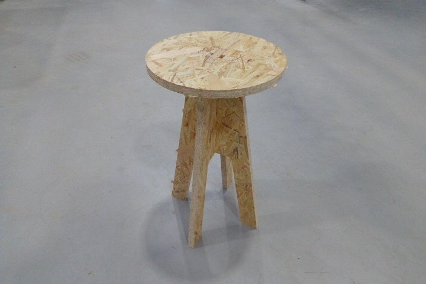

## Introduction

CNC stands for Computer Controlled Machining and the modern predecessors were developed at the begging of 1950 at the MIT servomechanism lab. Through the years this technology has became more precise and affordable, so we can have a tabletop [Roland SRM-20](http://fabacademy.org/2021/labs/agrilab/students/antonio-anaya/assignments/week05/) with a 0.01 mm precision or any [SLM 3D printer](http://fabacademy.org/2021/labs/agrilab/group/week_6_3D_printing/#description-of-ultimaker-3-extended).

The process needs a hardware capable of following a series of instructions with the encoded geometrical position in 2, 3 or more axis of the tool so as the tool type, the cut-rate, the tolerance, and the speed of any movement.

For this week our individual task is to design, encode, manufacture and assemble a large object. And our group assignment is to document our security training to use the CNC machine workshop at [AgriLab](http://agrilab.unilasalle.fr/), you can check our work [here.](http://fabacademy.org/2021/labs/agrilab/group/week_8_cnc/)

### Security assessment

[Check the group assignment to find this information here.](http://fabacademy.org/2021/labs/agrilab/group/week_8_cnc/)

## Design process

I've used [Fusion 360](https://www.autodesk.com/products/fusion-360/overview?term=1-YEAR&support=null) (under Windows) to design my project. I've been trying to run Fusion on Linux but it has some complications due to my Nvidia driver configuration.

The idea is just very simple yet useful. I got a very bad back pain everytime I solder in the ElectroLab, the reason is that there's no a right size bench. You can get one very tall bench or a very low chair. So I think a good cheap bench design will help us a little in the upcoming weeks.

This is my first sketch.
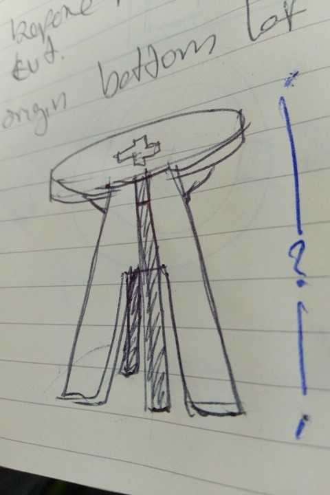

Then I started drawing it in Fusion.
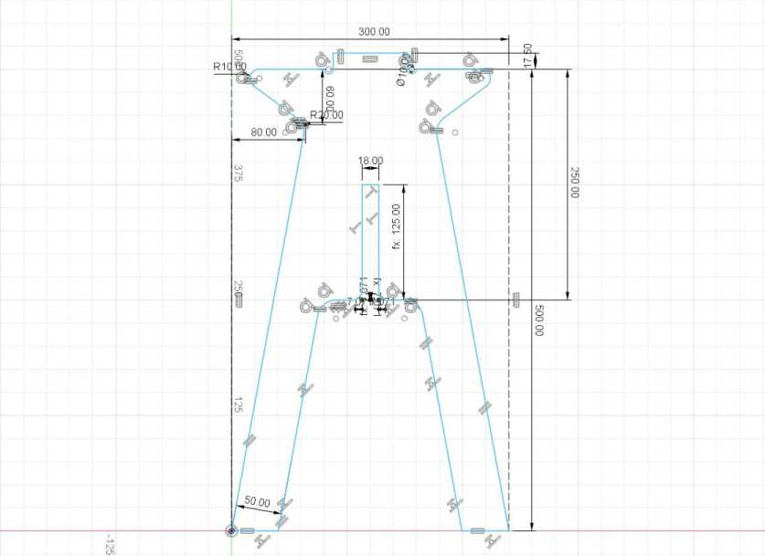

This is the parametric table.
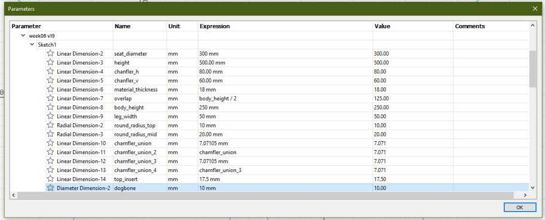

These are the three parts of the sketch.
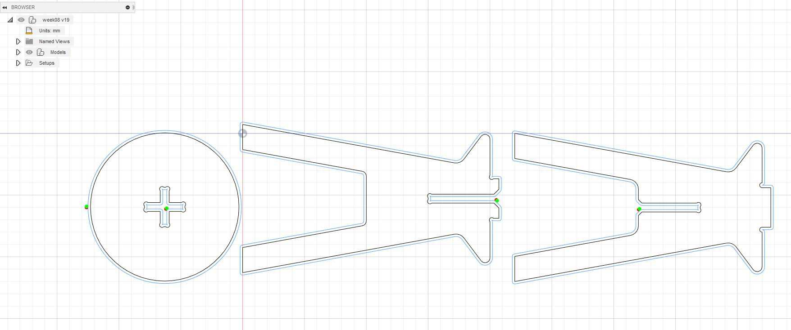

These are the three parts extruded by 1.8 mm which is the width of the material.
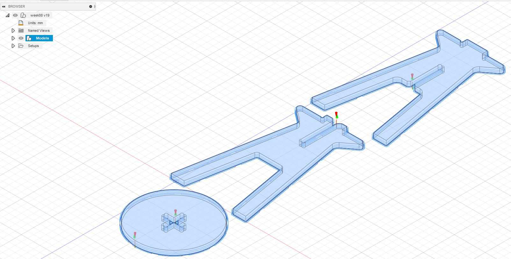

This is render I've made using the basic render options of Fusion 360.
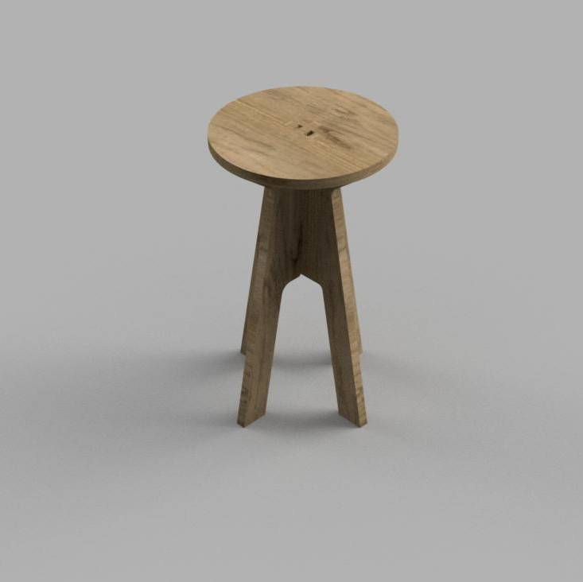

## CAM with Fusion 360

After the design has been completed the next steps to generate **""*.NC"** files for our CNC machine are:

**1.** Configure the tool size measuring the tool available in the lab.

- I've chose a 10 mm diameter 32 mm two flutes flat-end mill.
- For now all the other parameters of the milling tools like the shaft and holder are not very important, because the milling depth is only about 18 mm.

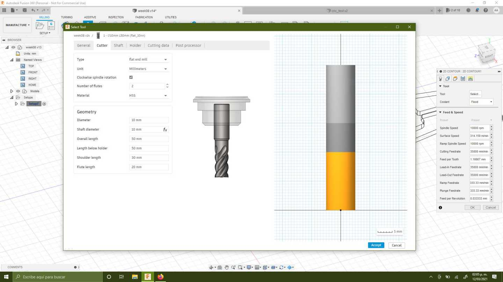
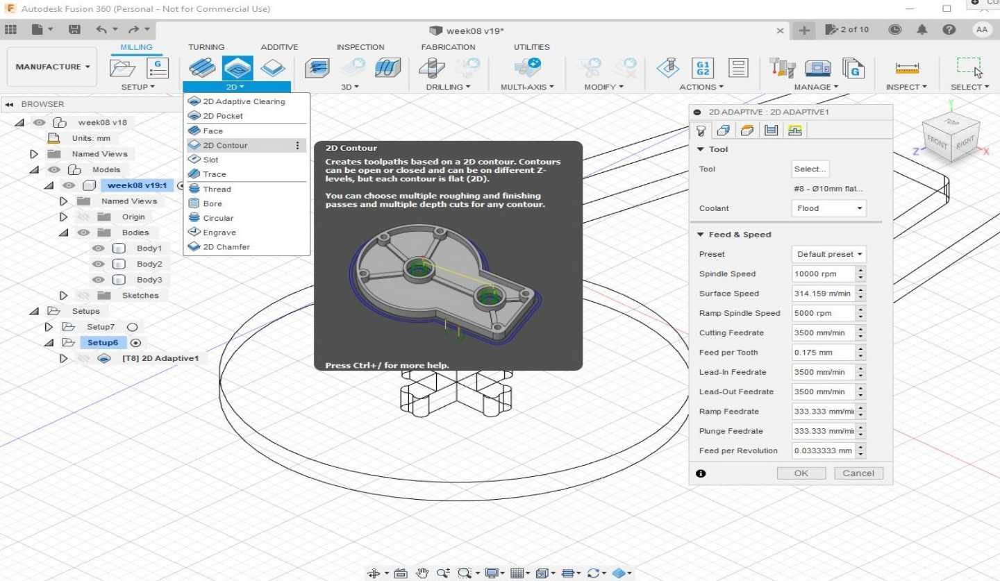
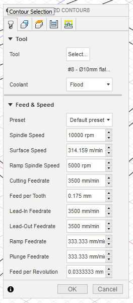
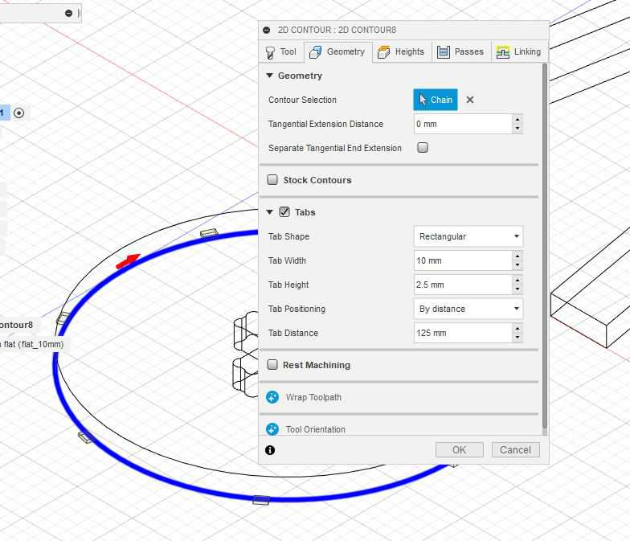
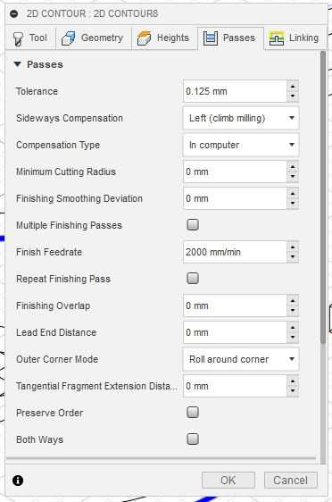
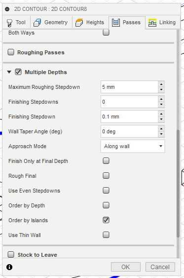
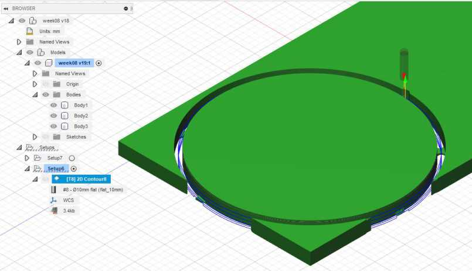
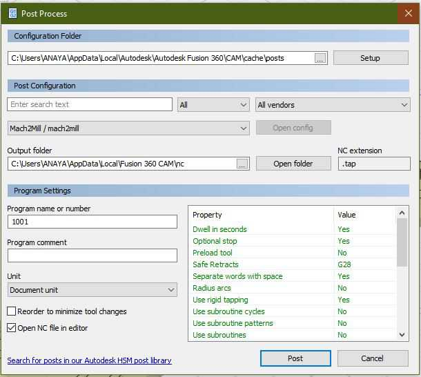
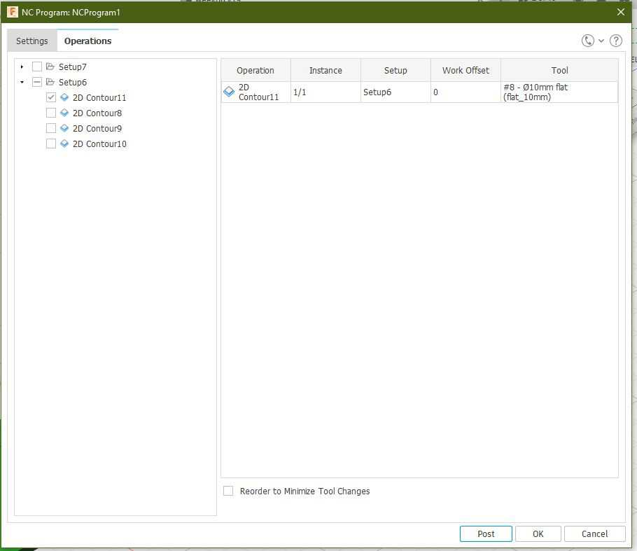

<figure class="video_container">
  <video controls="true" allowfullscreen="true" width=100%>
    <source src="../../images/week08/sim_01.mp4" type="video/mp4">
  </video>
</figure>

<figure class="video_container">
  <video controls="true" allowfullscreen="true" width=100%>
    <source src="../../images/week08/cam_02.mp4" type="video/mp4">
  </video>
</figure>

## Preparation

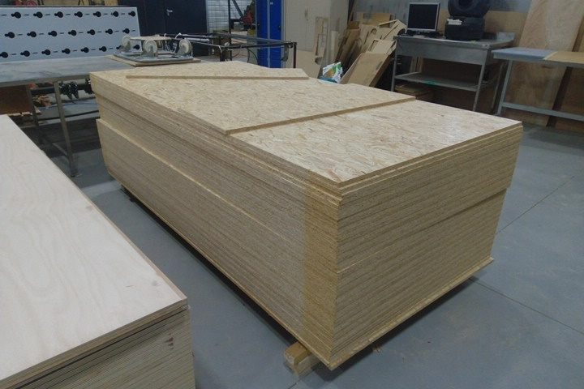
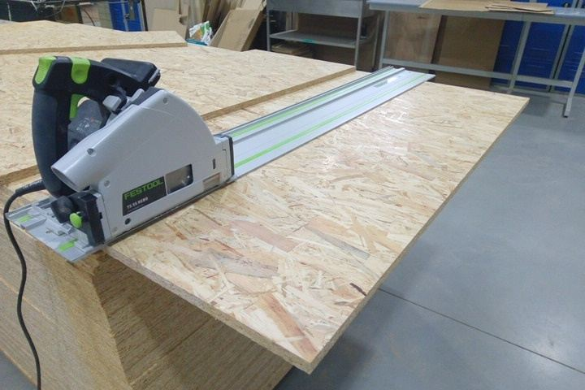
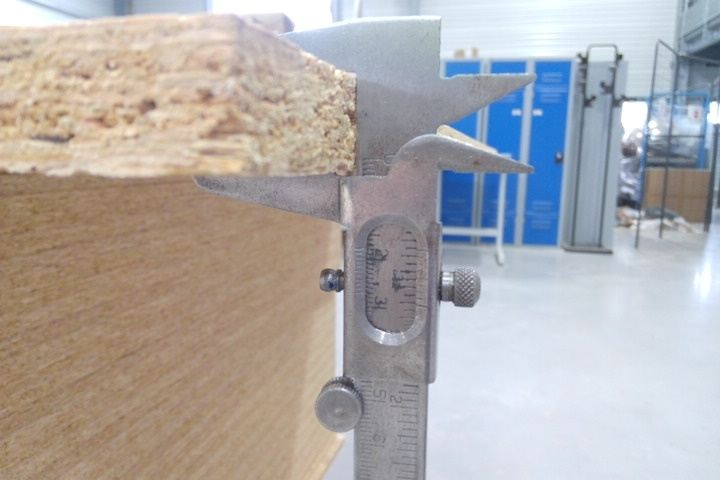

## Milling with the CNC machine

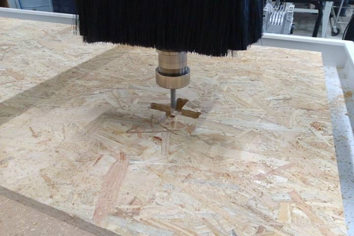
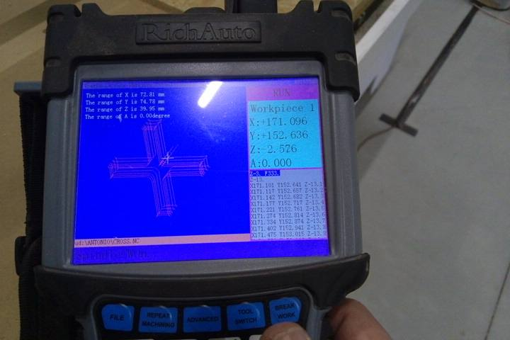
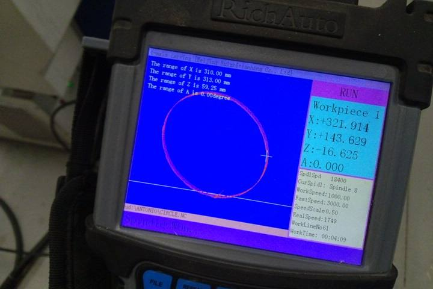
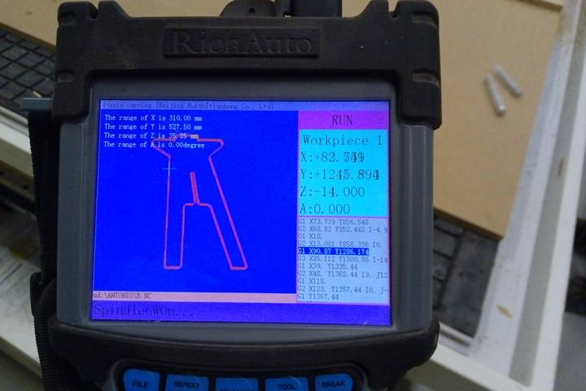

## Assembly

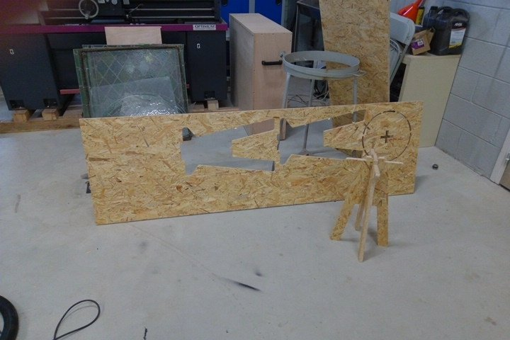
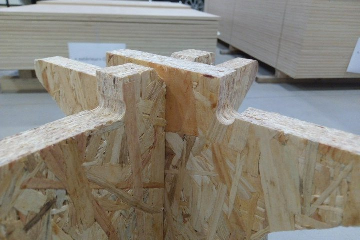
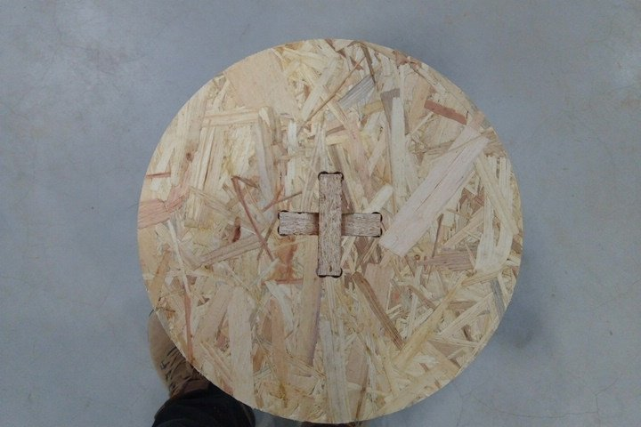

## Files

[Download Zip with all files](https://gitlab.fabcloud.org/academany/fabacademy/2021/labs/agrilab/students/antonio-anaya/-/archive/master/antonio-anaya-master.zip?path=docs/files/week08)
