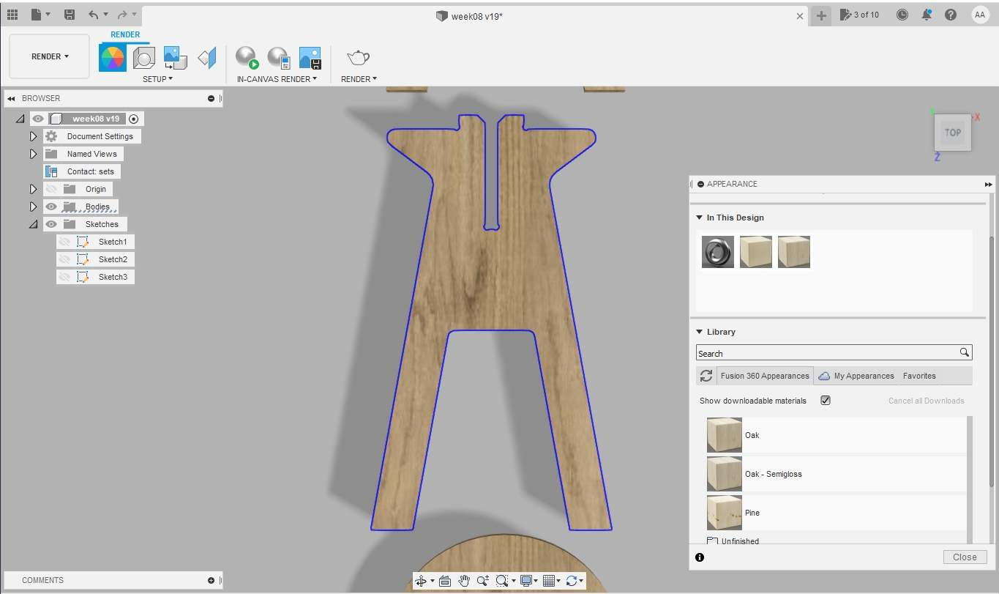
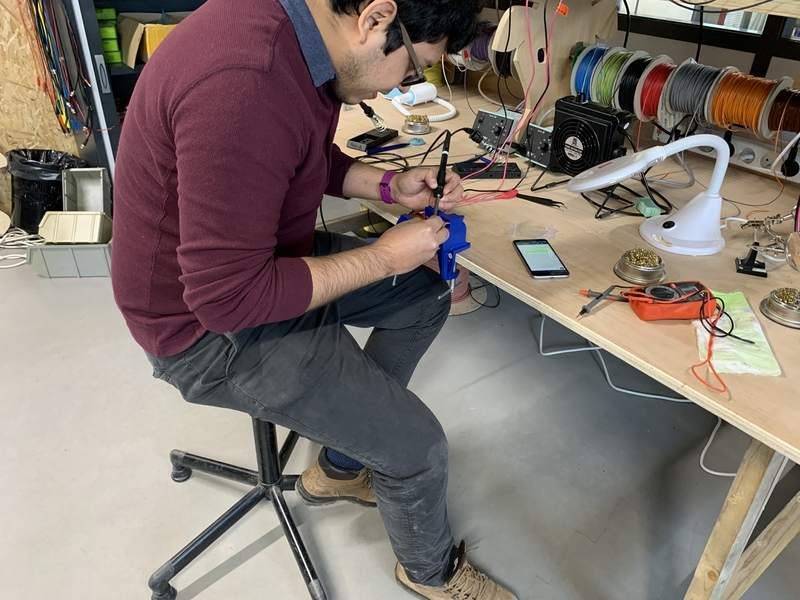
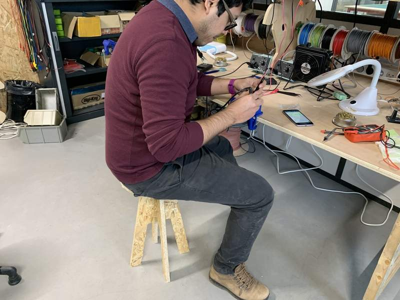
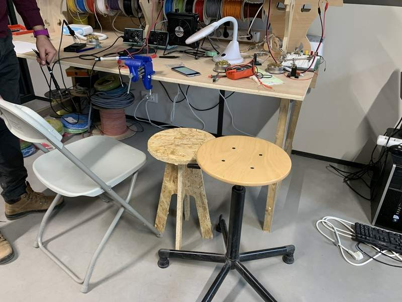

# 8. Computer controlled machining

## Introduction

CNC stands for Computer Controlled Machining and the modern predecessors were developed at the beginning of 1950 at the MIT servomechanism lab. Through the years this technology has became more precise and affordable, so we can have a tabletop [Roland SRM-20](http://fabacademy.org/2021/labs/agrilab/students/antonio-anaya/assignments/week05/) with a 0.01 mm precision or any [SLM 3D printer](http://fabacademy.org/2021/labs/agrilab/group/week_6_3D_printing/#description-of-ultimaker-3-extended).

The process needs a hardware capable of following a series of instructions with the encoded geometrical position in 2, 3 or more axis of the tool so as the tool type, the cut-rate, the tolerance, and the speed of any movement.

For this week our individual task is to design, encode, manufacture and assemble a large object. And our group assignment is to document our security training to use the CNC machine workshop at [AgriLab](http://agrilab.unilasalle.fr/), you can check our work [here.](http://fabacademy.org/2021/labs/agrilab/group/week_8_cnc/)

### Risk assessment

[Check my entry to the group assignment to find this information here.](http://fabacademy.org/2021/labs/agrilab/group/week_8_cnc/#risk-assessment-check-list)

[Check this risk assessment document to find out detailed information](https://www.dysoncentre.eng.cam.ac.uk/mills-folder/documents/manual-mill-risk-assessment-pdf)

## Design process

I've used [Fusion 360](https://www.autodesk.com/products/fusion-360/overview?term=1-YEAR&support=null) (under Windows) to design my project. I've been trying to run Fusion on Linux but it has some complications due to my Nvidia driver configuration.

The idea is just very simple yet useful. I got a very bad back pain everytime I solder in the ElectroLab, the reason is that there's no a right size bench. You can get one very tall bench or a very low chair. So I think a good cheap bench design will help us a little in the upcoming weeks.

This is my first sketch.

Then I started drawing it in Fusion.

This is the parametric table.

These are the three parts of the sketch. To make the second part of the body for the bench I've copy pasted the first sketch into a new one, and then modify the groove to coincide and serve as join mechanism.

These are the three parts extruded by 18 mm which is the width of the material.

On the Render environment of Fusion I've used Oak as a material for the appearance of the model.

This is render I've made using the basic render options of Fusion 360.
To virtually assemble the parts I've using the move/rotate tools under the design environment.

## CAM with Fusion 360

After the design has been completed the next steps to generate **""*.NC"** files for our CNC machine are:

**1.** Configure the tool size measuring the tool available in the lab.

- I've chose a 10 mm diameter 32 mm two flutes flat-end mill.
- For now all the other parameters of the milling tools like the shaft and holder are not very important, because the milling depth is only about 18 mm.

**2.** Then under the manufacture environment of Fusion select setup to configure the machine, orientation, models and tool for the manufacturing process.

- Select Milling.
- Selecte Z as the vertical axis for your model, be aware of you machine axis too, in this case Y is the longest axis in the machine so as in the model.

<figure class="video_container">
  <video controls="true" allowfullscreen="true" width=100%>
    <source src="../../images/week08/setup_01.mp4" type="video/mp4">
  </video>
</figure>

**3.** Under the 2D strategy I've selected **2D contour** as my milling process. The reason is because in the test I've found that as the quickest and simplest process for milling.

- Select the lower contour of your model.
- Select the right tool.
- Select the multi-height passes and use about hald the diameter of your milling bit.

**4.** Contour parameters I've selected:

- The **feedrate was too high** and during the manufacturing process [Luc](https://fabacademy.org/2019/labs/sorbonne/students/hanneuse-luc/about/) had to lower the travel and cutting feedrate and increased the spindle RPM to reduce vibrations in the machine. So I'll advice to use 2000 or 2200 Feedrate for 18mm OSB sheets.

**5.** I've used tabs to reduce vibration and the risk of detached parts during the process.

- Tabs are placed every 125.0 mm
- Tabs are rectangular
- Height 2.5 mm
- Width 10.0 mm

**6.** The tolerance was just enough and the parts fitted perfectly in place after the manufacturing.

- Tolerance was set as 0.125 mm

**7.** Multiple depths were configured

- Maximum roughing step-down was set to 5 mm
- Finishing step-down for a clean edge is 0.1 mm

**8.** The contour operation is finished and the program shows the cut path way.

- The video shows the complete process

<figure class="video_container">
  <video controls="true" allowfullscreen="true" width=100%>
    <source src="../../images/week08/cam_02.mp4" type="video/mp4">
  </video>
</figure>

**9.** Repeat the "2D contour" process for all the parts of the model.

**10.** Click in the post process button to find the next window to generate the GCODE for the CNC milling machine.

- I've selected "Mach2Mill / mach2mill" option which is the one we need in our lab for our CNC machine.

**11.** In the "operations tab" select the process you'll like to include in the output file.

- I've selected only one output file for every operation to have a better control of the whole process.
- It means I'll have to launch a File for every process in the machine.

**12.** After the output file is written, look for the code **G43 Z15. H8** approximately at line 19 and delete that line.

- The CNC machine at the lab uses this code to compensate the Z axis height by 15 mm and it means your cuts will happen 15 mm above your Z axis origin.

**13.** You can see here a simulation of the process that I've made using the "simulation" tools in Fusion 360.

<figure class="video_container">
  <video controls="true" allowfullscreen="true" width=100%>
    <source src="../../images/week08/sim_01.mp4" type="video/mp4">
  </video>
</figure>

## Preparation

I've used OSB trying to minimize the cost of my design.

The sheet should be maximum 2.0m, so we should cut it using the saw by 40 cm.

Finally we need to measure in different points the thickness of the material.

- 17.6 mm
- 17.8 mm
- 17.5 mm

So I've used 17.5 mm as the thickness measurement.

## Milling machine check list

1. Power on the machine.
2. Start Depression.
3. Start Vacuum dust aspiration.
4. Setup the Z axis connecting the electrode and the clamps, make a small test pressing "toolset" in the remote.
  - Place the electrode at the top of the material. It's always useful to remember that the "Depression" should be activated to make this step as the height will change because a small compression caused by the vacuum.

5. Lower the brush: To lower the brush go into "inputs menu" and look for **"06"** check it to red color and press "ok".
6. Ensure that there's no obstacles in the build area.
7. Ensure that you are using ear protections.

## Basic Workflow

Power on:

1. Open the compressed air valve.
- Push the power on button.
- In the remote accept "Go home XYZ" option.
- Press Ok.

<iframe src="https://www.youtube.com/embed/57srurq6RSI?modestbranding=1&showinfo=0&rel=0&theme=light&color=white" width="100%" height="315" frameborder="0"></iframe>

Fixing dust collector bug:

The machine at the lab has a bug in the software that need to be corrected in order to lower the dust collector brush.

1. In the menu go to the "inputs and outputs" option.
- Find the "06" input control
- Press Run to change the icon to "Red" color.
- Go to the main screen using the menu.
- Now the dust collector interrupter is enabled.

<iframe src="https://www.youtube.com/embed/PShWyMkXsJQ?modestbranding=1&showinfo=0&rel=0&theme=light&color=white" width="100%" height="315" frameborder="0"></iframe>

X and Y axis calibration:

On this process we need to set the center in the mill to the top left corner of the material to cut in our milling process.

1. Move the axis by using the movement arrows in the remote.
- You can use the slow or fast movements to be more precise, press the slow button in the remote for this.
- Position the mid point of the mill in the top left corner.

<iframe src="https://www.youtube.com/embed/zrY48mux4Gc?modestbranding=1&showinfo=0&rel=0&theme=light&color=white" width="100%" height="315" frameborder="0"></iframe>

Z axis calibration:

This process is very important for the correct operation of the machine. Be careful while setting up the Z axis.

1. Pick the test probe and connect it to the port in the milling cart head.
- Connect the clam to the mill holder.
- Make an "air" test to check if the system works correctly.
- Pose the Z axis at a high level
- With help of your companion be prepared to touch the probe and the mill.
- Press the "toolset" button in the remote.
- Wear the ear protection
- Activate the "depression" to hold the material in place
- Run the "toolset" test.
- Be prepared to stop the process if anything goes wrong.

<iframe src="https://www.youtube.com/embed/fWRaxg3zjwU?modestbranding=1&showinfo=0&rel=0&theme=light&color=white" width="100%" height="315" frameborder="0"></iframe>

Load file:

1. Connect the USB memory to the remote.
- press the "file" button.
- Find and select the file with the arrow buttons in the remote.
- Press ok to load.
- Press Run the start the work.
- Select the global speeds and press Ok to start working.

<iframe src="https://www.youtube.com/embed/9wtutoxJ-hQ?modestbranding=1&showinfo=0&rel=0&theme=light&color=white" width="100%" height="315" frameborder="0"></iframe>

## Milling with the CNC machine

First process:

- I've followed the same logic as the milling process by first cutting the interior contours to avoid misplaced cuts.

Second process:

- This is the seat of the bench.

Third process:

- This is the "A" part of the body.

Last process:

- This is the "B" part of the body.

I've missed to take a photo of this because I've some problems while milling.

## Troubleshooting

1. The feedrate is speed was too high in relationship of the spindle speed. It was set to **3500** mm/s in Fusion 360. And the spindle speed to 10000 RPM.
- My instructor changed the spindle speed to 15000 RPM.
- The feedrate and movements speed were set to 30% and the whole process moved from 10 mins in the simulation to 30 mins in realtime work.

2. I didn't have a companion.
- I've asked my instructor to assist me.

## Assembly

- This is how the OSB sheet looked like after removing it from the machine.

- Here you can see the dogbones I've used in my design.

- This is how the seat looks like assembled.

- And this is the final result.

- I'd like to add a video of the assembly process in the next days.

## Testing the bench

We can see here my back getting extremely curved while soldering at the soldering station.

Here I'm quite relaxed thanks to the support in the back of the chair but still it's not a good position for my back.

Here I'm using my bench and my back feels in a better position for long-time soldering.

Here you can compare the height of every seat available at the lab.

## Files

[Download Zip with all files from Fabcloud gitlab](https://gitlab.fabcloud.org/academany/fabacademy/2021/labs/agrilab/students/antonio-anaya/-/archive/master/antonio-anaya-master.zip?path=docs/files/week08)

Download files individually:

- [Fusion file](../../files/week08/week08_cnc_bench.f3d)
- [NC file 1 Cross](../../files/week08/a.nc)
- [NC file 2 Seat](../../files/week08/b.nc)
- [NC file 1 Body A](../../files/week08/circle.nc)
- [NC file 1 Body B](../../files/week08/cross.nc)
