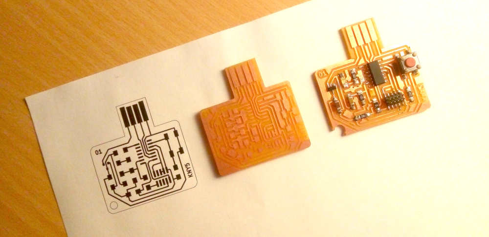

# 8. Computer controlled machining

## Introduction

CNC stands for Computer Controlled Machining and the modern predecessors were developed at the begging of 1950 at the MIT servomechanism lab. Through the years this technology has became more precise and affordable, so we can have a tabletop [Roland SRM-20](./link) with a 0.01 mm precision or any [SLM 3D printer](./link).

The process needs a hardware capable of following a series of instructions with the encoded geometrical position in 2, 3 or more axis of the tool so as the tool type, the cut-rate, the tolerance, and the speed of any movement.

For this week our individual task is to design, encode, manufacture and assemble a large object. And our group assignment is to document our security training to use the CNC machine workshop at [AgriLab](.Link/agrilab), you can check our work [here.](./link/work)

### Security assessment

## Design

## CAM with Fusion 360

### Manufacturing
