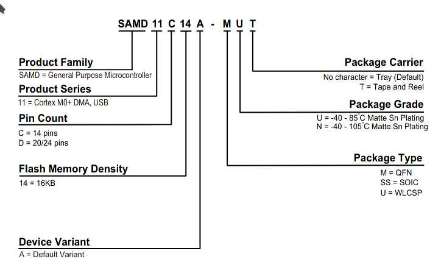
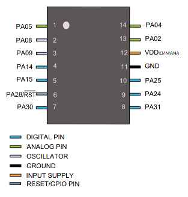
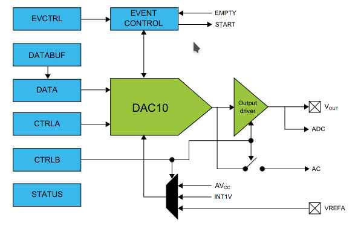
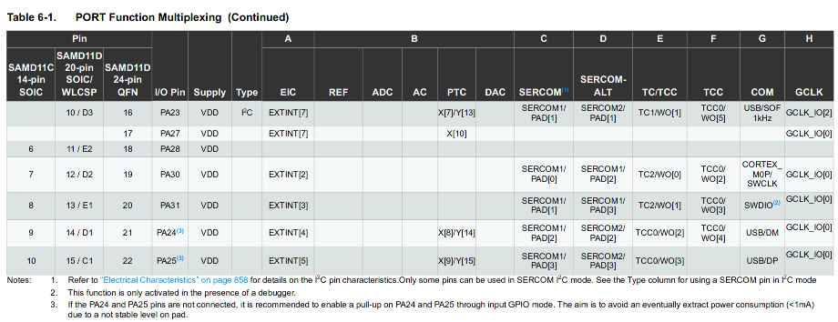
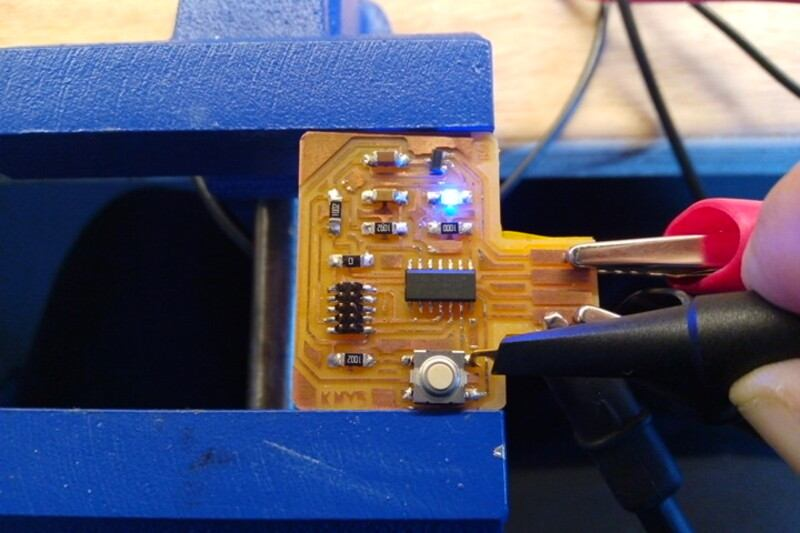
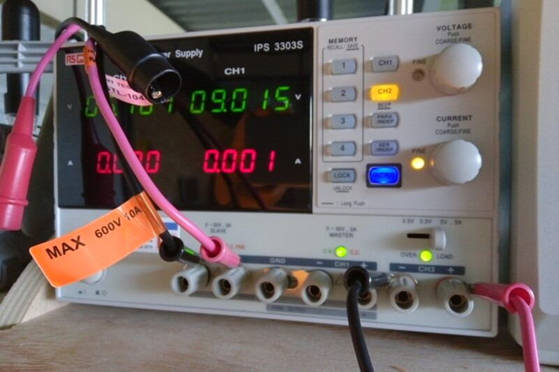
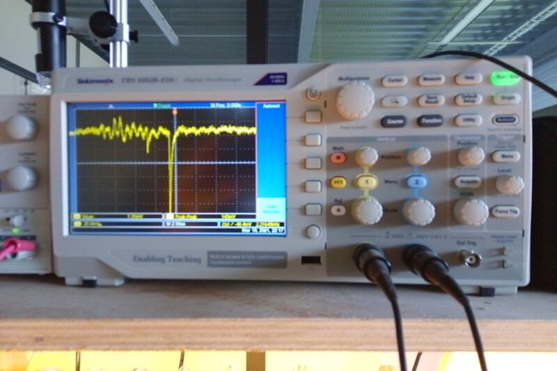
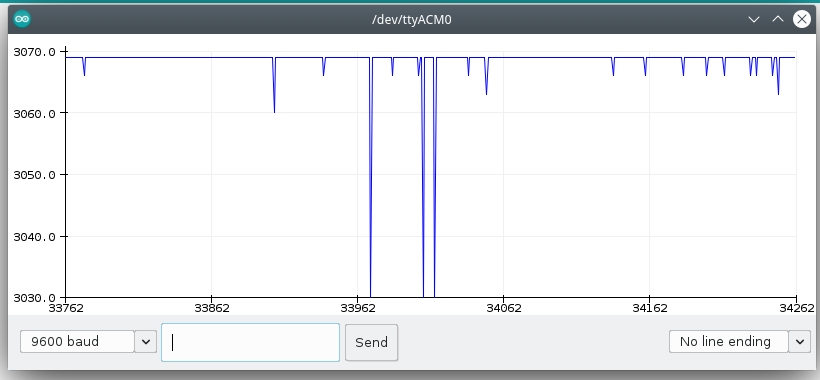
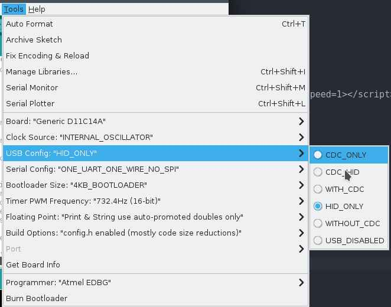
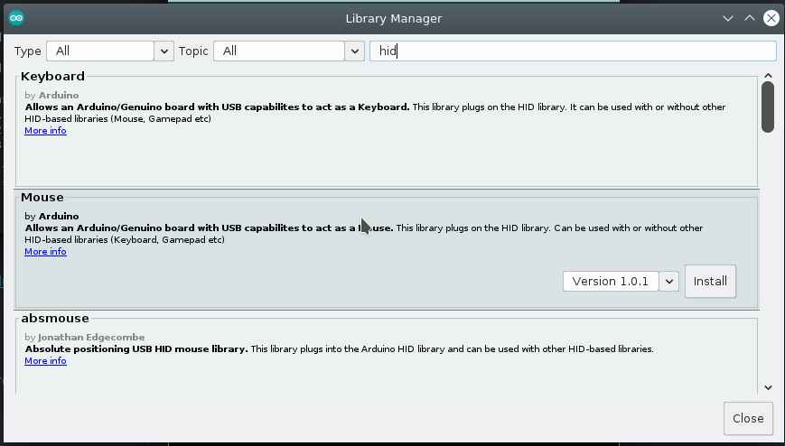

# 9. Embedded programming

<figure class="video_container">
  <video controls="true" allowfullscreen="true" poster="path/to/poster_image.png" loop>
    <source src="../../images/week09/demo_04.mp4" type="video/mp4">
  </video>
</figure>


## Introduction

The Micro-controller that I'm using in my board. [Check this link for more information.](../../assignments/week07)
[This is the page for the group assignment.](http://fabacademy.org/2021/labs/agrilab/group/week09/) I 've contributed with the [Raspberry pi](https://www.raspberrypi.org/) board review.

This week I've learn how to program in bare-metal C using only the [ASF library](https://www.microchip.com/en-us/development-tools-tools-and-software/libraries-code-examples-and-more/advanced-software-framework-for-sam-devices), then I used [Rust Programming Language](https://www.rust-lang.org/), but I didn't have time to write down all the steps in the compiling process and eventually found out some difficulties with the build toolchain. I've also tried Haskell and autopilot and Finally the [Arduino IDE.](https://www.arduino.cc/en/software)

My board has only one Button as input in PA02 and one LED as output in PA05. So I was looking for something useful to make with only one button and one LED and the result is the one button Mouse Scroll that I've made using the [Arduino IDE](arduino.cc), the Mouse library and event detection.

Then I've inspected using the oscilloscope


## ATSAMD11C14 Microcontroller

Its a low-power, high-performance ARM® Cortex®-M0+ based flash microcontroller.

It's one of the ATSAMD available in the AgriLab ElectroLab aside the SAMD21D17.

I've selected this microcontroller on [week07 electronics design](../../assignments/week07). The following information was learned and collected by me over this assignment.

Summary of specifications:

- > *Information modified from [Atmel documentation page](https://www.microchip.com/wwwproducts/en/ATSAMD11C14)*

| SAMD11C14 Specs |  |
| -- | -- |
| Family | SAMD11 |
| Max CPU speed | 48 MHz |
| Programmable memory size | 16 KBytes |
| SRAM | 4 KBytes |
| Auxiliary flash memory | 64 Bytes |
| Working Temperature range | -40 to 105 C |
| Operating Voltage range | 1.62 to 3.63 Volts |
| Direct memory access channels | 6 |
| SPI ports | 2 |
| I2C ports | 2 |
| Hardware touch periphereal | PTC |
| Periphereal pin select | YES |
| Native USB | YES, Full speed |
| Analog to Digital inputs (ADC) | 5 |
| ADC resolution | 12 Bits |
| ADC sampling rate | 350 K Samples per Second |
| Digital to Analog Outputs (DAC) | 1 |
| Input capture ports | 3 |
| Standalone output compare/ Standard PWM ports | 4 |
| Motor control PWM channels | 8 |
| 16 Bit digital timers | 2 |
| Parallel port type | GPIO |
| Comparators | 2 |
| Internal Oscillator | 32KHz, 32KHz ULP, 8 MHz |
| Hardware Realtime clock counter/Realtime Clock | YES |
| IO Pins| 12 |
| Pincount | 14 |
| Low Power capability | YES |

> *This tables were taken from [Mattairtech SAMD boards documentation.*](https://github.com/mattairtech/ArduinoCore-samd/blob/master/variants/Generic_D11C14A/README.md)


Pinout table for Arduino IDE:

| SAMD11 | Arduino | PINOUT | | | | | | | | | | | |
| --- | ---- | ---- | --- | --- | --- | --- | ---- | ---- | --- | --- | --- | --- | --- |
| Other | COM | PWM | Analog | INT | # | PIN | PIN | # | INT | Analog | PWM | COM | Other |
| | SCK*/RX2 | TCC01 | * | * | 5 | A5 | A4 | 4 | * | * | TCC00 | MOSI*/TX2 | REF |
| | MOSI* | TCC02 | | * | 8 | A8 (XIN) | A2 | 2 | * | * | | | DAC |
| | SCK* | TCC03 | | * | 9 | A9 (XOUT) | Vdd |
| | SDA/MISO* | TC10 | * | NMI | 14 | A14 | Gnd |
| | SCL/SS* | TC11 | * | * | 15 | A15 | A25 | 25 | | | | USB/DP |
BOOT | | | | | 28 | A28/RST | A24 | 24 | | | | USB/DM |
SWDCLK |  TX1/MISO* | | | | 30 | A30 | A31 | 31 | * | | RX1/SS* | | SWDIO |
  -------------------

Detailed information:

Arduino	| Port	| Alternate Function	| Comments (! means not used with this peripheral assignment)
--------|-------|-----------------------|-------------------------------------------------------------------------------------------
0	| ----	| NOT A PIN		| NOT A PIN
1	| ----	| NOT A PIN		| NOT A PIN
2	| PA02	| DAC			| EIC/EXTINT[2] ADC/AIN[0] PTC/Y[0] DAC/VOUT
3	| ----	| NOT A PIN		| NOT A PIN
4	| PA04	| REFB / TX2* / TCC00	| EIC/EXTINT[4] REF/ADC/VREFB ADC/AIN[2] AC/AIN[0] PTC/Y[2] SERCOM0/PAD[2] !SERCOM0/PAD[0] !TC1/WO[0] TCC0/WO[0]
5	| PA05	| RX2* / TCC01		| EIC/EXTINT[5] ADC/AIN[3] AC/AIN[1] PTC/Y[3] SERCOM0/PAD[3] !SERCOM0/PAD[1] !TC1/WO[1] TCC0/WO[1]
6	| ----	| NOT A PIN		| NOT A PIN
7	| ----	| NOT A PIN		| NOT A PIN
8	| PA08	| TX1 / MOSI / TCC02	| EIC/EXTINT[6] SERCOM1/PAD[2] !SERCOM0/PAD[2] TCC0/WO[2] !TCC0/WO[4] Xin32 / Xin
9	| PA09	| RX1 / SCK / TCC03	| EIC/EXTINT[7] SERCOM1/PAD[3] !SERCOM0/PAD[3] TCC0/WO[3] !TCC0/WO[5] Xout32 / Xout
10	| ----	| NOT A PIN		| NOT A PIN
11	| ----	| NOT A PIN		| NOT A PIN
12	| ----	| NOT A PIN		| NOT A PIN
13	| ----	| NOT A PIN		| NOT A PIN
14	| PA14	| SDA / TC10		| EIC/NMI ADC/AIN[6] PTC/X[0] PTC/Y[6] SERCOM0/PAD[0] !SERCOM2/PAD[0] TC1/WO[0] !TCC0/WO[0]
15	| PA15	| SCL / TC11		| EIC/EXTINT[1] ADC/AIN[7] PTC/X[1] PTC/Y[7] SERCOM0/PAD[1] !SERCOM2/PAD[1] TC1/WO[1] !TCC0/WO[1]
16	| ----	| NOT A PIN		| NOT A PIN

17	| ----	| NOT A PIN		| NOT A PIN
18	| ----	| NOT A PIN		| NOT A PIN
19	| ----	| NOT A PIN		| NOT A PIN
20	| ----	| NOT A PIN		| NOT A PIN
21	| ----	| NOT A PIN		| NOT A PIN
22	| ----	| NOT A PIN		| NOT A PIN
23	| ----	| NOT A PIN		| NOT A PIN
24	| PA24	| USB_NEGATIVE		| USB/DM
25	| PA25	| USB_POSITIVE		| USB/DP
26	| ----	| NOT A PIN		| NOT A PIN
27	| ----	| NOT A PIN		| NOT A PIN
28	| PA28	| Reset			| Reset, BOOT (double tap bootloader entry)
29	| ----	| NOT A PIN		| NOT A PIN
30	| PA30	| MISO / SWD CLK	| !EIC/EXTINT[2] SERCOM1/PAD[0] !SERCOM1/PAD[2] !TC2/WO[0] !TCC0/WO[2] SWD CLK, leave floating during boot
31	| PA31	| SS / SWD IO		| EIC/EXTINT[3] SERCOM1/PAD[1] !SERCOM1/PAD[3] !TC2/WO[1] !TCC0/WO[3] SWD IO

The SAMD11C14 its part of the SAMD family of microntrollers, its has multiple thing that are of the interest for my project including:

- Native USB connectors
- Digital to Analog Output
- Analog to Digital Input
- Communication
    - I2C
    - ISP
    - Serial

SAMD11C14 comes from:



This is a reference for the PIN numbers of the SAMD11C14:



And this is a schematic of the Digital to analog converter that I'm interested to use for the Dielectric Spectroscopy module of my final project.



The multiplexor table shows the pins and its capabilities for Communication and functions:





## Debugging

I've found out the difference between pull-up and pull-down arrangements for floating point connections.

So I've the idea to inspect using the oscilloscope the pin PA_02 which is connected to a button on my [board designed in week07](../../assignments/week07)

- Inspecting button at PA02:



- Power source at 5V:



- Signal in the Oscilloscope:



- Program to estimate mV at input:

```
const int BTN = 2;
int BTN_STATE = digitalRead(BTN);
const long VIN_FACTOR = 3.3 / 1.023 ;
void setup() {
  pinMode(LED_BUILTIN, OUTPUT);
  pinMode(BTN, INPUT);
  Serial.begin(9600);
}

void loop() {

Serial.println(analogRead(BTN) * VIN_FACTOR);

analogWrite(LED_BUILTIN, analogRead(BTN) );
}

```

- Arduino capture:




## EBDG workflow

Introduction:


### Requirements

Download files from FabAcademy material:

1. [Make file.](http://academy.cba.mit.edu/classes/embedded_programming/D11C/hello.D11C.blink.make)
2. [Blink.c](http://academy.cba.mit.edu/classes/embedded_programming/D11C/hello.D11C.blink.c)
3. [Bootloader](https://github.com/mattairtech/ArduinoCore-samd/blob/master/bootloaders/zero/binaries/sam_ba_Generic_D11C14A_SAMD11C14A.bin)
4. [Blink.ino](http://academy.cba.mit.edu/classes/embedded_programming/D11C/hello.D11C.blink.ino)

Clone ASF repository:
```
git clone git clone https://github.com/avrxml/asf.git
```

Changing D11C/hello.D11C.blink.make code to point correctly to asf.

I've cloned the repository in a local directory **~/repos/asf**

<script id="asciicast-UlNV8L9upUndPZmUwWoFP1GSM" src="https://asciinema.org/a/UlNV8L9upUndPZmUwWoFP1GSM.js" async data-autoplay="true" data-loop=1 data-t=23 data-speed=2></script>

Install arm-none-eabi-gcc dependency:
```
sudo dnf install arm-none-eabi-gcc
```

Install newlib dependency:
```
sudo dnf install arm-none-eabi-newlib arm-none-eabi-gcc-cs-c++.x86_64 gcc-c++-arm-linux-gnu.x86_64
```


### JTAG connection


### Flashing

```
make -f hello.D11C.blink.make edbg
```
If the command doesn't work, you can just used the generated bin file and use edbg like this:

```
sudo ./edbg -t samd11 -bpv -f hello.D11C.blink.bin
```


<script id="asciicast-44UvJQJOmUYlMv0DcYz8CpcFw" src="https://asciinema.org/a/44UvJQJOmUYlMv0DcYz8CpcFw.js" async data-autoplay="true" data-loop=1 data-t=23 data-speed=2></script>


### Blink Demo

<figure class="video_container">
  <video controls="true" allowfullscreen="true" poster="path/to/poster_image.png" width=100% loop>
    <source src="../../images/week07/flashed_01.mp4" type="video/mp4">
  </video>
</figure>


### Sparky blink Demo

Context:

Useful link:

[Tutorial for bare metal C programming for SAMD Microcontroller](https://microchipdeveloper.com/32arm:sam-bare-metal-c-programming)


Pseudo-code:

- Nested while loops:
- Loop1: Runs the whole program.
  - Loop2: Waits until PA02 state changes, the change is made by pulsating the button on the board.
  - Loop3: Toggles the LED state reducing the period every time.
  - Loop4: Toggles the LED state increasing the period every time.
  - If2: Keeps the LED on or off depending on the st variable, saves the value every in every cycle.

``` cpp

/*
This program uses the SAM11.h library from the ASF programming repository at github.
This program reads PA02 to turn on the LED at PA05, and makes a bouncing-blinky effect like an fluorescent old lamp.

IO pins:
PA02 <- Digital pull-up button input
PA05 -> Digital LED output

Autor: Antonio de Jesus Anaya Hernandez
Year: 2021
Org: Fab Academy
Lab: AgriLab
Country: France

*/

#include <samd11.h>
#define LED PORT_PA05
int cb = 200000;
double p = 0.7;
int st = 0;

void delay(uint32_t n) {
   uint32_t i = 0;
   while (i < n) ++i;
   }

int main(void) {
   //Clock Setup
   SYSCTRL->OSC8M.bit.PRESC = 1;

   //Configure PIN PA02 as digital input
   PORT->Group[0].PINCFG[2].reg |= PORT_PINCFG_INEN;
   PORT->Group[0].PINCFG[2].reg &= ~PORT_PINCFG_PULLEN;

   //Set LED pin PA05 as digital output
   REG_PORT_DIRSET0 = LED;

   // Loop_1
   while (1) {
     // Loop_2
     while (1){
       // Read PA02 state, halts the program until the button is pulsated
       if ((PORT->Group[0].IN.reg & PORT_PA02) < 1){
         if (st == 0){
           st = 1;
         } else { st = 0; }
         break; //Break to loop_3
       }
     }
     // Loop_3
     while (cb > 100) {
       // Decreases delay time
       cb = cb - (cb*p);
       //Toggle LED
       REG_PORT_OUTTGL0 |= LED;
       delay(cb);
     }
     // Loop_4
     while (cb < 300000){
       //Increases delay time
       cb = cb + (cb*p);
       // Toggle LED
       REG_PORT_OUTTGL0 |= LED;
       delay(cb);
     }
     if (st == 1){
       // Turn LED on
       REG_PORT_OUTSET0 |= LED;
       // Else turn LED off
     } else { REG_PORT_OUTCLR0 |= LED;}
   }
 }
```

<figure class="video_container">
  <video controls="true" allowfullscreen="true" poster="path/to/poster_image.png" width=100% loop>
    <source src="../../images/week09/demo_02.mp4" type="video/mp4">
  </video>
</figure>


## Arduino Workflow

- Installing mattairtech libraries:


- Flashing Bootloader:

<script id="asciicast-bVs53JUItHgLdNUwZ5pnDpwCx" src="https://asciinema.org/a/bVs53JUItHgLdNUwZ5pnDpwCx.js" async data-autoplay="true" data-loop=1 data-speed=1></script>


### One button scroll-down/up controller

Configuration:

To use [Human Interface Devices](https://www.wikiwand.com/en/Human_interface_device) such as Mouse or keyboards on a computer, requires an special configuration of the ATSAMD11 bootloader programmed by Mattairtech.



And also import the library from the arduino library manager repository:




```
/*
This program uses Arduino and Mouse library.
This program reads the board button to scroll-down and after the release of the button waits for 4 seconds to scroll up. After 4 seconds the program waits for a new button push event.

IO pins:
PA02 <- Digital pull-up BUTTON input
PA05 -> Digital LED output

Autor: Antonio de Jesus Anaya Hernandez
Year: 2021
Org: Fab Academy
Lab: AgriLab
Country: France
*/

#include <Mouse.h>

const int BTN = 2;
const int LED =  5;
int timer = 0;
int btn_state = 0;
int idle1 = 0;
int idle2 = 0;

void blink() {
  for(int pw = 0; pw < 255; pw++){
      delay(1);
      analogWrite(LED,pw);
  }
  analogWrite(LED,0);
}

void setup() {
  pinMode(LED, OUTPUT);
  pinMode(BTN, INPUT);
  Mouse.begin();
  //Serial.begin(9600);
}

void loop() {
  analogWrite(LED,5);
  btn_state = digitalRead(BTN);
  if(btn_state == LOW){
    while(btn_state == LOW){
      delay(200);
      analogWrite(LED, 100);
      Mouse.move(0,0,-1);
      btn_state = digitalRead(BTN);
    }
    for(int clicks = 0; clicks < 10; clicks++){
      delay(200);
      //Serial.println("Clicked");
      //Serial.print(clicks);
      if(clicks < 6){
        //digitalWrite(LED, HIGH);
        blink();
      }
      btn_state = digitalRead(BTN);
      while(btn_state == LOW && clicks < 6){
        delay(200);
        analogWrite(LED,30);
        Mouse.move(0,0,1);
        btn_state = digitalRead(BTN);
      }
    }
  }
  delay(200);
  //Serial.println("waitting");
}
```

<script id="asciicast-KlMq6gvI0W46eSBIU6cVzsP86" src="https://asciinema.org/a/KlMq6gvI0W46eSBIU6cVzsP86.js" async data-autoplay="true" data-loop=1 data-t=10 data-rows=30 data-speed=2></script>

<figure class="video_container">
  <video controls="true" allowfullscreen="true" poster="path/to/poster_image.png" width=100% loop>
    <source src="../../images/week09/demo_03.mp4" type="video/mp4">
  </video>
</figure>

<figure class="video_container">
  <video controls="true" allowfullscreen="true" poster="path/to/poster_image.png" width=100% loop>
    <source src="../../images/week09/demo_04.mp4" type="video/mp4">
  </video>
</figure>


### Ncurses for microcontrollers

About [NCURSES](https://www.wikiwand.com/en/Ncurses):

Its a library for application programming interface, for text-based user interfaces:

Like on this example:

<iframe src="http://www.youtube-nocookie.com/embed/KmSKwU-vc4g?modestbranding=1&showinfo=0&rel=0&iv_load_policy=3&theme=light&color=white&controls=0&disablekb=1" width="100%" height="315" frameborder="0"></iframe>

This is an example on [asciinema](https://ascinema.org):

<script id="asciicast-333393" src="https://asciinema.org/a/333393.js" async></script>

This next program produces an UI that's transmitted over SERIAL Communication to the computer and accesed by using minicon.

By pressing the physical button on my board the interface shows a message.

MCURSES its a version of NCURSES for embeded systems, it means that's small enough to fit in the memory of the SAMD11C14.

To install MCURSES:

```
git clone https://github.com/ChrisMicro/mcurses
```

```
/*---------------------------------------------------------------------------------------------------------------------------------------------------
   mcurses box demo

   Copyright (c) 2011-2015 Frank Meyer - frank(at)fli4l.de

   Revision History:
   V1.0 2015 xx xx Frank Meyer, original version
   V1.1 2017 01 14 ChrisMicro, converted to Arduino example

   This program is free software; you can redistribute it and/or modify
   it under the terms of the GNU General Public License as published by
   the Free Software Foundation; either version 2 of the License, or
   (at your option) any later version.

   Modification for Fab Academy week09:

   IO pins:
   PA02 <- Digital pull-up BUTTON input
   PA05 -> Digital LED output

   Autor: Antonio de Jesus Anaya Hernandez
   Year: 2021
   Org: Fab Academy
   Lab: AgriLab
   Country: France


  ---------------------------------------------------------------------------------------------------------------------------------------------------
*/
#include "mcurses.h"

#define         myitoa(x,buf)                   itoa ((x), buf, 10)

int buttonState = 0;

char PROGMEM logoFab[] = "\r\            ######## ########\n\
\r\        ########          #######\n\
\r\      ###################     ######\n\
\r\     ##      ##############       ###\n\
\r\   ((         #############         %%%\n\
\r\  (((            /#####             %%%\n\
\r\ ((((                               %%%%\n\
\r\ ((((   (((((((           %%%%%%%%%%%%%%\n\
\r\ ((((   (((((((((       &%%%%%%%%%%%%%%%\n\
\r\  (((   ((((((((((     &%%%%%%%%%   %%%*\n\
\r\   ((    (((((((((     %%%%%%%%%    %%%\n\
\r\    (((   (((((((       (%%%%%    %%%\n\
\r\      ((((((((((              %%%%%%\n\
\r\        ((((((((          %%%%%%%\n\
\r\            (((((((( %%%%%%%%\n\
";

void Arduino_putchar(uint8_t c)
{
  Serial.write(c);
}

void setup()
{
  Serial.begin(115200);

  setFunction_putchar(Arduino_putchar); // tell the library which output channel shall be used

  initscr();                  // initialize mcurses

  pinMode(5, OUTPUT);
  pinMode(2, INPUT);
}

void loop()
{
  buttonState = digitalRead(2);

  // check if the pushbutton is pressed. If it is, the buttonState is HIGH:
  if (buttonState == LOW) {
    // turn LED on:
    digitalWrite(5, HIGH);
    mvaddstr_P (18, 0, PSTR("fabacademy.org"));
    mvaddstr_P (20, 0, PSTR("This is an example of MCURSES a NCURSES library for microcontrollers"));
  } else {
    // turn LED off:
    digitalWrite(5, LOW);

  }
  char    buf[10];
  uint8_t idx;
  mvaddstr_P (0, 0, PSTR(logoFab));
  delay(500);
  clear ();

}
```

This is the result shown in asciinema:

<script id="asciicast-dDgFmfugIqAcCHOVTcJEl1tu5" src="https://asciinema.org/a/dDgFmfugIqAcCHOVTcJEl1tu5.js" async data-autoplay="true" data-loop=1 data-speed=1></script>

Video demo:

<figure class="video_container">
  <video controls="true" allowfullscreen="true" poster="path/to/poster_image.png" width=100% loop>
    <source src="../../images/week09/demo_05.mp4" type="video/mp4">
  </video>
</figure>


## Files

For Millivolts plotter:

- [blink.ino](../../files/week09/Blink_plot_millivolts/Blink_plot_millivolts.ino)

For blinky with ASF:

- [blinky.c](../../files/week09/blinky_ASF_SAMD11.c)
- [make file](../../files/week09/blinky_ASF_SAMD11.c)

For Mouse controller:

- [Arduino Mouse Scroller](../../files/week09/button_mouse/button_mouse.ino)

For Mcurses on Microcontrollers example:

- [Arduino code](../../files/week09/fabacademy_logo/fabacademy_logo.ino)
- [mcurses-config.h](../../files/week09/fabacademy_logo/mcurses-config.h)
- [mcurses.c](../../files/week09/fabacademy_logo/mcurses.c)
- [mcurses.h](../../files/week09/fabacademy_logo/mcurses.h)
