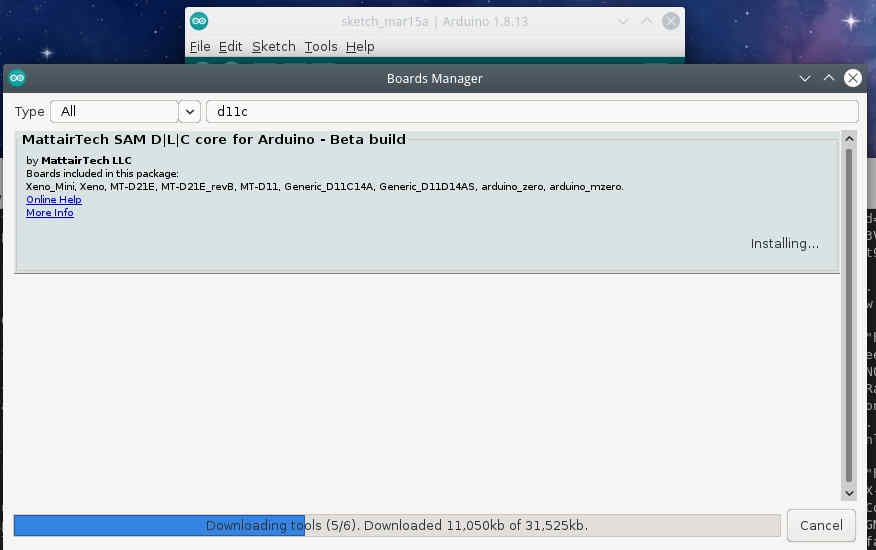

# 9. Embedded programming

## SAMD11 Datasheet

| SAMD11 | | | |
| --- | ---- | ---- | --- |
| PIN | | | |


## EBDG workflow

Introduction:


### Requirements

Download files from FabAcademy material:

1. [Make file.](http://academy.cba.mit.edu/classes/embedded_programming/D11C/hello.D11C.blink.make)
2. [Blink.c](http://academy.cba.mit.edu/classes/embedded_programming/D11C/hello.D11C.blink.c)
3. [Bootloader](https://github.com/mattairtech/ArduinoCore-samd/blob/master/bootloaders/zero/binaries/sam_ba_Generic_D11C14A_SAMD11C14A.bin)
4. [Blink.ino](http://academy.cba.mit.edu/classes/embedded_programming/D11C/hello.D11C.blink.ino)

Clone ASF repository:
```
git clone git clone https://github.com/avrxml/asf.git
```

Changing D11C/hello.D11C.blink.make code to point correctly to asf.

I've cloned the repository in a local directory **~/repos/asf**

<script id="asciicast-UlNV8L9upUndPZmUwWoFP1GSM" src="https://asciinema.org/a/UlNV8L9upUndPZmUwWoFP1GSM.js" async data-autoplay="true" data-loop=1 data-t=23 data-speed=2></script>

Install arm-none-eabi-gcc dependency:
```
sudo dnf install arm-none-eabi-gcc
```

Install newlib dependency:
```
sudo dnf install arm-none-eabi-newlib arm-none-eabi-gcc-cs-c++.x86_64 gcc-c++-arm-linux-gnu.x86_64
```


### JTAG connection


### Flashing

```
make -f hello.D11C.blink.make edbg
```
If the command doesn't work, you can just used the generated bin file and use edbg like this:

```
sudo ./edbg -t samd11 -bpv -f hello.D11C.blink.bin
```


<script id="asciicast-44UvJQJOmUYlMv0DcYz8CpcFw" src="https://asciinema.org/a/44UvJQJOmUYlMv0DcYz8CpcFw.js" async data-autoplay="true" data-loop=1 data-t=23 data-speed=2></script>


### Blink Demo

<figure class="video_container">
  <video controls="true" allowfullscreen="true" poster="path/to/poster_image.png" width=100% loop>
    <source src="../../images/week07/flashed_01.mp4" type="video/mp4">
  </video>
</figure>


### Sparky blink Demo

Context:

Pseudo-code:

- Nested while loops:
- Loop1: Runs the whole program.
  - Loop2: Waits until PA02 state changes, the change is made by pulsating the button on the board.
  - Loop3: Toggles the LED state reducing the period every time.
  - Loop4: Toggles the LED state increasing the period every time.
  - If2: Keeps the LED on or off depending on the st variable, saves the value every in every cycle.

``` cpp

/*
This program uses the SAM11.h library from the ASF programming repository at github.
This program reads PA02 to turn on the LED at PA05, and makes a bouncing-blinky effect like an fluorescent old lamp.

IO pins:
PA02 <- Digital pull-up button input
PA05 -> Digital LED output

Autor: Antonio de Jesus Anaya Hernandez
Year: 2021
Org: Fab Academy
Lab: AgriLab
Country: France

*/

#include <samd11.h>
#define LED PORT_PA05
int cb = 200000;
double p = 0.7;
int st = 0;

void delay(uint32_t n) {
   uint32_t i = 0;
   while (i < n) ++i;
   }

int main(void) {
   //Clock Setup
   SYSCTRL->OSC8M.bit.PRESC = 1;

   //Configure PIN PA02 as digital input
   PORT->Group[0].PINCFG[2].reg |= PORT_PINCFG_INEN;
   PORT->Group[0].PINCFG[2].reg &= ~PORT_PINCFG_PULLEN;

   //Set LED pin PA05 as digital output
   REG_PORT_DIRSET0 = LED;

   // Loop_1
   while (1) {
     // Loop_2
     while (1){
       // Read PA02 state, halts the program until the button is pulsated
       if ((PORT->Group[0].IN.reg & PORT_PA02) < 1){
         if (st == 0){
           st = 1;
         } else { st = 0; }
         break; //Break to loop_3
       }
     }
     // Loop_3
     while (cb > 100) {
       // Decreases delay time
       cb = cb - (cb*p);
       //Toggle LED
       REG_PORT_OUTTGL0 |= LED;
       delay(cb);
     }
     // Loop_4
     while (cb < 300000){
       //Increases delay time
       cb = cb + (cb*p);
       // Toggle LED
       REG_PORT_OUTTGL0 |= LED;
       delay(cb);
     }
     if (st == 1){
       // Turn LED on
       REG_PORT_OUTSET0 |= LED;
       // Else turn LED off
     } else { REG_PORT_OUTCLR0 |= LED;}
   }
 }
```

<figure class="video_container">
  <video controls="true" allowfullscreen="true" poster="path/to/poster_image.png" width=100% loop>
    <source src="../../images/week09/demo_02.mp4" type="video/mp4">
  </video>
</figure>


## Arduino Workflow


- Installing mattairtech libraries




### One button scroll-down/up controller

```
/*
This program uses Arduino and Mouse library.
This program reads the board button to scroll-down and after the release of the button waits for 4 seconds to scroll up. After 4 seconds the program waits for a new button push event.

IO pins:
PA02 <- Digital pull-up BUTTON input
PA05 -> Digital LED output

Autor: Antonio de Jesus Anaya Hernandez
Year: 2021
Org: Fab Academy
Lab: AgriLab
Country: France
*/

#include <Mouse.h>

const int BTN = 2;
const int LED =  5;
int timer = 0;
int btn_state = 0;
int idle1 = 0;
int idle2 = 0;

void blink() {
  for(int pw = 0; pw < 255; pw++){
      delay(1);
      analogWrite(LED,pw);
  }
  analogWrite(LED,0);
}

void setup() {
  pinMode(LED, OUTPUT);
  pinMode(BTN, INPUT);
  Mouse.begin();
  //Serial.begin(9600);
}

void loop() {
  analogWrite(LED,5);
  btn_state = digitalRead(BTN);
  if(btn_state == LOW){
    while(btn_state == LOW){
      delay(200);
      analogWrite(LED, 100);
      Mouse.move(0,0,-1);
      btn_state = digitalRead(BTN);
    }
    for(int clicks = 0; clicks < 10; clicks++){
      delay(200);
      //Serial.println("Clicked");
      //Serial.print(clicks);
      if(clicks < 6){
        //digitalWrite(LED, HIGH);
        blink();
      }
      btn_state = digitalRead(BTN);
      while(btn_state == LOW && clicks < 6){
        delay(200);
        analogWrite(LED,30);
        Mouse.move(0,0,1);
        btn_state = digitalRead(BTN);
      }
    }
  }
  delay(200);
  //Serial.println("waitting");
}
```


<script id="asciicast-KlMq6gvI0W46eSBIU6cVzsP86" src="https://asciinema.org/a/KlMq6gvI0W46eSBIU6cVzsP86.js" async data-autoplay="true" data-loop=1 data-t=10 data-rows=30 data-speed=2></script>

<figure class="video_container">
  <video controls="true" allowfullscreen="true" poster="path/to/poster_image.png" width=100% loop>
    <source src="../../images/week09/demo_03.mp4" type="video/mp4">
  </video>
</figure>

<figure class="video_container">
  <video controls="true" allowfullscreen="true" poster="path/to/poster_image.png" width=100% loop>
    <source src="../../images/week09/demo_04.mp4" type="video/mp4">
  </video>
</figure>


### Ncurses for microcontrollers

```
/*---------------------------------------------------------------------------------------------------------------------------------------------------
   mcurses box demo

   Copyright (c) 2011-2015 Frank Meyer - frank(at)fli4l.de

   Revision History:
   V1.0 2015 xx xx Frank Meyer, original version
   V1.1 2017 01 14 ChrisMicro, converted to Arduino example

   This program is free software; you can redistribute it and/or modify
   it under the terms of the GNU General Public License as published by
   the Free Software Foundation; either version 2 of the License, or
   (at your option) any later version.

   Modification for Fab Academy week09:

   IO pins:
   PA02 <- Digital pull-up BUTTON input
   PA05 -> Digital LED output

   Autor: Antonio de Jesus Anaya Hernandez
   Year: 2021
   Org: Fab Academy
   Lab: AgriLab
   Country: France


  ---------------------------------------------------------------------------------------------------------------------------------------------------
*/
#include "mcurses.h"

#define         myitoa(x,buf)                   itoa ((x), buf, 10)

int buttonState = 0;

char PROGMEM logoFab[] = "\r\            ######## ########\n\
\r\        ########          #######\n\
\r\      ###################     ######\n\
\r\     ##      ##############       ###\n\
\r\   ((         #############         %%%\n\
\r\  (((            /#####             %%%\n\
\r\ ((((                               %%%%\n\
\r\ ((((   (((((((           %%%%%%%%%%%%%%\n\
\r\ ((((   (((((((((       &%%%%%%%%%%%%%%%\n\
\r\  (((   ((((((((((     &%%%%%%%%%   %%%*\n\
\r\   ((    (((((((((     %%%%%%%%%    %%%\n\
\r\    (((   (((((((       (%%%%%    %%%\n\
\r\      ((((((((((              %%%%%%\n\
\r\        ((((((((          %%%%%%%\n\
\r\            (((((((( %%%%%%%%\n\
";

void Arduino_putchar(uint8_t c)
{
  Serial.write(c);
}

void setup()
{
  Serial.begin(115200);

  setFunction_putchar(Arduino_putchar); // tell the library which output channel shall be used

  initscr();                  // initialize mcurses

  pinMode(5, OUTPUT);
  pinMode(2, INPUT);
}

void loop()
{
  buttonState = digitalRead(2);

  // check if the pushbutton is pressed. If it is, the buttonState is HIGH:
  if (buttonState == LOW) {
    // turn LED on:
    digitalWrite(5, HIGH);
    mvaddstr_P (18, 0, PSTR("fabacademy.org"));
    mvaddstr_P (20, 0, PSTR("This is an example of MCURSES a NCURSES library for microcontrollers"));
  } else {
    // turn LED off:
    digitalWrite(5, LOW);

  }
  char    buf[10];
  uint8_t idx;
  mvaddstr_P (0, 0, PSTR(logoFab));
  delay(500);
  clear ();

}
```

<script id="asciicast-dDgFmfugIqAcCHOVTcJEl1tu5" src="https://asciinema.org/a/dDgFmfugIqAcCHOVTcJEl1tu5.js" async data-autoplay="true" data-loop=1 data-speed=1></script>

<figure class="video_container">
  <video controls="true" allowfullscreen="true" poster="path/to/poster_image.png" width=100% loop>
    <source src="../../images/week09/demo_05.mp4" type="video/mp4">
  </video>
</figure>
