# 10. Mechanical design / Machine design

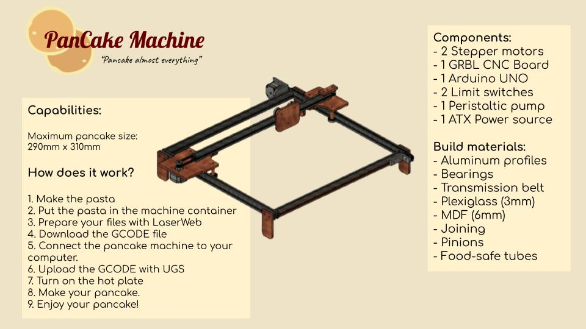
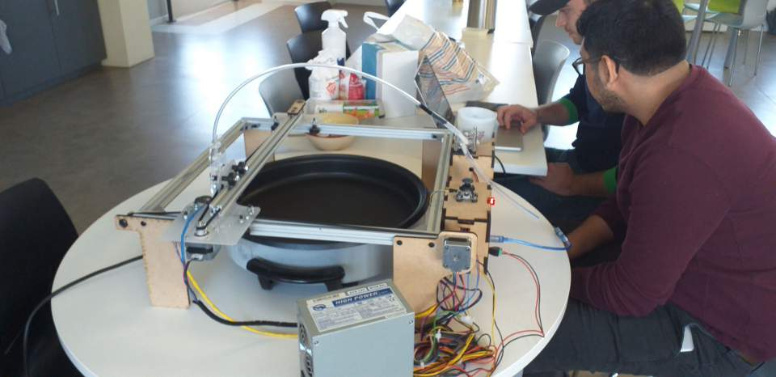


<!--iframe width="560" height="315" src="https://www.youtube.com/embed/_DBPXuooTRU" frameborder="0" allow="autoplay; encrypted-media" allowfullscreen></iframe> -->

<figure class="video_container">
  <video controls="true" allowfullscreen="true" poster="path/to/poster_image.png" width=100% loop>
    <source src="http://fabacademy.org/2021/labs/agrilab/video/week10/demo.mp4" type="video/mp4">
  </video>
</figure>


## Introduction

On this week we learn to design and make a machine. We faced different difficulties related to the teamwork, machine motion, electronics and the GCODE. This was a special week since the goal was to design and make a machine working as a team. And we are a very diverse team with different skills and motivations.

The work was divided naturally as things came and were picked by us [Theo](http://fabacademy.org/2021/labs/agrilab/students/theo-gautier/assignments/week15), [Elina](http://fabacademy.org/2021/labs/agrilab/students/elina-nguyen-cadoret/assignments/week10) and me.

Theo has the skill to design and make machines quickly, so He took responsibility of the machine frame and material selection.

Our instructors [Luc Hanneuse](https://fabacademy.org/2019/labs/sorbonne/students/hanneuse-luc/about/) and [Florent Lemaire](http://fabacademy.org/2020/labs/agrilab/students/florent-lemaire/about/) looked ahead to this week and they gave us access to Arduino UNO GRBL boards that I'll explain later on this [section](#cnc-control-system-assembly-and-configuration).

As I've been working just fine under Electronics and software I've picked the responsibility of that part of the project.

Elina took responsability of the pumping system and the research of the best pancake recipe for the machine.

One of the challenges on [AgriLab](http://agrilab.unilasalle.fr/) under the COVID-19 corfew and restrictions were the complete all this machine design and building process in Thursday, Friday and Monday, between 9am to 5:20pm.

This documentation its separated on multiple sections describing my work process chronologically. This is a resume of the work:

- The idea and teamwork.
- The electronics setup.
- GRBL firmware setup.
- Machine building.
- The GCODE file creation process with Fusion 360.
- Testing.
- Final result.
- Learning outcome.


Check the group assignment [here](http://fabacademy.org/2021/labs/agrilab/group/week10_machine_week/)


## Idea generation and team work.

We first talked together to explain our ideas and split the work.

- [Theo's](http://fabacademy.org/2021/labs/agrilab/students/theo-gautier/assignments/week15) idea: Pancake machine.
- [Elina's](http://fabacademy.org/2021/labs/agrilab/students/elina-nguyen-cadoret/assignments/week10) idea: 3 axis CNC machine.
- My idea was to work on someone's else idea. So we agreed to work together to develop Theo's pancake machine.

This was the first sketch we made together.

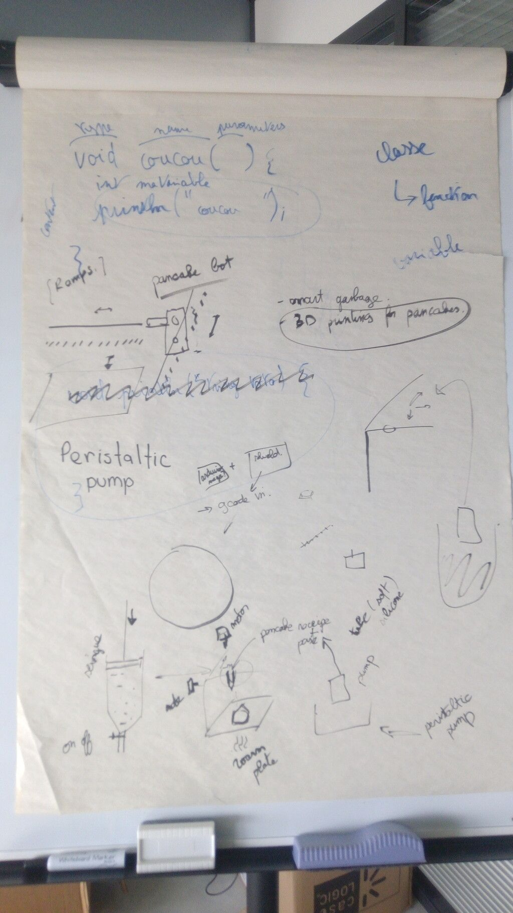

Then we explored the available materials and parts in the Lab.


#### Pancake robot:

**General schematic or diagram**

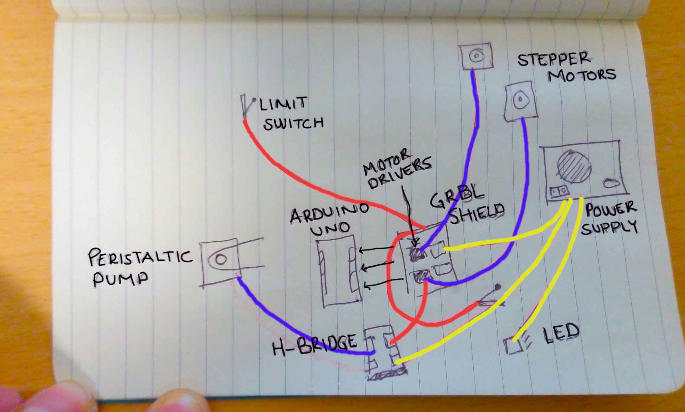


#### Work split

1. Theo machine design and building
2. Antonio CNC control system
3. Elina pumping system and pancake recipe


#### Criteria to chose the materials for the structure

This is a list of priorities for the materials we have used for the machine. Although we had to prioritize also time and availability and machining process. The person in charge of the final selections was my team mate [Theo](http://fabacademy.org/2021/labs/agrilab/students/theo-gautier/assignments/week15)

1. Food safety
2. Structural strength  
2. Heat resistance
2. Quantity
3. Quickness for building


#### Materials selected

After looking at our instructor [Luc](https://fabacademy.org/2019/labs/sorbonne/students/hanneuse-luc/about/) Laser machine:


We got some ideas and after looking of the available quicker machining processes we choose:

1. Plexiglass:
    - [Safety datasheet.](https://www.plexiglas.com/export/sites/plexiglas/.content/medias/downloads/sheet-docs/SDS-11630-PLEXIGLAS-G-COLORLESS-ACRYLIC-SHEET.pdf)
    - This is a transparent plastic material that's food-safe for contact.
    - We selected Laser cut for machining process.   
2. MDF wood 6mm thickness:
    - [Safety datasheet.](https://www.cookstownpanel.com/sites/admin/plugins/elfinder/files/cpc/products/downloads/mdf-data-sheet.pdf)
    - This is a material made out of wood fibers, mixed with wax and resins.
    - Compared to PLexiglass its more suitable for heat resistance, so the parts closed to the source of heat will be made out of it.
    - Compared to aluminum its cheaper and easy for machining.
3. Extruded aluminum profile 20x20 mm:
    - [Datasheet.](../../files/week10/profile_alum_2020_datasheet.pdf)
    - This is strongest structural material of our list. For machining it required a big saw machine available in the MechaLab at Agrilab.
    - It's also the most expensive material.
    - It brings a lot of structural advantages like the rails that we used for assembly multiple parts of the machine.


## Electronics setup

Introduction:

CNC control its a complex task, and there are few options open-sourced and easy to use.

[GRBL](https://github.com/gnea/grbl) its an Open-source software for hobby CNC control written for the AVR [Atmega328 micro-controllers](https://ww1.microchip.com/downloads/en/DeviceDoc/Atmel-7810-Automotive-Microcontrollers-ATmega328P_Datasheet.pdf).

Arduino UNO Boards are based on the AVR Atmega328 micro-controller, so our electronic CNC board kit uses all the capabilities of the software and makes the electronics assemble process easy and accessible for new CNC learners.

The [GRBL](https://github.com/gnea/grbl) board we have it's a common one used for CNC machines, like small low power laser cutters, small milling machines and vinyl cutters.

I'll explain more about it later, [check it here.](#grbl)


### Requirements

Those are the parts, consumables, tools and software I've used to accomplish my part of the project.


#### Parts


**Click on name to check reference**

| Part | Quantity |
| --- | --- |
| [NEMA 17 step motors](https://www.digikey.fr/product-detail/fr/trinamic-motion-control-gmbh/QSH4218-41-10-035/1460-1075-ND/4843426)  | 2 |
| [CNC GRBL arduino UNO compatible board](https://blog.protoneer.co.nz/arduino-cnc-shield/) | 1 |
| [HR4988 Motor drivers](https://components101.com/modules/a4988-stepper-motor-driver-module) | 2 |
| [Limit switches](https://sten-eswitch-13110800-production.s3.amazonaws.com/system/asset/product_line/data_sheet/124/MS.pdf) | 2 |  
| [Arduino UNO](https://store.arduino.cc/arduino-uno-rev3) | 1 |
| Connectors for wiring | # |
| [Recycled ATX power supply](https://hackaday.com/2016/10/28/not-quite-101-uses-for-an-atx-power-supply/) | 1 |


#### Consumables


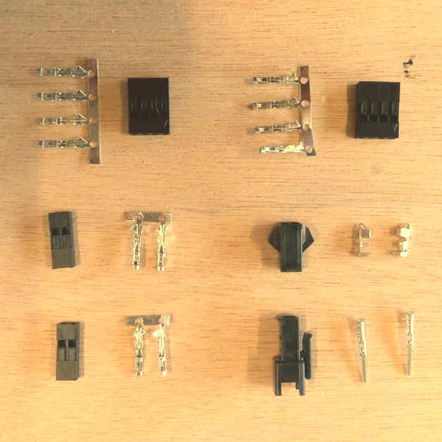

1. Ribbon wire 4 colors for stepper motors
2. AWG wire 1669
3. Connectors "Type 1"
4. Connector "Type 2"


#### Tools


1. GST Crimping Tool
2. Soldering iron
3. Clippers
4. Multimeter
5. Cross screw driver
6. Wire stripper


#### Software

1. [Arduino IDE](https://www.arduino.cc/en/software)
2. [Universal Gcode sender](https://winder.github.io/ugs_website/download/)
3. [GRBL firmware](https://github.com/grbl/grbl)
4. [Fusion 360](https://www.autodesk.com/products/fusion-360/overview)

**Instructions for the usage and configurations are detailed in the next steps.**


### ATX Power supply setup


We checked possible power sources and the most suitable one was this recycled ATX power supply.

In AgriLab there's a large stock of recycled parts and materials.


#### ATX Power on jumper

To switch on the power supply I added a jumper between the green wire and ground.

Explain more

1. Cut the wires
2. Connect using an electrical union connector


#### ATX voltage Outputs

This is the table with the Voltage and Power of every output in the ATX power supply.

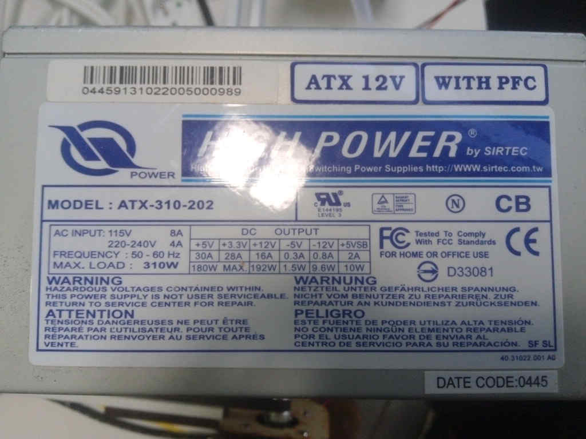


I've used 3 pairs of 12 Volts based in the power consumption of every component listed here:

| Part | Voltage | Wire color | Black Ground wire |
| -- | -- | --- | --- |
| Arduino UNO board | 5 Volts | Red | Yes |
| GRBL board | 12 Volts | Yellow | Yes |
| 12 V Red LED | 12 Volts | Yellow | Yes |
| Peristaltic pump | 12 Volts | Yellow | Yes |


### CNC GRBL Arduino UNO compatible board

This is the schematic given by the manufacturer. Schematic has some faults in the motor driver silk.


characteristics:

| GRBL | Board | |
| -- | -- | -- |
| Operation voltage | 12 to 16 V | not regulated, only protected by a fusible |
| Axis | 3 connectors for XYZ | +1 Clone axis connector |
| Limit switches | +-X, +-Y, +- Z | |
| Spindle control | Enable, Direction, cooling | Also used for laser output control |
| Machine override controls | Abort, Hold, Resume | |
| Emergency stop | | |
| Serial communication pinouts | SDA, SCL, TX RX, RST, 3.3V 5V | |
| Microstepping configuration jumpers | 1/2, 1/4, 1/8, 1/16 | |


#### Assembly


Connect the motor driver boards to the GRBL board sockets. Check the pinout and be sure all the pins coincide correctly.


#### Motor drivers

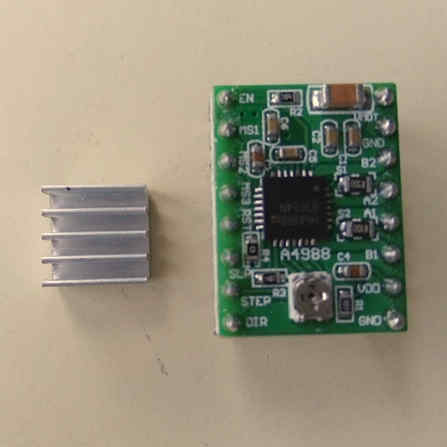


Characteristic:

| HR4988 motor driver | | |
| --- | --- | --- |
| Operation voltage | 5 Volts |  |
| Resistance | R100 | 0.1 Ohms |
| Motor Voltage Regulator | Potentiometer for VREF |

Pinouts in order:

| Left | Right |
| --- | -- |
| Direction | GND |
| Step | VDD |
| Sleep | 1B |
| Reset | 1A |
| MS3 | 2A |
| MS2 | 2B |
| MS1 | GND |
| Enable | VMOT |


### Stepper motors

#### Wiring

The wiring with the stepper motors was confusing and I invested one afternoon to find out the right wiring configuration.

I've find the correct wiring configuration after looking at this video tutorial in Spanish from ["El Profe García".](https://youtu.be/bx5XrROhr-E)

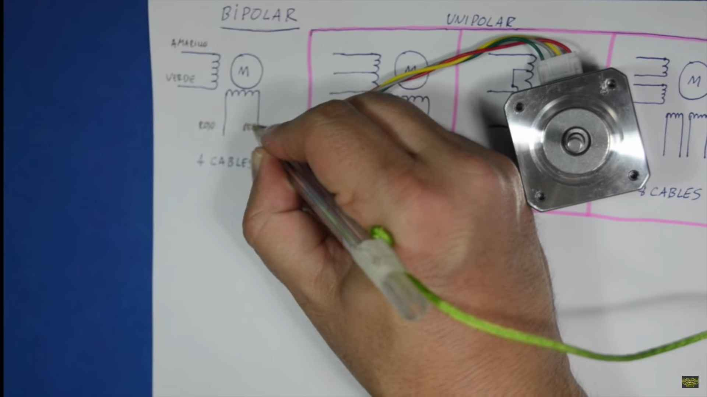

On the video I've learn how to identify the coils inside the step motor. And on this [other video form the same channel shows](https://youtu.be/eRcqiVBZPQM) the right pinout connection with a controller board.


I've found the solution by looking carefully at driver the controller.

Silk draft:

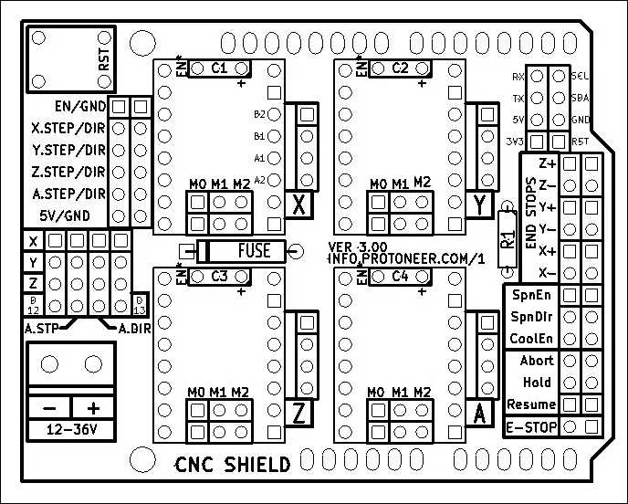

Silk board: See labels at the right side:

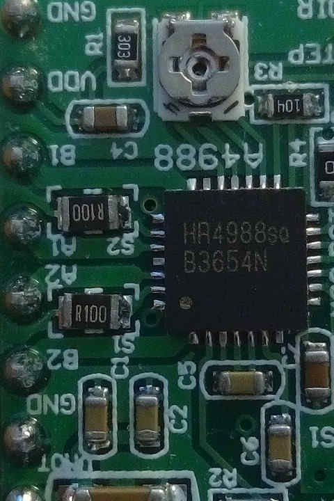

Comparison table:

| Silk board | Silk draft |
| -- | -- |
| B2 | B2 |
| A2 | B1 |
| A1 | A1 |
| B1 | A2 |

*For me it was so confusing to see some documentation showing 2A, 2B, 1A and 1B, and others showing A1, A2, B2, B1.*

The connector cable has 4 wires of colors, Red, Green, Blue and Black.


**This is the right configuration to punch the connectors to the cable from the motor driver to the stepper motor.**

| Code  | Motor driver color | Step motor color |
| -- | -- | -- |
| B2 | Green | Red |
| A1 | Red | Blue |
| A1 | Black | Green |
| B1 | Blue | Black |


#### VREF calibration

This is an important task to prevent over-heating of the motor drivers, and excessive vibration and over-heating of the step motors.

[This the motor datasheet provided by the manufacturer](link)
[SMD resistor calculator](http://kiloohm.info/smd4-resistor/R100)

Calculation:

| Values | | |
| -- | -- | -- |
| Current Sense resistance | 0.01 Ohms | Rsense |
| Rated motor current | 1.3 A | RMC |
| Safety margin percentage | 25 % | SM |

I've found this formula VREF = RMC x 8 x Rsense

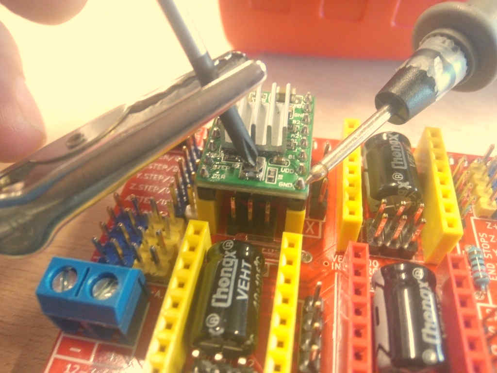

Process:

1. Use the multimeter as voltmeter in a scale of less than 5 Volts.
1. Get a multimeter with a clamp connector in the cathode
2. Power on the GRBL board
3. Place the cathode (screw driver) in the VREF potentiometer and the ground probe in the bottom left GND pin.
4. Turn the potentiometer clockwise to increase and anti-clockwise to decrease the VREF.

This method helped me to reduce a crancky noise in the motors and overheating of the driver controller board.
I have tried also to reduce the length of the cables to reduce the noise but this VREF method work fine at the end.


#### Steps per millimeter for belt driven systems

I've calculated this using this [calulator.](https://zalophusdokdo.github.io/StepperMotorsCalculator/en/index.html)

| Data | Value |
| -- | -- |
| Motor step angle | 1.8° |
| Driven Microstepping | Full step |
| Belt pitch | 2 mm (GT2) |
| Pulley tooth count | 20 |

**Result: 5.00**

| Resolution | Teeth | Step angle | Stepping | Belt |
| -- | -- | -- | -- | -- |
| 200 micron | 20 | 1.8° | Full step | 2mm |


### Wiring and connections

Follow this instructions to connect and wire the CNC control system:

1. Connect motor driver boards to the CNC arduino shield
  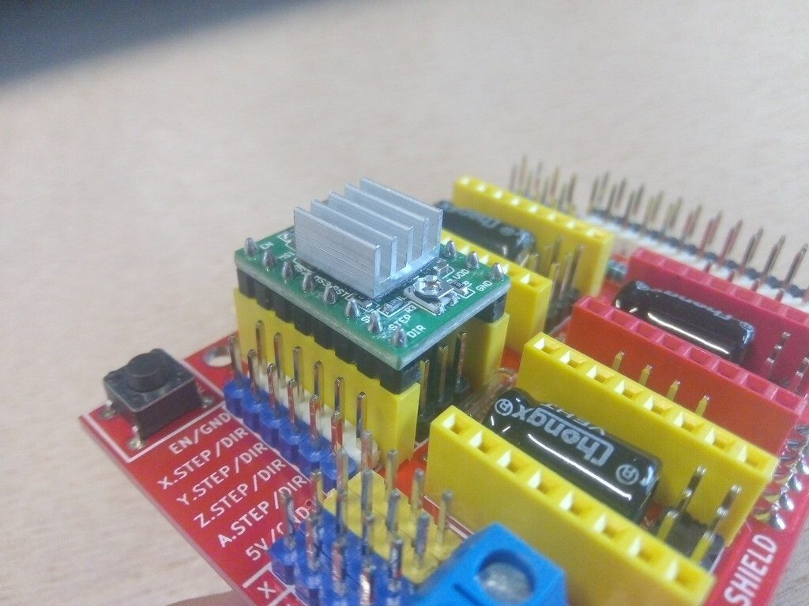
2. Connect stepper motors with the correct wiring configuration specified in the stepper motors section.
  
3. Connect X and Y limit switches to -X and -Y ports in the board.
4. Connect power supply yellow and black cables from the ATX power supply.
  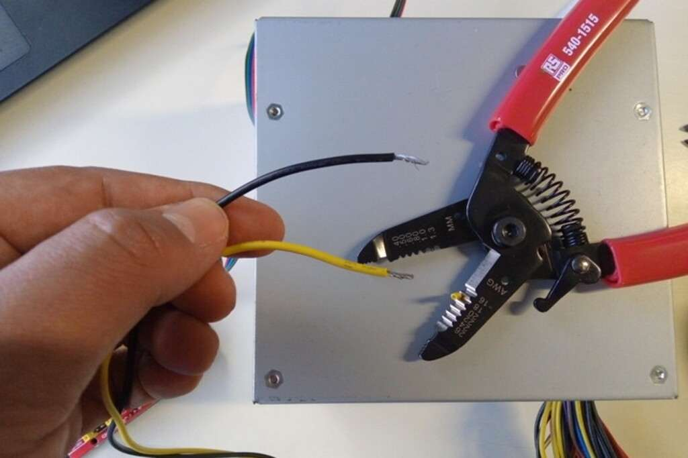
5. I've included a 12 V Red led to give some visual feedback, it's connected by an independent yellow and black wires from the ATX power supply.
  


## Software setup

### GRBL

As I mentioned before, [GRBL](https://github.com/grbl/grbl) is an Open-Source firmware that runs in Atmega328 based Arduinos for low cost CNC machines. The version I've used is the v1.1 released in 08/2019.

I've downloaded the repository using this command:

```
git clone https://github.com/grbl/grbl.git
```

Install requirements for Fedora Linux:

- Avr gcc compiler
- Arduino

```
sudo dnf install avr-gcc arduino
```

Once the requirements are installed, the next steps are documented in the [GRBL repository.](https://github.com/gnea/grbl/wiki/Compiling-Grbl)


#### Compiling and Flashing GRBL using Arduino IDE

>These instructions were extracted from GRBL documentation [here:](https://github.com/gnea/grbl/wiki/Compiling-Grbl)

1. Launch the Arduino IDE
 * Make sure you are using the most recent version of the Arduino IDE!
3. Load the ```grbl folder``` into the Arduino IDE as a Library.
 * Click the ```Sketch``` drop-down menu, navigate to ```Include Library``` and select ```Add .ZIP Library```. The ```Add .ZIP Library``` command supports both a .ZIP file or a folder. In our case, there is no ```.ZIP``` file.
 * You can confirm that the library has been added. Click the ```Sketch``` drop-down menu again, navigate to ```Include Library```, then scroll to the bottom of the list where you should see ```grbl```.
 * **IMPORTANT:** Select the ```grbl``` folder **_inside_** the ```grbl-XXX``` folder, which **only** contains the source files and an example directory.
 * If you accidentally select the `.zip` file or the wrong folder, you will need to navigate to your Arduino library, delete the mistake, and re-do Step 3.
4. Open the `GrblUpload` Arduino example.
 * Click the ```File``` down-down menu, navigate to ```Examples->Grbl```, and select ```GrblUpload```.
 * Do not alter this example in any way! Grbl does not use any Arduino code. Altering this example may cause the Arduino IDE to reference Arduino code and compiling will fail.
5. Compile and upload Grbl to your Arduino.
 * Connect your Arduino Uno to your computer.
 * Make sure your board is set to the Arduino Uno in the ```Tool->Board``` menu and the serial port is selected correctly in ```Tool->Serial Port```. (There are some controller boards on ebay that have the Arduino Pro bootloader on it, if you get error messages like "avrdude: stk500_getsync() attempt n of 10: not in sync: resp=0x20" then choose another board, try Arudino Pro/Pro Mini)
 * Click the ```Upload```, and Grbl should compile and flash to your Arduino! (Flashing with a programmer also works by using the ```Upload Using Programmer``` menu command.)


#### Compiling and flashing using command line tools

**Requirements for Fedora Linux**

GRBL repository:

```
git clone https://github.com/grbl/grbl.git
```

AVR-GCC and Arduino core libraries:

```
sudo dnf install avr-gcc arduino-core
```

Make:

```
sudo dnf install make
```

**Usage**

Go to your local GRBL repository using your terminal by cd <location_of_grbl>, in my case this is:

```
cd $HOME/repos/grbl
```

Then use make to compile the grbl HEX file that's going to be flashed to your Arduino UNO board:

```
make clean && make grbl.hex
```

If the HEX file is successfully compiled then proceed to flash it to the board by executing:

```
avrdude -v -patmega328p -Uflash:w:grbl_v1.1h.20190825.hex:i -carduino -b 115200 -P /dev/ttyACM0
```

Where:

- /dev/ttyACM0 it's the local addres of my Arduino UNO board.

- -patmega328p it's microprocessor family

- -Uflash:w:grbl*.hex it's the grbl_file_name.hex you have compiled.

- b 115200 it's the baudrate speed.

There are different ways to know this value, the easiest one it's this:

- Execute on the terminal with your board **unplugged**:

<script id="asciicast-aK4bM2mC0358HUAwKh2PpuRtb" src="https://asciinema.org/a/aK4bM2mC0358HUAwKh2PpuRtb.js" async></script>

```
ls /dev/tty*
```

Save the output and then execute the same command again, **but with your Arduino board connected**, compare the difference, and the new address it's the one of your Arduino:


#### Disable Z axis homing routine

After flashing the board, and setting up electronics and power source I tried to configure the homming using **Universal Gcode Sender** but, I got many alarms in the process of trying the limit switches. Remember I'm using a 2 axis configuration in hardware but then the GRBL by default expects  Z axis limit switch in the routine.

We need to edit and re-flash the firmware to the board, this are the steps needed:

In the lines 75 and 76 of the **grbl/config.h** file its declared the homing process and as the comments point:

- line 75 moves the Z axis which is not existing in our configuration,

- line 76 moves the XY axis at the same time and rate.

This whole process it's called "limit finding":

Edition:

- Comment line 75 by adding double slash "//" at the begging of the line.

- Edit line 76 by changing "HOMING_CYCLE_1" to "HOMING_CYCLE_0".

- Save the file, and run the compilation process with Arduino or Linux command tools.

Now the homing cycle starts by moving the X and Y axis and the errors are fixed.

<script id="asciicast-MdI79ftDUjOytR7em4Otg9V2P" src="https://asciinema.org/a/MdI79ftDUjOytR7em4Otg9V2P.js" async></script>


#### Firmware configuration

The important points of the firmware configuration are:

- "Report in inches", which means you need to disable it to use millimeters.

- "Homing cycle enabled", this is required since we're using a band-pulley system, and as result the machine is not precise enough to preserve an reliable 0 position.

- "Working area limits":
  - X: 310 mm
  - Y: 290 mm

We obtained this measurements by manually measuring the travel length of each axis:

X axis:


Y axis:


I've used UGS to change this configuration and also manually typing the codes in a terminal using serial communication and [minicom](https://wiki.emacinc.com/wiki/Getting_Started_With_Minicom):

Firmware configuration table:

The values like this "$0" or "$23" should by typed in the terminal after Serial communication has been established:

OR under Universal GCODE Sender see firmware configuration process [here](#firmware-configuration-wizard/):

This is a recorded session using Minicom for serial communication at 115200 Bauds to /dev/ttyACM0 Arduino UNO with GRBL firmware:

<script id="asciicast-LhgpVgfuGZgr9OGNbMikq4UMo" src="https://asciinema.org/a/LhgpVgfuGZgr9OGNbMikq4UMo.js" async></script>

| Setting | Value | Description |
| -- | -- | -- |
| $0 | 10 | Step pulse time |
| $1 | 25 | Step idle delay |
| $2 | 0 | Step pulse invert |
| $3 | 2 | Step direction invert |
| $4 | 0 | Invert Step enable pin |
| $5 | 0 | Invert limit pins |
| $6 | 0 | Invert probe pin |
| $10 | 1 | Status report options |
| $11 | 0.010 | Junction deviation |
| $12 | 0.020 | Arc tolerance |
| $13 | 0 | Report in inches |
| $20 | 1 | Soft limits enable |
| $21 | 0 | Hard limits enable |
| $22 | 1 | Homing cycle enable |
| $23 | 7 | Homing direction invert |
| $24 | 25.000 | Homing locate feed rate |
| $25 | 700.000 | Homing search feed rate |
| $26 | 250 |Homing switch de-bouncing delay |
| $27 | 1.000 | Homing switch pull-off distance |
| $30 | 10000 | Maximum spindle speed |
| $31 | 0 | Minimum spindle speed |
| $32 | 1 | Laser mode enabled |
| $100 | 5.000 | X-axis travel resolution |
| $101 | 5.000 | Y-axis travel resolution |
| $102 | 5.000 | Z-axis travel resolution |
| $110 | 10000.000 | X-axis maximum rate |
| $111 | 10000.000 | Y-axis maximum rate |
| $112 | 500.000 | Z-axis maximum rate |
| $120 | 5000.000 | X-axis acceleration |
| $121 | 5000.000 | Y-axis acceleration |
| $122 | 10.000 | Z-axis acceleration |
| $130 | 310.000 | X-axis maximum travel |
| $131 | 290.000 | Y-axis maximum travel |
| $132 | 0.000 | Z-axis maximum travel |


#### GCODE testing

I've the time to test multiple GCODES compatible for this version of GRBL.


| Code | Action|
| -- | -- |
| $H | Starts homing cycle |
| $G28 | Goes to the maximum point |
| $G0 X100 | Linear movement on X axis by 100 mm |
| $G0 Y100 | Linear movement on Y axis by 100 mm |
| $G0 X100 Y100 | Linear movement on X and Y axis by 100 mm |
| $G53 | Uses absolute coordinates for positioning |
| $G27 | Uses XY plane |

To execute this commands I've used Universal GCODE Sender:

<figure class="video_container">
  <video controls="true" allowfullscreen="true" poster="path/to/poster_image.png" width=100% loop>
    <source src="../../images/week10/ugs_02.mp4" type="video/mp4">
  </video>
</figure>


### Fusion 360 work-flow

I've used Autodesk's [Fusion 360](https://www.autodesk.com/products/fusion-360/overview) to understand how the process of making GCODE works with a familiar software. Although there are other options like [LaserWeb](https://laserweb.yurl.ch/)

The Design process consisted just in drawing a shape using the sketch tools under the Design environment of Fusion 360.

I've drafted simple shapes to test the pancake machine this an example of the test we ran on the Pancake Machine:

1. I've drafted this Nut of 120mm side to side and a inner circle of 70 mm diameter.
  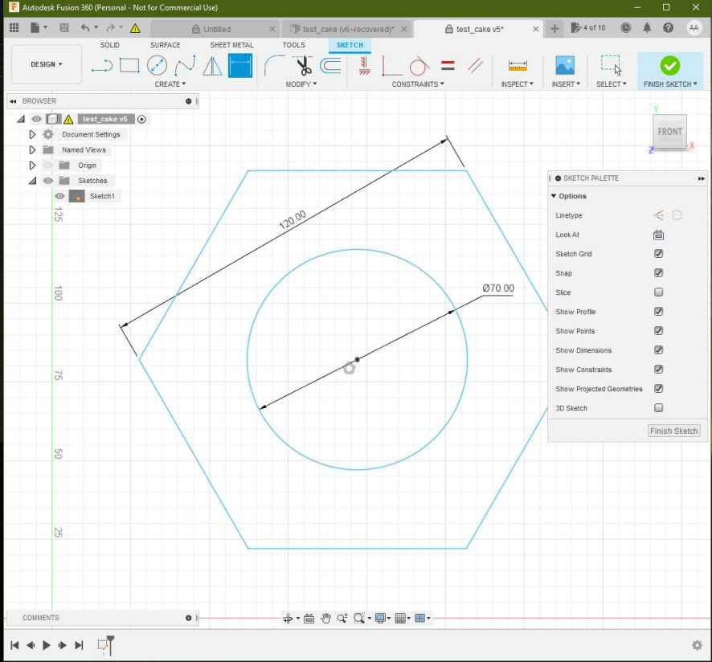
2. I've made under the "Manufacture" apart a setup process, selecting the Nut sketch as the working area:
  
3. I've selected as Machine "Autodesk Generic Cutting Machine"
  
4. Then selected the machining process as "Cutting":
  
5. Then selected "2D profile as cutting process" in the top bar as shown:
  
6. Under the "Select Tool" apart I've selected the "1- laser cutter" option as shown:
  
7. Then selected the countours in the sketch as shown:
  
  
8. Finally setting this parameters:
    - offset of 10mm.
    - retract heigh 5mm.
    - stock top at 0 mm.

9. Then under the "Inspection menu" I've generated the following GCODE simulation.
  <figure class="video_container">
    <video controls="true" allowfullscreen="true" poster="path/to/poster_image.png" width=100% loop>
    <source src="../../images/week10/fusion_08.mp4" type="video/mp4">
    </video>
  </figure>
10. To process the files and output a GCODE File for the machine the process its made as shown:
11. Under the "inspection apart" in the topbar select "Post process" option:
12. Then Select "Grbl Laser/grbl laser" for machine type:
  
13. I've setup the output directory and the program name as **~/Desktop/cake_test_01.nc** :
  
14. This the GCODE generated:
```
%
(cake_test_01)
(Machine)
(  vendor: Autodesk)
(  description: Generic Cutting Machine)
G90 G94
G17
G21

(2D Profile2)
G54
G0 S255 M4
G0 X62.576 Y25.508
G1 X61.576 Y23.776 F1000
G1 X62.447 Y22.268
G1 X131.498
G1 X166.023 Y82.068
G1 X131.498 Y141.868
G1 X62.447
G1 X27.921 Y82.068
G1 X61.576 Y23.776
G1 X63.576
G1 S0
M30
%

```


## Universal GCODE sender

Extracted from [Universal GCODE SENDER website](https://winder.github.io/ugs_website/)

> *A full featured gcode platform used for interfacing with advanced CNC controllers like GRBL , TinyG, g2core and Smoothieware. Universal Gcode Sender is a self-contained Java application which includes all external dependencies and can be used on most computers running Windows, MacOSX or Linux. *

Characteristics:

- Multiplatform
- Written in [JAVA](https://www.java.com/en/download/help/whatis_java.html) programming language.
- Provides an interface for Serial communication.
- Provides tools like Joystick and file input to run GCODE files.
- It has a testing tools
- The Configuration wizard makes the firmware configuration easier.

Overview:


### Instructions to install and run UGS under Linux:

- Download Universal GCODE sender following this [link](https://winder.github.io/ugs_website/download/)
- Once the files have been downloaded run the installation process depending on your platform.
- Install JAVA OpenJDK Runtime for Linux:
    <code>dnf install java-11-openjdk.x86_64</code>
   *[Follow the instructions on this page for more information about OpenJDK in Fedora Linux](https://docs.fedoraproject.org/en-US/quick-docs/installing-java/)*
- For Linux I've only had to extract the ZIP files and run the following command inside the "bin" directory:
    <code> ./ugsplatform </code>
- Run Universal GCODE sender and activate the communication with the machine.
- I've identify the GRBL Serial communiction device as **/dev/ttyACM0** automatically with UGS.
- Then I've established serial communication at 115200 bauds.
  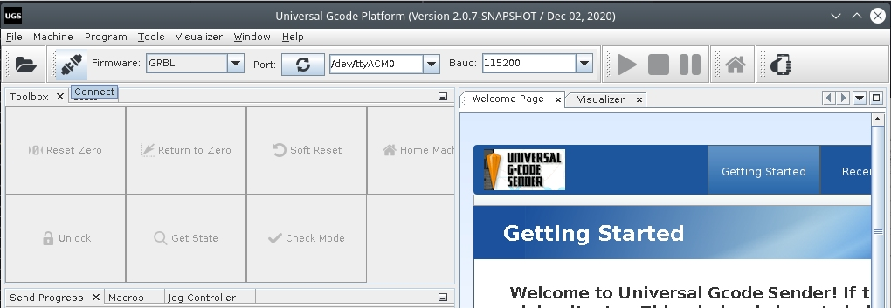


### Firmware configuration Wizard:

I've followed the Firmware configuration wizard to setup the values I've explained under the [Firmware Configuration section](#firmware-configuration)

<figure class="video_container">
  <video controls="true" allowfullscreen="true" poster="path/to/poster_image.png" width=100% loop>
  <source src="../../images/week10/ugs_01.mp4" type="video/mp4">
  </video>
</figure>


### Load  GCODE files

- Run the HOME cycle:


- Import the GCODE in "File" --> "Open"

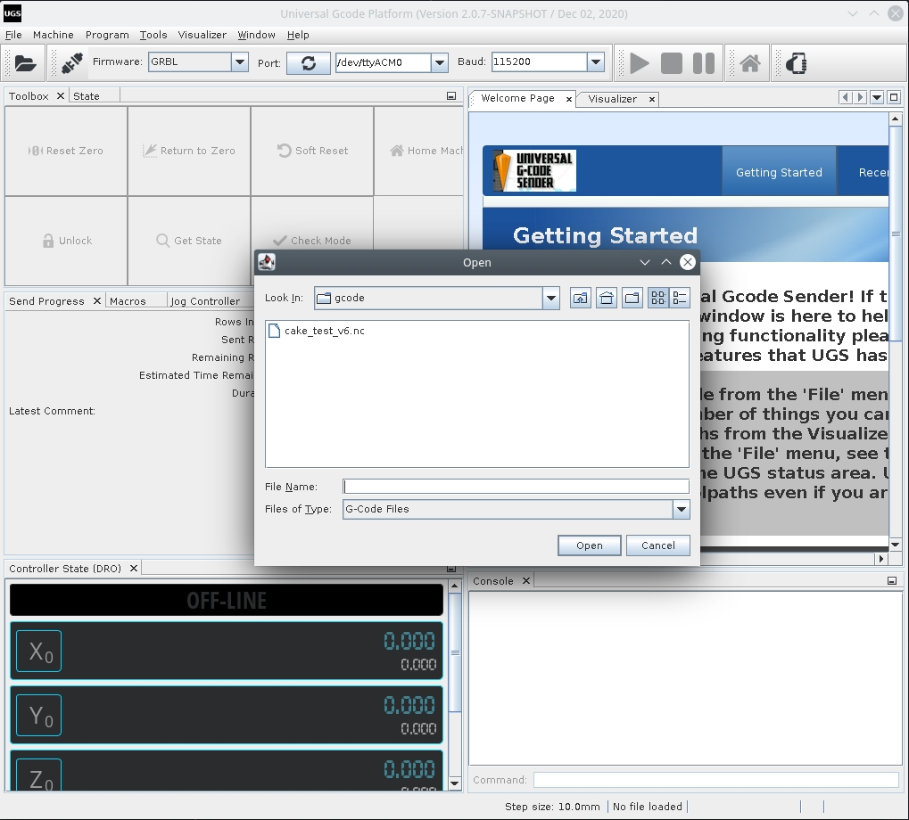

- Press the "Play" Button to run the GCODE


## Testing

### Fixing Slow speeds:

Change the maximum acceleration on the firmware configuration:

<figure class="video_container">
  <video controls="true" allowfullscreen="true" poster="path/to/poster_image.png" width=100% loop>
    <source src="../../images/week10/demo_02.mp4" type="video/mp4">
  </video>
</figure>


### Fixing High vibration:

Decrease the motor drivers VREF until the vibration gets reduced.

Do this by running a displacement GCODE command like:

- G00 X100 to debug the X axis
- G00 Y100 to debug the Y axis


### Fixing stuck motors

- Axis not moving:

Check the transmission band, look for any stuck parts or excessive friction.
Adjust the motor drivers VREF increasing the output

- Motors not changing direction

I've found that the silk labels on the motor drivers are inverted and thus it gets confusing if you try to connect the stepper motors following the schematics.


## Final result

At the end we tested the machine and made some pancakes this video was edited by [Theo](http://fabacademy.org/2021/labs/agrilab/students/theo-gautier/assignments/week15).

The assemble process of the different parts of the project took place while working, the integration and final test took place on Monday.

We iterated two times, the first version of the machine had an independent pumping control for speed flow control with a [joystick](http://fabacademy.org/2021/labs/agrilab/students/elina-nguyen-cadoret/assignments/week10/#peristaltic-pump). while Elina worked on her system and later her introduced tool control to activate and deactivate the peristaltic pump system. With the commnads "M03" and "M04".

This independent Arduino pumping system was later removed.

<figure class="video_container">
  <video controls="true" allowfullscreen="true" poster="path/to/poster_image.png" width=100% loop>
    <source src="http://fabacademy.org/2021/labs/agrilab/video/week10/demo.mp4" type="video/mp4">
  </video>
</figure>


## Learning outcome

**For an effective teamwork communication its crucial**, the first two days we had a very good understanding of the tasks and over the last two days communication stopped and so we started facing some misunderstandings between instructors and students.

**Its important to mention and keep record of all the modifications we make to others works**, for example on day 3 I spent 4 hours debugging the machine after a modification to the firmware I didn't knew about.

As the task was for 3 days 4 maximum, stress was a factor that limited our integration as teammates but at the end we cope and moved forward to deliver the machine on time.


## Files

[firmware](../files/week10/firmware_cakebot.settings)
[test_cake gcode](../files/week10/cake_test_01.nc)
[test_cake fusion file](../files/week10/test_cake.f3d)
