# 10. Mechanical design / Machine design


<figure class="video_container">
  <video controls="true" allowfullscreen="true" poster="path/to/poster_image.png" width=100% loop>
    <source src="../../images/week10/demo_02.mp4" type="video/mp4">
  </video>
</figure>

## Introduction

On this week we learn to design and make a machine. We faced different difficulties related to the teamwork, machine motion, electronics and the GCODE.


## Idea

We first talked together to explain our ideas and split the work.

- [Theo's](link) idea: Pancake machine.
- [Elina's](link) idea: 3 axis CNC machine.
- My idea was to stick to someone's else idea. So we agreed to work together to develop Theo's pancake machine.

This was the first sketch we made together.


Then we explored the available materials and parts in the Lab.


### Work split

1. Theo machine design and building
2. Antonio CNC control system
3. Elina pumping system and pancake recipe


### Criteria to chose the materials for the structure

1. Food safety
2. Structural strength  
2. Heat resistance
2. Quantity
3. Quickness for building


### Materials selected

1. Plexiglass
2. MDF wood 6mm thickness
3. Extruded aluminum profile


## Requirements

### Parts

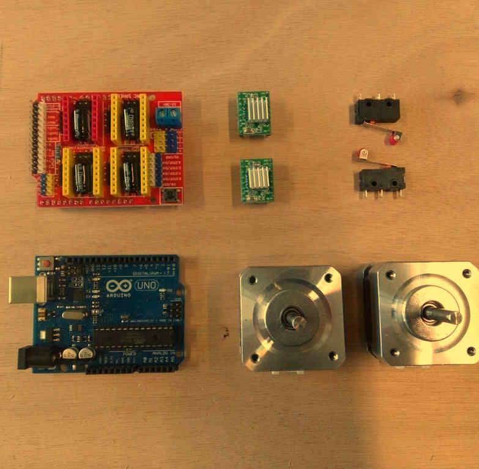

**Click on name to check reference in Digikey**

| Part | Quantity |
| --- | --- |
| NEMA 17 step motors  | 2 |
| CNC GRBL arduino UNO compatible board | 1 |
| HR4988 Motor drivers | 2 |
| Limit switches | 2 |  
| Arduino UNO | 1 |
| Connectors for wiring | # |
| Recycled ATX power supply | 1 |


### Consumables


1. Ribbon wire 4 colors for stepper motors
2. AWG wire 1669
3. Connectors "Type 1"
4. Connector "Type 2"


### Tools


1. Crimping D Sub-terminal
2. Soldering iron
3. Clippers
4. Multimeter
5. Cross screw driver
6. Wire stripper


### Software

1. [Arduino IDE](https://www.arduino.cc/en/software)
2. [Universal Gcode sender](https://winder.github.io/ugs_website/download/)
3. [GRBL firmware](https://github.com/grbl/grbl)
4. [Fusion 360](https://www.autodesk.com/products/fusion-360/overview)

**Instructions for the usage and configurations are detailed in the next steps.**


## Using an ATX Power supply

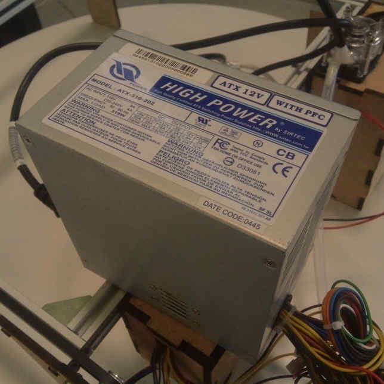

We checked possible power sources and the most suitable one was this recycled ATX power supply.

In AgriLab there's a large stock of recycled parts and materials.


### Power on jumper

To switch on the power supply I added a jumper between the green wire and ground.

1. Cut the wires
2. Connect using an electrical union connector

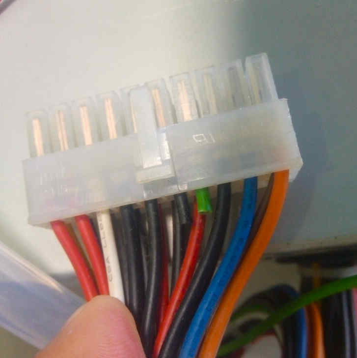
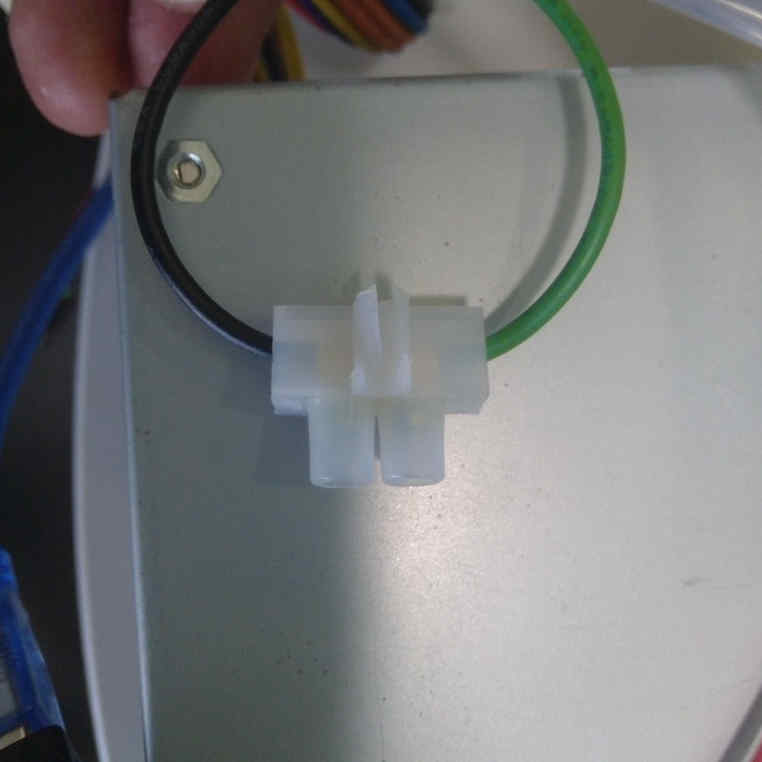


### Outputs

This is the table with the Voltage and Power of every output in the ATX power supply.


I've used 3 pairs of 12 Volts based in the power consumption of every component listed here:

| Part | Voltage | Wire color | Black Ground wire |
| -- | -- | --- | --- |
| Arduino UNO board | 5 Volts | Red | Yes |
| GRBL board | 12 Volts | Yellow | Yes |
| 12 V Red LED | 12 Volts | Yellow | Yes |
| Peristaltic pump | 12 Volts | Yellow | Yes |


## CNC control system assembly and configuration

Introduction:

The GRBL board we have it's a common one used for CNC machines, like small low power laser cutters, small milling machines and vinyl cutters.


### CNC board

This is the schematic given by the manufacturer.


characteristics:

| GRBL | Board | |
| -- | -- | -- |
| Operation voltage | 12 to 16 V | not regulated, only protected by a fusible |
| Axis | 3 connectors for XYZ | +1 Clone axis connector |
| Limit switches | +-X, +-Y, +- Z | |
| Spindle control | Enable, Direction, cooling | Also used for laser output control |
| Machine override controls | Abort, Hold, Resume | |
| Emergency stop | | |
| Serial communication pinouts | SDA, SCL, TX RX, RST, 3.3V 5V | |
| Microstepping configuration jumpers | 1/2, 1/4, 1/8, 1/16 | |


### Assembly

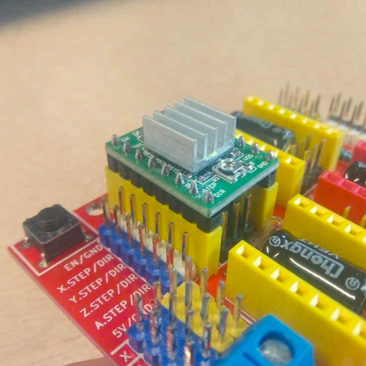

Connect the motor driver boards to the GRBL board sockets. Check the pinout and be sure all the pins coincide correctly.


### Motor drivers


Characteristic:

| HR4988 motor driver | | |
| --- | --- | --- |
| Operation voltage | 5 Volts |  |
| Resistance | R100 | 0.1 Ohms |
| Motor Voltage Regulator | Potentiometer for VREF |

Pinouts in order:

| Left | Right |
| --- | -- |
| Direction | GND |
| Step | VDD |
| Sleep | 1B |
| Reset | 1A |
| MS3 | 2A |
| MS2 | 2B |
| MS1 | GND |
| Enable | VMOT |


### Stepper motors

#### Wiring

The wiring with the stepper motors was confusing and I invested one afternoon to find out the right wiring configuration.

Following the color code the wires should be punched in the connector like this:


| Motor driver | Step motor |
| -- | -- |
| Green | Red |
| Red | Blue |
| Black | Green |
| Blue | Black |


#### VREF calibration

This is an important task to prevent over-heating of the motor drivers, and excessive vibration and over-heating of the step motors.  

[This the motor datasheet provided by the manufacturer](link)
[SMD resistor calculator](http://kiloohm.info/smd4-resistor/R100)

Calculation:

| Values | | |
| -- | -- | -- |
| Current Sense resistance | 0.01 Ohms | Rsense |
| Rated motor current | 1.3 A | RMC |
| Safety margin percentage | 25 % | SM |

I've found this formula VREF = RMC x 8 x Rsense


Process:

1. Use the multimeter as voltmeter in a scale of less than 5 Volts.
1. Get a multimeter with a clamp connector in the cathode
2. Power on the GRBL board
3. Place the cathode (screw driver) in the VREF potentiometer and the ground probe in the bottom left GND pin.
4. Turn the potentiometer clockwise to increase and anti-clockwise to decrease the VREF.


#### Steps per millimeter for belt driven systems

I've calculated this using this [calulator.](https://zalophusdokdo.github.io/StepperMotorsCalculator/en/index.html)

| Data | Value |
| -- | -- |
| Motor step angle | 1.8° |
| Driven Microstepping | Full step |
| Belt pitch | 2 mm (GT2) |
| Pulley tooth count | 20 |

**Result: 5.00**

| Resolution | Teeth | Step angle | Stepping | Belt |
| -- | -- | -- | -- | -- |
| 200 micron | 20 | 1.8° | Full step | 2mm |


### GRBL

[GRBL](https://github.com/grbl/grbl) is an Open-Source firmware that runs in Atmega328 based Arduinos for low cost CNC machines. The version I've used is the v1.1 released in 08/2019.

I've dowloaded the repository:

```
git clone https://github.com/grbl/grbl.git
```

Install requirements for Fedora Linux:

- Avr gcc compiler
- Arduino

```
sudo dnf install avr-gcc arduino
```

Once the requirements are installed, the next steps are documented in the [GRBL repository.](https://github.com/gnea/grbl/wiki/Compiling-Grbl)


#### Compiling and Flashing GRBL using Arduino IDE

1. Launch the Arduino IDE
 * Make sure you are using the most recent version of the Arduino IDE!
3. Load the ```grbl folder``` into the Arduino IDE as a Library.
 * Click the ```Sketch``` drop-down menu, navigate to ```Include Library``` and select ```Add .ZIP Library```. The ```Add .ZIP Library``` command supports both a .ZIP file or a folder. In our case, there is no ```.ZIP``` file.
 * You can confirm that the library has been added. Click the ```Sketch``` drop-down menu again, navigate to ```Include Library```, then scroll to the bottom of the list where you should see ```grbl```.
 * **IMPORTANT:** Select the ```grbl``` folder **_inside_** the ```grbl-XXX``` folder, which **only** contains the source files and an example directory.
 * If you accidentally select the `.zip` file or the wrong folder, you will need to navigate to your Arduino library, delete the mistake, and re-do Step 3.
4. Open the `GrblUpload` Arduino example.
 * Click the ```File``` down-down menu, navigate to ```Examples->Grbl```, and select ```GrblUpload```.
 * Do not alter this example in any way! Grbl does not use any Arduino code. Altering this example may cause the Arduino IDE to reference Arduino code and compiling will fail.
5. Compile and upload Grbl to your Arduino.
 * Connect your Arduino Uno to your computer.
 * Make sure your board is set to the Arduino Uno in the ```Tool->Board``` menu and the serial port is selected correctly in ```Tool->Serial Port```. (There are some controller boards on ebay that have the Arduino Pro bootloader on it, if you get error messages like "avrdude: stk500_getsync() attempt n of 10: not in sync: resp=0x20" then choose another board, try Arudino Pro/Pro Mini)
 * Click the ```Upload```, and Grbl should compile and flash to your Arduino! (Flashing with a programmer also works by using the ```Upload Using Programmer``` menu command.)


#### Compiling and flashing using command line tools

**Requirements for Fedora Linux**

GRBL repository:

```
git clone https://github.com/grbl/grbl.git
```

AVR-GCC and Arduino core libraries:

```
sudo dnf install avr-gcc arduino-core
```

Make:

```
sudo dnf install make
```

**Usage**

Go to your local GRBL repository using your terminal by cd <location_of_grbl>, in my case this is:

```
cd $HOME/repos/grbl
```

Then use make to compile the grbl HEX file that's going to be flashed to your Arduino UNO board:

```
make clean && make grbl.hex
```

If the HEX file is successfully compiled then proceed to flash it to the board by executing:

```
avrdude -v -patmega328p -Uflash:w:grbl_v1.1h.20190825.hex:i -carduino -b 115200 -P /dev/ttyACM0
```

Where:

- /dev/ttyACM0 it's the local addres of my Arduino UNO board.

- -patmega328p it's microprocessor family

- -Uflash:w:grbl*.hex it's the grbl_file_name.hex you have compiled.

- b 115200 it's the baudrate speed.

There are different ways to know this value, the easiest one it's this:

- Execute on the terminal with your board **unplugged**:

<script id="asciicast-aK4bM2mC0358HUAwKh2PpuRtb" src="https://asciinema.org/a/aK4bM2mC0358HUAwKh2PpuRtb.js" async></script>


```
ls /dev/tty*
```

Save the output and then execute the same command again, **but with your Arduino board connected**, compare the difference, and the new address it's the one of your Arduino:


#### Disable Z axis homing routine

After flashing the board, and setting up electronics and power source I tried to configure the homming using **Universal Gcode Sender** but, I got many alarms in the process of trying the limit switches. Remember I'm using a 2 axis configuration in hardware but then the GRBL by default expects  Z axis limit switch in the routine.

We need to edit and re-flash the firmware to the board, this are the steps needed:

In the lines 75 and 76 of the **grbl/config.h** file its declared the homing process and as the comments point:

- line 75 moves the Z axis which is not existing in our configuration,

- line 76 moves the XY axis at the same time and rate.

This whole process it's called "limit finding":

Edition:

- Comment line 75 by adding double slash "//" at the begging of the line.

- Edit line 76 by changing "HOMING_CYCLE_1" to "HOMING_CYCLE_0".

- Save the file, and run the compilation process with Arduino or Linux command tools.

Now the homing cycle starts by moving the X and Y axis and the errors are fixed.

<script id="asciicast-MdI79ftDUjOytR7em4Otg9V2P" src="https://asciinema.org/a/MdI79ftDUjOytR7em4Otg9V2P.js" async></script>


#### Firmware configuration

The important points of the firmware configuration are:

- Report in inches, which means you need to disable it to use millimeters.

- Homing cycle enabled, this is required since we're using a band-pulley system, and as result the machine is not precise enough to preserve an reliable 0 position.

- Working area limits:
  - X: 310 mm
  - Y: 290 mm

We obtained this measurements by manually measuring the travel length of each axis.


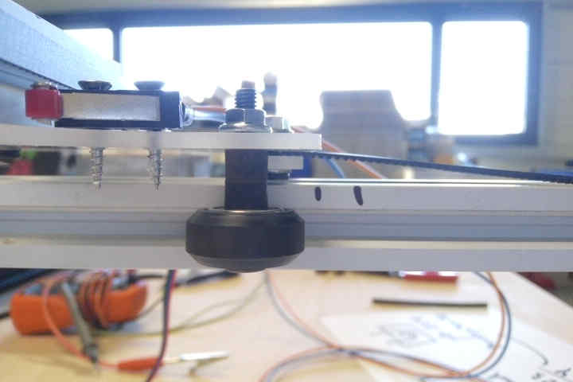

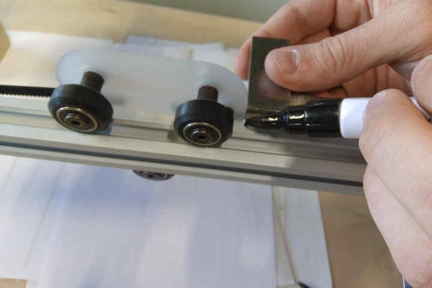

Firmware configuration table:

| Setting | Value | Description |
| -- | -- | -- |
| $0 | 10 | Step pulse time |
| $1 | 25 | Step idle delay |
| $2 | 0 | Step pulse invert |
| $3 | 2 | Step direction invert |
| $4 | 0 | Invert Step enable pin |
| $5 | 0 | Invert limit pins |
| $6 | 0 | Invert probe pin |
| $10 | 1 | Status report options |
| $11 | 0.010 | Junction deviation |
| $12 | 0.020 | Arc tolerance |
| $13 | 0 | Report in inches |
| $20 | 1 | Soft limits enable |
| $21 | 0 | Hard limits enable |
| $22 | 1 | Homing cycle enable |
| $23 | 7 | Homing direction invert |
| $24 | 25.000 | Homing locate feed rate |
| $25 | 700.000 | Homing search feed rate |
| $26 | 250 |Homing switch de-bouncing delay |
| $27 | 1.000 | Homing switch pull-off distance |
| $30 | 10000 | Maximum spindle speed |
| $31 | 0 | Minimum spindle speed |
| $32 | 1 | Laser mode enabled |
| $100 | 5.000 | X-axis travel resolution |
| $101 | 5.000 | Y-axis travel resolution |
| $102 | 5.000 | Z-axis travel resolution |
| $110 | 10000.000 | X-axis maximum rate |
| $111 | 10000.000 | Y-axis maximum rate |
| $112 | 500.000 | Z-axis maximum rate |
| $120 | 5000.000 | X-axis acceleration |
| $121 | 5000.000 | Y-axis acceleration |
| $122 | 10.000 | Z-axis acceleration |
| $130 | 310.000 | X-axis maximum travel |
| $131 | 290.000 | Y-axis maximum travel |
| $132 | 0.000 | Z-axis maximum travel |


### Valid GCODE


I've the time to test multiple GCODES compatible for this version of GRBL.

| Code | Action|
| -- | -- |
| $H | Starts homing cycle |
| $G28 | Goes to the maximum point |
| $G0 X100 | Linear movement on X axis by 100 mm |
| $G0 Y100 | Linear movement on Y axis by 100 mm |
| $G0 X100 Y100 | Linear movement on X and Y axis by 100 mm |
| $G53 | Uses absolute coordinates for positioning |
| $G27 | Uses XY plane |


## Wiring and connections

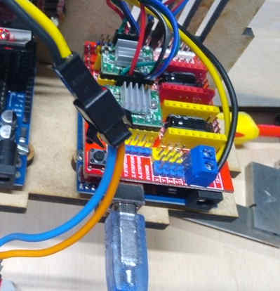

1. Connect motor driver boards to the CNC arduino shield
2. Connect stepper motors with the correct wiring configuration specified in the stepper motors section.
3. Connect X and Y limit switches to -X and -Y ports in the board.
4. Connect power supply yellow and black cables from the ATX power supply.
5. I've included a 12 V Red led to give some visual feedback, it's connected by an independent yellow and black wires from the ATX power supply.


## Fusion 360 work-flow

I've used Autodesk's [Fusion 360](https://www.autodesk.com/products/fusion-360/overview) to understand how the process of making GCODE works with a familiar software. Although there are other options like [LaserWeb](https://laserweb.yurl.ch/)


### Design

The Design process conssit just in drawing a shape using the sketch tools under the Design environment of Fusion 360.

I've simple shapes to test the

### Manufacturing


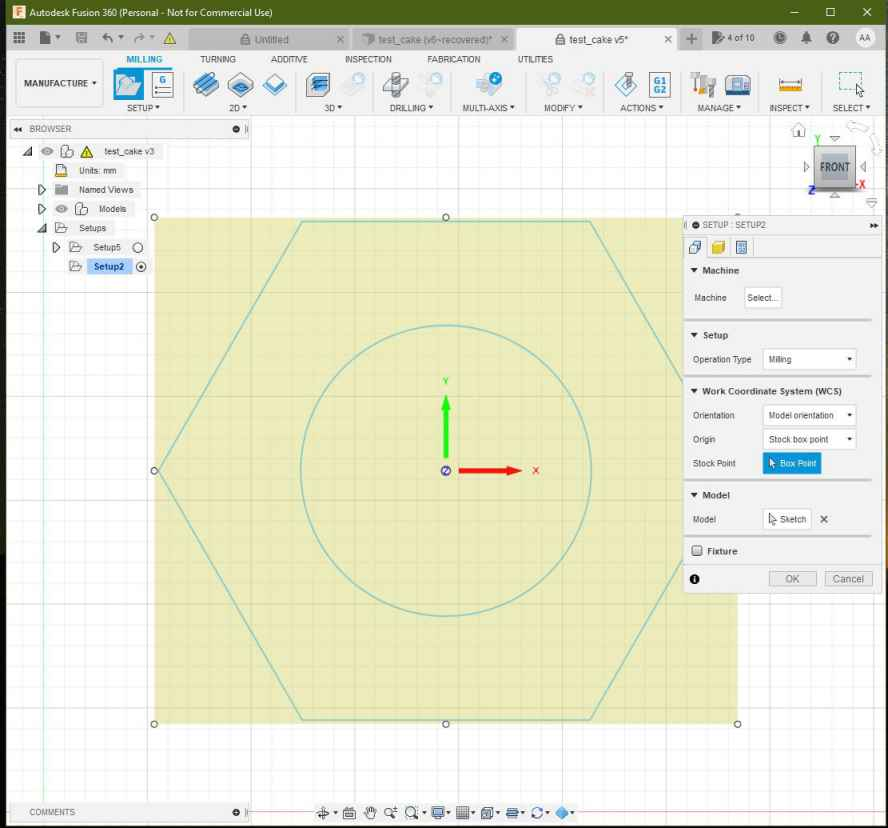

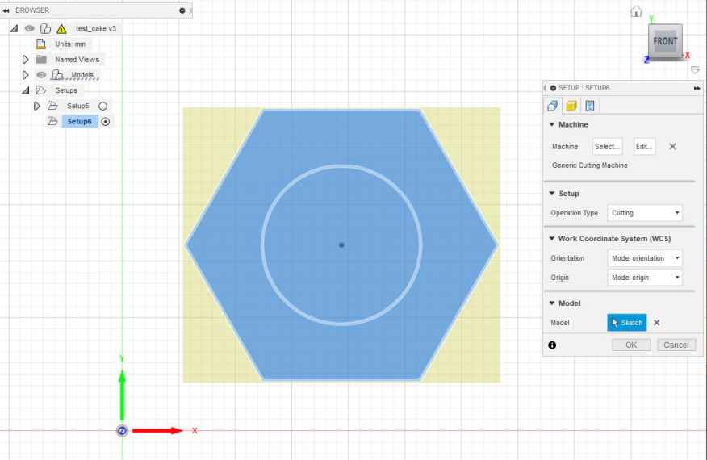
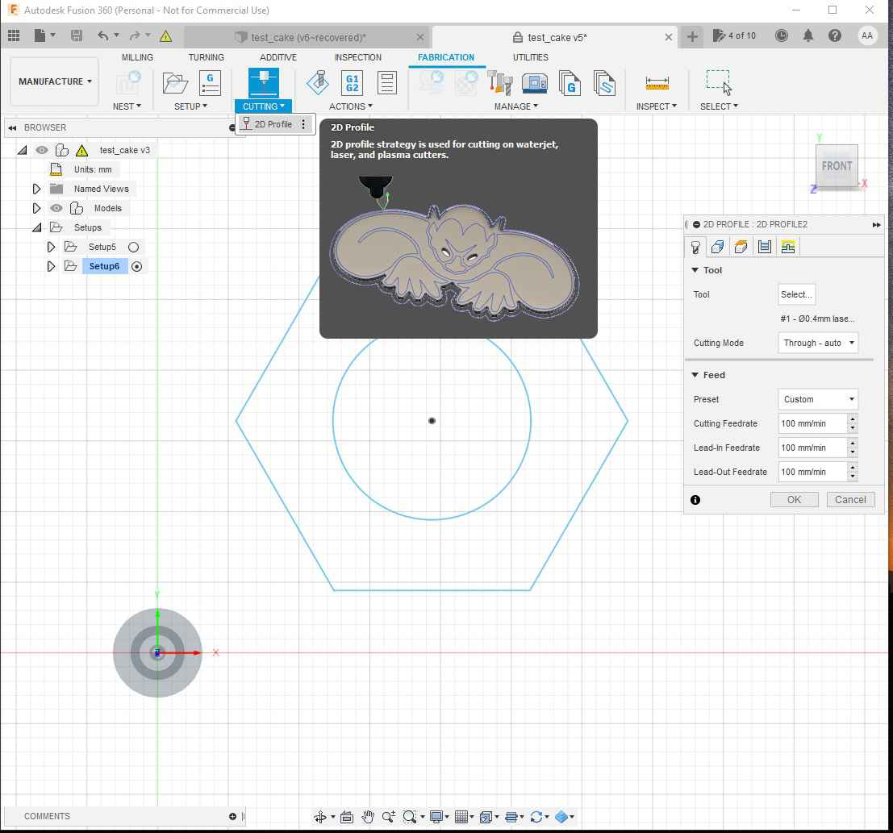
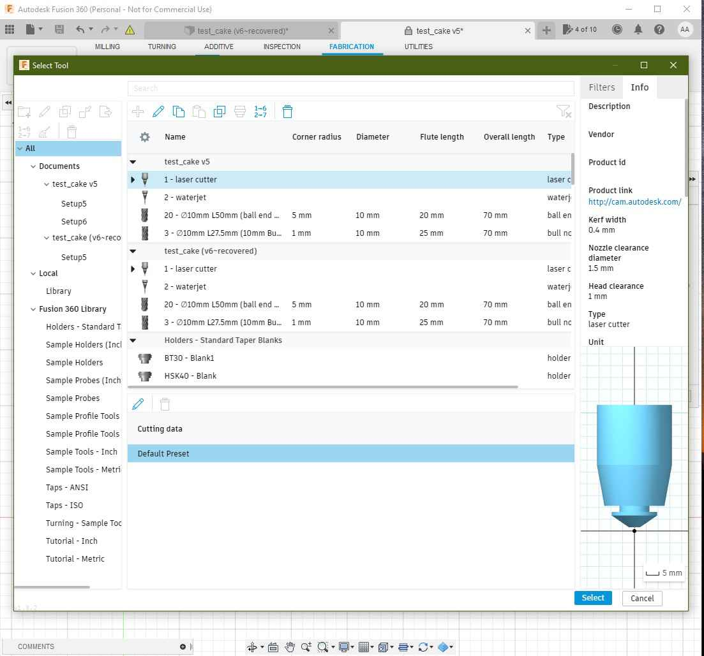


### Simulation

<figure class="video_container">
  <video controls="true" allowfullscreen="true" poster="path/to/poster_image.png" width=100% loop>
    <source src="./images/week10/fusion_08.mp4" type="video/mp4">
  </video>
</figure>

### NC file post-processing


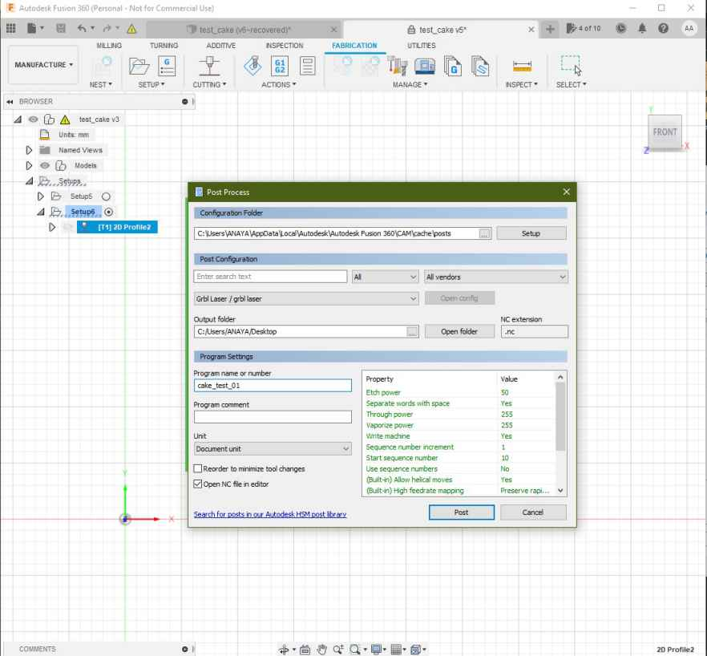
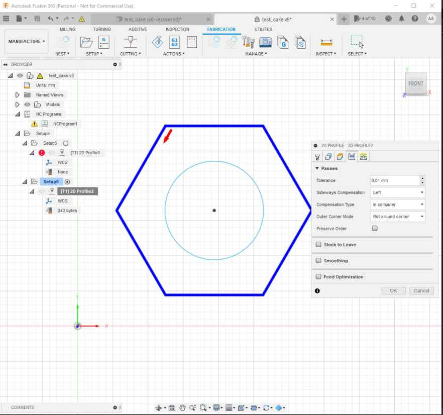


```
%
(cake_test_01)
(Machine)
(  vendor: Autodesk)
(  description: Generic Cutting Machine)
G90 G94
G17
G21

(2D Profile2)
G54
G0 S255 M4
G0 X62.576 Y25.508
G1 X61.576 Y23.776 F1000
G1 X62.447 Y22.268
G1 X131.498
G1 X166.023 Y82.068
G1 X131.498 Y141.868
G1 X62.447
G1 X27.921 Y82.068
G1 X61.576 Y23.776
G1 X63.576
G1 S0
M30
%

```

## Fine tuning

## Universal GCODE sender

### Configurations

## Troubleshooting

## Files
