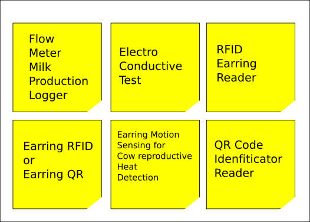

# 11. Input devices


## Introduction

This week I've learn to include a sensor on a pcb design, to programming it and to use the input data.

I've chose to use use this input devices:

1. A3144 Hall effect sensor.
2. RFID ISO11784 for animal Tag FDX reading board
3. Sparkfun's AS726x Spectral sensor VISIBLE

[Group assignment](http://fabacademy.org/2021/labs/agrilab/group/week11/)


## Testing sensors with SAMD11 board

I've used my SAMD11 board from [week07](../../assignments/week07), I've soldered wires to the pins to access the io pins.


## Oscilloscope

While working on the breadboard inspecting the pinouts I've had the idea to make analog write, place a wire as probe in the middle of an Oscilloscope.

I've observed a change in the wave when tested the probe into my chocolate "cocoa" beverage.


<figure class="video_container">
  <video controls="true" allowfullscreen="true" poster="path/to/poster_image.png" width=100% loop>
    <source src="../../images/week11/demo_02.mp4" type="video/mp4">
  </video>
</figure>


The change it's really small but gives me the idea that connecting an amplifier I'll be able to get a better signal processing.

This is of my interest for my final project, for QC of milk based in EC.

After this exercise I've jump to design a new board.


## Board design

### Micro-controller and connector arrangement

I've used the SAMD11 micro-controller, but I've got the understanding that I've like to use more peripherals I should switch to the SAM21 which has more IO and memory.


### Components

Final design:

1. Reset button
2. Input button
3. Output LED
4. 2 Connectors 1x04
5. 1 Connector 1x05
6. Hall effect sensor and voltage divider

Discarded:

1. JTAG connector
2. Micro-USB female connector


**Micro-controller and connector arrangement**


**Clock, LED and input button arrangement**


**Reset button and regulator arrangement**


**USB connector and HALL effect sensor arrangement**


**After my instructors advice I've flipped my schematics following the positive-top, ground-bottom convention.**


### PCB design

I've faced some problems while designing my board.

- I didn't use an 0.4mm clearance
- I've used an USB connector that's not possible to mill with a 0.4mm milling bit.
- I've started the tracing from outside to the inside and later I've problems with the connector's tracks., so I had to start over and design from the inside to the outside.

This was my first approach before noticing this problems.


**Changing to inside to outside strategy**


I've worked also with my schematic in one side to add jumpers and check the sequence of connections properly to avoid shorcuts and misplaced components


I've used inkscape to make and outline with this shape. The funny round thing in the right it's just my approach to make a rotation sensor board with the hall effect sensor. Wo the axis of the rotor is going to pass through the 10 mm hole.


Then I've imported the design into Kicad as SVG.


Then I've realized the problems with the traces for milling... and I had to rework my traces again.


This is the final PCB design


### Milling

For milling I've made three files using mods.

1. Tracks
2. Holes
3. Outline


### Stuffing


### Soldering

1. Micro-controller
2. Jumpers
3. Oscillators
4. Resistors
5. Buttons
6. Connectors
7. Hall effect SMD


### Flashing

For flashing I've used the JTAG programmer I've made in [Week05.](../../assignments/week05)


## Hall effect fluid sensor

For the this I've used the Allegro Micro A1324:


#### Characteristics

- [Datasheet](../../datasheets/A1324-5-6-Datasheet.pdf)
- SMD SOT23 form factor 3 pins.
- Temperature stable -40 to 150 C.
- Low noise
- Analog output
- Supply voltage 4.5 to 5.5 Volts.
- Current 9 mA.
- Frequency 17 KHz.


### Circuit design

I've follow this [Allegro Hall effect sensor applications guide](https://www.allegromicro.com/en/insights-and-innovations/technical-documents/hall-effect-sensor-ic-publications/hall-effect-ic-applications-guide), to design my circuit.

My design uses a voltage divider to scale a Maximum 5 Volts output to 3.3 Volts to prevent burning my SAMD11C14 microcontroller.


#### Schematic


**BOM**

| Component | ID | Form factor |
| -- | -- | -- |
| Allegromicro a1324 Hall effect sensor. | U3 |  SOT23W |
| Resistor 2 K Ohms | R3 | 1206 |
| Resistor 1 K Ohms | R2 | 1206 |
| Resistor 0 Ohms (jumper) | R8 | 1206 |


#### PCB

I've decided to make this shape to later add a mechanical spinning component so it could be used as a liquid flow sensor.


### Code

This code works by reading the analog output signal of the Allegromicro a1324 sensor connected to the pin **PA_04** of my board using the **AnalogRead** function of the Generic Arduino Mattairtech bootloader for SAMD11C14.

First declares the constants "HALL" to 4, "VIN_FACTOR" the factor of conversion to analog to millivolts 3.3/1023.

Declares a long precision variable "value".

Sets Hall pin as input, and starts Serial (USB) communication at 9600 bauds.

Loops analog read of HALL and sends TX Serial with the result of Value times VIN_FACTOR.


```
/*
This program reads the analog output of a HALL effect A-1324 sensor to millivolts

Pinout:

Hall sensor @ PIN 4

Pseudo-code:

First declares the constants "HALL" to 4, "VIN_FACTOR" the factor of conversion to analog to millivolts 3.3/1023.

Declares a long precision variable "value".

Sets Hall pin as input, and starts Serial (USB) communication at 9600 bauds.

Loops analog read of HALL and sends TX Serial with the result of Value times VIN_FACTOR.

Autor: Antonio de Jesus Anaya Hernandez
Agrilab, France.
Fabacademy week 11.

*/

const int HALL = 4;
const long VIN_FACTOR = 3.3 / 1.023 ;
long value = 0;

void setup() {
  pinMode(HALL, INPUT);
  Serial.begin(9600);
}

void loop() {

value = analogRead(HALL);

Serial.println(value * VIN_FACTOR);

}

```

Using Arduino's serial plotter I've found the sensor sends a lot of noise, and I've learn that's normal because of the materials of the board.


This is the signal response when an magnet passes 3 times over the sensor at 3mm distance.  


### About the 100mV step response

The step response signal is very small around 100 mV, the hall sensor needs at least 4.5V so I've think that maybe the voltage divider is not a good idea after all. So in the future I'll like to switch to a regulator, and test again.

The reason of the 100mV step signal is that I'm scalling the output signal assuming a maximun of 5 Volts, so the measured signal is 625 mV after the voltage divider, the arrengement of the voltage divider reduces by 66% the original analog output of the allegromicro a1324 hall effect sensor, so the step response of 100mV could be +34% without it.

I've used the Arduino IDE software to flash my board. The included plotter in the IDE as following.


## RFID Reader:

RFID stands for "radio-frequency identification" and belongs to AIDC technologies, "Automated identification and data capture".

This is an important part of my final project and RFID it's board used in animal identification systems.



There are two standards HDX and FDX.

Here I'm using an FDX standard reader that's used also in Mexico for cattle identification.

The RFID module that I'm using is the **134.2K Animal Tag FDX-B ISO11784 Reader Module**. I've find this module in [Agrilab's Electrolab inventory](agrilab.unilasalle.fr/).


Every cow in France gets an RFID earring by default but in Mexico its deployment its still ongoing due to multiple factors like supply chain and distribution.


#### Characteristics of the RFID module:

- Serial communication at 9600 bauds.
- LSB Hexadecimal format ASCII.
- 5 to 9 Volts
- FDX RFID standard complaining with the [ISO11784 standard](https://www.wikiwand.com/en/ISO_11784_and_ISO_11785)

This module uses Serial communication, the **TX** pin outputs at 9600 bauds, the reading distance it's approximately 25 to 30 centimeters at 5 Volts and 10 mA. You can appreciate the distance of detection in the demo video below.


#### Interfacing with the module

To interface with this board I've used the **Serial1** interface of my SAMD11C14 based board. Using the [Mattairtech Generic SAMD11C14 bootloader](https://github.com/mattairtech/ArduinoCore-samd/tree/master/variants/Generic_D11C14A), you have the **RX1** pin on the pin **PA_31** pin.


To read Serial communications we need the **TX** pin of the module connected to the **RX1** pin of the board, GND to ground and VCC to the 5 Volts pin of my SAMD11C14 board, the 5 Volts come from the USB connector. You can appreciate the wiring I've used with a bread board in the demo video below.


#### Code

This is the minimal code you need to read the module output, later on I'll need to decode and detect valid RFID earrings.

This code uses two serial communication interfaces, **Serial** which its equal to **USBSerial** and **Serial1** which is located in Pins 30 and 31 of the SAMD11C14 bootloader from Mattairtech.

I the **Setup** the code starts Serial communication on **Serial** and **Serial1** interfaces, both at 9600 bauds.

In **Loop** the board makes a **char** variable and assigns the value of the **Serial1.read()** output. *.read()* means that my board will open and read Serial communication in *Serial1* interface.

Then the **Loop** ends by printing the result using the **Serial (USBSerial)** communication. You can appreciate the output [here.](#serial-output)


```
/*
This program reads the TX output of the RFID ISO11784 for animal Tag FDX reading board, using the Serial1 interface of the SAMD11 micro-controller.

TX to RX on pin 31 Serial1


Autor: Antonio de Jesus Anaya Hernandez
Agrilab, France.
Fabacademy week 11.
*/

void setup() {
  Serial.begin(9600);
  Serial1.begin(9600);
}

void loop() {
  char id = Serial1.read();
  Serial.println(id);
  delay(100);
}
```


### Flashing

<script id="asciicast-9uphJuuU7P0OiTTZe8sKLbwrr" src="https://asciinema.org/a/9uphJuuU7P0OiTTZe8sKLbwrr.js" async></script>


### Serial output

<script id="asciicast-wSqG449cNzomrx4QNRKXbDJVJ" src="https://asciinema.org/a/wSqG449cNzomrx4QNRKXbDJVJ.js" async></script>


### Video

<figure class="video_container">
  <video controls="true" allowfullscreen="true" poster="path/to/poster_image.png" width=100% loop>
    <source src="../../images/week11/demo_01.mp4" type="video/mp4">
  </video>
</figure>


## Sparkfun spectral sensor

I've been stuck on this due to the library size. I've above 7000 bytes of the flash memory.

So I've been looking to the [AS7262 datasheet](https://cdn.sparkfun.com/assets/parts/1/2/2/4/9/AS7262_Datasheet.pdf#G1006885)


So I've learn that its possible to use i2c protocol by writing bytes to the sensor or UART by sending commands.

To read the device temperature:
- i2c: 0x06 bit 7:0
- UART: ATTEMP

Things I've to do to enable UART communication:

- Remove the solder from the Jp1 jumper
- Add a older to the jp2 jumper.


## Learning outcomes

This week assignment was very didactic and I've learn about step response by experimenting with the liquids at the beginning.

It's was my first time designing and manufacturing a sensor, so it was very satisfactory to me to see the sensor working using the Oscilloscope, but also I've learned about electronic noise.

I've learned to mill on this order:

- Traces
- Holes
- Outline

Then I've learned the basics about interfacing with Serial communications.

## Files

Kicad:

- [Compressed ZIP](../../files/week11/kicad/week11_kicad.zip)

Milling for Roland SRM-20:

- [Traces](../../files/week11/milling/week11_traces.rml)
- [Holes](../../files/week11/milling/week11_holes.rml)
- [Outline](../../files/week11/milling/week11_outline.rml)

Inkscape:

- [Outline shape SVG](../../files/week11/inkscape/pcb_outline.svg)
- [Outline shape DXF](../../files/week11/inkscape/pcb_outline.dxf)

Arduino:

- [Hall effect](../../files/week11/hall_effect_millivolts/hall_effect_millivolts.ino)
- [RFID](../../files/week11/rfid_134K_module/rfid_134K_module.ino)
