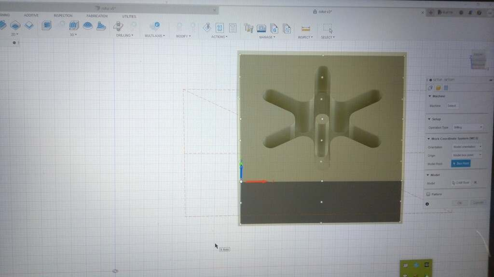
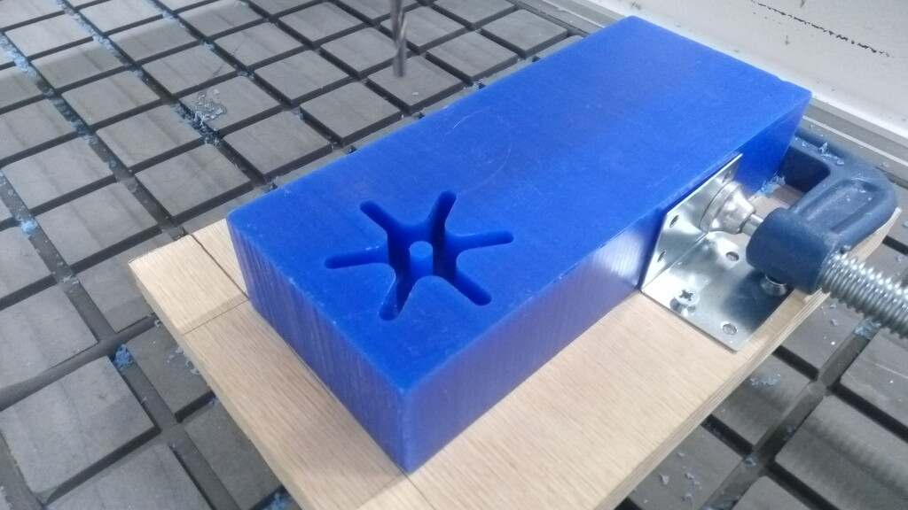
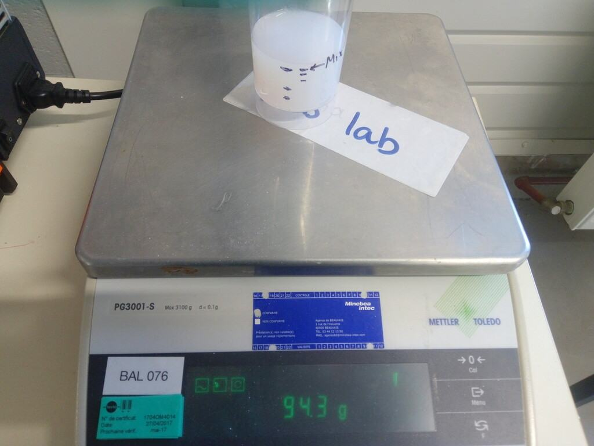
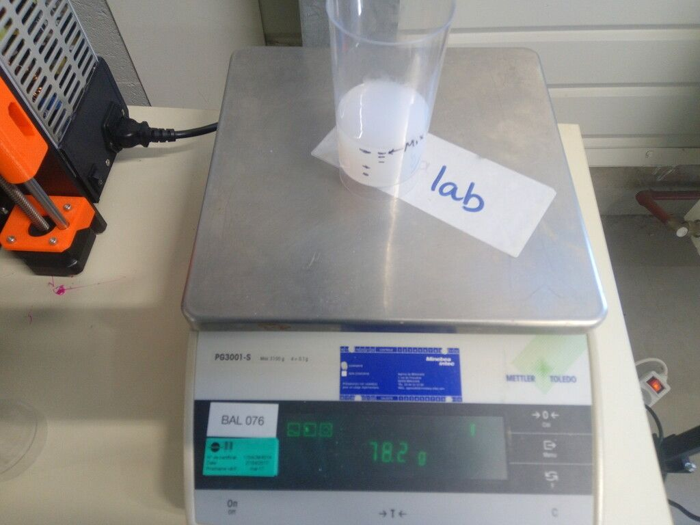
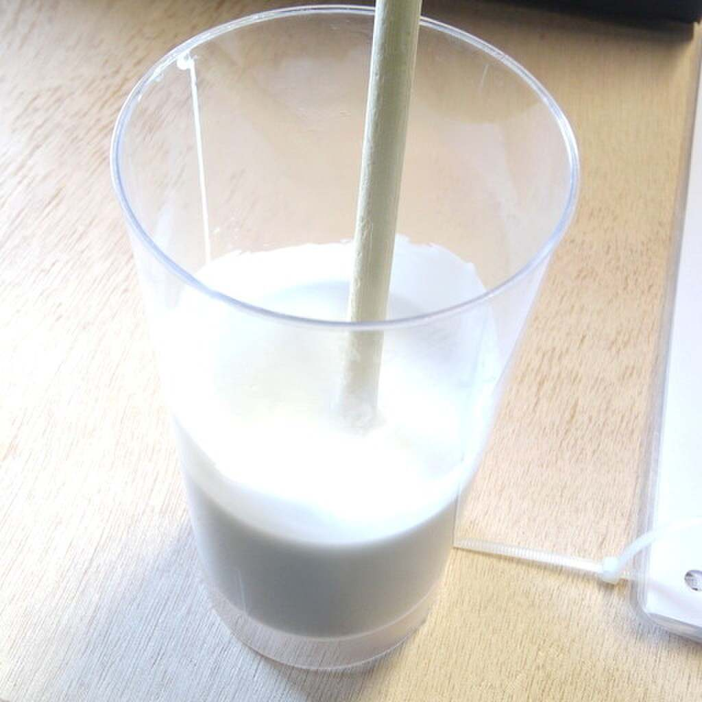
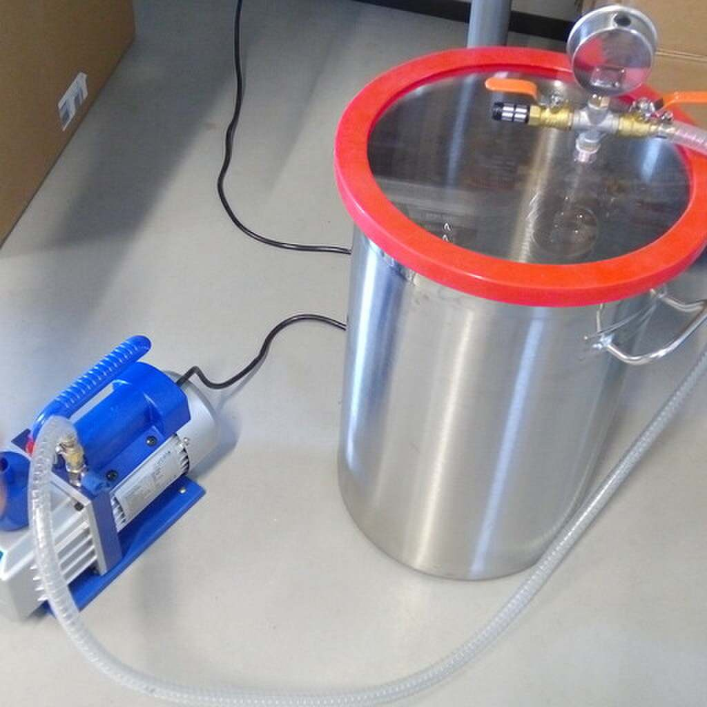
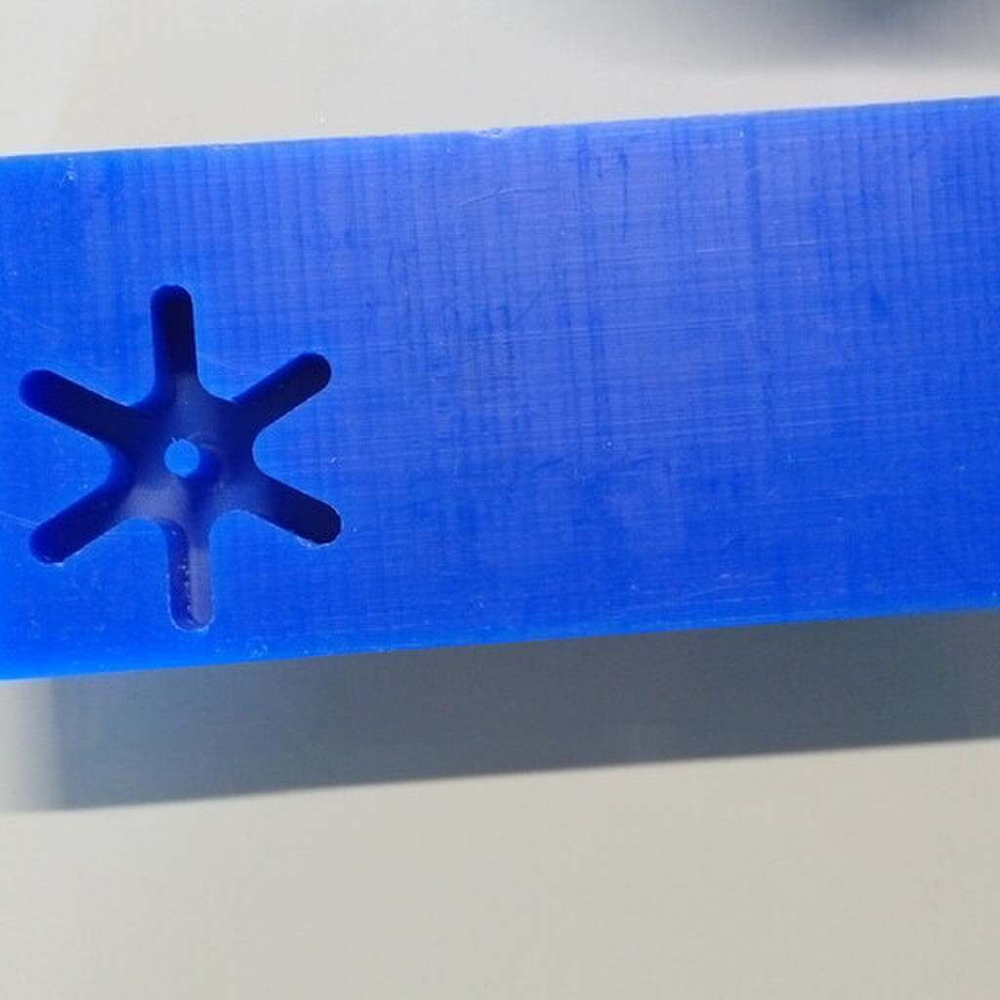

# 12. Molding and casting

## Introduction

For this week we need to:

1. Mill a mold using our available [CNC machine](http://fabacademy.org/2021/labs/agrilab/group/week_8_cnc/).
2. Cast an object using the milled mold.
3. Test materials for the [group assignment](http://fabacademy.org/2021/labs/agrilab/group/week12/)

Things I've learn so far:

- 3D modeling for molding.
- Process 3D CNC operations.
- Machining Wax bricks for molds.
- Calculate volume of material needed.
- Mix food-safe silicone.
- Cast silicon.
- Use the vacuum chamber.

## 3D design on Fusion

Model based in this two pieces found in Agrilab:

**Work in process**

## GCODE

## Preparation prior to Milling process

The milling process requires the Wax brick to be fixed to the [CNC bed](http://fabacademy.org/2021/labs/agrilab/group/week_8_cnc/). But the WAX brick dimensions doesn't coincide with the pattern in the bed that holds pieces using the vacuum pump.

So, we had the task to design a holding tool, for that I've measure the CNC bed.

## Holder design

### Draw

**Inkscape captures missing**

### Laser

**FTP captures missing**

### Mold base

In the milling day I've used Theo's holder for the 75 x 176 x 37 mm Wax brick

## Milling

<figure class="video_container">
	<video controls="true" allowfullscreen="true">
		<source src="../../images/week12/cnc_3d.mp4" type="video/mp4">
	</video>
</figure>

## Group assignment

### Supplies

## Silicone preparation

### Volume

### Mixing

<figure class="video_container">
	<video controls="true" allowfullscreen="true">
		<source src="../../images/week12/mixing_00.mp4" type="video/mp4">
	</video>
</figure>

### Vacuum chamber

## Casting

### Mold preparation

### Pouring

<figure class="video_container">
	<video controls="true" allowfullscreen="true">
		<source src="../../images/week12/pouring_00.mp4" type="video/mp4">
	</video>
</figure>

<figure class="video_container">
	<video controls="true" allowfullscreen="true">
		<source src="../../images/week12/pouring_01.mp4" type="video/mp4">
	</video>
</figure>

## Demolding

## Extra
### Casting bismuth

<figure class="video_container">
	<video controls="true" allowfullscreen="true">
		<source src="../../images/week12/casting_00.mp4" type="video/mp4">
	</video>
</figure>

## Conclusion

### Future projects

##Videos

<!-- figure class="video_container">
	<video controls="true" allowfullscreen="true">
		<source src="../../images/week12/casting_01.mp4" type="video/mp4">
	</video>
</figure-->

## Files
