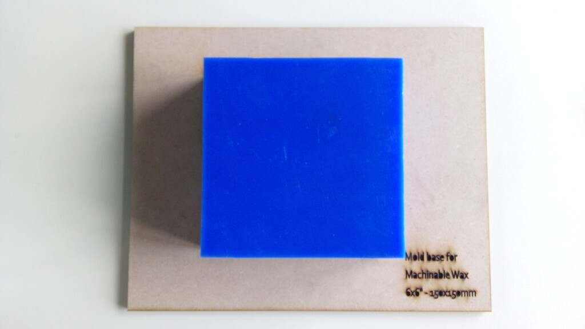
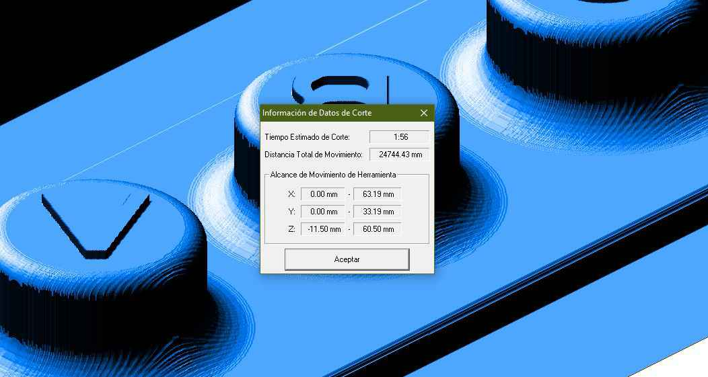

# 12. Molding and casting


## Introduction

For this week we need to:

1. Mill a mold using our available [CNC machine](http://fabacademy.org/2021/labs/agrilab/group/week_8_cnc/).
2. Cast an object using the milled mold.
3. Test materials for the [group assignment](http://fabacademy.org/2021/labs/agrilab/group/week12/)

Things I've learn so far:

- 3D modeling for molding.
- Process 3D CNC operations.
- Machining Wax bricks for molds.
- Calculate volume of material needed.
- Mix food-safe silicone.
- Cast silicon.
- Use the vacuum chamber.

Project:

- This is the rotor for my milk flow sensor.


## 3D design on Fusion


- Model inspired on this:


- And this 6 mm diameter x 50 mm long shaft I've found and cut in Agrilab.


### Design

- Sketch.
- Diameter: 50mm
- Shaft hole diameter: 5mm
- Blades width: 6mm
- Round corners 3mm


- Cross section of the model extruded.
- I've made this by using revolve on a profile and then applying difference.


This is a video of my entire CAD design process:

<figure class="video_container">
	<video controls="true" allowfullscreen="true">
		<source src="../../images/week12/fusion_01.mp4" type="video/mp4">
	</video>
</figure>


### Manufacturing

- I've placed thi origin in the corner shown in the capture.


- Rough cut.


- Smoother cut.


Tool configuration:

- Diameter: 3 mm
- Shaft diameter: 3 mm
- Overall length: 50 mm
- length bellow holder: 25 mm
- Shoulder length: 16 mm
- Flute length: 15 mm
- Tool number 3. (Just for current agrilab CNC machine tool configuration)


<figure class="video_container">
	<video controls="true" allowfullscreen="true">
		<source src="../../images/week12/mold_01.mp4" type="video/mp4">
	</video>
</figure>


### GCODE

- Delete line with G43 code. This adds 16 mm compensation to Z axis.
```
G43 Z16. H3
```


## Preparation prior to Milling process

The milling process requires the Wax brick to be fixed to the [CNC bed](http://fabacademy.org/2021/labs/agrilab/group/week_8_cnc/). But the WAX brick dimensions do not coincide with the pattern in the bed that holds pieces using the vacuum pump.

So, we had the task to design a holding tool, for that I've measure the CNC bed.

- I had the idea to make also taps for the vacuum holes of the CNC machine.
- The tap dimensions are 50 mm square and 4 mm radius in every corner.


- The lenght from rail to rail to use the holder pieces is 380 mm.


- The depth of the cuts in the CNC bed is 10 mm.


- The squares of the CNC bed pattern are 40 mm with a cut of 10 mm.


- These are the holder that are used to hold pieces in using the rails in the CNC bed.


## Holder design

I've chose to design a holder device for the machinable wax bricks, using 6 mm MDF plates and the laser cutter.


### Draw

**Inkscape captures missing**


### Laser

**FTP captures missing**


### Mold base

- This is the resulting piece, it holds steady in the CNC bed without the need of the vacuum pump.


- You can see here the small flexes that help the bricks to fit in place. All the bricks have slight 1-2mm differences in their dimensions.  


- This is the brick placed in the holder.




- Since I didn't have time to finish my entire **design for milling**. In the milling day I've used [Theo's](http://fabacademy.org/2021/labs/agrilab/students/theo-gautier/about/) holder for the 75 x 176 x 37 mm Wax brick. So I'm saving my brick and holder for later.


## Milling

Process:

- 2D pocket cut (Rough cut)
- 3D parallel cut (Smoothing cut)

Mistakes during the process:

- At first my process didn't include a 3D machining process.
- Generated the GCODE with the tool Number 1.

Solutions:

- Change the model adding angled spins to my design.
- Generate the GCODE with tool number 3 which in our CNC was the 3 mm Flat-end milling bit.


### Pocket

- This is the rough process, the machine just cuts the silhouette as a 2D but it lefts scales and steps the later will be smoothed.


### Parallel

- This is the smoothing process, the machine moves in along side the Z and X axis during this process.


- The resulting piece has a smoother surface.


<figure class="video_container">
	<video controls="true" allowfullscreen="true">
		<source src="../../images/week12/cnc_3d.mp4" type="video/mp4">
	</video>
</figure>


## Group assignment

For the group assignment I had the idea to make a sample table and cast some coins.
For that I've used:

- 2 pieces of 6 mm MDF plate.
- Plastic sheet.
- Laser cutter.


- This is the sample table.


- Putting altogether the parts.


- I've also bring paper towels and globes for my team mates.


- I've cast a coin using Food-safe silicone, as [Elina](http://fabacademy.org/2021/labs/agrilab/students/elina-nguyen-cadoret/about/), but with the difference that I've used the vacuum pump to extract air bubbles from the mix.


- This is the result, the very small features were replicated perfectly in the mold.


## Food-safe Silicone

- This is the **Food-safe silicone RTV polyaddition 3428** made by [Esprit Composite](https://espritcomposite.com/).

- It's a two components silicone A 100 and B 10 by mass.

| Esprit composite | Food-safe Silicone |
| -- | -- |
| Datasheet | [Link](../../files/week12/safety_esprit_composite_3428.pdf) |
| Safety sheet | [Link](../../files/week12/technical_esprit_composite_3428.pdf) |
| Pot life | 90 mins @ 23 C |
| Demold time | 16 hours @ 23 C |
| Color | White |
| Mixing ratio | A:100g, B:10g MASS |
| Indentation hardness | 28 Shore A |
| Tensile strength | 7.5 MPa |
| Elongation | 600% |
| Tear strength | 20 KN/m |
| Viscosity | 25000 mPa |
| Shrinkage | 0.1% |
| Safety precautions | Not hazardous |
| Solubility | None |

I've found this information on English [Stephane Muller's Fab-Academy page](https://fabacademy.org/2019/labs/sorbonne/students/stephane-muller/week10.html)

And in French in Esprit Composites web site.


- I've used a disposable cup and a chopstick to mix the components.


- This the vacuum chamber and pump.


I've found two food-safe demolding agents:

- Petroleum jelly and,
- Sunflower seed oil.


## Silicone preparation

There are two important steps before preparing the mix.

- To know the volume need so by that avoid any excessive amount of silicone.
- To use a demolding agent and so help the silicone come out easily.

### Volume

I've used water and the disposable plastic cup to estimate the **volume needed** of the mix. It's important to remark that I still had to measure the mass of the volume to know the amount of the component B.

- I've prepared also Theo's Silicone for his food-safe silicone assignment. And this is the volume needed for him.

- The top mark was the initial water level.
- The following mark is the current water level.


- The bottom mark is the water level after filling my mold.


- After over-estimating the residuals I've marked the level of **MIX** in the cup.


### Mass

- I've weighted the empty cup and then used the **Zero** function in the balance. So the next grams measured will be only the weight of the components.


The component A and B weighted **97 g** together 4 mm above to the level of the volume mark.

- 88 g Component A
- 9 g Component B


### Mixing

I've used the chopstick to mix the components following the instructions of [Professor Neil Gershenfeld](https://www.wikiwand.com/en/Neil_Gershenfeld) to avoid filling the mix with air bubbles.


- This a sample of the movements I've used to mix the components.

<figure class="video_container">
	<video controls="true" allowfullscreen="true">
		<source src="../../images/week12/mixing_00.mp4" type="video/mp4">
	</video>
</figure>


### Vacuum chamber

I've used the vacuum chamber to extract the air bubbles of the silicone Mix.

Parameters:

- Pressure: -1.5 MPa.
- Time: 10 mins.


- After releasing the vacuum.


## Casting

### Demolding agent

- I've chose Sunflower seed oil as demolding agent, following the instructions of the RTV3428 Silicone, it states that any agent should be food-safe as the silicone.

- Coating the borders of the mold with the Sunflower oil using a coffee filter.


- Coating the inside of the mold pouring oil into the cavity.


- After realizing the excessive coat of oil I've placed the mold backwards to help ease the excessive oil out of the cavity.


### Pouring

- Theo's mold.


- My initial mold.


- A big mistake.
- I've chose to put some PLA wires I found out nearby with the idea to help me in the demolding
process. Same for the Chopsticks.


- I didn't have the chance to record myself pouring the mix into the mold, but here I show out the technique I've used.

- The idea is to make a small stream pouring into the mold to break any bubble in the mix.

<figure class="video_container">
	<video controls="true" allowfullscreen="true">
		<source src="../../images/week12/pouring_00.mp4" type="video/mp4">
	</video>
</figure>

- I've show to Theo the same technique.

<figure class="video_container">
	<video controls="true" allowfullscreen="true">
		<source src="../../images/week12/pouring_01.mp4" type="video/mp4">
	</video>
</figure>


## Demolding

Remarks:

- The oil worked very good.
- Next time I'll not use any weird attachment, like I did with the chopsticks.

- I've pour the silicone on Monday 11 am and cast off on Tuesday 11 am.


- The mold after removing the silicone part.


- The casted part.


- I've used a knife to cut the excess of material.


- After clearing the excess I've inserted the 6 mm shaft as planned. The hole in the silicone is 5 mm so it is tight and stable.


## Extra
### Casting bismuth

I've helped [Theo's](http://fabacademy.org/2021/labs/agrilab/students/theo-gautier/about/) with his test for soft metal casting.

- This is the setup of the pizza oven and a improvised table I've found in AgriLab.


- The oven with the special container for molten metals.


- We used a K-type thermo-pair attached to the container using Kapton tape.


- Theo coated the mold with a thick layer of baby powder.


- This is Bismuth and his characteristic light reflective crystal structure.


- This device is a XTC-Profiler a thermo-pair reader that we use in the Electro-Lab.


- This was Theo's first attempt to cast Bismuth. The Bismuth got cold quickly, since the mold was 4 meters away from the oven. So the Bismuth didn't flow on the mold.


- This is a video of a second attempt performed by our instructor [Luc](https://fabacademy.org/2019/labs/sorbonne/students/hanneuse-luc/about/)

<figure class="video_container">
	<video controls="true" allowfullscreen="true">
		<source src="../../images/week12/casting_00.mp4" type="video/mp4">
	</video>
</figure>

- This is Theo's third and successful attempt to cast the Bismuth into the mold.


- Final cast piece.


| Data | casting Bismuth |
| -- | -- |
| Oven max Temp | 290 C |
| Time of practice | 46 mins |
| Time to reach 280 C | 26 mins |
| Attempts until success | 3 |


## Conclusion

- Silicone RTV3428 it's really easy to use.
- The viscosity was perfect to replicate all the features of the design.
- I'd like to use a cap for the top of my design, or a two parts mold.
- I'd keep using this material for my next sensor parts.


Design changes

- Design a mold that covers or embeds the shaft to avoid direct contact with the milk and the metal.


### Future projects

I've the idea to cast the entire body of my flow sensor, but since it's the first time for me using Food-safe materials I'll wait until finish my design properly.


## Rework for global review

I've started to prepare a molded version of the buttons I've designed for my final project.

My time will be managed like this:

| Task | Date |
| -- | -- |
| Milling mold base | 13/07 |
| Pouring silicone on wax mold | 13/07 |
| Casting on silicone mold | 14/07 |

| Original design | File |
| -- | -- |
| 3D Model SOLIDWORKS | [3D model](../../files/week12/buttons.sldprt) |  
| Roland Modela 4 project file | [project for toolpath](../../files/week12/buttons.mpj) |  

<iframe id="vs_iframe" src="https://www.viewstl.com/?embedded&url=http%3A%2F%2Ffabacademy.org%2F2021%2Flabs%2Fagrilab%2Fstudents%2Fantonio-anaya%2Ffiles%2Fweek12%2Fbuttons.STL" style="border:0;margin:0;width:100%;height:100%;"></iframe>

| Requirement | File |
| -- | -- |
| 3D Model STL | [stl model](../../files/week12/buttons.STL) |
| Milling path Rough | [Made with Roland Modela 4](../../files/week12/r_cut.prn) |
| Milling path finishing | [Made with Roland Modela 4](../../files/week12/f_cut.prn) |


### Software Install

For this rework I've chose to use Solidworks for modeling, and [Roland MODELA v4](https://www.rolanddga.com/es-la/soporte/products/software/modela-player-4) to generate the toolpaths for the machining. I'm using a version of the buttons I've designed for my final project.

To install Roland Modela I've used the links on the [documentation](http://yuichitamiya.fabcloud.io/fabacademy2020/projects/roland_modela_player4/) of [Yuichi Tamiya my global instructor.](http://archive.fabacademy.org/fabacademy2017/fablabkamakura/students/44/)

Software to install:

- Modela player 4.
- Virtual Modela.

[Download Links on Google Drive](https://drive.google.com/drive/folders/1vT6Qu2YWHNU_4Q_TgWwoMA3wRYo0V9G0?usp=sharing)


### Configuration

Once Roland Modela 4 its installed we can start using it, since this is a windows program I've to switch to Windows OS to use it.

1. Add Roland SRM-20 as the main machine.
		- 
2. Add a new tool: I'll add the 1mm flat-head milling bit we use for cutting PCBs.
		- 
3. Import the STL model.
		- 
4. Add process:
		- )
		- )
		- )
		- )
		- )
5. Rought cut:
		- 
		- 
		- 
6. Finishing:
		- 
		- 
		- 
7. Simulation with virtual Modela software:
		- 
		- 
		- 


## Files

<a href="../../files/week12/1_rotor_00.nc"> NC Rotor Rough Pocket process file. </a>

<a href="../../files/week12/2_rotor_01.nc"> NC Rotor Smoother Parallel process file. </a>

<a href="../../files/week12/inkscape_mold_base.svg"> Inkscape laser mold base file for 6x6 inches Wax brick </a>

<a href="../../files/week12/rotor_01.f3d"> Fusion 360 Rotor design and manufacturing file </a>
