# 13. Output Devices

<figure class="video_container">
	<video controls="true" allowfullscreen="true">
		<source src="../../images/week13/demo_01.mp4" type="video/mp4">
	</video>
</figure>


## Introduction

This week I've started to use output devices that are part of my device for the final project.

For this week I've used my board from [week11, input devices based on the ATSAMD11 micro-controller.](../../assignments/week09)


- A **Speaker** to make a sound after a RFID successful read.
- A **LCD display** to show information relative to the milk production.

Then to make this possible I've listed here different components and concepts that were useful for me during this week work.

Possible thing to use for this week work:

- Relay
- Speaker

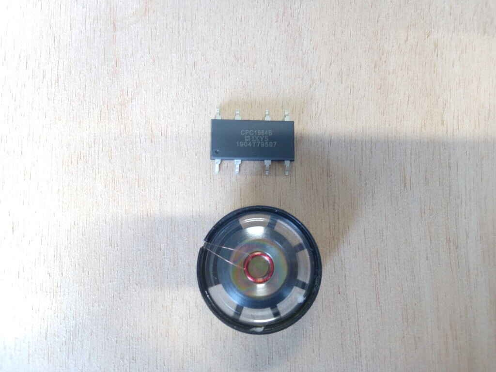

- LCD i2c display
- TFT display
- OLED i2c display

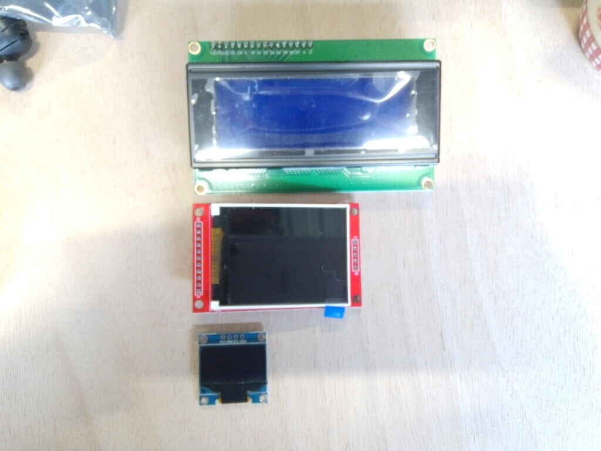

Also I've contributed to this weeks [Group assignment](http://fabacademy.org/2021/labs/agrilab/group/week13/) by checking the power consumption of a display and a speaker.


### Concepts I've explored during this week

#### Tone library for arduino

<figure class="video_container">
	<video controls="true" allowfullscreen="true">
		<source src="../../images/week13/sound_02.mp4" type="video/mp4">
	</video>
</figure>

```
/*
  Arduino Mario Bros Tunes
  With Piezo Buzzer and PWM

  Connect the positive side of the Buzzer to pin 3,
  then the negative side to a 1k ohm resistor. Connect
  the other side of the 1 k ohm resistor to
  ground(GND) pin on the Arduino.

  by: Dipto Pratyaksa
  last updated: 31/3/13
*/

/*************************************************
 * Public Constants
 *************************************************/

#define NOTE_B0  31
#define NOTE_C1  33
#define NOTE_CS1 35
#define NOTE_D1  37
#define NOTE_DS1 39
#define NOTE_E1  41
#define NOTE_F1  44
#define NOTE_FS1 46
#define NOTE_G1  49
#define NOTE_GS1 52
#define NOTE_A1  55
#define NOTE_AS1 58
#define NOTE_B1  62
#define NOTE_C2  65
#define NOTE_CS2 69
#define NOTE_D2  73
#define NOTE_DS2 78
#define NOTE_E2  82
#define NOTE_F2  87
#define NOTE_FS2 93
#define NOTE_G2  98
#define NOTE_GS2 104
#define NOTE_A2  110
#define NOTE_AS2 117
#define NOTE_B2  123
#define NOTE_C3  131
#define NOTE_CS3 139
#define NOTE_D3  147
#define NOTE_DS3 156
#define NOTE_E3  165
#define NOTE_F3  175
#define NOTE_FS3 185
#define NOTE_G3  196
#define NOTE_GS3 208
#define NOTE_A3  220
#define NOTE_AS3 233
#define NOTE_B3  247
#define NOTE_C4  262
#define NOTE_CS4 277
#define NOTE_D4  294
#define NOTE_DS4 311
#define NOTE_E4  330
#define NOTE_F4  349
#define NOTE_FS4 370
#define NOTE_G4  392
#define NOTE_GS4 415
#define NOTE_A4  440
#define NOTE_AS4 466
#define NOTE_B4  494
#define NOTE_C5  523
#define NOTE_CS5 554
#define NOTE_D5  587
#define NOTE_DS5 622
#define NOTE_E5  659
#define NOTE_F5  698
#define NOTE_FS5 740
#define NOTE_G5  784
#define NOTE_GS5 831
#define NOTE_A5  880
#define NOTE_AS5 932
#define NOTE_B5  988
#define NOTE_C6  1047
#define NOTE_CS6 1109
#define NOTE_D6  1175
#define NOTE_DS6 1245
#define NOTE_E6  1319
#define NOTE_F6  1397
#define NOTE_FS6 1480
#define NOTE_G6  1568
#define NOTE_GS6 1661
#define NOTE_A6  1760
#define NOTE_AS6 1865
#define NOTE_B6  1976
#define NOTE_C7  2093
#define NOTE_CS7 2217
#define NOTE_D7  2349
#define NOTE_DS7 2489
#define NOTE_E7  2637
#define NOTE_F7  2794
#define NOTE_FS7 2960
#define NOTE_G7  3136
#define NOTE_GS7 3322
#define NOTE_A7  3520
#define NOTE_AS7 3729
#define NOTE_B7  3951
#define NOTE_C8  4186
#define NOTE_CS8 4435
#define NOTE_D8  4699
#define NOTE_DS8 4978

#define melodyPin 3
//Mario main theme melody
int melody[] = {
  NOTE_E7, NOTE_E7, 0, NOTE_E7,
  0, NOTE_C7, NOTE_E7, 0,
  NOTE_G7, 0, 0,  0,
  NOTE_G6, 0, 0, 0,

  NOTE_C7, 0, 0, NOTE_G6,
  0, 0, NOTE_E6, 0,
  0, NOTE_A6, 0, NOTE_B6,
  0, NOTE_AS6, NOTE_A6, 0,

  NOTE_G6, NOTE_E7, NOTE_G7,
  NOTE_A7, 0, NOTE_F7, NOTE_G7,
  0, NOTE_E7, 0, NOTE_C7,
  NOTE_D7, NOTE_B6, 0, 0,

  NOTE_C7, 0, 0, NOTE_G6,
  0, 0, NOTE_E6, 0,
  0, NOTE_A6, 0, NOTE_B6,
  0, NOTE_AS6, NOTE_A6, 0,

  NOTE_G6, NOTE_E7, NOTE_G7,
  NOTE_A7, 0, NOTE_F7, NOTE_G7,
  0, NOTE_E7, 0, NOTE_C7,
  NOTE_D7, NOTE_B6, 0, 0
};
//Mario main them tempo
int tempo[] = {
  12, 12, 12, 12,
  12, 12, 12, 12,
  12, 12, 12, 12,
  12, 12, 12, 12,

  12, 12, 12, 12,
  12, 12, 12, 12,
  12, 12, 12, 12,
  12, 12, 12, 12,

  9, 9, 9,
  12, 12, 12, 12,
  12, 12, 12, 12,
  12, 12, 12, 12,

  12, 12, 12, 12,
  12, 12, 12, 12,
  12, 12, 12, 12,
  12, 12, 12, 12,

  9, 9, 9,
  12, 12, 12, 12,
  12, 12, 12, 12,
  12, 12, 12, 12,
};
//Underworld melody
int underworld_melody[] = {
  NOTE_C4, NOTE_C5, NOTE_A3, NOTE_A4,
  NOTE_AS3, NOTE_AS4, 0,
  0,
  NOTE_C4, NOTE_C5, NOTE_A3, NOTE_A4,
  NOTE_AS3, NOTE_AS4, 0,
  0,
  NOTE_F3, NOTE_F4, NOTE_D3, NOTE_D4,
  NOTE_DS3, NOTE_DS4, 0,
  0,
  NOTE_F3, NOTE_F4, NOTE_D3, NOTE_D4,
  NOTE_DS3, NOTE_DS4, 0,
  0, NOTE_DS4, NOTE_CS4, NOTE_D4,
  NOTE_CS4, NOTE_DS4,
  NOTE_DS4, NOTE_GS3,
  NOTE_G3, NOTE_CS4,
  NOTE_C4, NOTE_FS4, NOTE_F4, NOTE_E3, NOTE_AS4, NOTE_A4,
  NOTE_GS4, NOTE_DS4, NOTE_B3,
  NOTE_AS3, NOTE_A3, NOTE_GS3,
  0, 0, 0
};
//Underwolrd tempo
int underworld_tempo[] = {
  12, 12, 12, 12,
  12, 12, 6,
  3,
  12, 12, 12, 12,
  12, 12, 6,
  3,
  12, 12, 12, 12,
  12, 12, 6,
  3,
  12, 12, 12, 12,
  12, 12, 6,
  6, 18, 18, 18,
  6, 6,
  6, 6,
  6, 6,
  18, 18, 18, 18, 18, 18,
  10, 10, 10,
  10, 10, 10,
  3, 3, 3
};

void setup(void)
{
  pinMode(3, OUTPUT);//buzzer
  pinMode(13, OUTPUT);//led indicator when singing a note

}
void loop()
{
  //sing the tunes
  sing(1);
  sing(1);
  sing(2);
}
int song = 0;

void sing(int s) {
  // iterate over the notes of the melody:
  song = s;
  if (song == 2) {
    Serial.println(" 'Underworld Theme'");
    int size = sizeof(underworld_melody) / sizeof(int);
    for (int thisNote = 0; thisNote < size; thisNote++) {

      // to calculate the note duration, take one second
      // divided by the note type.
      //e.g. quarter note = 1000 / 4, eighth note = 1000/8, etc.
      int noteDuration = 1000 / underworld_tempo[thisNote];

      buzz(melodyPin, underworld_melody[thisNote], noteDuration);

      // to distinguish the notes, set a minimum time between them.
      // the note's duration + 30% seems to work well:
      int pauseBetweenNotes = noteDuration * 1.30;
      delay(pauseBetweenNotes);

      // stop the tone playing:
      buzz(melodyPin, 0, noteDuration);

    }

  } else {

    Serial.println(" 'Mario Theme'");
    int size = sizeof(melody) / sizeof(int);
    for (int thisNote = 0; thisNote < size; thisNote++) {

      // to calculate the note duration, take one second
      // divided by the note type.
      //e.g. quarter note = 1000 / 4, eighth note = 1000/8, etc.
      int noteDuration = 1000 / tempo[thisNote];

      buzz(melodyPin, melody[thisNote], noteDuration);

      // to distinguish the notes, set a minimum time between them.
      // the note's duration + 30% seems to work well:
      int pauseBetweenNotes = noteDuration * 1.30;
      delay(pauseBetweenNotes);

      // stop the tone playing:
      buzz(melodyPin, 0, noteDuration);

    }
  }
}

void buzz(int targetPin, long frequency, long length) {
  digitalWrite(13, HIGH);
  long delayValue = 1000000 / frequency / 2; // calculate the delay value between transitions
  //// 1 second's worth of microseconds, divided by the frequency, then split in half since
  //// there are two phases to each cycle
  long numCycles = frequency * length / 1000; // calculate the number of cycles for proper timing
  //// multiply frequency, which is really cycles per second, by the number of seconds to
  //// get the total number of cycles to produce
  for (long i = 0; i < numCycles; i++) { // for the calculated length of time...
    digitalWrite(targetPin, HIGH); // write the buzzer pin high to push out the diaphram
    delayMicroseconds(delayValue); // wait for the calculated delay value
    digitalWrite(targetPin, LOW); // write the buzzer pin low to pull back the diaphram
    delayMicroseconds(delayValue); // wait again or the calculated delay value
  }
  digitalWrite(13, LOW);

}

```

Source: [Arduino.cc](https://create.arduino.cc/projecthub/jrance/super-mario-theme-song-w-piezo-buzzer-and-arduino-1cc2e4)

#### 2N2222 Transistor

I've used the 2N2222 which is a multipurpose NPN transistor for low power amplification.

- For testing I've used the T0-92 form
- In my SMD circuit the SOT-23 form.

Datasheets:

- [P2N2222A](../../datasheets/P2N2222A.PDF)
- [MMBT2N2222A](../../datasheets/MMBT2N2222A.pdf)

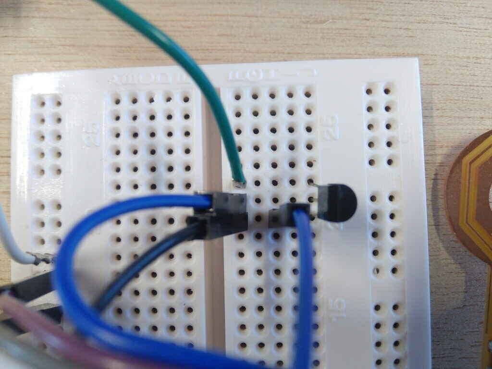

I've used this on my speaker circuit for amplification.


#### Voltage divider

> *from Sparkfun's tutorial's page*

> *[https://learn.sparkfun.com/tutorials/voltage-dividers/all](https://learn.sparkfun.com/tutorials/voltage-dividers/all)*

> *"A voltage divider is a simple circuit which turns a large voltage into a smaller one. Using just two series resistors and an input voltage, we can create an output voltage that is a fraction of the input. Voltage dividers are one of the most fundamental circuits in electronics. If learning Ohm's law was like being introduced to the ABC's, learning about voltage dividers would be like learning how to spell cat."*

Why do I need this?

The RFID board that I'm using for my project uses 5 to 9 Volts for power source, while my projects micro-controller with the SAMD11E17 needs only 3.3 Volts.


It means that to use this board with the UART Serial Communication Protocol, I need to connect the PIN_31 (RX) of my micro-controller to the TX pin of the RFID board.

So I need to convert from 5 to 3.3 Volts using a **Voltage divider**.

My current voltage divider configuration works using a 2k Ohms and 1 k Ohms resistors in a configuration like this.

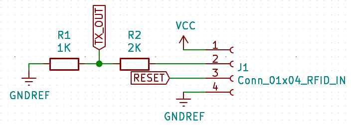

Formula:


#### PWM

>Reference from [https://learn.sparkfun.com/tutorials/pulse-width-modulation/all](https://learn.sparkfun.com/tutorials/pulse-width-modulation/all)

PWM stands for Pulse-Width-Modulation and it's a way to process output signals to use it for digital control. It is used for processes like dimming for RGB LED control, and current/ voltage for speed motor control.

One important thing to know and remember its the "Duty Cycle", it depends in the percentage of time that a signal is High or LOW in a period of time.

For a 5 Volts circuit, if I use 0.1 seconds (10 Hz) for "Period of time" and the output is 5 Volts for every 0.05 seconds my duty cycle will be equal to 50%. If the output is High for 0.025 seconds the Duty Cycle will be 25%. And if its High for 0.06 seconds the Duty Cycle will be 60%.


#### Sound and tones

The tone() function in the arduino library generates a square wave of the specified frequency (and 50% duty cycle) on a pin. A duration can be specified, otherwise the wave continues until a call to noTone(). The pin can be connected to a piezo buzzer or other speaker to play tones.

Only one tone can be generated at a time. If a tone is already playing on a different pin, the call to tone() will have no effect. If the tone is playing on the same pin, the call will set its frequency.

I've used this to produce a note C8 with the speaker. See the value 4186 in the tone() function.


#### Pull-up resistors

A pull-up resistor is an circuit arrangement to solve *floating input* signals.

The Pin is connected to the Voltage source in this case 3.3 Volts. And it's used for the i2c SDA and SCL inputs. Without this pull resistors the i2c communication doesn't work.

Source [Sparkfun tutorials](https://learn.sparkfun.com/tutorials/pull-up-resistors/all)

#### i2c protocol

i2c is a protocol that improves features from UART and SPI, its useful is you want to connect multiple devices using only 2 wires. An important remark is that every device that uses i2c has an hexadecimal "address" in this case I'm using **0x27** and I've find this in the LCD i2c documentation.


#### SAMD11C14 MUX table

Under the Arduino IDE we can select the number and types of com protocols to be used in our program and bootloader. To understand this more in detail I had to check the MUX table in the [ATSAMD11 documentation](http://ww1.microchip.com/downloads/en/devicedoc/atmel-42363-sam-d11_datasheet.pdf).


## Programming process

I've used [Arduino](arduino.cc) and the [generic bootloader](https://github.com/mattairtech/ArduinoCore-samd/tree/master/variants/Generic_D11C14A) for SAMD11C14 microcontrollers provided by Mattairtech.

To flash the bootloader I've used the same procees covered on my [week09 embeded programming assignment](../../assignments/week09/#arduino-workflow).

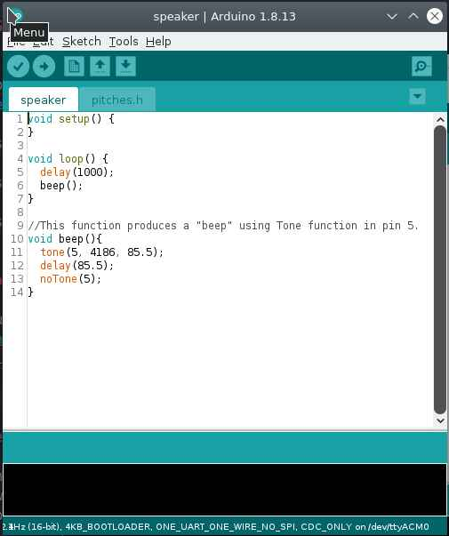

To flash my board I've selected this options:

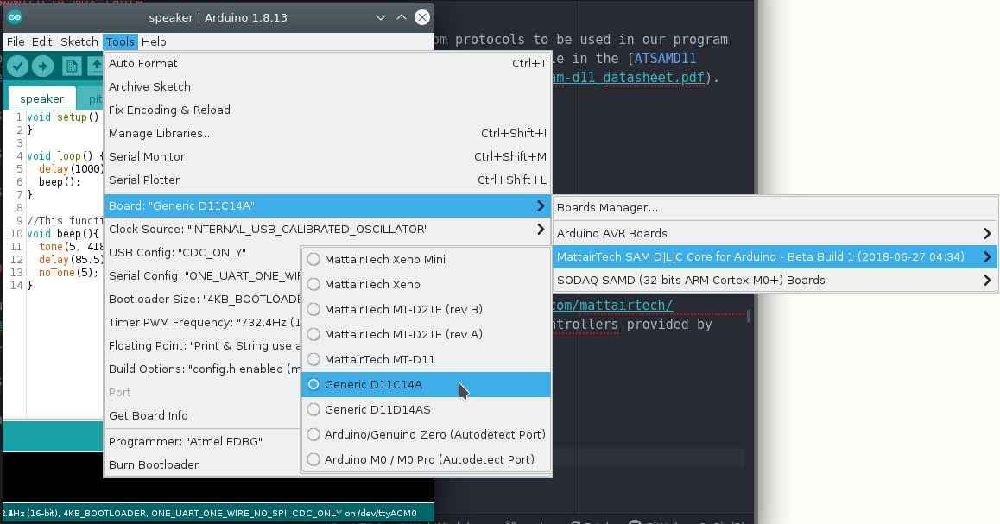

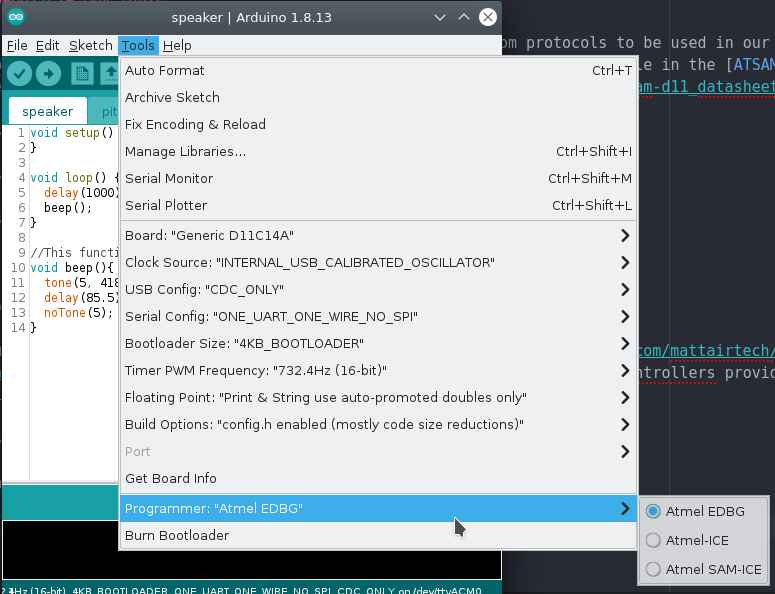


## Speaker

For this I've used as inspiration the access door of [Agrilab](https://agrilab.unilasalle.fr) the access door works by RFID when the ID is scanned it gives feedback by blinking a Green light and producing the following sound shown in the Test section.

I'll like to use the [tone library](#tone-library-for-arduino) to make a beep sound after scanning an RFID tag.


### Test

<figure class="video_container">
	<video controls="true" allowfullscreen="true">
		<source src="../../images/week13/speaker_test_03.mp4" type="video/mp4">
	</video>
</figure>


### Circuit

This is the circuit I've designed to drive a 2 Watts speaker using my SAMD11C14 board from week11, since the voltage output and current of the SAMD11C14 its limited to 1.63 to 3.63 Volts *depending on power operation input* on my case is 3.3 Volts to amplify the sound out of the speaker I've used a [2N2222 general purpose transistor](#2n2222-transistor).

I'm amplifying current and voltage since the Positive Pin to the speaker its connected to 5V and the micro-controller runs at 3.3 V.

The pin **PA_05** of my SAMD11C14 board is connected to the **BASE** Pin of the **2N2222** transistor. The **Collector** pin is connected to the **GROUND of the power source** and the **Emitter** to the **GROUND pad of the speaker**.

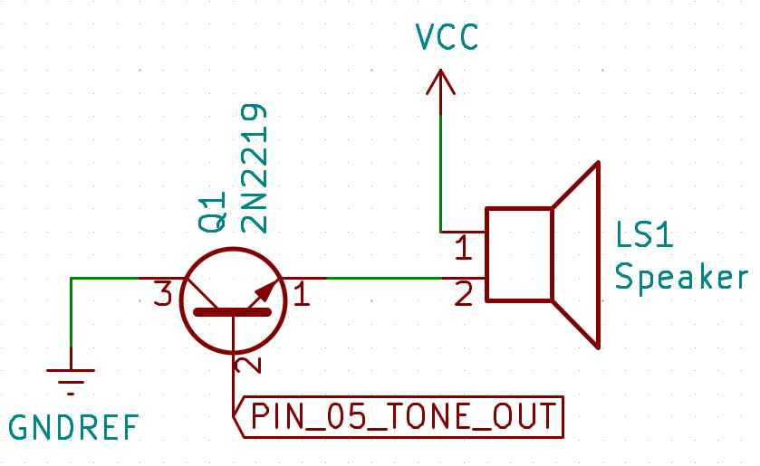

BOM:


| Component | ID | form factor |
| -- | -- | -- |
| General purpose transistor 2N2222 | Q1 | SOT23 |
| Generic 2W speaker | LS1 | * |


### Code

This code works by repeating every second the function **beep()**. The function **beep()** works by producing a tone with value 4186 equivalent to the musical note **C8** on the pin **PA_05** of my SAMD11C14 board with a duration of 85.5 milliseconds.


```
//This code produces a "beep" every one second.
// Pin 5 is the output
// It uses the tone function that produces a square signal with a duty cycle depending in the frequency of the tone.
// Autor: Antonio de Jesus Anaya Hernandez
// FabAcademy 2021
// Lab: Agrilab
// Country: France

void setup() {
}

void loop() {
  delay(1000);
  beep();
}

//This function produces a "beep" using Tone function in pin 5.
void beep(){
  tone(5, 4186, 85.5);
  delay(85.5);
	tone(5, 4186, 85.5);
  delay(85.5);
  noTone(5);
}
```


### Demo

This is the final result.

<figure class="video_container">
	<video controls="true" allowfullscreen="true">
		<source src="../../images/week13/speaker_demo_03.mp4" type="video/mp4">
	</video>
</figure>


## LCD Display

To show information processed by my SAMD11C14 microcontroller I've used a generic 24 x 4 display that I've found in [Agrilab's Electrolad inventory](https://agrilab.unilasalle.fr).

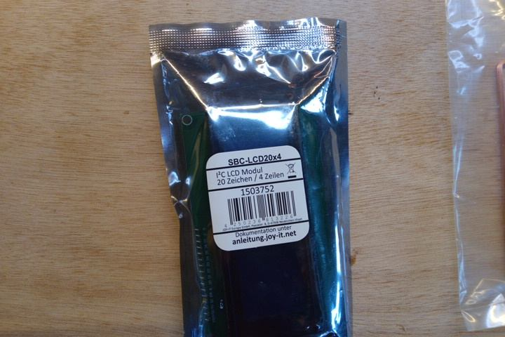

Specifications:

- 20 x 4 Display area symbols.
- Interfaced by i2c with the PCF8574T microcontroller.
- Symbol size 2.96 * 4.75 mm.
- Blue backlight.
- White text color.

In the future I'll use the display to show the information of the Scanned RFID  animals tags scanned by my device.


### Circuit

The i2c communication protocol of the display, uses **SDA** and **SCL** pins. This circuit integrates pull-up resistors on pins **SDA (PA_14)** and **SCL PA_15** to avoid **floating point noise**. This noise interferes with the digital information and makes the screen unusable.

I've realized the need for pull-up resistors after connecting the display directly to the **SDA** and **SCL** pins of my board and findout the display not working. After debugging I've googled possible cause of the issue and found the answer [at Sparkfuns i2c tutorial](https://learn.sparkfun.com/tutorials/i2c/i2c-at-the-hardware-level).

I've covered the information about pull-up resistors [here](#pull-up-resistors).


### Code

I've found a code example for i2c displays [here](https://create.arduino.cc/projecthub/Arnov_Sharma_makes/lcd-i2c-tutorial-664e5a).

Every i2c device has a particular address I've found the address in the package of the LCD display **0x27**.

This code works by first including the [Wire library](https://www.arduino.cc/en/reference/wire).

This is the library at arduino library manager:

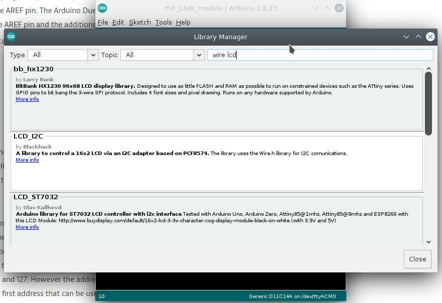

**Pick the second option for PCF8574 microcontrollers**

Then calling the LiquidCrystal_I2C library, that's included in the download, using 20x4 as size and the address 0x27.

In the **Setup** the Wire protocol its initilized, the lcd its initialized, the cursor in the screen its set to the coordinates **(1,1)** it means the first square of the top left cell, and finalizes by printing **Hello** on one cell per letter starting from **(1,1)**.

In the **Loop** the lcd turns on the backlight, sets the cursor at the cell **(1,2)**, prints **"World"**  for one second, turns off the backlight for one second and repeats the process.

I've used this as a blinking example.

```
//This code uses:
// LiquidCrystal_I2C and Wire library.
// Pins 14 and 15 as SDA and SCL.
// This code makes the i2c display blink its backlight for 1 second and writes "hello" during setup and "world" during loop.
// Autor: Antonio de Jesus Anaya Hernandez
// Fab-Academy: 2021 Agrilab
// Country: France

#include <Wire.h>
#include <LiquidCrystal_I2C.h>

LiquidCrystal_I2C lcd(0x27,20,4);

void setup() {
  Wire.begin();
  //setup lcd and write hello
  lcd.init();
  lcd.setCursor(1,1);
  lcd.print("Hello");
}

void loop() {
  lcd.backlight();
  lcd.setCursor(1,2);
  lcd.print("world");
  delay(1000);
  lcd.noBacklight();
  delay(1000);
}
```


### Demo

<figure class="video_container">
	<video controls="true" allowfullscreen="true">
		<source src="../../images/week13/display_02.mp4" type="video/mp4">
	</video>
</figure>


## Input + output

| Parts list | | |
| -- | -- | -- |
| Resistor | 1 | 1K |
| Resistor | 1 | 2K |
| 2N2222 | 1 | SOT-32 |
| 1x04 connector | 2 |
| 1x03 connector  | 1 |

[RFID WL-134KHz Datasheet](https://allinbest.com/blog/1342k-animal-tag-fdxb-iso11784-reader-module/)


### Circuit

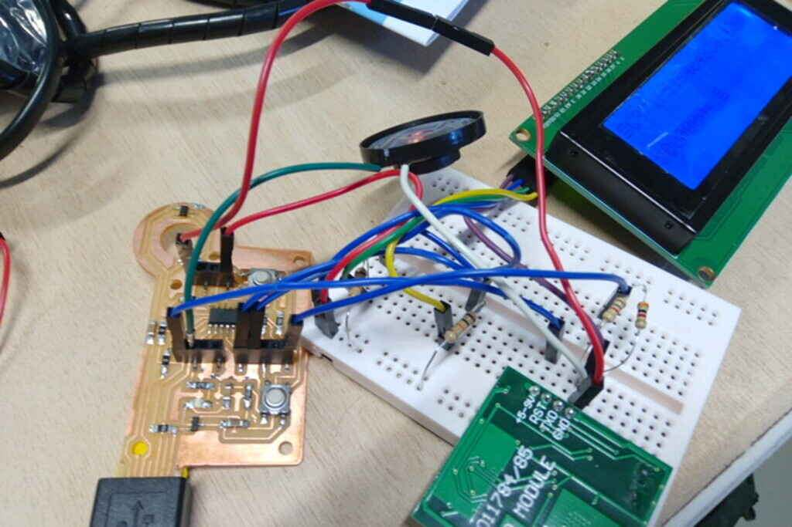


### Code
```
//This code uses:
// LiquidCrystal_I2C and Wire library.
// Pins 14 and 15 as SDA and SCL.
// Pin 31 for Serial communication at 9600 bauds
// Pin 5 for tone speaker output
// 5 Volts for RFID Tag reader board
// 3.3 Volts for Speaker and LCD display.
// Communcation protocols: i2c for display and Serial at "Serial1 interface" for RFID tag reader.
// This code makes the i2c display blink its backlight for 1 second and writes "hello" during setup and "world" during loop.
// Autor: Antonio de Jesus Anaya Hernandez
// Fab-Academy: 2021 Agrilab
// Country: France

#include <Wire.h>
#include <LiquidCrystal_I2C.h>

LiquidCrystal_I2C lcd(0x27,20,4);

char rfid_tag [30];

void setup() {
  Wire.begin();
  Serial1.begin(9600);
  lcd.init();
  lcd.backlight();
}

void loop() {
  int id = Serial1.read();

  if (id == 2){
    beep();
    rfid_tag[0] = id;
    for (int c = 1; c < 30; c++){
      int bit_ = Serial1.read();
      rfid_tag[c] = bit_;
    }
    }
  lcd.setCursor(0,0);
  lcd.print(rfid_tag);
}

void beep(){
  tone(5, 4186, 85.5);
  delay(85.5);
  noTone(5);
}
```


### Demo

This is the messy setup of my input+output first attempt. I integrates this elements:

- Speaker
- RFID 134KHz
- LCD Display

<figure class="video_container">
	<video controls="true" allowfullscreen="true">
		<source src="../../images/week13/demo_01.mp4" type="video/mp4">
	</video>
</figure>


## Board

I've made this board to replace the wiring of my circuit, although during the weekend I've broke one of the 1x04 connectors.

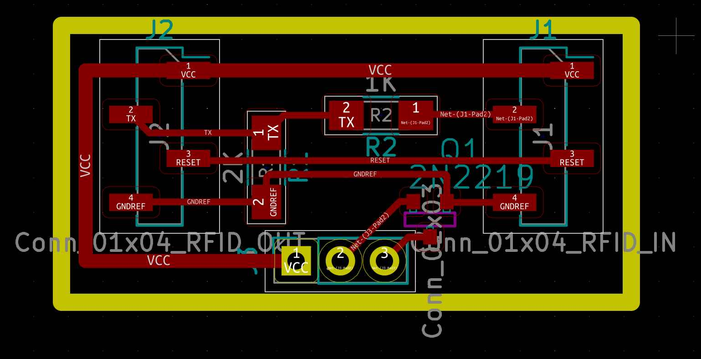


## learning outcomes

During this week I've learned about the importance of output devices for interaction between humans and electronic devices.

The sound produced by


### Issues

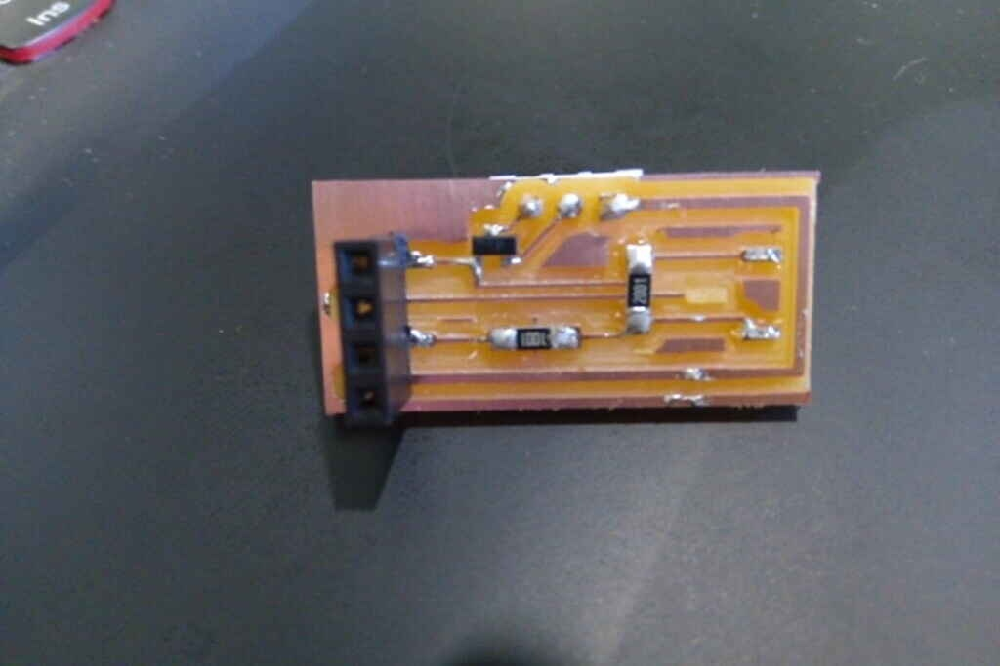

I'll change the design of my board on the:

- Connectors
- Transistor type


## Files

Code:

- [Speaker code](../../files/week13/speaker.ino)
- [Display code](../../files/week13/display.ino)
- [RFID, Speaker and Display code](../../files/week13/speaker_lcd_rfid.ino)

Circuits:

- [Kicad files **Use this** ZIP version](../../files/week13/kicad.zip)
<!--
- [Kicad project file](../../files/week13/kicad/wee13.pro)
- [Schematic](../../files/week13/kicad/wee13.sch)
- [PCB](../../files/week13/kicad/wee13.kicad_pcb)
- [Netfile](../../files/week13/kicad/wee13.net)
-->

Milling Roland SRM-20:

- [Traces](../../files/week13/roland_srm20/week13_audio_rfid.rml)
- [Outline](../../files/week13/roland_srm20/week13_outline.rml)
