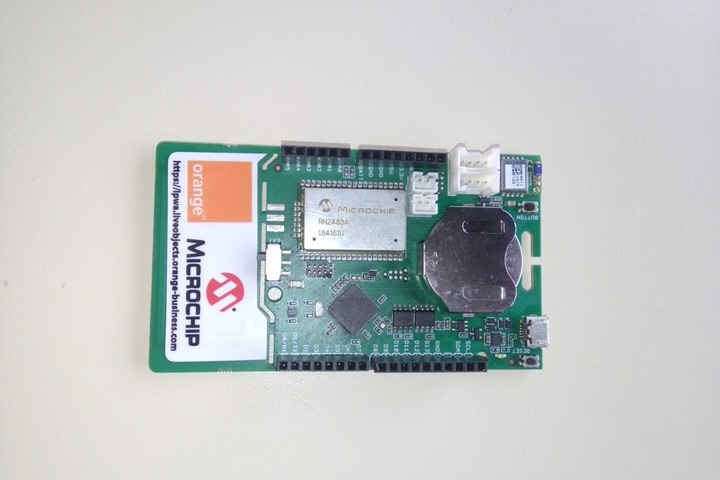

# 14. Networking and communications

## Introduction

For this week I've started to learn about:

- LORA and LORAWAN:
  - Microchip, LORA ExpLoRer board.
    - Arduino SODAQ firmware libraries.
  - [thethingsnetwork.org](thethingsnetwork.org)
  - AM stands for Amplitude modulation.
  - FM stands for Frequency modulation.
    - Lower noise than AM.
- LORA modulation:
  - Payload.
  - Encoding.
    - Counter element
  - Decoding, on thethingsnetwork app.
  - 868 MHz Band for Europe.
  - 902-927 BAnd for US and Mexico.
  - Spread Factor.
    - SF7 it's it's for energy efficient,
    - SF12 it's for decoding easiness.
  - Chirp.
  - Byte broadcast.
  - Duty cycle for thethingsnetwork.
    - max 30 seconds every 24 hrs.
    - band shifting.
  - Power consumption: 1 Dbm = 1mW.

[My instructor Luc Hanneuse](https://fabacademy.org/2019/labs/sorbonne/students/hanneuse-luc/about/) explained LORA, LORAWAN and thethingsnetwork.org to me on Thursday morning.
