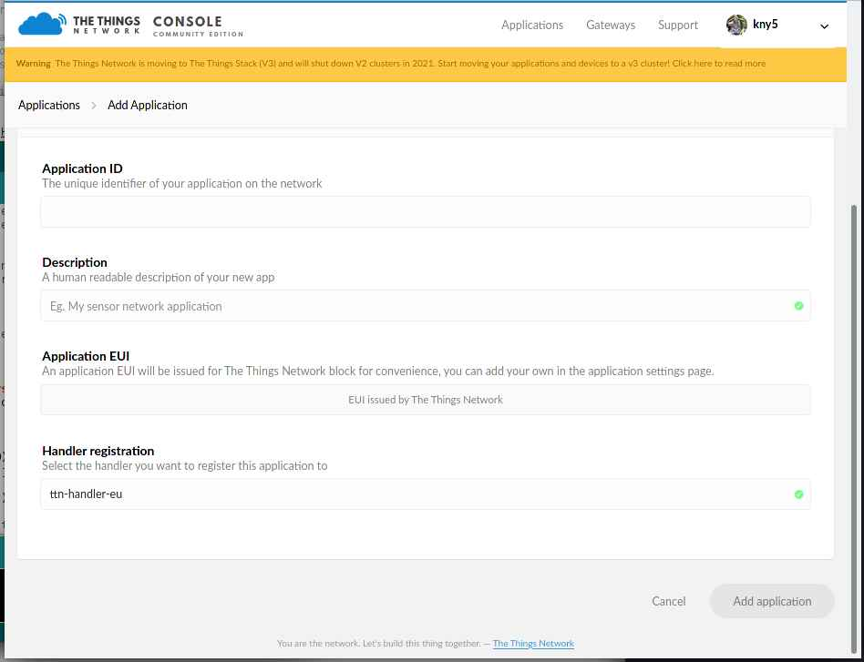
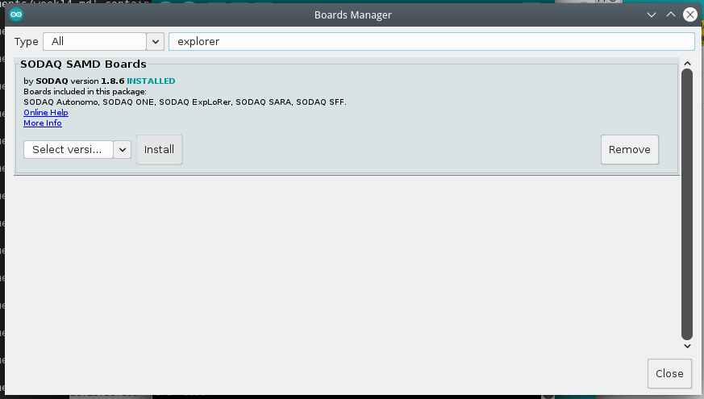
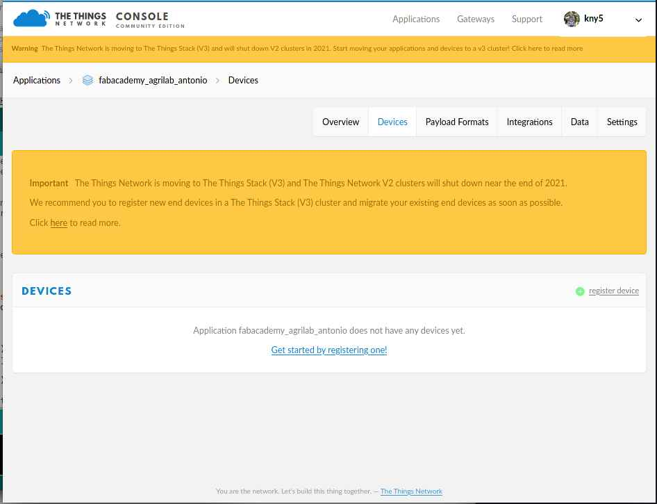
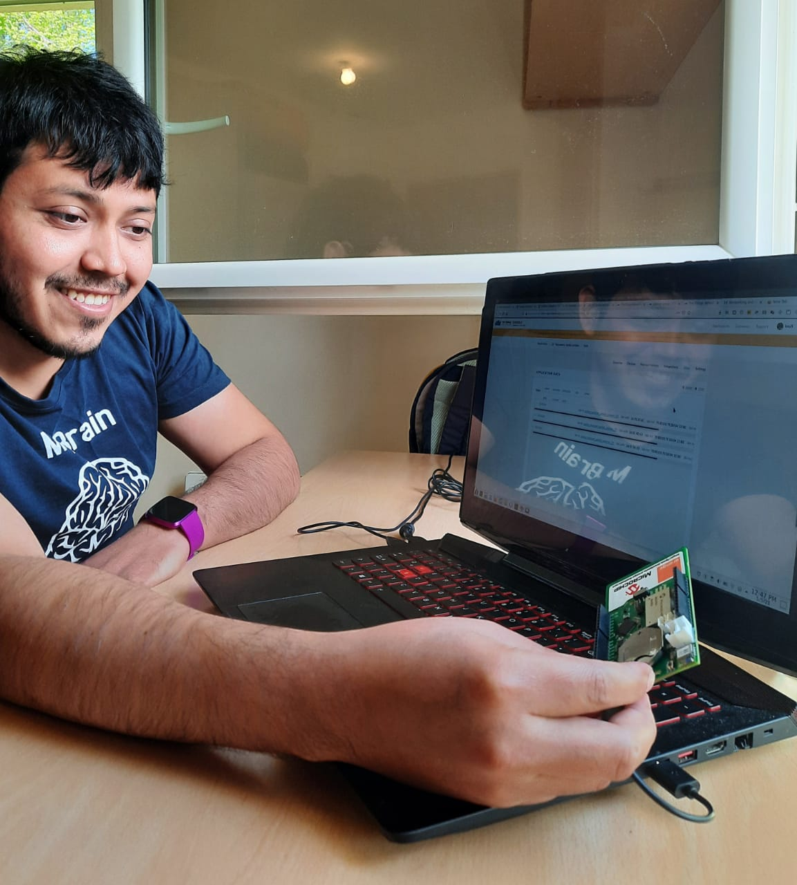
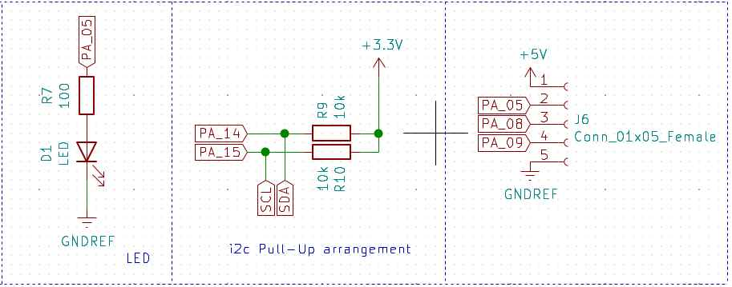
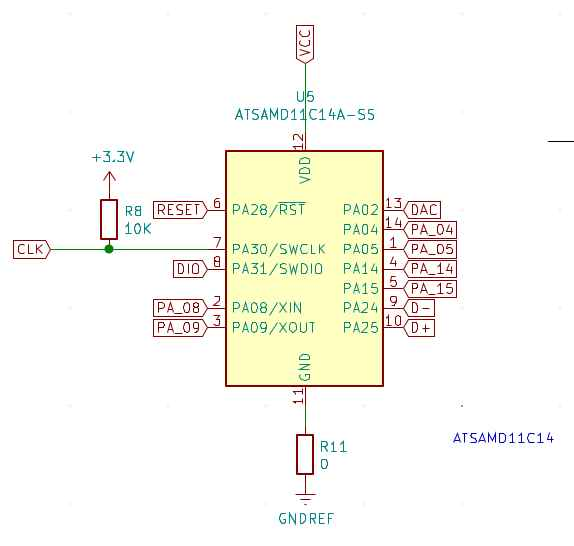
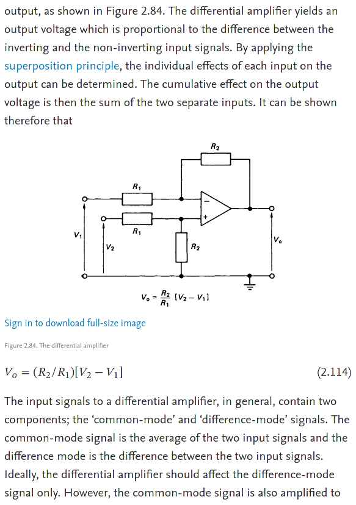
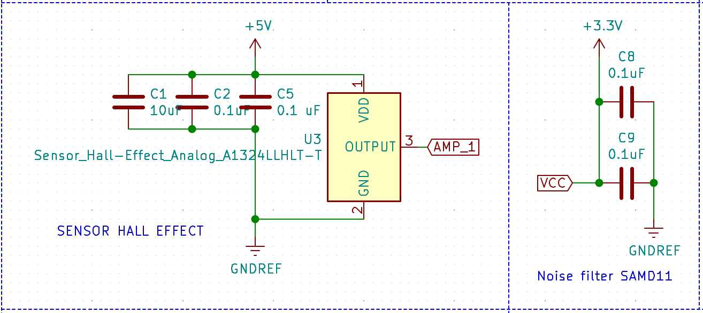
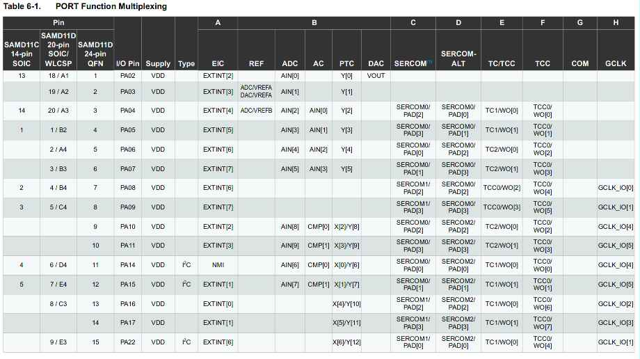
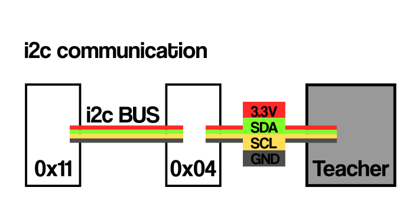

# 14. Networking and communications

## Introduction

For this week I've started to learn about:

- LORA and LORAWAN:
  - Microchip, LORA ExpLoRer board.
    - Arduino SODAQ firmware libraries.
  - [thethingsnetwork.org](https://thethingsnetwork.org)
  - AM stands for Amplitude modulation.
  - FM stands for Frequency modulation.
    - More immune to noise than AM.
- LORA modulation:
  - Payload.
  - Encoding.
    - Counter element
  - Decoding, on thethingsnetwork app.
  - 868 MHz Band for Europe.
  - 902-927 Band for US and Mexico.
  - Spread Factor.
    - SF7 it's it's for energy efficient,
    - SF12 it's for decoding easiness.
  - Chirp.
  - Byte broadcast.
  - Duty cycle for thethingsnetwork.
    - max 30 seconds every 24 hrs.
    - band shifting.
  - Power consumption: 1 dBm = 1mW.
  - dB it's and scale not an unit.


[My instructor Luc Hanneuse](https://fabacademy.org/2019/labs/sorbonne/students/hanneuse-luc/about/) explained LORA, LORAWAN and thethingsnetwork.org to me on Thursday morning.

For the [group assignment](http://fabacademy.org/2021/labs/agrilab/group/week14/) I have asked [Theo](http://fabacademy.org/2021/labs/agrilab/students/theo-gautier) to use i2c protocol to communicate our boards.


## Issues with LORA, thethingsnetwork.

So far I've made and account on thethingsnetwork.org, and sadly on the last week a bug made it impossible to access to the network in agrilab's node.

Also I've tried to use the arduino resources following Luc's tutorial but the references don't work so far.

I'll try this again on Tuesday.


## Using **SODAQ Explorer** LORA development board.

[Following this tutorial](https://www.thethingsnetwork.org/docs/devices/node/quick-start/index.html)

Important info from SODAQ/orange documentation:

[Link](https://github.com/Orange-OpenSource/Orange-ExpLoRer-Kit-for-LoRa)

- SerialUSB for debugSerial
- Serial1 for Bluetooth
- Serial for pins D0/RX and D1/TX
- Serial2 for loraSerial
- TTN_FP_EU868 for freqPlan
- appEui: Provided by thethingsnetwork
- appKey: Provided by thethingsnetwork

> I've created an account on [thethingsnetwork](https://thethingsnetwork.org/)


> Then added a new application


> This form gives applications a



> After finishing the app creation I've added a new device


> For this I've used the the things network library on Arduino
> Here there's the process to add the library from the Arduino Library manager.


> Here there's the boards manager to add SODAQ SAMD boards.



> Here this sketch shows the device EUI.


> This sketch in the examples apart, its a simple test to send "00" to the thethingsnetwork app.


> We need to add appEUI and appKey, I've find this data in the thethingsnetwork console.


> Selecting the SODAQ ExpLoRer board.


> New device added.



> Device information.


> Data sent.


### Results

> Location


> Data


> Response on serialdebug


> Testing




The SODAQ ExpLoRer board, it's an easy to setup and start hardware, once I've understand the process It went extremely quick with the Arduino IDE.

I'll like to use LORA and the thethingsnetwork for my communications of my final project.


## Circuit design for week14

For this weeks assignment I've worked on a circuit integrating an improved hall effect sensor circuit alongside a **DAC** output that I'll use for my final project Dielectric Spectroscopy sensor.

The original plan was to make two of this boards and communicate with i2c protocol.

I've also the next objectives:

- Use different connectors for USB and JTAG.
- Use a 3.3 and 5 Volts i2c connectors.
- Keep using the SAMD11C14 micro controller.
- Make an SAMD21 based board for central processing of data.

This are the Characteristics for my SAMD11C14 board.

Connectors:





- 1x05 connector for JTAG programming.
- 1x04 connector for 12c 3.3 Volts communication.
- 1x04 connector for 12c 5 Volts communication.
- 1x04 connector for USB communication.
- 1x05 connector for PIN_05, PIN_08 and PIN_09.

Power:

- 3.3 Volts linear regulator.
- 5 Volts from USB.

Outputs:

- LED output at PA_05.
- DAC output with AD8605 Operational amplifier at PA_02.


Micro-controller:



- SAMD11C14 microcontroller with power input noise filter.
- SDA and SCL pull ups at PA_14 and PA_15.
- Reset button.

Sensors:


- HALL effect sensor with power input filter arrangement.
- Differential amplification with AD8605 for HALL effect output.

List of components used:

*I've made this table by:*

- Exporting a BOM from Kicad *Generate Bill of materials in the tools menu*
- Importing the txt BOM file in this [csv to markdown converter page](https://www.convertcsv.com/csv-to-markdown.htm)

|Reference|Value                                 |Datasheet                                                                               |
|---------|--------------------------------------|----------------------------------------------------------------------------------------|
|U5       |ATSAMD11C14A-SS                       |                                                                                        |
|J4       |Conn_01x04_Female                     |~                                                                                       |
|J3       |Conn_01x04_Female                     |~                                                                                       |
|SW1      |BUTTON_B3SN                           |https://omronfs.omron.com/en_US/ecb/products/pdf/en-b3sn.pdf                            |
|R2       |10K                                   |~                                                                                       |
|C7       |1uF                                   |                                                                                        |
|R8       |10K                                   |~                                                                                       |
|C3       |1uF                                   |                                                                                        |
|J1       |Conn_01x05_Female                     |~                                                                                       |
|U3       |Sensor_Hall-Effect_Analog_A1324LLHLT-T|https://www.allegromicro.com/~/media/Files/Datasheets/A1324-5-6-Datasheet.ashx          |
|C5       |0.1 uF                                |                                                                                        |
|J5       |Conn_01x04_Female                     |~                                                                                       |
|C2       |0.1uF                                 |                                                                                        |
|C1       |10uF                                  |                                                                                        |
|D1       |LED                                   |https://optoelectronics.liteon.com/upload/download/DS-22-98-0002/LTST-C150CKT.pdf       |
|R7       |100                                   |~                                                                                       |
|C6       |0.1uF                                 |                                                                                        |
|C10      |0.1uF                                 |                                                                                        |
|J2       |Conn_01x02                            |~                                                                                       |
|C8       |0.1uF                                 |                                                                                        |
|C9       |0.1uF                                 |                                                                                        |
|U4       |OPAMP_AD8605                          |https://www.analog.com/media/en/technical-documentation/data-sheets/AD8605_8606_8608.pdf|
|R3       |10K                                   |~                                                                                       |
|R5       |1K                                    |~                                                                                       |
|R6       |10K                                   |~                                                                                       |
|R4       |1K                                    |~                                                                                       |
|U2       |OPAMP_AD8605                          |https://www.analog.com/media/en/technical-documentation/data-sheets/AD8605_8606_8608.pdf|
|R1       |10K                                   |~                                                                                       |
|C4       |10pF                                  |                                                                                        |
|J6       |Conn_01x05_Female                     |~                                                                                       |
|R11      |0                                     |~                                                                                       |
|U1       |Regulator_Linear_LM3480-3.3V-100mA    |https://www.ti.com/lit/ds/symlink/lm3480.pdf                                            |
|R10      |10k                                   |~                                                                                       |
|R9       |10k                                   |~                                                                                       |


### Differential amplifier

Differential amplifier is a type of electronic amplifier that amplifies the difference between two input voltages but suppresses any voltage common to the two inputs.

I need a this electronic component for the Hall effect sensor, to amplify the signal output because the signal it's just 100 mV and can by difficult to filter, instead of measuring the 100 mV I'll use the differential amplifier to measure 5 - 0.001 = 4.999 Volts pulses which are notably easy to detect.

> [From week11 input devices work](../../assignments/week11)
Using Arduino's serial plotter I've found the sensor sends a lot of noise, and I've learn that's normal because of the materials of the board.


This is the signal response when an magnet passes 3 times over the sensor at 3mm distance.  


For this I've consulted the references shown:

- [Overview of differential amplifiers on science direct by multiple autors](https://www.sciencedirect.com/topics/engineering/differential-amplifier)




### DAC amplifier

DAC stands for Digital to analog converter and it's part of my Dielectric Spectroscopy Sensor for my final project. I'm going to use this to identify fat and protein proportions in milk samples.

I'm using DAC from the SAMD11C14, in the datasheet DAC it's on the pin PA_02. And its capable to perform at 350000 samples per second.

I want to use this capability of the SAMD11C14 to produce a signal and then measure the difference by passing the signal trough a milk sample.

This is in order to detect the molecular structure of the milk sample.

For this I've used the next reference:

- [AD8605 Datasheet](https://www.analog.com/media/en/technical-documentation/data-sheets/AD8605_8606_8608.pdf)


### Noise filters

For this I've used the next references:

- [ST electronics designing for noisy environments handbook](https://www.st.com/resource/en/application_note/cd00003833-designing-with-microcontrollers-in-noisy-environments-stmicroelectronics.pdf)

- [Using capacitors to filter electrical noise](https://www.arrow.com/en/research-and-events/articles/using-capacitors-to-filter-electrical-noise)

I've used noise filtering for:

- ATSAMD11C14A micro-controller.
- A1324 Hall effect sensor.

The plan its too reduce the noise observed during in week 11.


- [Week 11 oscilloscope](../../assignments/week11/#hall-effect-fluid-sensor)



After the local review my instructor [Luc Hanneuse](https://fabacademy.org/2019/labs/sorbonne/students/hanneuse-luc/about/)) has helped me to understand that I'm not implementing noise filters in my circuit but only parallel connected capacitors, this helps only to prevent voltage drops while operating the device.

So certainly I'll have to work more on the circuits design og my project for the next steps.


### Conclusions

I've been working on this but unfortunately I didn't have the time to manufacture the board.


## Communications:

In the last weeks I've use multiple communication protocols. I'll shown this work and then the final one.


### SAMD11 MUX table

Under the Arduino IDE we can select the number and types of com protocols to be used in our program and bootloader. To understand this more in detail I had to check the MUX table in the [ATSAMD11 documentation](http://ww1.microchip.com/downloads/en/devicedoc/atmel-42363-sam-d11_datasheet.pdf).





### USB

I've made this program originally on week09 Embedded programming.

Check more details [here.](../../assignments/week09)

One button scroll-down/up controller.

```
/*
This program uses Arduino and Mouse library.
This program reads the board button to scroll-down and after the release of the button waits for 4 seconds to scroll up. After 4 seconds the program waits for a new button push event.

IO pins:
PA02 <- Digital pull-up BUTTON input
PA05 -> Digital LED output

Autor: Antonio de Jesus Anaya Hernandez
Year: 2021
Org: Fab Academy
Lab: AgriLab
Country: France
*/

#include <Mouse.h>

const int BTN = 2;
const int LED =  5;
int timer = 0;
int btn_state = 0;
int idle1 = 0;
int idle2 = 0;

void blink() {
  for(int pw = 0; pw < 255; pw++){
      delay(1);
      analogWrite(LED,pw);
  }
  analogWrite(LED,0);
}

void setup() {
  pinMode(LED, OUTPUT);
  pinMode(BTN, INPUT);
  Mouse.begin();
  //Serial.begin(9600);
}

void loop() {
  analogWrite(LED,5);
  btn_state = digitalRead(BTN);
  if(btn_state == LOW){
    while(btn_state == LOW){
      delay(200);
      analogWrite(LED, 100);
      Mouse.move(0,0,-1);
      btn_state = digitalRead(BTN);
    }
    for(int clicks = 0; clicks < 10; clicks++){
      delay(200);
      //Serial.println("Clicked");
      //Serial.print(clicks);
      if(clicks < 6){
        //digitalWrite(LED, HIGH);
        blink();
      }
      btn_state = digitalRead(BTN);
      while(btn_state == LOW && clicks < 6){
        delay(200);
        analogWrite(LED,30);
        Mouse.move(0,0,1);
        btn_state = digitalRead(BTN);
      }
    }
  }
  delay(200);
  //Serial.println("waitting");
}
```

<script id="asciicast-KlMq6gvI0W46eSBIU6cVzsP86" src="https://asciinema.org/a/KlMq6gvI0W46eSBIU6cVzsP86.js" async data-autoplay="true" data-loop=1 data-t=10 data-rows=30 data-speed=2></script>


<figure class="video_container">
  <video controls="true" allowfullscreen="true" poster="path/to/poster_image.png" width=100% loop>
    <source src="../../images/week09/demo_04.mp4" type="video/mp4">
  </video>
</figure>


### RFID and serial communication.

```
/*
This program reads the TX output of the RFID ISO11784 for animal Tag FDX reading board, using the Serial1 interface of the SAMD11 micro-controller.

TX to RX on pin 31 Serial1


Autor: Antonio de Jesus Anaya Hernandez
Agrilab, France.
Fabacademy week 11.
*/

void setup() {
  Serial.begin(9600);
  Serial1.begin(9600);
}

void loop() {
  char id = Serial1.read();
  Serial.println(id);
  delay(100);
}
```


Flashing

<script id="asciicast-9uphJuuU7P0OiTTZe8sKLbwrr" src="https://asciinema.org/a/9uphJuuU7P0OiTTZe8sKLbwrr.js" async></script>


Serial output

<script id="asciicast-wSqG449cNzomrx4QNRKXbDJVJ" src="https://asciinema.org/a/wSqG449cNzomrx4QNRKXbDJVJ.js" async></script>


Video

<figure class="video_container">
  <video controls="true" allowfullscreen="true" poster="path/to/poster_image.png" width=100% loop>
    <source src="../../images/week11/demo_01.mp4" type="video/mp4">
  </video>
</figure>

### Spectral sensor and serial communication:

## Sparkfun spectral sensor

I've been stuck on this due to the library size. I've above 7000 bytes of the flash memory.

So I've been looking to the [AS7262 datasheet](https://cdn.sparkfun.com/assets/parts/1/2/2/4/9/AS7262_Datasheet.pdf#G1006885)


So I've learn that its possible to use i2c protocol by writing bytes to the sensor or UART by sending commands.

To read the device temperature:
- i2c: 0x06 bit 7:0
- UART: ATTEMP

Things I've to do to enable UART communication:

- Remove the solder from the Jp1 jumper
- Add a older to the jp2 jumper.


code

```
/*
This program reads the TX output of the Sparkfun As7262 board, writes a command to blink the LED light of the sensor, the baudrate and command ATLED0=100 were found in the sensor datasheet using the Serial1 interface of the SAMD11 micro-controller.

TX to RX on pins 10, 31 Serial1


Autor: Antonio de Jesus Anaya Hernandez
Agrilab, France.
Fabacademy week 11.
*/

void setup() {
  // initialize serial:-------------------------------
  Serial.begin(115200);
  Serial1.begin(115200);
  delay(200);
  Serial1.write("ATLED0=100");
  delay(500);
  Serial.println(Serial.read());
}

void loop() {

Serial1.write(Serial.read());

Serial.println(Serial1.read());

delay(100);
}

```


### i2c

LCD Display

Circuit

I'm using here pull-up resistors to solve floating point inputs in SDA and SCL pins.


Code

```
//This code uses:
// LiquidCrystal_I2C and Wire library.
// Pins 14 and 15 as SDA and SCL.
// This code makes the i2c display blink its backlight for 1 second and writes "hello" during setup and "world" during loop.
// Autor: Antonio de Jesus Anaya Hernandez
// Fab-Academy: 2021 Agrilab
// Country: France

#include <Wire.h>
#include <LiquidCrystal_I2C.h>

LiquidCrystal_I2C lcd(0x27,20,4);

void setup() {
  Wire.begin();
  //setup lcd and write hello
  lcd.init();
  lcd.setCursor(1,1);
  lcd.print("Hello");
}

void loop() {
  lcd.backlight();
  lcd.setCursor(1,2);
  lcd.print("world");
  delay(1000);
  lcd.noBacklight();
  delay(1000);
}
```

Demo

<figure class="video_container">
	<video controls="true" allowfullscreen="true">
		<source src="../../images/week13/display_02.mp4" type="video/mp4">
	</video>
</figure>


## Networking

### i2c bus

Explain about communication on deep.

- SDA
- SCL
- Show data from the network analyzer
- Bytes


For this I've used:

- my board from [week11](../../assignments/week11.)
- 2 Arduinos UNO.
- An i2c LCD display.


Description:

- Teacher sets the LCD display,
- Teacher sends x and y values to students 4 and 17,
- i2c addresses are 4, 17 and master address its optional, and LCD address it's 0x27.
- Student 4 prints x value using the LCD screen and serial communication,
- Student 17 prints y value using the LCD screen and serial communication.


### Board and pinouts

### Code

Teacher:
I've use my own board as Teacher.


```
//This code uses:
// LiquidCrystal_I2C and Wire library.
// Pins 14 and 15 as SDA and SCL.
// This code is the teacher in the "teacher/student" i2c configuration. It sends messages to device 4 and 17.
// Autor: Antonio de Jesus Anaya Hernandez
// Fab-Academy: 2021 Agrilab
// Country: France
// Taken parts from Wire M/S receiver
// by Nicholas Zambetti <http://www.zambetti.com>


#include <Wire.h>
#include <LiquidCrystal_I2C.h>
LiquidCrystal_I2C lcd(0x27,20,4);

void setup()
{
  Serial.begin(9600);
  Wire.begin(); // join i2c bus (address optional for master)
  lcd.init();
  lcd.setCursor(1,1);
  lcd.clear();
  lcd.print("Students board:");
  lcd.backlight();
}

byte x = 0;
byte y = 255;

void loop()
{
  Wire.begin();
  Wire.beginTransmission(4); // transmit to device #4
  Wire.write("x is ");        // sends five bytes
  Wire.write(x);              // sends one byte
  x++;
  Wire.beginTransmission(17); // transmit to device #17
  Wire.write("y is ");        // sends five bytes
  Wire.write(y);              // sends one byte  
  Wire.endTransmission();    // stop transmitting
  y--;
  delay(500);
}
```

Student 4 Arduino UNO board:

```
//This code uses:
// LiquidCrystal_I2C and Wire library.
// Pins 14 and 15 as SDA and SCL.
// This code is the teacher in the "teacher/student" i2c configuration. It sends messages to device 4 and 17.
// Autor: Antonio de Jesus Anaya Hernandez
// Fab-Academy: 2021 Agrilab
// Country: France
// Taken parts from Wire M/S receiver
// by Nicholas Zambetti <http://www.zambetti.com>


#include <Wire.h>
#include <LiquidCrystal_I2C.h>
LiquidCrystal_I2C lcd(0x27,20,4);


void setup()
{
  Wire.begin(4);                // join i2c bus with address #4
  Wire.onReceive(receiveEvent); // register event
  Serial.begin(9600);           // start serial for output
}

void loop()
{
  delay(100);
}

// function that executes whenever data is received from master
// this function is registered as an event, see setup()
void receiveEvent(int howMany)
{
  while(1 < Wire.available()) // loop through all but the last
  {
    char c = Wire.read(); // receive byte as a character
    Serial.print(c);         // print the character
  }
  int x = Wire.read();    // receive byte as an integer
  Serial.println(x);         // print the integer

  lcd.setCursor(1,2);
  lcd.clear();
  lcd.print(x);
```


Student 17 Arduino UNO board:

```
//This code uses:
// LiquidCrystal_I2C and Wire library.
// Pins 14 and 15 as SDA and SCL.
// This code is the teacher in the "teacher/student" i2c configuration. It sends messages to device 4 and 17.
// Autor: Antonio de Jesus Anaya Hernandez
// Fab-Academy: 2021 Agrilab
// Country: France
// Taken parts from Wire M/S receiver
// by Nicholas Zambetti <http://www.zambetti.com>


#include <Wire.h>
#include <LiquidCrystal_I2C.h>
LiquidCrystal_I2C lcd(0x27,20,4);

void setup()
{
  Wire.begin(17);                // join i2c bus with address #4
  Wire.onReceive(receiveEvent); // register event
  Serial.begin(9600);           // start serial for output
}

void loop()
{
  delay(100);
}

// function that executes whenever data is received from master
// this function is registered as an event, see setup()
void receiveEvent(int howMany)
{
  while(1 < Wire.available()) // loop through all but the last
  {
    char c = Wire.read(); // receive byte as a character
    Serial.print(c);         // print the character
  }
  int y = Wire.read();    // receive byte as an integer
  Serial.println(y);         // print the integer
  lcd.setCursor(1,3);
  lcd.clear();
  lcd.print(y);


```

## Demo


## Circuit



## Files


- [Spectral_test.ino](../../files/week14/spectral_test.ino)
- [student.ino](../../files/week14/student.ino)
- [teacher.ino](../../files/week14/teacher.ino)
- [Arduino Mouse Scroller](../../files/week09/button_mouse/button_mouse.ino)
