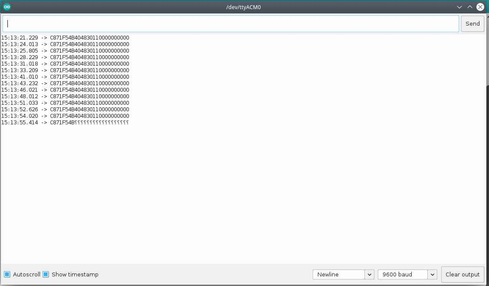
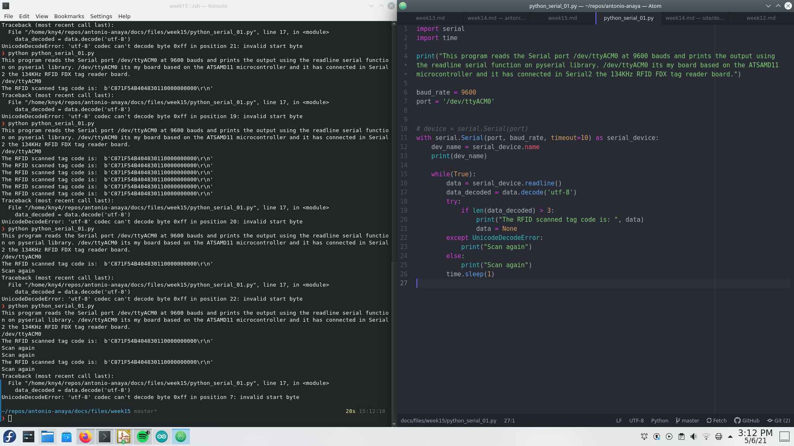
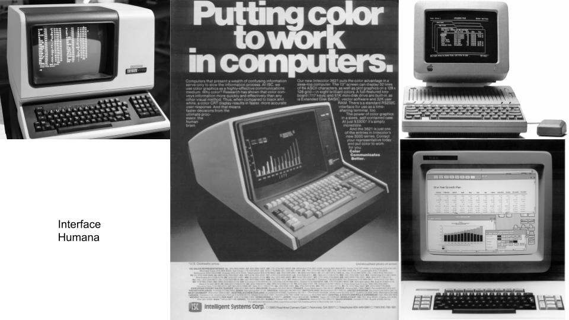
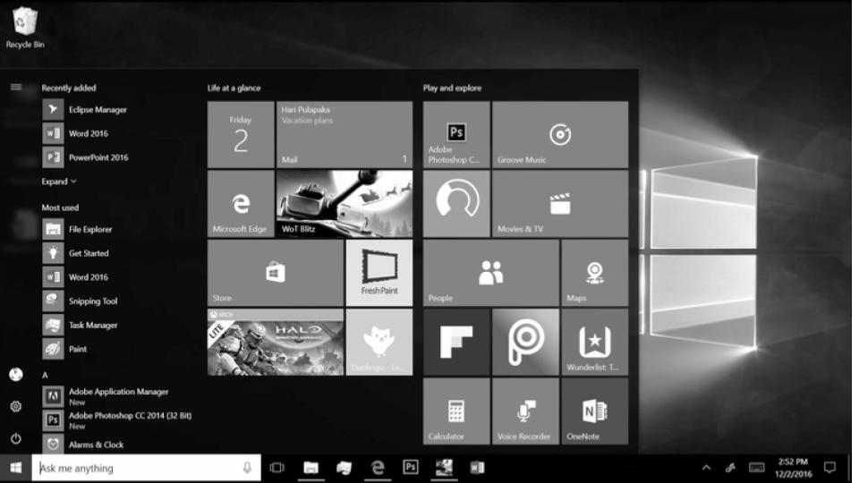
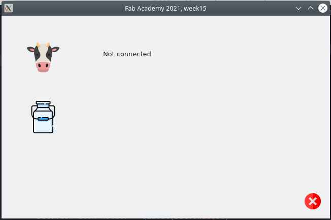
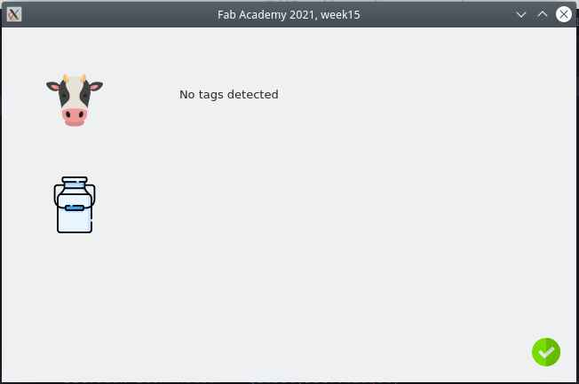
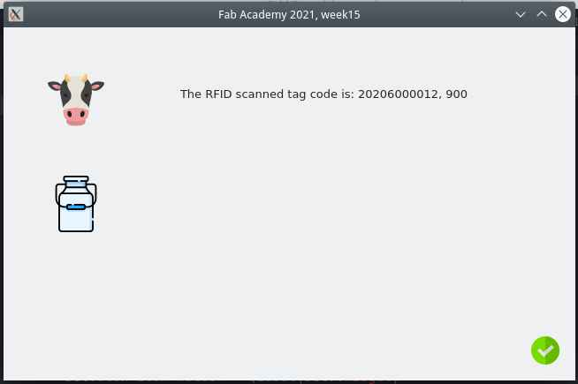
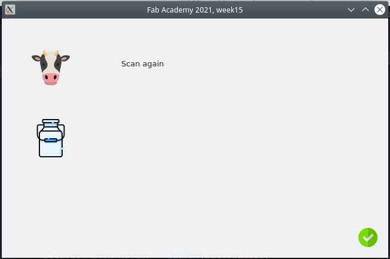

# 15. Interface and application programming

<figure class="video_container">
	<video controls="true" allowfullscreen="true">
		<source src="../../images/week14/demo.mp4" type="video/mp4">
	</video>
</figure>

## Introduction

Goals:

For this week I've decided to complete the minimum requirements. My tasks will be:

1. Use the 134KHz RFID sensor.
1. Optionally use an FDX and HDX sensor to read cow RFID tags used in France and Mexico.
2. Give a format to the data received in the mircro-controller code, form the sensor.
2. Establish serial communication between micro-controller and computer.
3. Read and parse the data received from micro-controller using Python.
4. Make a short basic UI. Using QT.
5. Make a distributable version of the software using a packaging library.


## Micro-controller

I've used again my [board from week 11](../../assignments/week11).

```
// This code uses:

// Pin 31 for Serial communication at 9600 bauds
// 5 Volts for RFID Tag reader board

// Communication protocols: USB Serial abd "Serial1 interface" for RFID tag reader.

// This code reads the RFID tag and prints the result in SERIAL.

// Autor: Antonio de Jesus Anaya Hernandez
// Fab-Academy: 2021 Agrilab
// Country: France

/*#include <Wire.h>
#include <LiquidCrystal_I2C.h>

LiquidCrystal_I2C lcd(0x27,20,4);
*/
char rfid_tag [30];

void setup() {
  Serial1.begin(9600);
  Serial.begin(9600);
  /*
  Wire.begin();
  lcd.init();
  lcd.backlight();
  */
}

void loop() {
  int id = Serial1.read();

  if (id == 2){
    //beep();
    //rfid_tag[0] = id;
    for (int c = 0; c < 26; c++){
      int bit_ = Serial1.read();
      rfid_tag[c] = bit_;
   }
   Serial.println(rfid_tag);
   }

  /*
  lcd.setCursor(0,0);
  lcd.print(rfid_tag);
  */

  delay(200);

}
```

Decoding issues:



Exception error with Python:




## Python

The Python programming language it's my favorite programming language. So I've decided to skip a trial of multiple programming languages and just use the one I like the most.


### About Python

>*Python is an interpreted, interactive, object-oriented programming language. It incorporates modules, exceptions, dynamic typing, very high level dynamic data types, and classes. It supports multiple programming paradigms beyond object-oriented programming, such as procedural and functional programming. Python combines remarkable power with very clear syntax. It has interfaces to many system calls and libraries, as well as to various window systems, and is extensible in C or C++. It is also usable as an extension language for applications that need a programmable interface. Finally, Python is portable: it runs on many Unix variants including Linux and macOS, and on Windows.*

**[Fragment from Python's documentation.](https://docs.python.org/3/faq/general.html#what-is-python)**


### Configurations

I'm a Linux user and so my configuration follows this information.

1. Linux Fedora 32
2. Conda as Python environment version manager.
3. Qt as User interface library.

For this the Configuration process may change a bit for Windows and Mac users.


####  Conda environment

> *Conda is an open source package management system and environment management system that runs on Windows, macOS and Linux. Conda quickly installs, runs and updates packages and their dependencies. Conda easily creates, saves, loads and switches between environments on your local computer. It was created for Python programs, but it can package and distribute software for any language.*

> *Conda as a package manager helps you find and install packages. If you need a package that requires a different version of Python, you do not need to switch to a different environment manager, because conda is also an environment manager. With just a few commands, you can set up a totally separate environment to run that different version of Python, while continuing to run your usual version of Python in your normal environment*

[**Taken from Anaconda's documentation**](https://conda.io/en/latest/)

Process overview:

We need to:

1. Install Python Anaconda compiler,
2. Create a new environment just for this weeks assignment,
3. Install PyQt5 and requirements packages,
4. Install PySerial library
5. Code a program with Python using PyQT5 and PySerial Libraries.
6. Make a distributable version of the program.


Creating a new environment:

```
conda create -n week15
```

Activate environment:

```
conda activate week15
```

Install pyserial:

```
pip install pyserial
```


## First trial code:

```
import serial
baud_rate = 9600
port = '/dev/ttyUSB0'


# device = serial.Serial(port)
with serial.Serial(port, baud_rate, timeout=1) as serial_device:
    print(serial_device.name)
    data = serial_device.readline()

while(True):
    print(data)
```


## Second trial code:

```
import serial
import time

print("This program reads the Serial port /dev/ttyACM0 at 9600 bauds and prints the output using the readline serial function on pyserial library. /dev/ttyACM0 its my board based on the ATSAMD11 microcontroller and it has connected in Serial2 the 134KHz RFID FDX tag reader board.")

baud_rate = 9600
port = '/dev/ttyACM0'
milking = True

def parse_rfid(rfid_code):
    head = rfid_code[:1]
    code = rfid_code[1:11]
    country = rfid_code[11:14]
    tail = rfid_code[14:]
    return (head, code, country, tail)

# device = serial.Serial(port)
with serial.Serial(port, baud_rate, timeout=10) as serial_device:
    dev_name = serial_device.name
    print(dev_name)

    while(milking):
        time.sleep(0.5)
        data = serial_device.readline()
        if len(data) > 3:
            try:
                data_decoded = data.decode('utf-8')
                print("The RFID scanned tag code is: ", parse_rfid(data_decoded))
                data = None
            except UnicodeDecodeError:
                print("Scan again")
        else:
            print("No tags detected")
```


### About Qt Graphic User Interfaces

In the past Computers used to have simple text based interfaces.



Over the years this changed to have visual more interactive interfaces.




### PyQt5

>*PyQt is one of the most popular Python bindings for the Qt cross-platform C++ framework. PyQt was developed by Riverbank Computing Limited. Qt itself is developed as part of the Qt Project. PyQt provides bindings for Qt 4 and Qt 5. PyQt is distributed under a choice of licences: GPL version 3 or a commercial license. *

**[From Riverbank Computing Limited website](https://wiki.python.org/moin/PyQt)**


#### Configuration

Install PyQt5 library:
```
pip install PyQt5
```

Test code:

Reference: *https://pythonbasics.org/pyqt-hello-world/*

```

import sys
from PyQt5.QtWidgets import QApplication, QWidget, QLabel

def window():
   app = QApplication(sys.argv)
   widget = QWidget()

   textLabel = QLabel(widget)
   textLabel.setText("Hello World!")
   textLabel.move(110,85)

   widget.setGeometry(50,50,320,200)
   widget.setWindowTitle("PyQt5 Example")
   widget.show()
   sys.exit(app.exec_())

if __name__ == '__main__':
   window()
```

Using it long side PySerial:

```
import sys
from PyQt5.QtWidgets import QApplication, QWidget, QLabel


class MainWindow():
    def __init__(self):
        self.app = QApplication(sys.argv)
        self.widget = QWidget()
        self.text1 = "Fab Academy 2021, week15"
        self.text2 = "0"

    def setLabel(self):
        self.label = QLabel(self.widget)
        self.label.setText(self.text2)
        self.label.move(110, 85)

    def setTitle(self):
        self.widget.setGeometry(50,50,320,200)
        self.widget.setWindowTitle(self.text1)

    def display(self):
        self.widget.show()
        sys.exit(self.app.exec_())


def __run():
    app = MainWindow()
    app.setLabel()
    app.setTitle()
    app.display()

def read_rfid():


__run()


```

Using Threading:

```
import sys
from PyQt5.QtWidgets import QApplication, QWidget, QLabel
from python_serial_01 import read_rfid, output
import threading
import time


class MainWindow():
    def __init__(self):
        self.app = QApplication(sys.argv)
        self.widget = QWidget()
        self.text1 = "Fab Academy 2021, week15"
        self.text2 = "0"
        self.setLabel()
        self.setTitle()

    def setLabel(self):
        self.label = QLabel(self.widget)
        self.label.setText(self.text2)
        self.label.move(110, 85)

    def setTitle(self):
        self.widget.setGeometry(50,50,320,200)
        self.widget.setWindowTitle(self.text1)

    def display(self):
        self.widget.show()
        sys.exit(self.app.exec_())


a = MainWindow()


def update_label(text):
    while True:
        print("loop1")
        time.sleep(0.5)
        a.label.setText(text)


serial = threading.Thread(target=read_rfid)
updater = threading.Thread(target=update_label, args=(output,))
serial.start()
updater.start()
a.display()

```

## UI

### Views







### Console output

<script i
d="asciicast-QFRnhwoZco5bR6BXGPgW0TOPd" src="https://asciinema.org/a/QFRnhwoZco5bR6BXGPgW0TOPd.js" async></script>


### Final code

View:

```
import sys
from PyQt5.QtWidgets import QApplication, QWidget, QLabel
from PyQt5.QtGui import QPixmap
from python_serial_01 import read_rfid, try_serial
import threading
import time


class MainWindow():
    height = 400
    width = height * 1.618

    def __init__(self):
        self.app = QApplication(sys.argv)
        self.widget = QWidget()
        self.text1 = "Fab Academy 2021, week15"
        self.text2 = "0"*45
        self.setLabel()
        self.setTitle()
        self.setLogo()
        self.setConnection_icon()
        # self.setRFID_img()
        self.setMilk_img()

    def setLabel(self):
        self.label = QLabel(self.widget)
        self.label.setText(self.text2)
        self.label.resize(500, 50)
        self.label.move(200, 50)

    def setTitle(self):
        self.widget.setGeometry(50,50,self.width,self.height)
        self.widget.setWindowTitle(self.text1)

    def setConnection_icon(self):
        self.con_icon_holder = QLabel(self.widget)
        if try_serial():
            self.con_icon = QPixmap('ok.png')
        else:
            self.con_icon = QPixmap('not.png')
        self.con_icon_holder.setPixmap(self.con_icon)
        self.con_icon_holder.resize(self.con_icon.width(), self.con_icon.height())
        self.con_icon_holder.move(self.width -50, self.height-50 )

    def setRFID_img(self):
        self.rfid_icon_holder = QLabel(self.widget)
        self.rfid_icon = QPixmap('tag.png')
        self.rfid_icon_holder.setPixmap(self.rfid_icon)
        self.rfid_icon_holder.resize(self.rfid_icon.width(), self.rfid_icon.height())
        self.rfid_icon_holder.move(50, self.height -100)

    def setMilk_img(self):
        self.milk_icon_holder = QLabel(self.widget)
        self.milk_icon = QPixmap('milk.png')
        self.milk_icon_holder.setPixmap(self.milk_icon)
        self.milk_icon_holder.resize(self.milk_icon.width(), self.milk_icon.height())
        self.milk_icon_holder.move(50, (self.height-self.milk_icon.height())*0.5)

    def setLogo(self):
        self.logo = QPixmap('cow.png')
        self.logo_holder = QLabel(self.widget)
        self.logo_holder.setPixmap(self.logo)
        self.logo_holder.resize(self.logo.width(), self.logo.height())
        self.logo_holder.move(50, 50)


    def display(self):
        self.widget.show()
        sys.exit(self.app.exec_())


a = MainWindow()


def update_label():
    while True:
        print("loop1")
        time.sleep(0.5)
        data = read_rfid()
        a.label.setText(data)


updater = threading.Thread(target=update_label)
updater.start()
a.display()

```

Rfid library:

```
# print("This program reads the Serial port /dev/ttyACM0 at 9600 bauds and prints the output using the readline serial function on pyserial library. /dev/ttyACM0 its my board based on the ATSAMD11 microcontroller and it has connected in Serial2 the 134KHz RFID FDX tag reader board."

import serial
import time
import logging


baud_rate = 9600
port = '/dev/ttyACM0'
output = "Default"


def hex_to_dec(data):
    reversed = data[::-1]
    decimal = int(reversed, 16)
    return str(decimal)


def parse_rfid(rfid_code):
    head = rfid_code[:1]
    code = rfid_code[1:11]
    country = rfid_code[11:14]
    tail = rfid_code[14:]
    return "{code}, {country}".format(code=hex_to_dec(code), country=hex_to_dec(country))


def try_serial():
    try:
        with serial.Serial(port, baud_rate, timeout=10) as serial_device:
            dev_name = serial_device.name
            print(dev_name)
            serial_device.close()
            return True
    except:
        print("No conection")
        return False


def read_rfid():
    try:
        with serial.Serial(port, baud_rate, timeout=10) as serial_device:
            dev_name = serial_device.name
            print(dev_name)
            data = serial_device.readline()
            if len(data) > 3:
                try:
                    data_decoded = data.decode('utf-8')
                    output = "The RFID scanned tag code is: %s" % parse_rfid(data_decoded)

                except UnicodeDecodeError:
                    output = "Scan again"
            else:
                output = "No tags detected"
            print(output)
            serial_device.close()
            return output
    except:
        return "Not connected"

```

## Files

[Python Serial communication reader](../../files/week15/python_serial_01.py)
[Python Pyqt User interface](../../files/week15/rfid_app_view.py)
[Arduino code for SAMD11C14 board microcontroller](../../files/week15/serial_rfid.ino)
Icons from [flaticon](flaticon.com):
[cow](../../files/week15/cow.png)
[ok](../../files/week15/ok.png)
[not](../../files/week15/not.png)
[rfid](../../files/week15/tag.png)
