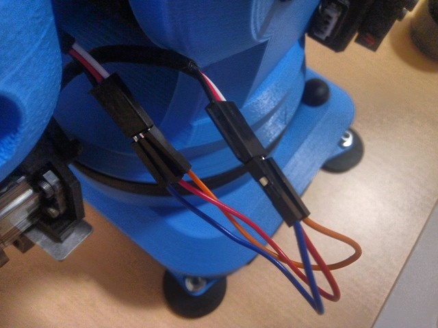
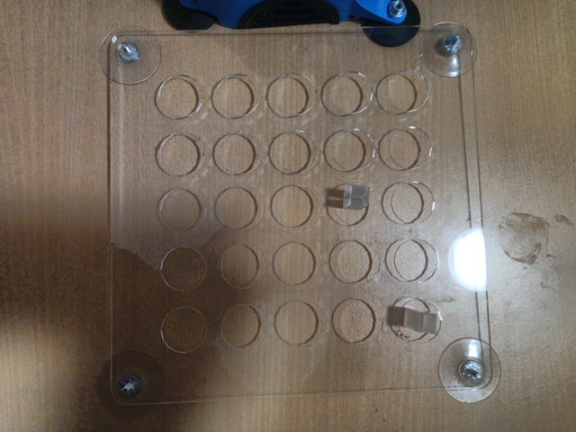
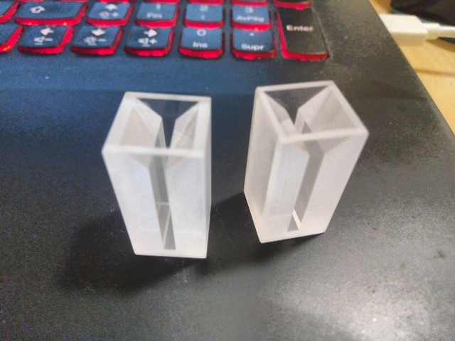
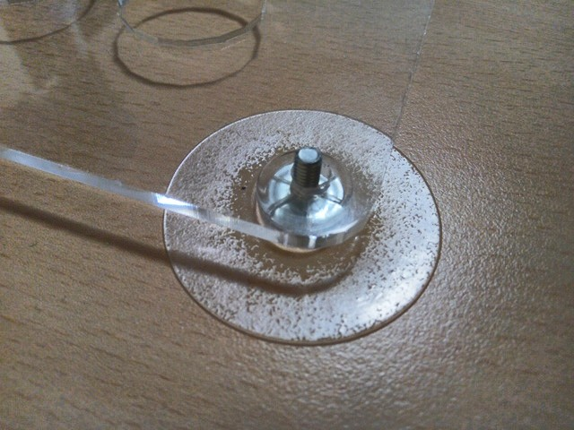

# 16. Wildcard week

## Robotics

For this I've been using the Niryo One 6 axis Robotic Arm.

Characteristics:

- 6 axis
- 3 Motors
- 3 Servo motors

I've used Niryo One to make a pick and place robot.

The working area has a grid of 5x5 spaces and I've used a coordinate system to name the poses in the learning system of Niryo, starting from (0,0) Right bottom corner to (4,4) top left corner of the grid.

The idea its use this to move [cubetes](https://www.wikiwand.com/en/Cuvette) using in spectroscopy.


### Assembling process

- Insert feet
- Attach clamp
- Connect clamp terminals with DuPont wires




### Enable clamps

The clamps need to be enabled under Niryo Studio.

- Select Standar Clamps.
- Click Enable.
- Test the clamps.

)


<figure class="video_container">
	<video controls="true" allowfullscreen="true">
		<source src="../../images/week16/niryo_06.mp4" type="video/mp4">
	</video>
</figure>


### Firsts Steps

Following the Guide from Niryo:

*For Linux*

- [Download the Niryo One Studio Program](https://drive.google.com/file/d/1PbiHoHrFK54YVzJFzgfM_a51oE6ReHKe/view)
- Extract the files.
- Make the program File executable using:

```
chmod +x NiryoOneStudio
```
- Execute the program by doing:

```
./NiryoOneStudio
```

- Power on by pulsing the button.
- Wait until the Power LED indicator turns Blue. This means the arm its on Hotspot mode.
- Using Niryo One Studio search for the Niryo One hotspot in the connection section.


- Once the connection has been established, start the automatic calibration process.


### Working area

I've designed this grid to train a pick and place program easily.






### Coordinate system

Niryo uses radians and every value in their axis means positive and negative rolling angle positions.

x, y, z and i, j, k.

X = base roll
Y = Pitch arm
Z = Yaw arm

I = Yaw elbow
J = pitch elbow
K = roll hand


### Automatic Calibration

**The calibration process its the most important step.** If you don't calibrate the robot properly you can cause unwanted collisions.

The sequence makes the robot reach the limits of the XYZ motors. The servos don't move since they have their own encoders for position tracking.

<figure class="video_container">
	<video controls="true" allowfullscreen="true">
		<source src="../../images/week16/niryo_00.mp4" type="video/mp4">
	</video>
</figure>

- Here is the tracking position showed in the 3D model on Niryo One Studio:


This is  video showing the calibration sequence.

<figure class="video_container">
	<video controls="true" allowfullscreen="true">
		<source src="../../images/week16/niryo_07.mp4" type="video/mp4">
	</video>
</figure>


### Position Tracking

Niryo Studio plots in 3D the sensed position of each axis on real time.

<figure class="video_container">
	<video controls="true" allowfullscreen="true">
		<source src="../../images/week16/niryo_01.mp4" type="video/mp4">
	</video>
</figure>


### Learning mode

The Learning mode ublocks the motors so you can move the arm in their 6 axis and it keeps tracking the positions.

Once you reach the desired pose you can:

- Save it
- Use it in a block for programming with niryo blocks.

<figure class="video_container">
	<video controls="true" allowfullscreen="true">
		<source src="../../images/week16/niryo_02.mp4" type="video/mp4">
	</video>
</figure>


### Pose saving

This is the process of saving the poses to use it later to program a sequence.

<figure class="video_container">
	<video controls="true" allowfullscreen="true">
		<source src="../../images/week16/niryo_03.mp4" type="video/mp4">
	</video>
</figure>


### Using pose as steps sequences

Once you have saved the positions you can uses it as sequences in a program. This video shows the process.

<figure class="video_container">
	<video controls="true" allowfullscreen="true">
		<source src="../../images/week16/niryo_04.mp4" type="video/mp4">
	</video>
</figure>


### Niryo blocks programming

This is easy to use interface to Python and ROS to program the robot using a [Scratch](scratch.mit.edu) like interface using programming blocks.

I've used the functions under Movement:

- Pick from
- Place from
- Move to pose
- Calibrate atm
- Loop for "10" times.


Running a sequence:

<figure class="video_container">
	<video controls="true" allowfullscreen="true">
		<source src="../../images/week16/niryo_05.mp4" type="video/mp4">
	</video>
</figure>


### Pick and place program

This is the result:

<figure class="video_container">
	<video controls="true" allowfullscreen="true">
		<source src="../../images/week16/niryo_08.mp4" type="video/mp4">
	</video>
</figure>

Another angle:

<figure class="video_container">
	<video controls="true" allowfullscreen="true">
		<source src="../../images/week16/niryo_09.mp4" type="video/mp4">
	</video>
</figure>

## Issues

Error code 32 in motors can mean one of the axis has been stuck, to solve this:

- Unstuck the axis.
- Reboot Niryo.

Sometimes Niryo will stop in the middle of a task.

- Just move to a initial pose and restart the routine.

Issues with ELF files caused by dual boooting Windows and Linux.

- I've tried to recover my files but I've a data corruption issue that damaged half of my work. This started on week 14 while using Python under Windows.
- Solution was to make a new repository clone and copy paste the recovered files.

<script id="asciicast-0laIRW4sVJBbP9bc9ee9dvDhN" src="https://asciinema.org/a/0laIRW4sVJBbP9bc9ee9dvDhN.js" async></script>

## Files

- [Grid](drawing.dxf)
- [Pick and place program for niryo](pick_and_place.xml)
