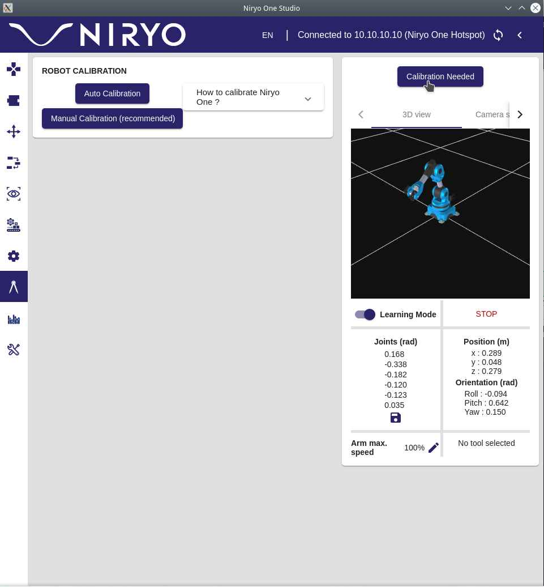

# 16. Wildcard week

## Robotics

For this I've been using the Niryo One 5 axis Robotic Arm.


### Assembling process

**Work in progress**

**Images**


### Firsts Steps

Following the Guide from Niryo:

*For Linux*

- [Download the Niryo One Studio Program](https://drive.google.com/file/d/1PbiHoHrFK54YVzJFzgfM_a51oE6ReHKe/view)
- Extract the files.
- Make the program File executable using:

```
chmod +x NiryoOneStudio
```
- Execute the program by doing:

```
./NiryoOneStudio
```

- Power on by pulsing the button.
- Wait until the Power LED indicator turns Blue. This means the arm its on Hotspot mode.
- Using Niryo One Studio search for the Niryo One hotspot in the connection section.




- Once the connection has been established, start the automatic calibration process.


### Automatic Calibration

<figure class="video_container">
	<video controls="true" allowfullscreen="true">
		<source src="../../images/week16/niryo_00.mp4" type="video/mp4">
	</video>
</figure>

- Here is the tracking position showed in the 3D model on Niryo One Studio:


### Position Tracking

<figure class="video_container">
	<video controls="true" allowfullscreen="true">
		<source src="../../images/week16/niryo_01.mp4" type="video/mp4">
	</video>
</figure>


### Learning mode


### Python interface

## Machine learning
