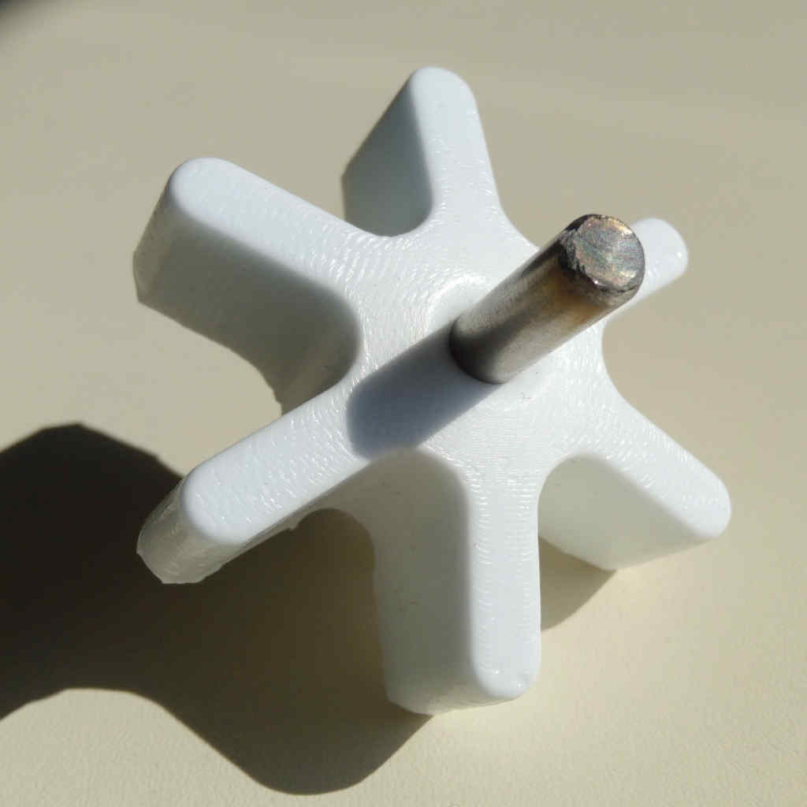
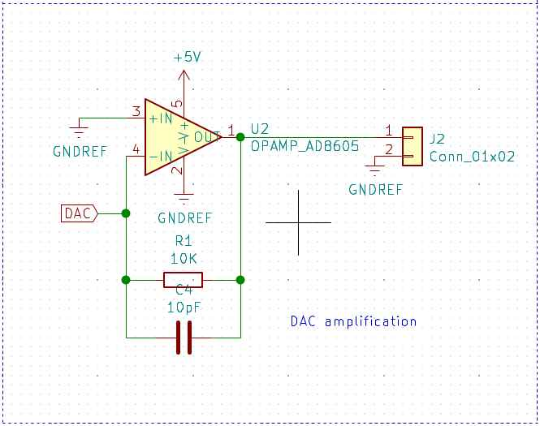

# 17. Applications and Implications.

## What will it do?

- Identify cow in production.
    - Using RFID reader.
        - Module RFID reader FDX, or, HDX - FDX.
- Measure the quantity of milk produced by the identified cow.
    - Using Hall effect food-safe sensor.
        - Module food-safe flow sensor.
- Estimate the Quality of milk based in its content of Fat/Protein.
    - Using Dielectric Spectroscopy.
        
        - Module signal emitter (DAC output).
        - AND
        - Module signal reader (ADC input).
- Save the data generated per cow.
    - Using SD memory card module.
        - Module SD card writer.
- Display information of the current process.
    - Using a LCD display.
        - Module display.
- Send data over USB, serial communication.
    - Using Module display,

## Who has done what beforehand?

### DairyMilk M6800 - Milk Sensors

[DairyMilk M6800 - Milk Sensors](https://www.gea.com/en/products/milking-farming-barn/dairymilk-milking-cluster/milk-sensors/index.jsp)

### Milk Checker

[Milk Checker](https://www.arbrown.com/english/products/milk_test/digital_mastitis_detector/)

<!---->
[Datasheet](https://www.arbrown.com/english/products/milk_test/digital_mastitis_detector/dl3.html)

This device its commonly use to verify the freshness of milk and to detect sub-clinical mastitis in the cattle.

The functioning its simple:

- Collecting a sample of milk.
- Perform the test by pulsing the test button.
- Check a paper printed reference table of values and possible correlations.
- Determine a diagnostic based in the lecture.

### Sensirion liquid flow meters

[Sensirion liquid flow meters](https://www.sensirion.com/en/flow-sensors/liquid-flow-meters/)

### Spectra

[Spectra Biomedical Imaging Device](https://www.open-electronics.org/spectra-portable-open-source-biomedical-imaging-system/)

## What will you design?

Prototypes:

Electronic circuit DAC, ADC, and hall effect board.

Food-safe hall effect flow sensor.

Waterproof encase.

RFID reader module.
<figure class="video_container">
  <video controls="true" allowfullscreen="true" poster="path/to/poster_image.png" width=100% loop>
    <source src="../../images/week11/demo_01.mp4" type="video/mp4">
  </video>
</figure>
1KHz sine wave generated by SAMD11C14 DAC capability.
<figure class="video_container">
  <video controls="true" allowfullscreen="true" poster="path/to/poster_image.png" width=100% loop>
    <source src="../../images/week17/ds_01.mp4" type="video/mp4">
  </video>
</figure>
Summary table:

> I2C Communication protocol.

| Module | Id | Address | Type |
| -- | -- | -- | -- |
| Module RFID reader FDX | 2 | 0x02 | Student |
| Module food-safe flow sensor | 3 | 0x03 | Student |
| Module signal emitter (DAC output) | 4 | 0x04 | Student |
| Module signal reader (ADC input) | 5 | 0x05 | Student |
| Module SD card writer | 6 | 0x06 | Student |
| Module display | 1 | | 0x01 | Teacher |

## What materials and components will be used?

### Materials

- Plexiglass
- Food-grade silicone
- PCB
- Bolts 4mm
- Nuts 4mm
- Seal ring
- Wires and connectors

### Components

- Module RFID reader FDX.
    - ATSAMD11C14 Microcontroller.
    - ...

- Module food-safe flow sensor.
    - ATSAMD11C14 Microcontroller.
    - ...
- Module signal emitter (DAC output).
    - ATSAMD11C14 Microcontroller.
    
    - ...
- Module signal reader (ADC input).
    - ATSAMD11C14 Microcontroller.
    - ...

    |Reference|Value                                 |Datasheet                                                                               |
    |---------|--------------------------------------|----------------------------------------------------------------------------------------|
    |U5       |ATSAMD11C14A-SS                       |                                                                                        |
    |J4       |Conn_01x04_Female                     |~                                                                                       |
    |J3       |Conn_01x04_Female                     |~                                                                                       |
    |SW1      |BUTTON_B3SN                           |https://omronfs.omron.com/en_US/ecb/products/pdf/en-b3sn.pdf                            |
    |R2       |10K                                   |~                                                                                       |
    |C7       |1uF                                   |                                                                                        |
    |R8       |10K                                   |~                                                                                       |
    |C3       |1uF                                   |                                                                                        |
    |J1       |Conn_01x05_Female                     |~                                                                                       |
    |U3       |Sensor_Hall-Effect_Analog_A1324LLHLT-T|https://www.allegromicro.com/~/media/Files/Datasheets/A1324-5-6-Datasheet.ashx          |
    |C5       |0.1 uF                                |                                                                                        |
    |J5       |Conn_01x04_Female                     |~               elina-nguyen-cadoret                                                                        |
    |C2       |0.1uF                                 |                                                                                        |
    |C1       |10uF                                  |                                                                                        |
    |D1       |LED                                   |https://optoelectronics.liteon.com/upload/download/DS-22-98-0002/LTST-C150CKT.pdf       |
    |R7       |100                                   |~                                                                                       |
    |C6       |0.1uF                                 |                                                                                        |
    |C10      |0.1uF                                 |                                                                                        |
    |J2       |Conn_01x02                            |~                                                                                       |
    |C8       |0.1uF                                 |                                                                                        |
    |C9       |0.1uF                                 |                                                                                        |
    |U4       |OPAMP_AD8605                          |https://www.analog.com/media/en/technical-documentation/data-sheets/AD8605_8606_8608.pdf|
    |R3       |10K                                   |~                                                                                       |
    |R5       |1K                                    |~                                                                                       |
    |R6       |10K                                   |~                                                                                       |
    |R4       |1K                                    |~                                                                                       |
    |U2       |OPAMP_AD8605                          |https://www.analog.com/media/en/technical-documentation/data-sheets/AD8605_8606_8608.pdf|
    |R1       |10K                                   |~                                                                                       |
    |C4       |10pF                                  |                                                                                        |
    |J6       |Conn_01x05_Female                     |~                                                                                       |
    |R11      |0                                     |~                                                                                       |
    |U1       |Regulator_Linear_LM3480-3.3V-100mA    |https://www.ti.com/lit/ds/symlink/lm3480.pdf                                            |
    |R10      |10k                                   |~                                                                                       |
    |R9       |10k                                   |~                                                                                       |

- Module SD card writer.
    - ATSAMD11C14 Microcontroller.
    - ...
- Module display.
    - ATSAMD11C14 Microcontroller.
    - ...

## Where will they come from?

This materials are available in the FabLab inventory. For now all of them will come from AgriLab.

## How much will they cost?

- The goal is less than 200 Euros.
- Actual price: To be determined in the next days.

## What parts and systems will be made?

- Module RFID reader FDX.
- Module food-safe flow sensor.
- Module signal emitter (DAC output).
- Module signal reader (ADC input).
- Module SD card writer.
- Module display.

## What processes will be used?

- PCB milling with ROLAND SRM-20
- Mold and casting with CNC machine.
- Embedded programming with Atmel MPLAB Harmony.

## What questions need to be answered?

- How Fat and Protein are related to the step response at certain Frequencies.
- Find the range of frequencies for fat and protein in fresh Milk.
- Find the step response of

## How will it be evaluated?

> Finding a correlation between Step response and Fat Protein that could be measure with the DAC and DCA modules.
> - By being used in an actual farm.

**Note:** As week22 I've decided to change this to the next testing plan also written in [week19 documentation](../../assignments/week19/#time-management)

For the testing I've changed my idea since the time available is less for me. My testing will be to measure different samples:

- 100ml From a bottle milk
- 100ml of creme.
- 100ml of coca-cola
- 100ml of tap water.

I'll take note of the values of the samples and compare the results in a table like this:

| Substance | Samples per second | Min | Max | Average |
| -- | -- | -- | -- | -- |
| | | | | |
