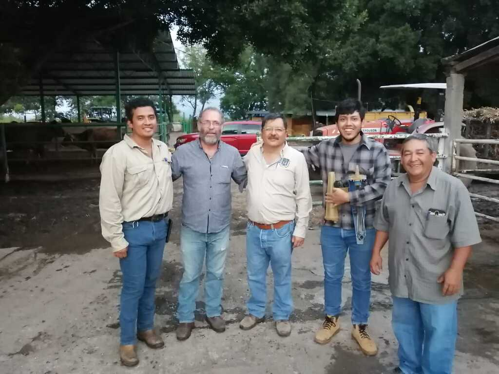
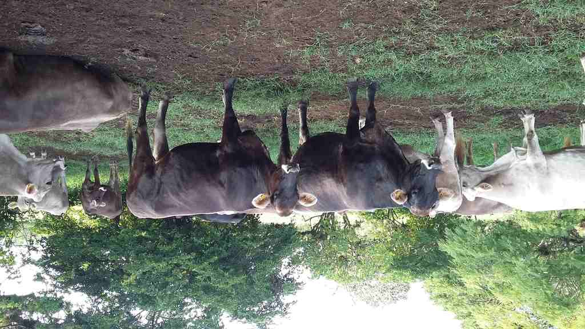
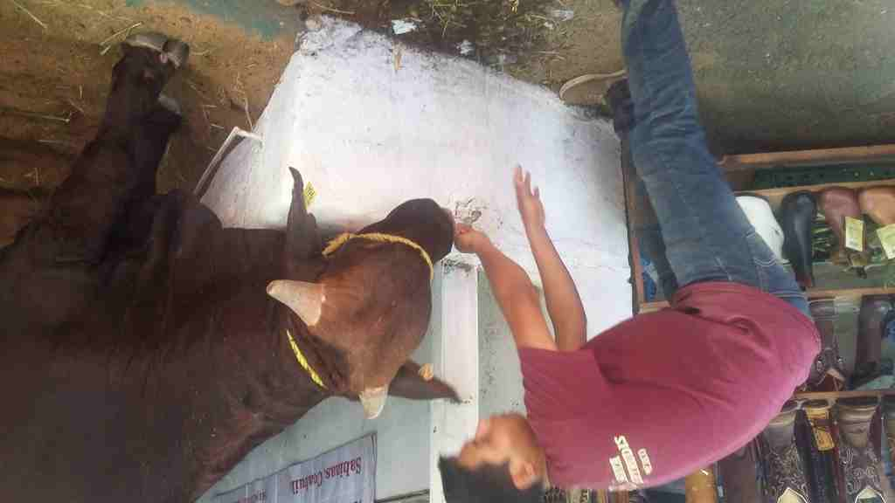
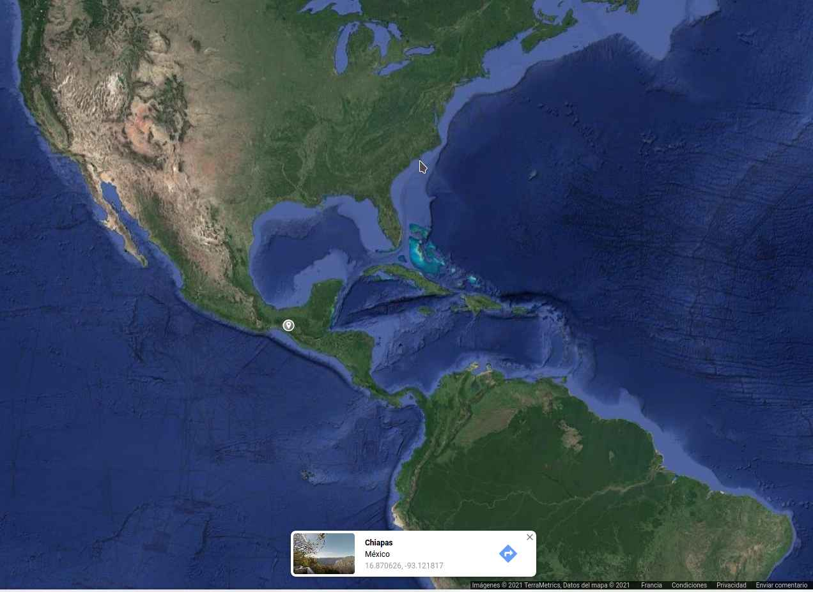

# 18. Invention, Intellectual Property and Business Models.

## Context

I've been working closely with agricultural technicians for the last 8 years in Mexico. During this time I've realized the many challenges associated to the supply chain of reliable tools, the accessibility of data management platforms and the complexity of the existent solutions.

For this reason I've developed my final project focused on bringing an easy to access tool to help increase the reliability of milk produced by small farmers in under developed countries such as Mexico.

Photo after a field trip to the Comalapa Region in the south of Mexico, close to the border to Guatemala.

Photo of Holstein, Brahman cattle in the region of Ocozocuautla, Chiapas in Mexico, using RFID earrings for electronic identification.

Photo of a young boy serving water to a cow during the national dairy producers expo in Jalisco, Mexico.

## Dissemination plan

This project its currently supported by:

- [AgriLab](https://agrilab.unilasalle.fr) in France.

- [The office for science and technology of the government of Chiapas state in Mexico.](https://icti.chiapas.gob.mx/)

- [The MIT Global Startup Labs program.](https://gsl.mit.edu/).

The project its expected to have a trial and usage in 2022 in Chiapas State in Mexico in the Ocozocuautla region, with the help of the local dairy producers association.

During the next months I'll apply to different seed funding initiatives to help me out continue the development of the device.

In the last year I've also know [Field Ready](https://www.fieldready.org/) and designed a system for tracking devices manufactured mostly in fablabs around the world with the purpose to help people in difficult environments under disaster by climate, or war.

I've also collaborated with [Hackaday](https://hackaday.com) during the [Hackaday Prize 2020](https://hackaday.com/2020/07/10/dream-team-members-announced-for-the-2020-hackaday-prize/) and [Public Lab](https://publiclab.org) and got the understanding of the requirements for open-source scientific kits.

My plan summarizes in this points:

- Trial in 2022 in Chiapas, Mexico.
- Develop further towards an scientific kit.
- Open source resources.
- Look out for team mates.
- Distributing the resources through Hackaday, Field Ready and PublicLab.
- Search for seed funding towards a commercial product development.

### Details

About the use of seed funding resources the main points to cover for seed funding are:

- The associated costs to Product development prior to final product launching.
- [Equipment](#equipment) or renting a space in a Fablab.
- Fulfill with localized legal permissions and regulations.

About who will build the device:

For the first three trials the device will be build by me, [Antonio Anaya](../../about/index.html), but for the future steps the device is ment to be build by anyone that has access to the minimum equipment required but specially to people with access to fablabs.

You will find the instructions to replicate my final project in the next [link](../../projects/for_replication).

## Equipment

For the next phase the project will require the hosting by a FabLab with the following list of equipment:

- Electronics lab with a sufficient inventory for microcontroller board developments and prototypes.
- Roland Roland SRM 20 milling machine or certified chemical etching working area.
- Prusa Mk3 3D printer.
- 120 m wide Laser cutter machine.
- Materials and connectors inventory.

Another possibility its to acquire the equipment but that will increase the cost of the production by more than 20'000 USD.

## Trials

The trial will be performed by veterinary technicians from public and private institutions dedicated to monitor the quality of dairy productions in the central Region of Chiapas in Mexico.

Schedule:

- First trial starting in January 2022.
- First cut in March 2022.
- Prototype 2 in April 2022.
- Second trial in May 2022.
- Second cut in Jun 2022.
- Prototype 3 in July 2022.

### First
This will be the feasibility of the device.

Its mean to be conducted with the help of technicians and researchers of the [UNACH](https://www.unach.mx/campus-ii-tuxtla-gutierrez/facultad-de-medicina-veterinaria-y-zootecnia) due to their knowledge of the location and understanding of the working conditions of the local farms in the Ocozocuautla region.

The sample size will be one farm and 50 milk samples per week from different animals, for 2 months.

The method will be developed by the researchers based on a [Scientific Comparative experiments](https://sciencing.com/difference-between-control-controlled-variable-8724178.html) but it will consider the comparison current commercial solutions and the data from the MILQ device.

### Second

This will be focus in the interaction and will compare two form factors of the device. Currently there's only one form factor but the second one will be developed on the following months.

The methodology will be based on the "Design thinking, User Centered Product design methodology" of [IDEO, and Stanford](https://changelabs.stanford.edu/system-transformation-methodologies-2/design-thinking) and later use the data obtained will be process using [AB comparison methodology](https://www.wikiwand.com/en/A/B_testing)

### Third

This will be focus to complain with Mexican norms and standards and will consider the replacement of materials prior to a pre-commercial release.

The methodology will be based on the [COFEPRIS regulations *in Spanish*](https://www.gob.mx/cms/uploads/attachment/file/540589/GUIA_REGULACION_PRODUCTOS_BIOLOGICOS.PDF) The MExican office for regulations for products for veterinarian usage.

## Intellectual Property

The device will currently run under the [CERN Open Hardware License](https://ohwr.org/cernohl) [strongly reciprocal variant](https://ohwr.org/cern_ohl_s_v2.txt). This license was chosen for being a scientific hardware license, compared to the [Open Soruce Hardware Association](https://www.oshwa.org/faq/) it has stronger scientifical support.

CERN Open Hardware Licence Version 2 - Strongly Reciprocal

Preamble

CERN has developed this licence to promote collaboration among
hardware designers and to provide a legal tool which supports the
freedom to use, study, modify, share and distribute hardware designs
and products based on those designs. Version 2 of the CERN Open
Hardware Licence comes in three variants: CERN-OHL-P (permissive); and
two reciprocal licences: CERN-OHL-W (weakly reciprocal) and this
licence, CERN-OHL-S (strongly reciprocal).

The CERN-OHL-S is copyright CERN 2020. Anyone is welcome to use it, in
unmodified form only.

Use of this Licence does not imply any endorsement by CERN of any
Licensor or their designs nor does it imply any involvement by CERN in
their development.

1 Definitions

  1.1 'Licence' means this CERN-OHL-S.

  1.2 'Compatible Licence' means

       a) any earlier version of the CERN Open Hardware licence, or

       b) any version of the CERN-OHL-S, or

       c) any licence which permits You to treat the Source to which
          it applies as licensed under CERN-OHL-S provided that on
          Conveyance of any such Source, or any associated Product You
          treat the Source in question as being licensed under
          CERN-OHL-S.

  1.3 'Source' means information such as design materials or digital
      code which can be applied to Make or test a Product or to
      prepare a Product for use, Conveyance or sale, regardless of its
      medium or how it is expressed. It may include Notices.

  1.4 'Covered Source' means Source that is explicitly made available
      under this Licence.

  1.5 'Product' means any device, component, work or physical object,
      whether in finished or intermediate form, arising from the use,
      application or processing of Covered Source.

  1.6 'Make' means to create or configure something, whether by
      manufacture, assembly, compiling, loading or applying Covered
      Source or another Product or otherwise.

  1.7 'Available Component' means any part, sub-assembly, library or
      code which:

       a) is licensed to You as Complete Source under a Compatible
          Licence; or

       b) is available, at the time a Product or the Source containing
          it is first Conveyed, to You and any other prospective
          licensees

            i) as a physical part with sufficient rights and
               information (including any configuration and
               programming files and information about its
               characteristics and interfaces) to enable it either to
               be Made itself, or to be sourced and used to Make the
               Product; or
           ii) as part of the normal distribution of a tool used to
               design or Make the Product.

  1.8 'Complete Source' means the set of all Source necessary to Make
      a Product, in the preferred form for making modifications,
      including necessary installation and interfacing information
      both for the Product, and for any included Available Components.
      If the format is proprietary, it must also be made available in
      a format (if the proprietary tool can create it) which is
      viewable with a tool available to potential licensees and
      licensed under a licence approved by the Free Software
      Foundation or the Open Source Initiative. Complete Source need
      not include the Source of any Available Component, provided that
      You include in the Complete Source sufficient information to
      enable a recipient to Make or source and use the Available
      Component to Make the Product.

  1.9 'Source Location' means a location where a Licensor has placed
      Covered Source, and which that Licensor reasonably believes will
      remain easily accessible for at least three years for anyone to
      obtain a digital copy.

 1.10 'Notice' means copyright, acknowledgement and trademark notices,
      Source Location references, modification notices (subsection
      3.3(b)) and all notices that refer to this Licence and to the
      disclaimer of warranties that are included in the Covered
      Source.

 1.11 'Licensee' or 'You' means any person exercising rights under
      this Licence.

 1.12 'Licensor' means a natural or legal person who creates or
      modifies Covered Source. A person may be a Licensee and a
      Licensor at the same time.

 1.13 'Convey' means to communicate to the public or distribute.

2 Applicability

  2.1 This Licence governs the use, copying, modification, Conveying
      of Covered Source and Products, and the Making of Products. By
      exercising any right granted under this Licence, You irrevocably
      accept these terms and conditions.

  2.2 This Licence is granted by the Licensor directly to You, and
      shall apply worldwide and without limitation in time.

  2.3 You shall not attempt to restrict by contract or otherwise the
      rights granted under this Licence to other Licensees.

  2.4 This Licence is not intended to restrict fair use, fair dealing,
      or any other similar right.

3 Copying, Modifying and Conveying Covered Source

  3.1 You may copy and Convey verbatim copies of Covered Source, in
      any medium, provided You retain all Notices.

  3.2 You may modify Covered Source, other than Notices, provided that
      You irrevocably undertake to make that modified Covered Source
      available from a Source Location should You Convey a Product in
      circumstances where the recipient does not otherwise receive a
      copy of the modified Covered Source. In each case subsection 3.3
      shall apply.

      You may only delete Notices if they are no longer applicable to
      the corresponding Covered Source as modified by You and You may
      add additional Notices applicable to Your modifications.
      Including Covered Source in a larger work is modifying the
      Covered Source, and the larger work becomes modified Covered
      Source.

  3.3 You may Convey modified Covered Source (with the effect that You
      shall also become a Licensor) provided that You:

       a) retain Notices as required in subsection 3.2;

       b) add a Notice to the modified Covered Source stating that You
          have modified it, with the date and brief description of how
          You have modified it;

       c) add a Source Location Notice for the modified Covered Source
          if You Convey in circumstances where the recipient does not
          otherwise receive a copy of the modified Covered Source; and

       d) license the modified Covered Source under the terms and
          conditions of this Licence (or, as set out in subsection
          8.3, a later version, if permitted by the licence of the
          original Covered Source). Such modified Covered Source must
          be licensed as a whole, but excluding Available Components
          contained in it, which remain licensed under their own
          applicable licences.

4 Making and Conveying Products

You may Make Products, and/or Convey them, provided that You either
provide each recipient with a copy of the Complete Source or ensure
that each recipient is notified of the Source Location of the Complete
Source. That Complete Source is Covered Source, and You must
accordingly satisfy Your obligations set out in subsection 3.3. If
specified in a Notice, the Product must visibly and securely display
the Source Location on it or its packaging or documentation in the
manner specified in that Notice.

5 Research and Development

You may Convey Covered Source, modified Covered Source or Products to
a legal entity carrying out development, testing or quality assurance
work on Your behalf provided that the work is performed on terms which
prevent the entity from both using the Source or Products for its own
internal purposes and Conveying the Source or Products or any
modifications to them to any person other than You. Any modifications
made by the entity shall be deemed to be made by You pursuant to
subsection 3.2.

6 DISCLAIMER AND LIABILITY

  6.1 DISCLAIMER OF WARRANTY -- The Covered Source and any Products
      are provided 'as is' and any express or implied warranties,
      including, but not limited to, implied warranties of
      merchantability, of satisfactory quality, non-infringement of
      third party rights, and fitness for a particular purpose or use
      are disclaimed in respect of any Source or Product to the
      maximum extent permitted by law. The Licensor makes no
      representation that any Source or Product does not or will not
      infringe any patent, copyright, trade secret or other
      proprietary right. The entire risk as to the use, quality, and
      performance of any Source or Product shall be with You and not
      the Licensor. This disclaimer of warranty is an essential part
      of this Licence and a condition for the grant of any rights
      granted under this Licence.

  6.2 EXCLUSION AND LIMITATION OF LIABILITY -- The Licensor shall, to
      the maximum extent permitted by law, have no liability for
      direct, indirect, special, incidental, consequential, exemplary,
      punitive or other damages of any character including, without
      limitation, procurement of substitute goods or services, loss of
      use, data or profits, or business interruption, however caused
      and on any theory of contract, warranty, tort (including
      negligence), product liability or otherwise, arising in any way
      in relation to the Covered Source, modified Covered Source
      and/or the Making or Conveyance of a Product, even if advised of
      the possibility of such damages, and You shall hold the
      Licensor(s) free and harmless from any liability, costs,
      damages, fees and expenses, including claims by third parties,
      in relation to such use.

7 Patents

  7.1 Subject to the terms and conditions of this Licence, each
      Licensor hereby grants to You a perpetual, worldwide,
      non-exclusive, no-charge, royalty-free, irrevocable (except as
      stated in subsections 7.2 and 8.4) patent licence to Make, have
      Made, use, offer to sell, sell, import, and otherwise transfer
      the Covered Source and Products, where such licence applies only
      to those patent claims licensable by such Licensor that are
      necessarily infringed by exercising rights under the Covered
      Source as Conveyed by that Licensor.

  7.2 If You institute patent litigation against any entity (including
      a cross-claim or counterclaim in a lawsuit) alleging that the
      Covered Source or a Product constitutes direct or contributory
      patent infringement, or You seek any declaration that a patent
      licensed to You under this Licence is invalid or unenforceable
      then any rights granted to You under this Licence shall
      terminate as of the date such process is initiated.

8 General

  8.1 If any provisions of this Licence are or subsequently become
      invalid or unenforceable for any reason, the remaining
      provisions shall remain effective.

  8.2 You shall not use any of the name (including acronyms and
      abbreviations), image, or logo by which the Licensor or CERN is
      known, except where needed to comply with section 3, or where
      the use is otherwise allowed by law. Any such permitted use
      shall be factual and shall not be made so as to suggest any kind
      of endorsement or implication of involvement by the Licensor or
      its personnel.

  8.3 CERN may publish updated versions and variants of this Licence
      which it considers to be in the spirit of this version, but may
      differ in detail to address new problems or concerns. New
      versions will be published with a unique version number and a
      variant identifier specifying the variant. If the Licensor has
      specified that a given variant applies to the Covered Source
      without specifying a version, You may treat that Covered Source
      as being released under any version of the CERN-OHL with that
      variant. If no variant is specified, the Covered Source shall be
      treated as being released under CERN-OHL-S. The Licensor may
      also specify that the Covered Source is subject to a specific
      version of the CERN-OHL or any later version in which case You
      may apply this or any later version of CERN-OHL with the same
      variant identifier published by CERN.

  8.4 This Licence shall terminate with immediate effect if You fail
      to comply with any of its terms and conditions.

  8.5 However, if You cease all breaches of this Licence, then Your
      Licence from any Licensor is reinstated unless such Licensor has
      terminated this Licence by giving You, while You remain in
      breach, a notice specifying the breach and requiring You to cure
      it within 30 days, and You have failed to come into compliance
      in all material respects by the end of the 30 day period. Should
      You repeat the breach after receipt of a cure notice and
      subsequent reinstatement, this Licence will terminate
      immediately and permanently. Section 6 shall continue to apply
      after any termination.

  8.6 This Licence shall not be enforceable except by a Licensor
      acting as such, and third party beneficiary rights are
      specifically excluded.

## Business model based in Lean Business Canvas

### Key partners:

Current:

- [AgriLab](https://agrilab.unilasalle.fr) in France.

- [The office for science and technology of the government of Chiapas state in Mexico.](https://icti.chiapas.gob.mx/)

- [The MIT Global Startup Labs program.](https://gsl.mit.edu/).

Potential:

- [Field Ready](https://www.fieldready.org/)

- [Hackaday](https://hackaday.com)

- [Public Lab](https://publiclab.org)

### Key activities:

- [Decentralized manufacturing.](https://www.fishbowlinventory.com/blog/2018/05/02/the-difference-between-centralized-and-decentralized-manufacturing/)

- Electronics manufacturing.

- Digital fabrication.

### Key resources:

- The minimum equipment and [inventory of a FabLab](https://docs.google.com/spreadsheets/u/0/d/1U-jcBWOJEjBT5A0N84IUubtcHKMEMtndQPLCkZCkVsU/pub?single=true&gid=0&output=html) its needed.

- The FabAcademy Network.

- The Field Ready network.

### Value propositions:

- Milk Quality control inspection device to determine quality of the milk produced "in situ"

- An supply chain simplified device accessible to difficult to access locations.

- A user friendly product to being used with a short learning curve.

### Customer relationships:

- Remote customer assistance.

- "In situ" assistance by current technicians in field.

- Community workshops by region.

### Channels:

#### Awareness:

Currently physically reaching out local dairy production associations in the south region of Chiapas and proposing an early access to the device in exchange of the permission to participate in the trials.

#### Evaluation:

The device its meant to give access to small farmers to a laboratory analysis to improve their income based on the acquisition price of their dairy production.

#### Purchase/Delivery:

Its planned to sell and deliver the device by using the local dairy association shops under commission. There's also the option to rent the device for a limited ammount of time.

After sales support will be given by Asociación de veterinarios y zootecnicos de Chiapas (Vet association of Chiapas State in Mexico).

### Revenue streams:

The revenue streams are still unknown but the goal price for monthly subscription to acquire the device will be 1000 MXN Month per device per farm with after sales support.
The device its planned to have a annual price of 6'000 MXN. Pesos. And the after sales support of 600 MXN month.

They're three streams of income:

- Monthly subscription 1'000 MXN that includes the device rent and support.
- One time payment for the device of $6'000 MXN and one year support included.
- Extra after sales support 600 MXN per month.

#### Details

The annual production of milk in the Tropical south zone of Mexico has been 1500 million liters per year from the year 2000 to the year 2010.

The average revenue of a small dairy producer in the south region in Mexico, which is the poorest region the country is a minimum of 4.2 MXN per liter, and the minimum production per day its an average of 13 liters per day per cow. The minimum amount of cattle to be part of the local dairy association is 10 cows.

So the minimum brute income will be around 16'000 MXN per month with an approximate production cost of 75% the final income per month will be 3'000 MXN per month. This income its for the smallest of the associates but they represent only 10% of the total of producers and the average cattle per producers its around 70 cows.  

The real cost per device as a product its yet to be determined, the plan its to make a revenue of it, still the numbers are difficult to say given the current state of the project, in the next stages I'll update the amounts in this section.

### Customer segments:

Niche market is the dairy producers who need to sustain the quality of its production and can't afford a laboratory test or facility.

Currently the customers are:

- Asociación Ganadera de Coita, Chiapas, Mexico.

- Asociación de veterinarios y zootecnicos de Chiapas.

## Slide and Video for final presentation

The final presentation of the project to Professor [Neil Gershenfeld](https://www.wikiwand.com/fr/Neil_Gershenfeld) was scheduled for June 16th 2021 11:00 hrs Boston time.

### Slide

### video

<figure class="video_container">
	<video controls="true" allowfullscreen="true">
		<source src="../../presentation.mp4" type="video/mp4">
	</video>
</figure>
