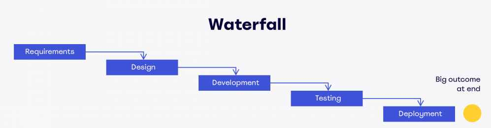
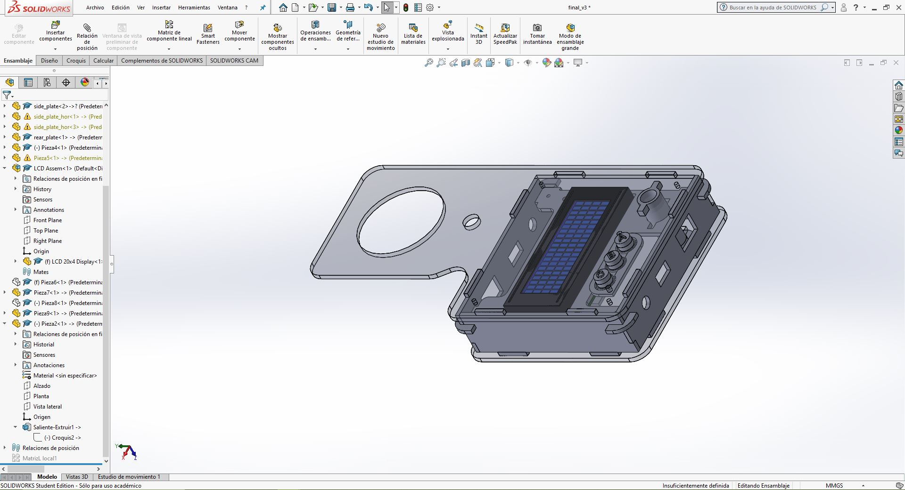

# 19. Project development.

## Introduction:

My final project development will consist in the design and manufacture of a device inspired on this form factor:

[Milk Checker](https://www.arbrown.com/english/products/milk_test/digital_mastitis_detector/)

<!---->
[Datasheet](https://www.arbrown.com/english/products/milk_test/digital_mastitis_detector/dl3.html)

Concepts of form factor and electronics:

## Time management

You can check a table of my planned time management [here](#what-will-happen-when).

The method I've used is the waterfall method of development:

### Requirements

- SAMD11C14 as the main micro-controller.
    - Pros: Cheap, powerful, 32 bits, Modern, DAC: 350 ksps.
    - Cons: limited memory: 14 Kb, Limited pinouts: 12.

- A display to show information.
    - Use the i2c 20x4 ASCII display available at the fablab.

- Affordable battery replacement.

- Quick and easy to build.

- Interactive User Interface.

### Design

The design process consisted on taking the form factor of the **Milk checker (c)**:

### Development

From the concept to the idea and to the actual physical object I've been thinking in ways to make it easy and quick to build. Thus for that I've selected the next requirements

The Development process its being started from 3D design. I've used [Solidworks](https://solidworks.com) because its a software I've used for more than 10 years, unlike [XDesign](https://www.solidworks.com/es/media/solidworks-xdesign-design-go) I need to use [Windows OS](https://www.microsoft.com/fr-fr/windows) but the stability and performance its much better on my current system a 7 year old LENOVO Y700 laptop.

The materials I've chose for the body of the device are:

- White Plexiglass
- Transparent Plexiglass
- Pink PLA filament

I've chose this materials because those are widely available on AgriLab inventory  and the pink PLA was circumstantial since the 3D printer I've used had this material loaded already.

Circuit design had more iterations since I was trying to achieve [Dielectrical spectroscopy](http://academy.cba.mit.edu/classes/input_devices/DS.pdf). The configurations were:

- DAC Sinus Signal generator up to 80 KHz.
- Multivibrator 80 KHz.
- DAC Electrical conductivity.
- Design of probes or inserts for sensing.
- Push button board for analog output for control of the device.

Software design was focus on showing the information and process the sample measurements, I had the idea to show the next information in the LCD screen.

- RFID number.
- AgriLab Logo.
- Graph bar.
- Sample size.
- Current sample value.
- Average value for all the samples.
- Menu for settings.

## What tasks have been completed, and what tasks remain?

Due to a short of time caused by health issues I've decided to cut tasks and focus in the simplest functions of the project:

Completed tasks:

- Identify cow in production using RFID.
- Display information of current process.

Remaining tasks:

- Measure the quantity of milk produced by identified cow.
- Estimate the Quality of milk based in its content of Fat/Protein.
- Save the data generated per cow.
- Send data over USB, serial communication.

New tasks added:

- Identify fresh and 5 days not refrigerated milk.

## What has worked? what hasn't?

The DAC output of my final project has worked but with a Frequency limited to 1 KHz, to increase the frequency of the signal generated I've worked on a Multivibrator circuit. To generate an AC signal up to 1 MHz frequency.

The Multivibrator Circuit has also worked producing a capped frequency of 40Khz. But due to multiple mistakes in the tracing process I've had problems to finally make it to work.

The operational amplifier hasn't work due to a misunderstanding of the pin out connections and components used, like the 10K Ohms resistor added to the output instead the input.

## What questions need to be resolved?

The correlation between dielectric spectroscopy and the quality of milk based in the proportion of Fat and Protein needs to be approached in detail and with access to a production facility.

## What will happen when?

| week01 to week16 | week17 | week18 | week19 | week20 |
| -- | -- | -- | -- | -- |
| General and user research |
| | Proposals, Hardware, Software, Interaction |
| | | Second prototype, Workbench test. |
| | | | First prototype, workbench test, feedback and rework |
| | | | | Video demo |

## what have you learned?

During the last four weeks I've experimented with different things for my final project especially for the electronics here I summarize the most important things I've learned.

### Electronic circuits design in details

During the weeks I've learned how to produce electronics in different shapes by importing contour files in DXF format in Kicad.

Button board with LEDs:

Immersive electrode for the transmission of Alternate Current signals:

SAMD11C14 based board for DAC 1 Khz and Analog to Digital capturing:

Usage of connectors for clean wiring of electronics:

I've made a USB cable connector using a 4 pin connector instead of the USB milled connector used during the weeks on my designs.

### Packaging

I've made several iterations in the packaging development the common failures were caused by:

- Kerf.
- Brittleness of materials.
- Mechanical assembly of laser cut pieces.

This first prototype was impossible to assembly without breaking the pieces due to its tighten assembly connections.

### Prototyping and iteration

Prototyping takes time, its the most obvious thing but it can be hard to make it on time without considering every component.

For that I've reasoned in the next following steps for a successful project integration:

- Initial form factor design
- User interaction considerations
- Inputs and outputs
- Electronics design
- Power supply selection
- Location of components inside and outside the package
- Wiring
- Packaging design
- Joining mechanisms

This reassembles the [FabAcademy program](https://fabacademy.org) and now I've a better understanding about the order of the assignments we have been following during this weeks.

### DAC Signal generation with SAMD11C14 microcontroller.

I've learned to generated signals using the [MPLAB IDE of Microchip](https://microchip-mplab-harmony.github.io/csp_apps_sam_d11/apps/dac/dac_wav_gen/readme.html) with the Harmony library.

This is the result observed in the oscilloscope.

