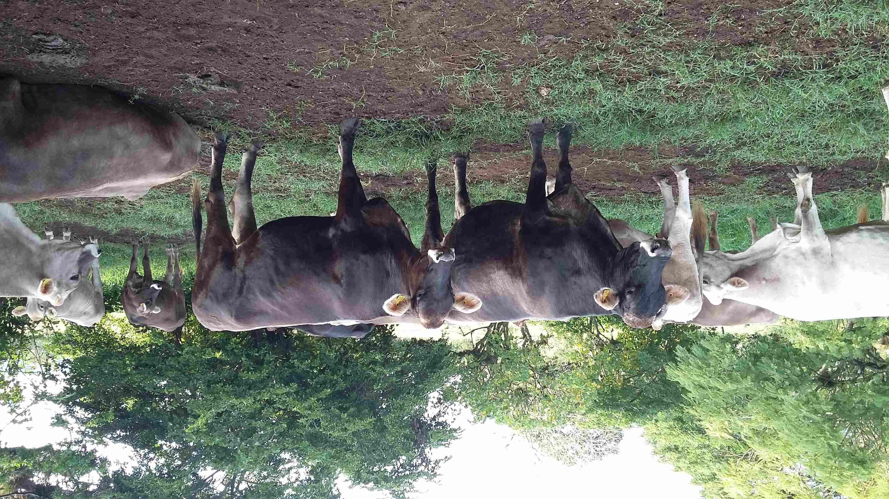
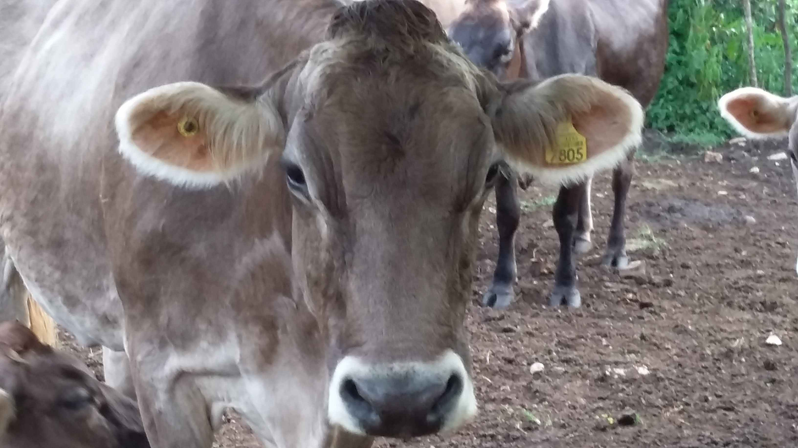

# Final Project

## On site Milk QC and animal identification system:

While working in Mexico, I discovered the need for an affordable data acquisition system.

Project board:

## Research

Currently RFID is the preferred technology for farm animals identification, in Mexico this is something that
has been unsuccessfully deployed due to multiple factors, but the most important one is supply chain and distribution.

[RFID stands for Radio Frequency Identification](https://www.wikiwand.com/en/Radio-frequency_identification), in animal identification it can be found as a earring, a collar or skin implant.

In Mexico the standard RFID earring is imported and then distributed, making it not accessible to small producers in rural areas, and they are the bast majority of producers making almost 60% of the country total production. Worldwide we can find the same situation in underdeveloped countries.

My idea is to design a RFID system that can be made on FabLabs and also an Milk Quality control sensor to measure protein/fat content and also somatic cells. Somatic cells are present as part of animals immune system, and some diseases can be prevented by counting somatic cells in the dairy production.

My approach for a sustainable farm is the one that makes decisions based on data captured in the working field, to make a better use of natural resources and also all sort of different supplies. The indiscriminate use of hormones and antibiotics in animals is a problem that affects current disease control systems, producers financial viability and the consumer. One of the objectives is to identify diseases while in the dairy production and apply the antibiotics on the affected animal. Currently most farmers apply vaccines periodically without any analysis and this makes vaccination an expensive activity that most producers avoid because of their current financial status.

To indirectly measure fat/protein in milk I've found spectroscopy as a viable solution. Currently they're cheaper CHIPS like the [AS7265x](https://www.sparkfun.com/products/15050) that can be used to classify previously measured fat/protein samples of milk based in their measured spectrum.

So one of the steps in this research will be to measure a variety of milk samples using the AS7265x and a laboratory standard spectrometer to correlate the results.

The other important aspect I'm considering for this project is the interaction design. User-centered design for agriculture is an important topic, since most tools need an specialized trained professional to be used. In some places this will not be a problem, but in Mexico, in my region the technicians/animals is 3000 animals for each technician.

### A comparison of current methods in Mexico and a Experimental farm in France:

<iframe frameborder="0" scrolling="no" marginheight="0" marginwidth="0"width="788.54" height="443" type="text/html" src="https://www.youtube.com/embed/CrMBq_2zi3U?autoplay=0&fs=0&iv_load_policy=3&showinfo=0&rel=0&cc_load_policy=0&start=0&end=0&origin=https://youtubeembedcode.com">
<small><a href="https://youtubeembedcode.com/es/">https://youtubeembedcode.com/es/</a></small>

<small><a href="https://mibew.org/">afforadablle targeted web traffic</a></small>

<small><a href="https://youtubeembedcode.com/es/">https://youtubeembedcode.com/es/</a></small>

<small><a href="https://mibew.org/">afforadablle targeted web traffic</a></small>
</iframe>

<iframe frameborder="0" scrolling="no" marginheight="0" marginwidth="0"width="788.54" height="443" type="text/html" src="https://www.youtube.com/embed/UNGkzNqBQVc?autoplay=0&fs=0&iv_load_policy=3&showinfo=0&rel=0&cc_load_policy=0&start=0&end=0&origin=https://youtubeembedcode.com">
<small><a href="https://youtubeembedcode.com/en/">https://youtubeembedcode.com/en/</a></small>

<small><a href="https://mibew.org/">increase visitors in your website</a></small>
</iframe>
