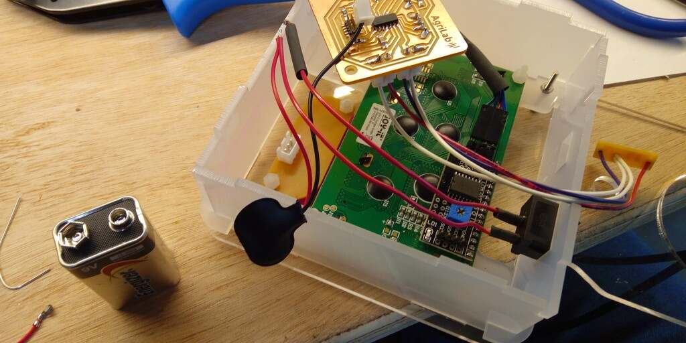

# Final project: MILQ


## Description

MILQ its a device for checking the freshness of a milk sample by measuring electrical conductivity, it uses a disposable espresso cup as sample collector and plots a graph on its LCD display.

Characteristics:

- Based on ATSAMD11C14A ARM 32 bits Microcontroller.
- 800 Samples on 10 secs.
- 9V battery


## License

[CERN Open Hardware Licence Version 2 - Strongly Reciprocal](../../files/project/cern_ohl_s_v2.txt)

```
CERN Open Hardware Licence Version 2 - Strongly Reciprocal


Preamble

CERN has developed this licence to promote collaboration among
hardware designers and to provide a legal tool which supports the
freedom to use, study, modify, share and distribute hardware designs
and products based on those designs. Version 2 of the CERN Open
Hardware Licence comes in three variants: CERN-OHL-P (permissive); and
two reciprocal licences: CERN-OHL-W (weakly reciprocal) and this
licence, CERN-OHL-S (strongly reciprocal).

The CERN-OHL-S is copyright CERN 2020. Anyone is welcome to use it, in
unmodified form only.

Use of this Licence does not imply any endorsement by CERN of any
Licensor or their designs nor does it imply any involvement by CERN in
their development.


1 Definitions

  1.1 'Licence' means this CERN-OHL-S.

  1.2 'Compatible Licence' means

       a) any earlier version of the CERN Open Hardware licence, or

       b) any version of the CERN-OHL-S, or

       c) any licence which permits You to treat the Source to which
          it applies as licensed under CERN-OHL-S provided that on
          Conveyance of any such Source, or any associated Product You
          treat the Source in question as being licensed under
          CERN-OHL-S.

  1.3 'Source' means information such as design materials or digital
      code which can be applied to Make or test a Product or to
      prepare a Product for use, Conveyance or sale, regardless of its
      medium or how it is expressed. It may include Notices.

  1.4 'Covered Source' means Source that is explicitly made available
      under this Licence.

  1.5 'Product' means any device, component, work or physical object,
      whether in finished or intermediate form, arising from the use,
      application or processing of Covered Source.

  1.6 'Make' means to create or configure something, whether by
      manufacture, assembly, compiling, loading or applying Covered
      Source or another Product or otherwise.

  1.7 'Available Component' means any part, sub-assembly, library or
      code which:

       a) is licensed to You as Complete Source under a Compatible
          Licence; or

       b) is available, at the time a Product or the Source containing
          it is first Conveyed, to You and any other prospective
          licensees

            i) as a physical part with sufficient rights and
               information (including any configuration and
               programming files and information about its
               characteristics and interfaces) to enable it either to
               be Made itself, or to be sourced and used to Make the
               Product; or
           ii) as part of the normal distribution of a tool used to
               design or Make the Product.

  1.8 'Complete Source' means the set of all Source necessary to Make
      a Product, in the preferred form for making modifications,
      including necessary installation and interfacing information
      both for the Product, and for any included Available Components.
      If the format is proprietary, it must also be made available in
      a format (if the proprietary tool can create it) which is
      viewable with a tool available to potential licensees and
      licensed under a licence approved by the Free Software
      Foundation or the Open Source Initiative. Complete Source need
      not include the Source of any Available Component, provided that
      You include in the Complete Source sufficient information to
      enable a recipient to Make or source and use the Available
      Component to Make the Product.

  1.9 'Source Location' means a location where a Licensor has placed
      Covered Source, and which that Licensor reasonably believes will
      remain easily accessible for at least three years for anyone to
      obtain a digital copy.

 1.10 'Notice' means copyright, acknowledgement and trademark notices,
      Source Location references, modification notices (subsection
      3.3(b)) and all notices that refer to this Licence and to the
      disclaimer of warranties that are included in the Covered
      Source.

 1.11 'Licensee' or 'You' means any person exercising rights under
      this Licence.

 1.12 'Licensor' means a natural or legal person who creates or
      modifies Covered Source. A person may be a Licensee and a
      Licensor at the same time.

 1.13 'Convey' means to communicate to the public or distribute.


2 Applicability

  2.1 This Licence governs the use, copying, modification, Conveying
      of Covered Source and Products, and the Making of Products. By
      exercising any right granted under this Licence, You irrevocably
      accept these terms and conditions.

  2.2 This Licence is granted by the Licensor directly to You, and
      shall apply worldwide and without limitation in time.

  2.3 You shall not attempt to restrict by contract or otherwise the
      rights granted under this Licence to other Licensees.

  2.4 This Licence is not intended to restrict fair use, fair dealing,
      or any other similar right.


3 Copying, Modifying and Conveying Covered Source

  3.1 You may copy and Convey verbatim copies of Covered Source, in
      any medium, provided You retain all Notices.

  3.2 You may modify Covered Source, other than Notices, provided that
      You irrevocably undertake to make that modified Covered Source
      available from a Source Location should You Convey a Product in
      circumstances where the recipient does not otherwise receive a
      copy of the modified Covered Source. In each case subsection 3.3
      shall apply.

      You may only delete Notices if they are no longer applicable to
      the corresponding Covered Source as modified by You and You may
      add additional Notices applicable to Your modifications.
      Including Covered Source in a larger work is modifying the
      Covered Source, and the larger work becomes modified Covered
      Source.

  3.3 You may Convey modified Covered Source (with the effect that You
      shall also become a Licensor) provided that You:

       a) retain Notices as required in subsection 3.2;

       b) add a Notice to the modified Covered Source stating that You
          have modified it, with the date and brief description of how
          You have modified it;

       c) add a Source Location Notice for the modified Covered Source
          if You Convey in circumstances where the recipient does not
          otherwise receive a copy of the modified Covered Source; and

       d) license the modified Covered Source under the terms and
          conditions of this Licence (or, as set out in subsection
          8.3, a later version, if permitted by the licence of the
          original Covered Source). Such modified Covered Source must
          be licensed as a whole, but excluding Available Components
          contained in it, which remain licensed under their own
          applicable licences.


4 Making and Conveying Products

You may Make Products, and/or Convey them, provided that You either
provide each recipient with a copy of the Complete Source or ensure
that each recipient is notified of the Source Location of the Complete
Source. That Complete Source is Covered Source, and You must
accordingly satisfy Your obligations set out in subsection 3.3. If
specified in a Notice, the Product must visibly and securely display
the Source Location on it or its packaging or documentation in the
manner specified in that Notice.


5 Research and Development

You may Convey Covered Source, modified Covered Source or Products to
a legal entity carrying out development, testing or quality assurance
work on Your behalf provided that the work is performed on terms which
prevent the entity from both using the Source or Products for its own
internal purposes and Conveying the Source or Products or any
modifications to them to any person other than You. Any modifications
made by the entity shall be deemed to be made by You pursuant to
subsection 3.2.


6 DISCLAIMER AND LIABILITY

  6.1 DISCLAIMER OF WARRANTY -- The Covered Source and any Products
      are provided 'as is' and any express or implied warranties,
      including, but not limited to, implied warranties of
      merchantability, of satisfactory quality, non-infringement of
      third party rights, and fitness for a particular purpose or use
      are disclaimed in respect of any Source or Product to the
      maximum extent permitted by law. The Licensor makes no
      representation that any Source or Product does not or will not
      infringe any patent, copyright, trade secret or other
      proprietary right. The entire risk as to the use, quality, and
      performance of any Source or Product shall be with You and not
      the Licensor. This disclaimer of warranty is an essential part
      of this Licence and a condition for the grant of any rights
      granted under this Licence.

  6.2 EXCLUSION AND LIMITATION OF LIABILITY -- The Licensor shall, to
      the maximum extent permitted by law, have no liability for
      direct, indirect, special, incidental, consequential, exemplary,
      punitive or other damages of any character including, without
      limitation, procurement of substitute goods or services, loss of
      use, data or profits, or business interruption, however caused
      and on any theory of contract, warranty, tort (including
      negligence), product liability or otherwise, arising in any way
      in relation to the Covered Source, modified Covered Source
      and/or the Making or Conveyance of a Product, even if advised of
      the possibility of such damages, and You shall hold the
      Licensor(s) free and harmless from any liability, costs,
      damages, fees and expenses, including claims by third parties,
      in relation to such use.


7 Patents

  7.1 Subject to the terms and conditions of this Licence, each
      Licensor hereby grants to You a perpetual, worldwide,
      non-exclusive, no-charge, royalty-free, irrevocable (except as
      stated in subsections 7.2 and 8.4) patent licence to Make, have
      Made, use, offer to sell, sell, import, and otherwise transfer
      the Covered Source and Products, where such licence applies only
      to those patent claims licensable by such Licensor that are
      necessarily infringed by exercising rights under the Covered
      Source as Conveyed by that Licensor.

  7.2 If You institute patent litigation against any entity (including
      a cross-claim or counterclaim in a lawsuit) alleging that the
      Covered Source or a Product constitutes direct or contributory
      patent infringement, or You seek any declaration that a patent
      licensed to You under this Licence is invalid or unenforceable
      then any rights granted to You under this Licence shall
      terminate as of the date such process is initiated.


8 General

  8.1 If any provisions of this Licence are or subsequently become
      invalid or unenforceable for any reason, the remaining
      provisions shall remain effective.

  8.2 You shall not use any of the name (including acronyms and
      abbreviations), image, or logo by which the Licensor or CERN is
      known, except where needed to comply with section 3, or where
      the use is otherwise allowed by law. Any such permitted use
      shall be factual and shall not be made so as to suggest any kind
      of endorsement or implication of involvement by the Licensor or
      its personnel.

  8.3 CERN may publish updated versions and variants of this Licence
      which it considers to be in the spirit of this version, but may
      differ in detail to address new problems or concerns. New
      versions will be published with a unique version number and a
      variant identifier specifying the variant. If the Licensor has
      specified that a given variant applies to the Covered Source
      without specifying a version, You may treat that Covered Source
      as being released under any version of the CERN-OHL with that
      variant. If no variant is specified, the Covered Source shall be
      treated as being released under CERN-OHL-S. The Licensor may
      also specify that the Covered Source is subject to a specific
      version of the CERN-OHL or any later version in which case You
      may apply this or any later version of CERN-OHL with the same
      variant identifier published by CERN.

  8.4 This Licence shall terminate with immediate effect if You fail
      to comply with any of its terms and conditions.

  8.5 However, if You cease all breaches of this Licence, then Your
      Licence from any Licensor is reinstated unless such Licensor has
      terminated this Licence by giving You, while You remain in
      breach, a notice specifying the breach and requiring You to cure
      it within 30 days, and You have failed to come into compliance
      in all material respects by the end of the 30 day period. Should
      You repeat the breach after receipt of a cure notice and
      subsequent reinstatement, this Licence will terminate
      immediately and permanently. Section 6 shall continue to apply
      after any termination.

  8.6 This Licence shall not be enforceable except by a Licensor
      acting as such, and third party beneficiary rights are
      specifically excluded.

```


## BOM

### Tools:

| Tool | Specifications |
| -- | -- |
| Roland SRM-20 milling machine or alike | Sacrificial plate is needed for safety of the machine |
| Prusa i3 Mk2 3D printer machine or alike | Resolution needed to 0.10 mm for maximum dimensional accuracy with 0.4 mm nozzle. |
| Laser cutting machine | Effective working area more than 50 x 50 cms, power 150 Watts, CO2 and security protocol compliant trained operation, **Clean working space and Fire Extinguisher is mandatory** |
| Weller Pu-81 Soldering iron or alike | Precision tip for maximum accuracy, tool folder for comfort and security |


### Supplies:

| Material | Quantity | Specifications |
| -- | -- | -- |
| Plexiglass | 75 x 15 cms or 40 x 30 cms | 6 mm thickness transparent or translucent |
| PLA Filament for 3D printer | > 10 grams | 1.75 diameter |
| FR1 Electronic board for milling | > 14 x 9 cms | 1.8 mm thickness, **flat**, single sided |
| 1.0 mm milling bit | Multiple | This tip is used for milling the FR1 electronic board, maximum quality the better for accurate trace milling |
| 0.4 mm milling bit | Multiple x2 | This tip is used for milling the FR1 electronic board, maximum quality the better for accurate trace milling, this component its extremely fragile |
| Double face tape | 1 roll | Stickiness should be enough to fix the FR1 to the sacrificial layer during the milling process |


### Wires:

| Color | Quantity | Specifications |
| -- | -- | -- |
| Red | > 80 centimeter | Caliber AWG 24 |    
| Blue | > 80 centimeter | Caliber AWG 24 |    
| Optional 1 | > 30 centimeter | Caliber AWG 24 |
| Optional 2 | > 30 centimeter | Caliber AWG 24 |    
| 10 wires flat cable|  1.27 mm pitch JTAG connector |


### Connectors:

| | Type | Quantity | Specifications |
| -- | -- | -- | -- |
| Dupont JST XH | | | [Link for purchasing](https://fr.aliexpress.com/item/1005001463771344.html) |
| | 2 Pins | 6 | male and female, plus connectors |
| | 3 Pins | 1 | male and female, plus connectors |
| | 4  Pins | 4 | male and female, plus connectors |
| Dupont Jumper Pin | | | [Link for purchasing](https://www.wish.com/product/5b655353560f5d7c2ecd9f07?from_ad=goog_shopping&_display_country_code=FR&_force_currency_code=EUR&pid=googleadwords_int&c=%7BcampaignId%7D&ad_cid=5b655353560f5d7c2ecd9f07&ad_cc=FR&ad_lang=FR&ad_curr=EUR&ad_price=6.00&campaign_id=8143443324&gclid=Cj0KCQjw5auGBhDEARIsAFyNm9E5gI7olP03C6wbNo97dyqIX1Gn-OZgUURI7Ub3fB6T09M_k1RAmaAaAkNvEALw_wcB&hide_login_modal=true&share=web) |
| | 4  Pins | 1 | female, plus connectors |
| JTAG self punching | | | |
| | 2x5 | 1 | female, 1.27 mm pitch |


### Joinery (plastic):

| | Type | Quantity | Specifications |
| -- | -- | -- | -- |
| Nylon hexagonal spacers | 2 | 5 mm spacer |
| Nylon hexagonal nuts | 14 | 3 mm height |
| Nylon bolt | 2 | 6 mm height |
| Nylon bolt | 4 | 12 mm height |


### Joinery (metal):

| | Type | Quantity | Specifications |
| -- | -- | -- | -- |
| M2 precision bolt |  | 8 |
| M2 hexagonal nut | | 8 |


### Electronic components:

#### Control board components:


|Reference|Value            |Footprint                                |Datasheet                                                                           |
|---------|-----------------|-----------------------------------------|------------------------------------------------------------------------------------|
|J3       |Conn_01x04_Female|digikey:PinHeader_1x4_P2.5mm_Drill1.1mm  |~                                                                                   |
|R2       |10K              |fabacademy2021:R_1206                    |~                                                                                   |
|C7       |0.1uF            |fabacademy2021:C_1206                    |                                                                                    |
|C3       |1uF              |fabacademy2021:C_1206                    |                                                                                    |
|J5       |Conn_01x04_Female|digikey:PinHeader_1x4_P2.5mm_Drill1.1mm  |~                                                                                   |
|D1       |LED              |fabacademy2021:LED_1206                  |https://optoelectronics.liteon.com/upload/download/DS-22-98-0002/LTST-C150CKT.pdf   |
|R7       |100              |fabacademy2021:R_1206                    |~                                                                                   |
|C6       |0.1uF            |fabacademy2021:C_1206                    |                                                                                    |
|J6       |Conn_01x05_Female|digikey:PinHeader_1x5_P2.5mm_Drill1.1mm  |~                                                                                   |
|U1       |Regulator_Linear_LM3480-3.3V-100mA|fabacademy2021:fab-SOT23                 |https://www.ti.com/lit/ds/symlink/lm3480.pdf                                        |
|R10      |10k              |fabacademy2021:R_1206                    |~                                                                                   |
|R9       |10k              |fabacademy2021:R_1206                    |~                                                                                   |
|J1       |Conn_ARM_JTAG_SWD_10|fabacademy2021:fab-SWD10pin127pitch.lib  |http://infocenter.arm.com/help/topic/com.arm.doc.ddi0314h/DDI0314H_coresight_components_trm.pdf|
|R11      |0                |fabacademy2021:R_1206                    |~                                                                                   |
|R8       |10K              |fabacademy2021:R_1206                    |~                                                                                   |
|U5       |ATSAMD11C14A-SS  |fabacademy2021:SOIC-14_3.9x8.7mm_P1.27mm |                                                                                    |
|J2       |Conn_01x02       |digikey:PinHeader_1x2_P2.5mm_Drill1.1mm  |~                                                                                   |
|J4       |Conn_01x02       |digikey:PinHeader_1x2_P2.5mm_Drill1.1mm  |~                                                                                   |
|R1       |0                |fabacademy2021:R_1206                    |~                                                                                   |
|C9       |0.1uF            |fabacademy2021:C_1206                    |                                                                                    |
|U2       |Regulator_Linear_NCP1117-5.0V-1A|fabacademy2021:SOT-223-3_TabPin2         |https://www.onsemi.com/pub/Collateral/NCP1117-D.PDF                                 |
|C2       |1uF              |fabacademy2021:C_1206                    |~                                                                                   |
|J7       |Conn_01x02_Female|digikey:PinHeader_1x2_P2.5mm_Drill1.1mm  |~                                                                                   |
|R3       |150              |fabacademy2021:R_1206                    |~                                                                                   |
|D2       |LED              |fabacademy2021:LED_1206                  |https://optoelectronics.liteon.com/upload/download/DS-22-98-0002/LTST-C150CKT.pdf   |
|Q1       |MOSFET_P-CH_30V_1.1A|fabacademy2021:fab-SOT-23                |https://www.onsemi.com/pub/Collateral/NDS356AP-D.PDF                                |
|C1       |1uF              |fabacademy2021:C_1206                    |~                                                                                   |


#### Button board components


|Reference|Value            |Footprint                                |Datasheet                                                                           |
|---------|-----------------|-----------------------------------------|------------------------------------------------------------------------------------|
|SW1      |BUTTON_PTS636    |fabacademy2021:Button_Omron_B3SN_6x6mm   |https://dznh3ojzb2azq.cloudfront.net/products/Tactile/PTS636/documents/datasheet.pdf|
|R6       |100              |fabacademy2021:R_1206                    |~                                                                                   |
|R2       |0                |fabacademy2021:R_1206                    |~                                                                                   |
|R4       |50               |fabacademy2021:R_1206                    |~                                                                                   |
|R8       |1k               |fabacademy2021:R_1206                    |~                                                                                   |
|SW2      |BUTTON_PTS636    |fabacademy2021:Button_Omron_B3SN_6x6mm   |https://dznh3ojzb2azq.cloudfront.net/products/Tactile/PTS636/documents/datasheet.pdf|
|SW3      |BUTTON_PTS636    |fabacademy2021:Button_Omron_B3SN_6x6mm   |https://dznh3ojzb2azq.cloudfront.net/products/Tactile/PTS636/documents/datasheet.pdf|
|J1       |Conn_01x03_Female|digikey:PinHeader_1x3_P2.54mm_Drill1.02mm|~                                                                                   |
|R7       |100              |fabacademy2021:R_1206                    |~                                                                                   |
|D3       |LED              |fabacademy2021:LED_1206                  |~                                                                                   |
|R5       |100              |fabacademy2021:R_1206                    |~                                                                                   |
|D2       |LED              |fabacademy2021:LED_1206                  |~                                                                                   |
|R3       |100              |fabacademy2021:R_1206                    |~                                                                                   |
|D1       |LED              |fabacademy2021:LED_1206                  |~                                                                                   |


## Files

### Files for laser cut

Settings for 100 Watts CO2 laser cutter machine:

- Speed: 15
- Power: 20

Files for approximate kerf: 0.2 mm.


| Piece | Quantity | File |
| -- | -- | -- |
| Side plate | 3 | [side plate](../../files/project/laser/side_plate.DXF)


| Piece | Quantity | File |
| -- | -- | -- |
| Switch plate | 1 | [switch plate](../../files/project/laser/switch_plate.DXF)


| Piece | Quantity | File |
| -- | -- | -- |
| Front plate | 1 | [Front plate](../../files/project/laser/front_plate.DXF)


| Piece | Quantity | File |
| -- | -- | -- |
| Rear plate | 1 | [rear plate](../../files/project/laser/rear_plate.DXF)


| Piece | Quantity | File |
| -- | -- | -- |
| Middle plate | 1 | [middle plate](../../files/project/laser/middle_plate.DXF)


### Files for 3D printing

Settings for FDM 1.75 mm heated bed printer:

- Infill: 10%
- Generic PLA filament
- First layer:
		- Layer height: 0.20 mm
		- Nozzle temp: 215 C
		- Bed temp: 60 C
- Other layers:
		- Layer height: 0.20 mm
		- 210 C
		- 60 C
- Shell: 2
- Solid layers every 4 layers
- Minimum wall thickness: 0.7 mm
- Perimeter speed: 50 mm/s
- External perimeter speed: 35 mm/s

[Download Prusa Slicer configuration file](../../files/project/3d/config.ini)

[Download Prusa Slicer adjustments](../../files/project/3d/settings_01.ini)

<iframe id="vs_iframe" src="https://www.viewstl.com/?embedded&url=http%3A%2F%2Ffabacademy.org%2F2021%2Flabs%2Fagrilab%2Fstudents%2Fantonio-anaya%2Ffiles%2Fproject%2F3d%2Fbuttons.STL" style="border:0;margin:0;width:100%;height:100%;"></iframe>

| Piece | Quantity | File |
| -- | -- | -- |
| Buttons | 1 | [buttons](../../files/project/3d/buttons.STL) |

<iframe id="vs_iframe" src="https://www.viewstl.com/?embedded&url=http%3A%2F%2Ffabacademy.org%2F2021%2Flabs%2Fagrilab%2Fstudents%2Fantonio-anaya%2Ffiles%2Fproject%2F3d%2Fholder.STL" style="border:0;margin:0;width:100%;height:100%;"></iframe>

| Piece | Quantity | File |
| -- | -- | -- |
| Holders | 4 | [Holders](../../files/project/3d/holder.STL) |


### Files for circuit milling

#### Buttons


[Download](../../files/project/milling/buttons.svg)

| Piece | Quantity | Traces | Text | Holes | Outline |  
| -- | -- | -- | -- | -- | -- |
| Buttons board | 1 | [Button traces](../../files/project/milling/buttons_traces.svg) | | [Buttons holes](../../files/project/milling/buttons_holes.svg) | [Buttons outline](../../files/project/milling/buttons_outline.svg) |


#### Control


[Download](../../files/project/milling/control.svg)

| Piece | Quantity | Traces | Text | Holes | Outline |  
| -- | -- | -- | -- | -- | -- |
| Control board | 1 | [control traces](../../files/project/milling/control_traces.svg) | [control text](../../files/project/milling/control_txt.svg) | [control holes](../../files/project/milling/control_holes.svg) | [control outline](../../files/project/milling/control_outline.svg) |


#### Electrical conductivity


[Download](../../files/project/milling/ec.svg)

| Piece | Quantity | Traces | Text | Holes | Outline |  
| -- | -- | -- | -- | -- | -- |
| EC probe board | 1 | [ec traces](../../files/project/milling/ec_traces.svg) | | | [ec outline](../../files/project/milling/ec_outline.svg) |


### Wiring

#### Battery, board and switch


| Battery | board |  Switch |
| -- | -- | -- |
| 9V connector | 0x2 connector male | Solder to pins |


#### Board i2c to LCD Display

| LCD  | Board (TOP) |
| -- | -- |
| GND | 3.3V |
| 3.3V | SDA |
| SDA | SCL |
| SCL | GND |


#### Board 5 pins conn to buttons board

Board (TOP):

| PIN | VAL |
| -- | -- |
| 1 | 5 V |
| 2 | Signal |
| 3 | |
| 4 | |
| 5 | GND |


Buttons (TOP):

| PIN | VAL |
| -- | -- |
| 1 | 5 V |
| 2 | Signal |
| 3 | GND |


#### Electro-conductive probe

Connector VOUT (TOP):

| PIN | VAL |
| -- | -- |
| 1 | GND |
| 2 | VOUT |

Connector AIN (TOP):

| PIN | VAL |
| -- | -- |
| 1 | AIN |
| 2 | GND |


<!--
#### Wire 5
#### Wire 6
-->

## Soldering

### Control board

Suggested order for soldering components:

**Preferably use, lead free solder.**

1. Microcontroller
1. Transistors
2. Resistors
3. Capacitors
4. LEDs
5. Connectors

Milled board PCB:


Soldered components:


Connectors on back side:


### Buttons board

Suggested order for soldering components:

**Preferably use, lead free solder.**

1. Resistors
2. LEDs
3. Push buttons
4. Connector


### Electrical conductivity board

Suggested order for soldering components:

**Preferably use, lead free solder.**

| PAD | Value | Wire color |
| -- | -- | -- |
| Left | VOUT | RED |
| middle 2 | GND | WHITE |
| middle 1 | GND | WHITE |
| Right | AIN | GREEN |

This image is from the back so the order of the colors is inverted.


## Assembly process

Assemble the middle plate, using:

| Part | Quantity | Reference | Notes |
| -- | -- | -- | -- |
| Vinyl bolt 12 mm | 4 | [Ref](#joinery-plastic)
| Vinyl hexagonal nut | 8 | [Ref](#joinery-plastic) | 4 to attach bolts to middle plate as down bellow, 4 more to fix LCD display to middle plate.




00%/>


### Code

```


#include <Wire.h>
#include <LiquidCrystal_I2C.h>

LiquidCrystal_I2C lcd(0x27,20,4);

char rfid_tag[26];

#define max_val 4000
#define sample_size 100
#define duty_cycle 1
#define lcd_scaler 2
#define lcd_segments 8
#define plot_mult ((max_val / lcd_segments)*2) * duty_cycle

uint8_t customChar[8] = {
  0x02,
  0x0A,
  0x0E,
  0x1E,
  0x1E,
  0x1C,
  0x0C,
  0x08
};

void mkr_chrs(){
  lcd.init();
  lcd.setCursor(0,0);

  uint8_t graphChar[8][8] = {B00000};

  for(int n = 0; n<7; n++){
  graphChar[n][n] = B11111;
  lcd.createChar(n, graphChar[n]);
  }};

void plot(int a, int c_pos){
   int a_p = (max_val - a) / plot_mult;

   lcd.home();
   lcd.print(a_p);

   if(a_p == 7){
    lcd.setCursor(c_pos,2);
    lcd.print("_");
    }
   else if(a_p < 5){
    lcd.setCursor(c_pos,1);
    lcd.write(a_p*lcd_scaler);
    }
   else {
    lcd.setCursor(c_pos,2);
    lcd.write(a_p*lcd_scaler);}
   };

void p_samples(){
  for(int n = 0; n < 8; n++){
    lcd.setCursor(2+n, 0);
    lcd.write(n);
    }
  }

void setup() {
  Wire.begin();
  Serial.begin(9600);

  mkr_chrs();

  lcd.init();
  lcd.backlight();

  lcd.createChar(7, customChar);

  //bootstart_msg();
  //delay(1000);
  animation_01(50);
  lcd.clear();
  pinMode(4, INPUT);
  //pinMode(5, OUTPUT);
  pinMode(5, INPUT);
  analogReadResolution(12);
  analogWriteResolution(12);
}

void loop() {

  /*if (Serial1.available()) {
    animation_01(100);
    lcd.setCursor(0,1);
    char* rfid_val = readRFIDtag();
    lcd.print(rfid_val);
    delay(1000);
  }
  else{
    lcd.print("nope");
    }
  */

  //p_samples();


  byte SAMPLES[sample_size-1];
  int mult = sample_size/20;
  lcd.setCursor(12,0);
  agrilab();


  for(int s = 0; s < sample_size; s++){
    //digitalWrite(5, HIGH);
    analogWrite(DAC0, max_val);
    int ec_val = analogRead(4);
    //analogWrite(DAC0, 0x0);

    lcd.setCursor(8,3);
    lcd.print(ec_val);
    SAMPLES[s] = ec_val;


    //lcd.setCursor(s/mult,2);
    plot(ec_val, s/mult);

    lcd.setCursor(s/mult,3);
    lcd.print(">");

    lcd.setCursor(0,3);
    lcd.print(s+1);
    //digitalWrite(5, LOW);
    }

  int key = analogRead(5);

    lcd.setCursor(3,0);
    if(key > 3500){
      lcd.print("c");
      }
    else if(key > 3190 && key < 3250){
      lcd.print("b");
      }
    else if(key < 2340 && key > 2305){
      lcd.print("a");
      }
    else{
      lcd.print("?");
      }
    lcd.setCursor(5,0);
    lcd.print(key);


  int sum_ec = 0;

  for(int z = 0; z < sample_size; z++){
    sum_ec += SAMPLES[z];
   }
   lcd.setCursor(17,3);
   lcd.print(sum_ec/sample_size);
   delay(3000);

   lcd.clear();
}


char* readRFIDtag() {
  byte id = Serial.read();
  rfid_tag[0] = id;

  if (id == 2){
    for (int c = 1; c < 26; c++){
      byte bit_ = Serial.read();
      rfid_tag[c] = bit_;
      }
  }
  return rfid_tag;
  }

void agrilab(){
  const char a[] = {"AgriLab"};
  lcd.print(a);
  lcd.write(7);
  }

void bootstart_msg() {

  const char b[] = {"Fab Academy 2021"};
  const char c[] = {"MILQ"};

  lcd.setCursor(6,1);

  agrilab();
  delay(2000);

  lcd.clear();
  lcd.setCursor(0,1);
  lcd.print(b);
  lcd.setCursor(0,2);
  lcd.print(c);
  delay(3000);
  }

void animation_01(int del_ay){
  int a;
  int b;
  for(a = 0; a < 20; a++){
    lcd.setCursor(a,3);
    lcd.print("/");
    delay(del_ay);
    }
  }

void dieleric_01(){
  while(true){
    analogWrite(DAC0, 0xff);
    analogWrite(DAC0, 0x0);
    }
  }

void die_read_02(){
  while(true){
    lcd.print(analogRead(4));
    }
  }

```

[Download code](../../files/project/code/milq_01.ino)

[Download binary for ATSAMD11C14A](../../files/project/code/milq_firmware.bin)


#### Flashing code with EDBG ATSAMD11C14A programmer


<script id="asciicast-7dRzmv1E9xrZKi30LasY9GCZF" src="https://asciinema.org/a/7dRzmv1E9xrZKi30LasY9GCZF.js" async></script>


## How to use it


## Final presentation

<figure class="video_container">
	<video controls="true" allowfullscreen="true">
		<source src="../../presentation.mp4" type="video/mp4">
	</video>
</figure>
